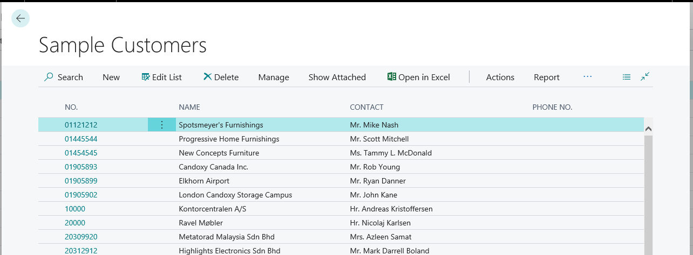

# Simple List Page Code Example

The AL code in this article creates a simple list page that displays records from an existing table.



For a more detailed explanation of the list page, see [Designing List Pages](devenv-designing-list-pages.md).

```AL
page 50111 SampleCustomerList
{
    PageType = List;
    ApplicationArea = All;

    // Specifies the page to display records from the Customer table.
    SourceTable = Customer;

    // Makes the page searchable from the Tell me what you want to do feature. 
    UsageCategory = Lists;

    // Specifies the card page Sample Customers to be uses for modifying or creating new customer records.
    CardPageId = 50112;

    // Sets the title of the page to Sample Customers.
    Caption = 'Sample Customers';

    layout
    {
        area(Content)
        {
            // Sets the No., Name, Contact, and Phone No. fields in the Customer table to be displayed as columns in the list. 
            repeater(Group)
            {
                field("No."; "No.")
                {
                    ApplicationArea = All;

                }
                field(Name; Name)
                {
                    ApplicationArea = All;

                }
                field(Contact; Contact)
                {
                    ApplicationArea = All;
                }

                field(Phone; "Phone No.")
                {
                    ApplicationArea = All;

                }
            }
        }
    
    }

    actions
    {
        // Adds an action on the Actions menu of the action bar that opens the page Customer Ledger Entries. 
        area(Processing)
        {
            action("Ledger Entries")
            {
                ApplicationArea = All;
                RunObject = page "Customer Ledger Entries";
                trigger OnAction();
                begin

                end;
            }
        }

        // Promotes an action for creating a sales quote to promoted action menu called New.
        area(Creation)
        {
            action("New Sales Quote")
            {
                ApplicationArea = All;
                RunObject = page "Sales Quote";
                Promoted = true;
                PromotedCategory = New;
                Image = NewSalesQuote;
                trigger OnAction();
                begin

                end;
            }
        }

        // Adds an action on the Report menu that opens the Top 10 List report.
        area(Reporting)
        {
            action("Top 10 List")
            {
                ApplicationArea = All;
                RunObject = report "Customer - Top 10 List";
                trigger OnAction();
                begin

                end;
            }
        }
    }
}

```

## See Also
[AL Development Environment](devenv-reference-overview.md)  
[Page Extension Object](devenv-page-ext-object.md)  
[Actions Overview](devenv-actions-overview.md)  
[Adding Pages and Reports to Tell Me](devenv-al-menusuite-functionality.md)  
[Personalizing Your Workspace](/dynamics365/business-central/ui-personalization-user)  
[Using Designer](devenv-inclient-designer.md)  
