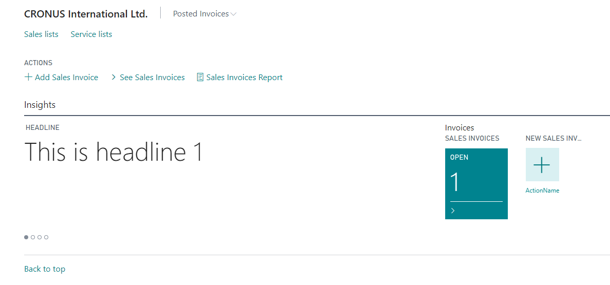

# Simple Role Center Code Example

The AL code in this article creates a simple Role Center customized for users assigned to a new profile. 



For a more detailed explanation of Role Centers, see [Designing Role Centers](devenv-designing-role-centers.md).

This example uses the **RoleCenterHeadline** page code [example](devenv-create-role-center-headline.md) to display the headline and the **SalesInvoiceCuePage** page and the following code [example](devenv-cues-action-tiles.md) for the Cue and Action tile.

```AL
page 50125 MyRoleCenter
{
    PageType = RoleCenter;
    Caption = 'My Role Center';

    layout
    {
        area(RoleCenter)
        {
            group(Group1)
            {
                part(Part1; RoleCenterHeadline)
                {
                    ApplicationArea = All;
                }

                part(Part2; SalesInvoiceCuePage)
                {
                    Caption = 'Invoices';
                }
            }
        }
    }


    actions
    {
        area(Sections)
        {
            group(PostedInvoices)
            {
                Caption = 'Posted Invoices';
                Image = RegisteredDocs;
                action(PostedServiceInvoices)
                {
                    Caption = 'Posted Service Invoices';
                    RunObject = Page "Posted Service Invoices";
                    ApplicationArea = All;
                }

                action(PostedSalesInvoices)
                {
                    Caption = 'Posted Sales Invoices';
                    RunObject = Page "Posted Sales Invoices";
                    ApplicationArea = All;
                }

                group(SalesDocuments)
                {
                    Caption = 'Sales Documents';
                    action("Sales Document Entity")
                    {
                        ApplicationArea = All;
                        RunObject = page "Sales Document Entity";
                    }
                    action("Sales Document Line Entity")
                    {
                        ApplicationArea = All;
                        RunObject = page "Sales Document Line Entity";
                    }
                }
            }
        }

        area(Embedding)
        {

            action(Sales)
            {
                Caption = 'Sales lists';
                RunObject = Page "Sales list";
                ApplicationArea = All;
            }

            action(Services)
            {
                Caption = 'Service lists';
                RunObject = Page "Service list";
                ApplicationArea = All;

            }


        }

        area(Processing)
        {
            action(SeeSalesInvoices)
            {
                Caption = 'See Sales Invoices';
                RunObject = Page "Posted Sales Invoices";
            }

        }

        area(Creation)
        {
            action(AddSalesInvoice)
            {
                Caption = 'Add Sales Invoice';
                Image = NewInvoice;
                RunObject = Page "Sales Invoice";
                RunPageMode = Create;
            }
        }

        area(Reporting)
        {
            action(SalesInvoicesReport)
            {
                Caption = 'Sales Invoices Report';
                Image = "Report";
                RunObject = Report "Sales - Invoice";
            }
        }
    }
}

// Creates a profile that uses the Role Center
profile MyProfile
{
    ProfileDescription = 'Sample Profile';
    RoleCenter = MyRoleCenter;
    Caption = 'My profile';
}

```

## See Also
[AL Development Environment](devenv-reference-overview.md)  
[Page Extension Object](devenv-page-ext-object.md)  
[Actions Overview](devenv-actions-overview.md)  
[Adding Pages and Reports to Tell Me](devenv-al-menusuite-functionality.md)  
[Personalizing Your Workspace](/dynamics365/business-central/ui-personalization-user)  
[Using Designer](devenv-inclient-designer.md) 