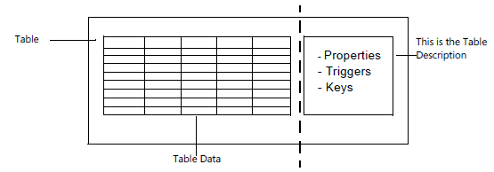
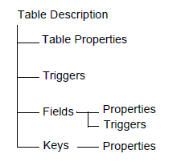

# Tables Overview

Tables are the fundamental objects in any database. They are the objects in which you store and manipulate data. This is true no matter what kind of data you need to manage. When you create a new database, you begin by building the tables. Later, you create pages and reports in order to access and view the data in the tables.  

A table can be visualized as a two-dimensional matrix, consisting of columns and rows. The following illustration shows a table where each row is a record and each column is a field.  
  
A table consists of two parts: the table data and a table description. The table data is the part users often think of as comprising the database, because it contains the actual records with their data fields. The layout and properties of those fields, however, are specified by the table description. The table description is not directly visible to the user. The following illustration shows how the table data and the table description together form a table.  
  
  
  
When you design a table, you assign a number of characteristics to it, such as a name, an ID number, and the fields it contains. You also assign a number of characteristics (such as name, ID number, data type, and initial value) to each field. When you design a new table, you also specify which keys you want the system to maintain. All these characteristics are stored in the table description when you save your table design.  
  
The information in the table description is used by SQL Server and occasionally by database users who need information about the table structure. The table description makes the database flexible, as it lets the system access tables with different structures. The database can extract the definitions of the table structure from the table description and thereby correctly access any table. 
  
The following illustration shows that a table description contains properties, triggers, fields, and keys and shows how these are related.  
  
  
  
The table description contains some properties that are related to the table, others that are related to the fields in the table, and other properties related to keys. You can also see that triggers are defined both for the table and for the fields in the table.  

## Creating tables  

In AL code, you can create new tables or modify existing tables. Read more about creating and modifying tables in the following sections.

|To  |See  |
|----|-----|
|Create a new table object|[Table Object](devenv-table-object.md)|
|Modify an existing table object|[Table Extension Object](devenv-table-ext-object.md)|
|Decide which field data type you want to apply to your data|[Field Data Types](./methods-auto/library.md)|
|Apply table and field properties|[Table and Table Extension Properties](properties/devenv-table-properties.md)|
|Set primary and secondary table keys|[Table Keys](devenv-table-keys.md)|

## Using triggers in database design

[!INCLUDE[d365fin_long_md](includes/d365fin_long_md.md)] supports setting up actions to take place in response to specific events. These are known as triggers. The following topics help to explain how [!INCLUDE[d365fin_long_md](includes/d365fin_long_md.md)] implements this feature of database design.  
  
|To|See|  
|--------|---------|  
|Learn about the set of triggers that [!INCLUDE[d365fin_long_md](includes/d365fin_long_md.md)] supports for tables and fields.|[Table and Field Triggers](triggers/devenv-triggers.md)|  
<!-- 
|Create a table trigger.|[How to: Define or Modify Table or Field Triggers](How-to--Define-or-Modify-Table-or-Field-Triggers.md)|  
|See reference information about specific triggers.|[Triggers](Triggers.md)|  -->
  
## Creating relationships between tables  

In [!INCLUDE[d365fin_long_md](includes/d365fin_long_md.md)], the primary way to establish a connection between tables is to use the **TableRelation** property. The following topics go into detail about how this works.  
  
|To|See|  
|--------|---------|  
|Get a brief introduction to relational database design in [!INCLUDE[d365fin_long_md](includes/d365fin_long_md.md)].|[Setting Relationships Between Tables](devenv-set-relationships-between-tables.md)|  

<!--
|Understand the extra steps SQL Server requires to use the **TableRelation** property.|[Maintaining Table Relationships on SQL Server](Maintaining-Table-Relationships-on-SQL-Server.md)|  ???
  
## Understanding SQL Server and Linked Objects  
 [!INCLUDE[navnow](includes/navnow_md.md)] supports special handling for SQL Server Object tables. You can find help on linked objects in the following topics.  
  
|To|See|  
|--------|---------|  
|Learn about the **LinkedObject** table property.|[Creating Table Definitions from SQL Server Objects (Linked Objects)](  Creating-Table-Definitions-from-SQL-Server-Objects--Linked-Objects-.md)|  
|Work with other data sources, including Microsoft Excel and Oracle databases.|[Accessing Objects in Other Databases or on Linked Servers](Accessing-Objects-in-Other-Databases-or-on-Linked-Servers.md)|  
  
  -->
## See Also  
[Developing Extensions in AL](devenv-dev-overview.md)