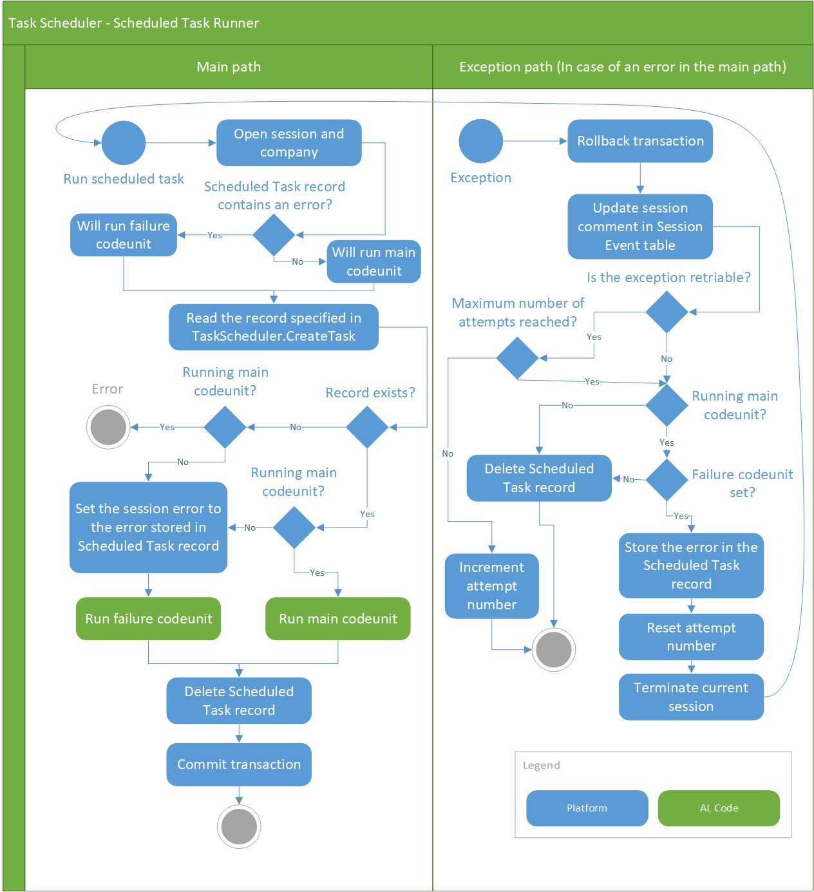

# Task Scheduler

<!-- source PartnerDiagnosticsScheduledTaskManagementTrace.cs -->

The task scheduler enables you to control when certain operations or processes (in other words *tasks*) are run. Basically, a task is a codeunit or report that is scheduled to run at a specific data and time. Tasks run in a background session between the [!INCLUDE[d365fin_server_md](includes/d365fin_server_md.md)] instance and database. Behind the scenes, the task scheduler is used by the job queue to process job queue entries that are created and managed from the clients.  

## Create and manage scheduled tasks in AL

A scheduled task is basically a codeunit that runs logic in a backgrounds session at a specific time. Optionally, you can create a second codeunit that contains the logic to handle the task if an error occurs for any reason. This codeunit is referred to as a *failure codeunit*.

In AL code, you create and manage tasks by using the AL methods that are available for the [TASKSCHEDULER](methods-auto/taskscheduler/taskscheduler-data-type.md) data type. 

|Method|Description|For more information, see...|  
|--------------|-----------------|-------------------------------|  
|CreateTask|Adds a task to run a codeunit at a specified date and time.|[TaskScheduler.CreateTask(Integer, Integer [, Boolean] [, String] [, DateTime] [, RecordId]) Method](methods-auto/taskscheduler/taskscheduler-createtask-integer-integer-boolean-string-datetime-recordid-method.md)  [TaskScheduler.CreateTask(Integer, Integer, Boolean, String, DateTime, RecordId, Duration) Method](methods-auto/taskscheduler/taskscheduler-createtask-integer-integer-boolean-string-datetime-recordid-duration-method.md)|  
|SetTaskReady|Sets a task to the **Ready** state. A task can't run until it's **Ready**.|[TaskScheduler.SetTaskReady(Guid [, DateTime]) Method](methods-auto/taskscheduler/taskscheduler-settaskready-method.md)|  
|TaskExists|Checks whether a specific task exists.|[TaskScheduler.TaskExists(Guid) Method](methods-auto/taskscheduler/taskscheduler-taskexists-method.md)|  
|CancelTask|Cancels a scheduled task.|[TaskScheduler.CancelTask(Guid) Method](methods-auto/taskscheduler/taskscheduler-canceltask-method.md)|  

To set up a task, create codeunits that contain the logic that you want to run at a scheduled time. Once you have the codeunits, add code to the application that calls the CREATETASK method to schedule a task. The CREATETASK method can also specify the earliest date to run the task.  

## How task scheduler works

This section describes the flow that a scheduled task goes through.

### General flow

When a scheduled task is run, there are two possible execution paths that it can follow: the *main path* and the *exception path*. The main path is used to run the main codeunit and failure codeunits, if any. The exception path is used to handle errors and control the retry flow when errors occur in the main path. What happens in the exception path depends on whether the exception is [retriable](#retriable).

Here's a general overview of the process:  

1. When a task is created, the task is recorded in table **2000000175 Scheduled Task** of the database.  
2. When task achieves the ready state and it's scheduled time occurs, a new background session is started.
3. The main path starts: 

    1. The company is opened and the scheduled task in the table **2000000175 Scheduled Task** is validated.

       If any error occurs during this phase, the task fails unless there's a failure codeunit. In which case, the failure code will be run. 
    2. The task's main codeunit is run:

       - If main codeunit runs successfully, it's removed from table **2000000175 Scheduled Task**.
       - If an error occurs, the error is passed on to the exception path.

4. The exception path starts:

    1. The transaction is rolled back.
    2. The exception handling logic is run:

        - If the exception is retriable, the main codeunit is rerun following the main path.

           This retry flow continues in the same session until the task succeeds or until the maximum number of retries is exceeded, then it fails. The session is then deleted. To understand when the task will be retried, see [Retry Intervals](#retrycycle).
        - If the exception isn't retriable and there's no failure codeunit, the task fails.
        - If the exception isn't retriable and there's a failure codeunit, the current session is terminated. A new session is started, and the failure codeunit runs in this session, following the main path.

            If the failure codeunit doesn't handle the error or fails itself, then the exception path is run to retry the failure codeunit. This retry flow continues in the same session until the task succeeds or until the maximum number of retries is exceeded. The session is then terminated.
  
### Detailed flow

The following diagram illustrates the flow in detail.

<!--NAV You can view these errors in the event log of the computer that is running the [!INCLUDE[d365fin_server_md](includes/d365fin_server_md.md)] instance. For more information, see [Monitoring Dynamics NAV Server Events Using Event Viewer](Monitoring-Microsoft-Dynamics-NAV-Server-Events-in-the-Windows-Event-Log.md). --> 

### Retry intervals

When a task's main codeunit or failure codeunit enters the retry flow, it will be rerun at approximately the following intervals as long as the error persists. The number of retires and the intervals are different for Business Central online and on-premises.

**Online**

A codeunit will be retried up to 99 times, according to the following intervals:

|Retry attempt|Wait time (minutes) after previous attempt|
|-------------|---------|
|1 and 2|.5|
|3 and 4|1|
|5 and 64|2|
|7 and 8|3|
|9 to 99|5|

**On-premises**

A codeunit will be retried up to nine times, according to the following intervals:

|Retry attempt|Wait time (minutes) after previous attempt|
|-------------|---------|
|1 and 2|2|
|3|4|
|4 to 9|15|

<!--
1. Two minutes after the first failure.  
2. Two minutes after the second failure.  
3. Four minutes after the third failure.
4. 15 minutes after the fourth failure.
5. 15 minutes after the next failures, until the tenth retry attempt. After the tenth retry, the task fails completely.  -->

## Error conditions and retriable exceptions

A task can fail under the various conditions, like:  

- The company can't be opened.  
- A SQL connection or transient error occurred with the database.  
- The [!INCLUDE[d365fin_server_md](includes/d365fin_server_md.md)] instance restarted while the task was being run.  
- An upgrade is in progress.

The task scheduler is designed to automatically rerun main and failure codeunits when certain exceptions occur, instead of just failing on the first attempt. Exceptions that cause the system to rerun a codeunit are referred to as *retriable exceptions*. Whether an exception is retriable depends on whether the exception occurs in the main or failure codeunit and if you're using Business Central online or on-premises.

### Retriable exceptions in the main codeunit

If your running [!INCLUDE[prod_short](includes/prod_short.md)] online, the service controls which exceptions are retriable. With [!INCLUDE[prod_short](includes/prod_short.md)] on-premises, you can specify retriable exceptions by configuring the **Execution Retry Exceptions** (TaskSchedulerExecutionRetryExceptions) setting on the [!INCLUDE[server](includes/server.md)] instance. The **Execution Retry Exceptions** setting is semicolon-separated list of exceptions in a format: `Exception1;Exception2;Exception3`. If you want to specify error code of the exception, use the following format instead: `Exception1:ErrorCode1;Exception2:ErrorCode2.`

### Retriable exceptions in the main codeunit

Because failure codeunits are designed for error situations, expect for a selected few, almost all exceptions while running failure codeunits are retriable. It doesn't matter if you're using Business Central online or on-premises. Even with on-premises, you can't specify retriable exceptions, like you can for main codeunits.

## About task sessions and permissions

The task runs in a background session, which means that there's no user interface. The behavior is similar to that of the STARTSESSION method, where any dialog boxes that would normally appear are suppressed. For more information about specific dialog boxes, see [StartSession](methods-auto/session/session-startsession-integer-integer-string-table-duration-method.md) method.  

The session runs by using the same user/credentials that are used when calling AL code. The user must have appropriate permissions to the codeunit and any other objects that are associated with the operation of the codeunit.

## Monitor and troubleshoot

[!INCLUDE[prod_short](includes/prod_short.md)] offers two ways to monitor the flow of scheduled tasks: Azure Application Insights and the **Session Event** table. These tools let you follow execution of a task, and investigate errors in failure codeunits.

### Application Insights

You can set up [!INCLUDE[prod_short](includes/prod_short.md)] to send telemetry traces to an Application Insights resource in Azure. Once set up, telemetry data will be sent to the resource as scheduled task moves through the flow. For more information, see:

[Enable Sending Telemetry to Application Insights](../administration/telemetry-enable-application-insights.md) 

[Analyzing Task Scheduler Telemetry](../administration/telemetry-task-scheduler-trace.md)

### Session Event table

From the [!INCLUDE[prod_short](includes/prod_short.md)] web client, you can open the Session Events table by adding `table=2000000111` to the URL. For example: [https://businesscentral.dynamics.com/?table=2000000111](https://businesscentral.dynamics.com/?table=2000000111).

## Configure task scheduler for Business Central on-premises

[!INCLUDE[server](includes/server.md)] includes several settings related to task scheduler. These settings allow you to enable or disable task scheduler and manage tasks. For more information, see [Configure Business Central Server - Task Scheduler](../administration/configure-server-instance.md#Task).

## See Also
[Task Scheduler Data Type](methods-auto/taskscheduler/taskscheduler-data-type.md)   
[Developing Extensions](devenv-dev-overview.md)  
[Get Started with AL](devenv-get-started.md) 