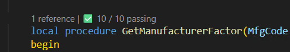

# Run AL tests from Visual Studio Code with Test Explorer

[!INCLUDE [2026-releasewave1-later](../includes/2026-releasewave1-later.md)]

You can use the built-in *Test Explorer* in Visual Studio Code to discover and run AL tests in your workspace. This feature lets you run tests directly from the IDE instead of using an external test runner or the [!INCLUDE [prod_short](includes/prod_short.md)] web client.

## Prerequisites

Before you run tests from Visual Studio Code, make sure you meet the following requirements:

- [!INCLUDE [prod_short](includes/prod_short.md)] version 28.0 or newer (2026 release wave 1).
- The AL Language extension for Visual Studio Code is installed.

## Discover and run tests

The Test Explorer automatically detects test codeunits and test methods in the active workspace.

1. Open the **Test Explorer** view in Visual Studio Code. Learn more about the Test Explorer in [Testing in Visual Studio Code](https://code.visualstudio.com/docs/debugtest/testing).
1. Verify that your test codeunits appear in the test list. Only tests in the active workspace are added to the Test Explorer. Tests are sorted first by their owning app, then by the codeunit that declares them, and finally the test procedures themselves.
1. Select the test you want to run, and then choose the **Run** button. Learn more in the [Test run profiles](#test-run-profiles) section.
1. Review the test execution progress and results in the **Test Results** panel.

## Test run profiles

We support the following run profiles:

| **Profile name**     | **Description** |
|----------------------|-----------------|
| Publish & Run        | Publishes the test project and any of its dependencies (if they have changed) before running the selected tests. This is the default run profile. |
| Run                  | Runs the selected tests without prepublishing the project. |
| Run & Debug          | Publishes the test project and starts a run with the debugger attached. |
| Coverage (Procedure) | Runs the selected tests and collects procedure-level code coverage. Learn more in the [View code coverage information](#view-code-coverage-information) section. |

## View code coverage information

When the Coverage (Procedure) run profile is selected, the test run keeps track of the procedures and triggers that are invoked by each test. This information is then surfaced as a new CodeLens on the relevant procedures and triggers.

Clicking on this new CodeLens will execute the tests that had covered the procedure or trigger. This is useful when making changes to quickly run the most relevant tests.

## Test execution

Tests run from Visual Studio Code don't execute under an AL [test runner codeunit](devenv-testrunner-codeunits.md). This has a few implications.

1. Running AI tests isn't supported.
2. Any tests that rely on events published in a test runner for test setup or teardown might not work.
3. Isolation level is determined by the [RequiredTestIsolation](properties/devenv-requiredtestisolation-property.md) property set on the test codeunit. If this property isn't set, we default to Codeunit level isolation.

## Supported environments

Running tests from Visual Studio Code is supported on [!INCLUDE [prod_short](includes/prod_short.md)] version 28.0 and newer on the following environments:

- Online sandbox environments.
- Local (on-premises) server installations.

> [!NOTE]
> Running tests on production environments isn't supported because it might affect business operations. Learn more in [Testing the application overview](devenv-testing-application.md).

## Related information

[Testing the application overview](devenv-testing-application.md)  
[Create test codeunits and test methods](devenv-test-codeunits-and-test-methods.md)  
[Testing in Visual Studio Code](https://code.visualstudio.com/docs/debugtest/testing)
