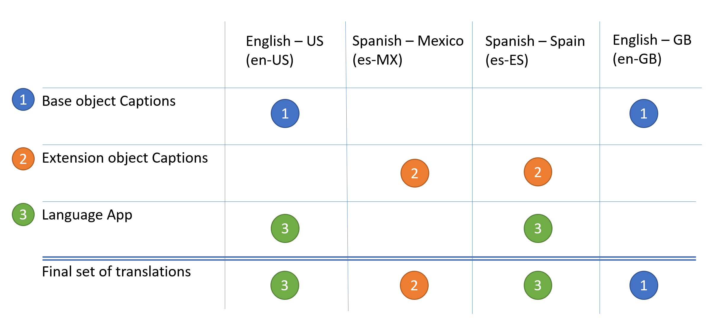
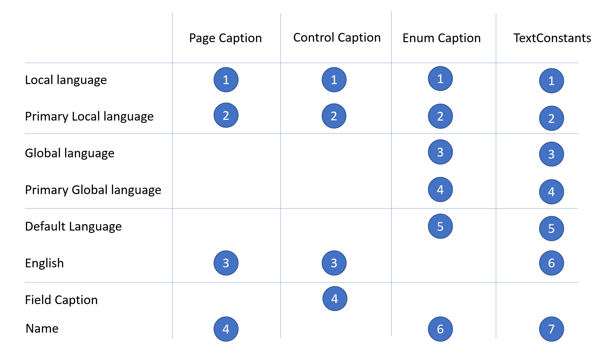

# Translations Overview

Your [!INCLUDE[prod_short](../includes/prod_short.md)] app can be translated to other languages to adjust it to the market need. Because of the layered architecture of the extension model, the translation(s) that are displayed to the user depends on a number of things as explained in this topic.

In [!INCLUDE[prod_short](../includes/prod_short.md)] translations are done using XLIFF files, which is a standardized format used for computer-based translations. For more information, see [Working with Translation Files](devenv-work-with-translation-files.md).

The format for translation

## The life of a caption 

Translations can be applied using multiple properties, and there are multiple opportunities to change them. The caption of a page, for example, can be changed from multiple places. With that flexibility, a defined structure is defined. A page name will be overwritten as follows: 

1. Page Name
2. Page Caption
3. Page Extension Caption
4. Translation app 
5. Page Customization 

> [!NOTE]  
> Translations provided using profile configuration cannot be overwritten by any apps. 

## Translations in the same layer

If there are *multiple translations on the same layer*, then it is possible to control which translations are *applied last* by setting a dependency in the `app.json` file to the layers where the translation is intended to be applied last.

For example, if you want to change the text provided from  **Translation app XYZ**, you can create another translation app, and in the `app.json` file of that new translation app, you must then specify a dependency on **Translation app XYZ** to make sure that the translation in *the new app is applied after* and thereby overwrites the original translation.

```al
"dependencies": 
  [
    {"id": "f1f12588-13cb-47fd-b94a-cddce44e9a8f", "name": "Translation app XYZ", "publisher": "Default publisher", "version": "1.0.0.0"}
  ]
```

For more information, see [JSON Files](devenv-json-files.md).

## Overwrites

When *translations from different layers* are picked up, one translation from each observed culture is kept and when it is overwritten, only the specified culture changes. In the illustration, we have a caption and its page extension caption.





```al
page 50101 SimpleCustomerCard
{
    Caption = 'Customer';

```

```al
pageextension 50101 SimpleCustomerCardExtension extends SimpleCustomerCard
{
    CaptionML = it-IT = Cliente, da-DK = Debitor;

```

The resulting caption will then be **Customer** in en-US, **Cliente** in it-IT, and **Debitor** in da-DK. 

## Picking the language to display

Once translations on the different layers have been collected, the translations that display on the user interface are then picked, based on the context.



The following definitions are used in the illustration:

**Local language**  
The language that the user specifies in [!INCLUDE[prod_short](../includes/prod_short.md)] settings.

**Global language**  
By default it is the same as the local language, but the global language can be changed from AL code. 

**Default Language**  
Is defined by a server setting. For [!INCLUDE[prod_short](../includes/prod_short.md)] online it is set to the same language that was selected when signing up for Business Central.

**Primary language**  
Defined as the primary culture of a language, for example, for `es-MX` (Spanish-Mexico) the primary language will be `es-ES` (Spanish-Spain).

**Field Caption**  
If the page control is backed by a table field, then if no matches where found then it would use the same algorithm from the control by on the field.


## See Also

[Working with Translation Files](devenv-work-with-translation-files.md)  
[CaptionML Property](properties/devenv-captionml-property.md)  

