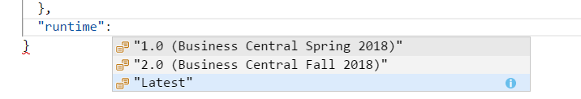

# Versioning on Platform    

> [!IMPORTANT]  
> [!INCLUDE[vnext_preview](includes/vnext_preview.md)]

The AL language extension is compatible with multiple versions of the server. You can install the AL Language extension from the Visual Studio Code marketplace and use it to develop solutions for [!INCLUDE[d365_bus_central_md](includes/d365_bus_central_md.md)].

To set the version of the server, add the **runtime** property in the `app.json` file. This attribute defines the platform version that the extension is targeting. Depending on the runtime version, some features become available, while some features are not supported. For example, .NET interoperability can only be used when the runtime version is 2.0 or higher. For more information about .NET Interoperability, see [Getting started with Microsoft .NET Interoperability from AL](devenv-get-started-call-dotnet-from-al.md).   

In the runtime property, the **Latest** value is the default value. When you set the **Latest** as the `runtime` property value, you enable the newest available  version by default. For example, in the following image, **Latest** runtime value represents the **2.0 Business Central Fall 2018** version. 



> [!NOTE]  
> AL Language extension is not compatible with [!INCLUDE[nav_2018_short_md](includes/nav_2018_short_md.md)] version backwards. For [!INCLUDE[nav_2018_short_md](includes/nav_2018_short_md.md)] development, the traditional method should be used. You must install the Visual Studio Code extension from the `ALLanguage.vsix` file shipped on the DVD. 

## Version compatibility
**Scenario 1**: If the server receives an extension which is compiled with a higher runtime version than the one it supports, then an error will be thrown. For example, if you set the runtime value to '2.0', you get the following error message. 

```
The runtime version of the extension package is currently set to '2.0'. The runtime version must be set to '1.0' or earlier in the app.json file in order to install the extension package on this server.
```

When you set the extension to a higher runtime version, the extension package may contain certain features that the server may not support which would result in an error. Therefore, you must lower the runtime version which is supported with the current server. Also, you must note that by lowering the runtime version, you may get warnings about the features that are not supported by the server.

**Scenario 2**: If the server receives an extension which is compiled with a lower runtime version than the one it supports, a best-effort compilation is made. This is allowed in order to avoid recompilation of the extension packages when every time the server is upgraded. 

## See Also
[Debugging in AL](devenv-debugging.md)  
[Developing Extensions](devenv-dev-overview.md)  
[Microsoft .NET Interoperability from AL](devenv-get-started-call-dotnet-from-al.md)  
