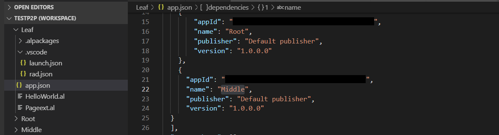
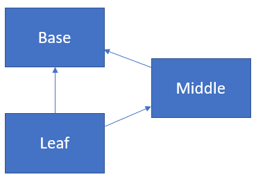
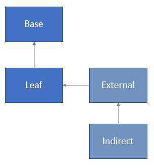

# Working with Multiple Projects and Project References

[!INCLUDE[2019_releasewave2.md](../includes/2019_releasewave2.md)]

A project reference in an AL-based workspace is defined as a dependency in the `app.json` file and exists as a project in the workspace. There is no special visual representation of a project reference. 

> [!IMPORTANT]  
> A *project reference* is the full `id`, `name`, `publisher`, and `version` of an existing project in the workspace. This is contrary to an application reference where it is enough to specify a minimal version.

In the example below, the project called **Leaf** defines two dependencies to the projects **Middle** and **Root**. Since both **Root** and **Middle** are projects in the workspace they are considered project references.

The advantage of working with project references is that there is no need to download the symbols for a project reference. They are there as the symbols for the reference project and will be resolved as they are modified. For example, if you add a new method to a codeunit in the **Root** project and reference the codeunit in the **Leaf** project, the method will automatically resolve as you touch the **Leaf** project.

When a project is built with **Ctrl+Shift+B** the following will happen:
1. The .app file is copied to the `.alpackages` folder of all projects that depend on it.
2. All project references that might be "dirty" are also built.

> [!NOTE]  
> If reference resolution stops working then building the project reference and re-initializing the workspace using **Reload Window** resolves references.

## Publishing changes
With the introduction of project references the publishing logic in a workspace has changed. Publishing, either with **Ctrl+F5** or RAD publishing using **Alt+Ctrl+F5**, will do a set publishing of all the projects that have changed with defining a startup project. The startup project is always the active project. What does this mean? 

A project is considered changed if any of its application objects have changed in the sense that the application object already is in the `rad.json` or will be in the `rad.json` once the project has been built. This means that if you change an application object, you save it, and then close Visual Studio Code, but have not built, the `rad.json` will not be updated and then the project will not be considered "dirty".

For example, in a workspace with three projects; **Leaf**, **Middle**, and **Base**. **Leaf** depends on **Middle** and **Base**, and **Middle** depends on **Base** as illustrated below:

Assuming that: 
1. All three projects; **Leaf**, **Base**, and **Middle** have changed. 
2. The **Leaf** project is the current project that is published. 

Then all three projects; **Base**, **Middle**, and **Leaf** will be part of the set that will be published.

In a scenario where **Middle** has not changed, but **Leaf** is still the startup project, then only **Base** and **Leaf** will be published.

A new file is created to package set dependencies called `*.dep.app`. This is the file that gets transferred to the server and it is deleted if publishing of the dependency set is successful.

## Server publishing changes
Although server publishing is an internal step, it does have an impact on the dependency publishing and is useful to know.

For example, in a workspace with two projects; **Leaf** depends on **Base**, and **External** and **Indirect** are projects outside of the workspace as illustrated below:

Assuming that:
1. A workspace exists with **Leaf** and **Base** as workspace projects.
2. **Base** is published. 
3. On the server **Base**, **Leaf**, **External**, and **Indirect** are already installed apps. 

The following happens on the server:  
- All apps that depend on **Base** will be uninstalled, including **External** and **Indirect** dependency.  
- Any other app that directly depend on **Base** and are not published in the global scope - in this case **Leaf** and **External** - are unpublished.  
- **Base** will be uninstalled, unpublished, and then published.  
- **Leaf** and **External** will be published, installed and then compiled against the newly published **Base**. Important to notice here is that the **Extenal** app also will be published.

## Launch.json file setting
To control how dependency publishing is performed on the server, the `launch.json` file has a setting `dependencyPublishingOption` with the following options:

|Setting |Description |
|--------|------------|
|Default|Set dependency publishing will be applied.|
|Ignore|Dependency publishing is ignored. This setting should be used cautiously, see note below.|
|Strict|Dependency publishing will fail if there are any installed apps that depend on the startup project.|

> [!NOTE]  
> With the `Ignore` setting only **Leaf** will be published against what has already been published on the server for **Middle** and **Base**. If a change has been done on **Base** that would break **Leaf**, even though local compilation would pass, the server compilation will fail in this scenario. The benefit of using this option is to gain publishing time when **Base** is a large project. Assuming that **Base** is published, then **Leaf** and **Middle** will be left untouched on the server. Only runtime errors will reveal if **Base** has broken **Middle** and **Leaf**.

## Incremental Build setting
If the `al.incrementalBuild` setting is set to `true` on workspaces with project to project refernces, all resolution will happen from the referenced project, instead of happening from an app in the `\packagecache` folder which will enhance the build time. For more information, see [AL Language Extension Configuration](devenv-al-extension-configuration.md).

## See also 
[Development in AL](devenv-dev-overview.md)   
[Best Practices for AL](../compliance/apptest-bestpracticesforalcode.md)  
[Working with multiple AL project folders within one workspace](devenv-multiroot-workspaces.md)  
[JSON Files](devenv-json-files.md)

