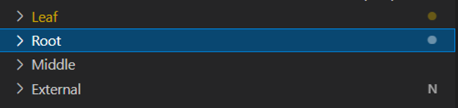

# Work with multiple projects and project references

[!INCLUDE[2019_releasewave2.md](../includes/2019_releasewave2.md)]

A project reference in an AL-based workspace is defined as a dependency in the `app.json` file and exists as a project in the workspace. There's no special visual representation of a project reference. 

> [!IMPORTANT]  
> A *project reference* is the full `id`, `name`, `publisher`, and `version` of an existing project in the workspace. This is contrary to an application reference where it's enough to specify a minimal version. If you're using workspaces with multiple projects and change the `name` or `publisher` of an extension in the workspace, the dependencies in the app.json file must be updated with the new name and publisher or you may encounter issues with reference resolution. For more information, see [App identity](devenv-app-identity.md).

In the example below, the project called **Leaf** defines two dependencies to the projects **Middle** and **Root**. Since, both Root and Middle are projects in the workspace, they're considered project references.

The advantage of working with project references is that there's no need to download the symbols for a project reference. They're there as the symbols for the reference project and are resolved as they're modified. For example, if you add a new method to a codeunit in the **Root** project and reference the codeunit in the **Leaf** project, the method automatically resolves as you touch the **Leaf** project.

When a project is built with <kbd>Ctrl</kbd>+<kbd>Shift</kbd>+<kbd>B</kbd>, the following happens:

1. The .app file is copied to the `.alpackages` folder of all projects that depend on it.
2. All project references that might be "dirty" are also built.

> [!NOTE]  
> If reference resolution stops working then building the project reference and re-initializing the workspace using **Reload Window** resolves references.

## Project loading in a workspace

As a project loads in a workspace, it attempts to load all its project references as a transitive operation. While a project loads, features like IntelliSense and hover over aren't available. Depending on the number of project references and files in the project, this operation can be time consuming.

When the project loads in the workspace, the user is notified with the standard Visual Studio Code progress notification dialogs of the current state. The notifications can be closed, but they don't stop loading a project. If the user selects somewhere else or changes the active project, loading of the previous project is canceled and the newly selected active project starts loading instead. A project can be loaded by making it active, by opening an .al file, or opening the app.json project file. Once a project is loaded it stays loaded until the AL language server is active, or the **Reload Window** command, using **Ctrl+R** is triggered. 

Projects that haven't been loaded in the workspace are decorated with the letter **N**.  

## Publish changes

With the introduction of project references, the publishing logic in a workspace changed. Publishing, either with <kbd>Ctrl</kbd>+<kbd>F5</kbd>  or RAD publishing using <kbd>Alt</kbd>+<kbd>Ctrl</kbd>+<kbd>F5</kbd>, does a set publishing of all the projects that changed with defining a startup project. The startup project is always the active project.

A project is considered changed if any of its application objects changed in the sense that the application object is already in the `rad.json` or will be in the `rad.json` once the project is built. This means that if you change an application object, you save it, and then close Visual Studio Code without building the project, the `rad.json` doesn't update and then the project is considered "dirty".

For example, in a workspace with three projects; **Leaf**, **Middle**, and **Base**. **Leaf** depends on **Middle** and **Base**, and **Middle** depends on **Base** as illustrated below:

Assuming that: 

* All the three projects; **Leaf**, **Base**, and **Middle** changed. 
* The **Leaf** project is the current project that is published. 

Then all the three projects; **Base**, **Middle**, and **Leaf** are part of the set that is published.

In a scenario where **Middle** isn't changed, but **Leaf** is still the startup project, then only **Base** and **Leaf** are published.

A new file is created to package the set dependencies called `*.dep.app`. This file gets transferred to the server and it's deleted if publishing of the dependency set is successful.

## Server publishing changes

Although server publishing is an internal step, it does have an effect on the dependency publishing and is useful to know.

For example, in a workspace with two projects; **Leaf** depends on **Base**, and **External** and **Indirect** are projects outside of the workspace as illustrated below:

Assuming that:

* A workspace exists with **Leaf** and **Base** as workspace projects.
* **Base** is published. 
* On the server **Base**, **Leaf**, **External**, and **Indirect** are already installed apps. 

The following happens on the server:

- All apps that depend on **Base** are uninstalled, including **External** and **Indirect** dependency.  
- Any other apps that directly depend on **Base** and aren't published in the global scope - in this case **Leaf** and **External** - are unpublished.  
- **Base** is uninstalled, unpublished, and then published.  
- **Leaf** and **External** are published, installed, and then compiled against the newly published **Base**. Important to notice here's that the **External** app is also published.

## Launch.json file setting

To control how dependency publishing is performed on the server, the `launch.json` file has a setting `dependencyPublishingOption` with the following options:

|Setting |Description |
|--------|------------|
|Default|Set dependency publishing will be applied.|
|Ignore|Dependency publishing is ignored. This setting should be used cautiously, see note below.|
|Strict|Dependency publishing fails if there are any installed apps that depend on the startup project.|

> [!NOTE]  
> With the `Ignore` setting only **Leaf** will be published against what has already been published on the server for **Middle** and **Base**. If a change has been done on **Base** that would break **Leaf**, even though local compilation would pass, the server compilation will fail in this scenario. The benefit of using this option is to gain publishing time when **Base** is a large project. Assuming that **Base** is published, then **Leaf** and **Middle** will be left untouched on the server. Only runtime errors will reveal if **Base** has broken **Middle** and **Leaf**.

## User and workspace launch configuration

With [!INCLUDE[prod_short](includes/prod_short.md)] version 21.1, you can add a launch property to a code-workspace or in the settings.json file. For more information, see [User and workspace launch configuration](devenv-json-launch-file.md#user-and-workspace-launch-configuration).

## Traverse the dependency graph

[!INCLUDE[2022_releasewave1.md](../includes/2022_releasewave1.md)]

To remove unnecessary manual work, use the **AL: Publish full dependency tree for active project** command, which traverses a project dependency graph in the workspace and install any required projects if these aren't already deployed to the NST server. Find the command by using <kbd>Ctrl</kbd>+<kbd>Shift</kbd>+<kbd>P</kbd> or by using the keyboard shortcut <kbd>Shift</kbd>+<kbd>Alt</kbd>+<kbd>W</kbd>. This calculates the correct order in which to compile and publish the dependencies of the current project and publish them using the `launch.json` option selected from the current active project.

> [!NOTE]  
> Only project and app references covered by the workspace will be traversed. If the deployed AL project has dependencies to apps that aren't included in the workspace, these will still have to be present or manually deployed in advance.

## Incremental Build setting

If the `al.incrementalBuild` setting is set to `true` on workspaces with project to project references, all resolutions happen from the referenced project, instead of happening from an app in the `\packagecache` folder, which enhances the build time. For more information, see [AL Language Extension Configuration](devenv-al-extension-configuration.md).

## Making sure that your project or workspace is updated

> [!NOTE]  
> When working in a project or workspace, some operations require that you run a **Reload Window** command (<kbd>Ctrl</kbd>+<kbd>R</kbd>) for your project or workspace to ensure that it’s updated correctly. Examples are; source control operations like Git Pull, changes made to the `app.json` file, or updating User or Workspace settings for AL.

## See also

[Development in AL](devenv-dev-overview.md)  
[Best practices for AL](../compliance/apptest-bestpracticesforalcode.md)  
[Working with multiple AL project folders within one workspace](devenv-multiroot-workspaces.md)  
[JSON files](devenv-json-files.md)  