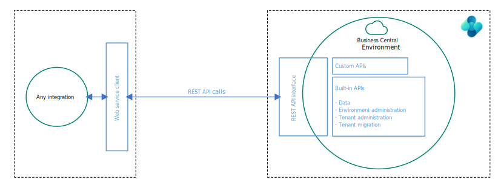

# Integration overview for Business Central (for architects and developers)

This article is intended to help architects and developers make sound design decisions when they implement integration scenarios to and from [!INCLUDE[prod_short](../includes/prod_short.md)].

:::image type="content" source="media/all-integrations.svg" alt-text="Shows how Business Central integrates to Microsoft 365" lightbox="media/all-integrations.svg":::

The article describes integration patterns, integration scenarios, and integration solutions. However, it doesn't include technical details about how to use or set up every integration pattern. It also doesn't include sample integration code.

> [!NOTE]
> Some integrations require a separate subscription or license. Please consult the documentation for that subscription for requirements and details.

## Integrations to/from Business Central are done with web services

Most integrations (except for a few built-in integrations) to and from [!INCLUDE[prod_short](../includes/prod_short.md)] are done using web services. [!INCLUDE[prod_short](../includes/prod_short.md)] supports three types of web services: REST API, SOAP, and OData. 

:::image type="content" source="media/webservice-stack.svg" alt-text="Shows the three different types of web services in Business Central" lightbox="media/webservice-stack.svg":::

The recommended way to use web services for [!INCLUDE[prod_short](../includes/prod_short.md)] is by using the REST API stack. 

For more information, see [Web services overview](../webservices/web-services.md).

## How to explore and develop against Business Central REST APIs

When you need to connect to [!INCLUDE[prod_short](../includes/prod_short.md)] from another application, you should use REST APIs, either the built-in APIs or custom APIs.

For more information on how to explore and develop against APIs, best practices, and which built-in APIs exist, see [REST API overview](../webservices/api-overview.md).

## Integrating to Office apps and [!INCLUDE[m365](includes/m365-name.md)]

[!INCLUDE[prod_short](../includes/prod_short.md)] supports multiple integrations to [!INCLUDE[m365](includes/m365-name.md)]. Enabling integrations to [!INCLUDE[m365](includes/m365-name.md)] augments the functionality in [!INCLUDE [prod_short](../includes/prod_short.md)] with extra features. It also augments [!INCLUDE[m365](includes/m365-name.md)] apps with new features so that users can stay in the flow of work and get access to the right data at the right time from the app they prefer working with. Along with built-in integration, [!INCLUDE [prod_short](../includes/prod_short.md)] offers more ways for you to integrate with [!INCLUDE[m365](includes/m365-name.md)] apps using APIs.

:::image type="content" source="media/m365-integrations-overview.svg" alt-text="Shows how Business Central integrates to Office" lightbox="media/m365-integrations-overview.svg":::

[!INCLUDE [prod_short](../includes/prod_short.md)] integrates to the following [!INCLUDE[m365](includes/m365-name.md)] products and services:

- [!INCLUDE[m365_excel](includes/m365-excel-name.md)]
- [!INCLUDE [m365-field-service-name](includes/m365-field-service-name.md)]
- [!INCLUDE[m365_graph](includes/m365-graph-name.md)]
- [!INCLUDE[m365_onedrive_for_business](includes/m365-onedrive-for-business-name.md)]
- [!INCLUDE[m365_outlook](includes/m365-outlook-name.md)]
- [!INCLUDE[m365_sharepoint](includes/m365-sharepoint-name.md)]
- [!INCLUDE[m365_teams](includes/m365-teams-name.md)]
- [!INCLUDE[m365_word](includes/m365-word-name.md)]

For more information, see [Integrating Business Central with Microsoft 365](m365-integration-overview.md). 

## Integrating Business Central with Power Platform

[!INCLUDE[prod_short](../includes/prod_short.md)] supports multiple integrations to Power Platform. Enabling integrations to Power Platform augments the functionality in [!INCLUDE [prod_short](../includes/prod_short.md)] with more features. 

:::image type="content" source="media/powerplatform-integrations.svg" alt-text="Shows how Business Central integrates to Power Platform" lightbox="media/powerplatform-integrations.svg"::: 

[!INCLUDE [prod_short](../includes/prod_short.md)] integrates to the following Power Platform products and services:

- Power Apps
- Power Automate
- Power BI
- Power Pages

For more information, see [Integrating Business Central with Power Platform](../powerplatform/powerplatform-integration-overview.md).

## Built-in: Integrating Business Central with Dataverse

[!INCLUDE[prod_short](../includes/prod_short.md)] has four built-in ways to integrate with [!INCLUDE[dataverse_short](../includes/dataverse_short.md)]:

- Data synchronization that replicates data between [!INCLUDE[prod_short](../includes/prod_short.md)] and [!INCLUDE[dataverse_short](../includes/dataverse_short.md)].
- Data virtualization with virtual tables in [!INCLUDE[dataverse_short](../includes/dataverse_short.md)] via [!INCLUDE[prod_short](../includes/prod_short.md)] API for (**C**reate/**R**ead/**U**pdate/**D**elete) operations.
- Data change (**CUD**) events using webhooks.
- Business events (preview).

:::image type="content" source="media/connect-to-dataverse.svg" alt-text="Shows the four interactions of DataVerse with Business Central" lightbox="media/connect-to-dataverse.svg":::

For more information, see [Integrating Business Central with Microsoft Dataverse](dataverse-integration-overview.md).

## Built-in: Integrating Business Central with Dynamics 365 Sales

You can integrate [!INCLUDE[prod_short](../includes/prod_short.md)] with Dynamics 365 Sales by first setting up integration to [!INCLUDE[dataverse_short](../includes/dataverse_short.md)] and then doing more setup from the [!INCLUDE[prod_short](../includes/prod_short.md)] application. Integrating to Dynamics 365 Sales lets users view information from [!INCLUDE[prod_short](../includes/prod_short.md)] while they're working in Dynamics 365 Sales. For example, when preparing a sales quote it could be useful to know whether you have enough inventory to fulfill the order.

For more information, see [Integrating Business Central with Dynamics 365 Sales](/dynamics365/business-central/admin-prepare-dynamics-365-for-sales-for-integration).  

## Built in: Integrating Business Central with Dynamics 365 Field Service

Service organizations require a front-to-back application in which financials, inventory, and procurement are tightly coupled with service delivery. They generate financial data with every transaction. Every work order represents cost and revenue, and every resource generates profit and loss. Customer interactions add entries on the general ledger. The integration between [!INCLUDE [prod_short](includes/prod_short.md)] and [!INCLUDE [m365-field-service-name](includes/m365-field-service-name.md)] streamlines the end-to-end process of managing service operations and ensures a smooth flow of information between the two systems.

For more information, see [Integrate with Microsoft Dynamics 365 Field Service](/dynamics365/business-central/admin-integrate-field-service).

## Built-in: Integrating Business Central with Shopify

You can integrate [!INCLUDE[prod_short](../includes/prod_short.md)] with Shopify by installing and configuring the Shopify Connector app. By connecting your Shopify store (or stores) with [!INCLUDE[prod_short](../includes/prod_short.md)], you can maximize your business productivity and manage and view insights from your business and your Shopify store as one unit.

For more information, see [Get started with the Shopify connector](/dynamics365/business-central/shopify/get-started).

## Integrating to external systems from AL code: calling external services

You can integrate [!INCLUDE[prod_short](../includes/prod_short.md)] apps and extensions with external systems by using the *HttpClient* data type in AL code.

:::image type="content" source="media/httpclient.svg" alt-text="Shows how AL apps and extensions can call external web services from Business Central" lightbox="media/httpclient.svg":::

For more information, see [Call external services with the HttpClient data type](../developer/devenv-httpclient.md).

## Integrating to external systems from AL code: Azure services

You can integrate [!INCLUDE[prod_short](../includes/prod_short.md)] apps and extensions with Azure services such as Azure Blob Storage, Azure Files, Azure Functions, or Azure Key Vault. 

:::image type="content" source="media/connect-to-azure-services.svg" alt-text="Shows how AL apps and extensions can call Azure services from Business Central" lightbox="media/connect-to-azure-services.svg":::

For more information, see [Integrating Business Central with Azure services](./integration-azure-overview.md).

## Integrating Business Central with infrastructure services

[!INCLUDE[prod_short](../includes/prod_short.md)] integrates to a few fundamental infrastructure services for operations such as authentication, authorization, auditing, telemetry, and printing.

Here are some supported integrations between Business Central and fundamental services:

- Authentication and authorization: [!INCLUDE[microsoft_entra_name](includes/m365-entra-name.md)]
- Network security: [!INCLUDE[azure_security_service_tags_name](includes/azure-security-service-tags-name.md)]
- Telemetry: [!INCLUDE[appinsights](../includes/azure-appinsights-name.md)]
- Local printers: [!INCLUDE[m365_universal_print](../includes/universal-print-name.md)]

For more information, see [Integrating Business Central with infrastructure services](integration-infrastructure-overview.md).

## Integrating AI by extending Copilot in Business Central

You can integrate [!INCLUDE[prod_short](../includes/prod_short.md)] apps and extensions with the Azure OpenAI Service to extend Copilot in Business Central with new generative AI capabilities.

For more information, see [Integrating AI using Developer Tools for Copilot](../developer/ai-integration-landing-page.yml).

## Related information

[Web services overview](../webservices/web-services.md)  
[Developing Connect apps](../developer/devenv-develop-connect-apps.md)   
[Integrating Business Central with Office apps and Microsoft 365](m365-integration-overview.md)  
[Integrating Business Central with Power Platform](../powerplatform/powerplatform-integration-overview.md)  
[Integrating Business Central with Microsoft Dataverse](dataverse-integration-overview.md)  
[Integrating Business Central with Dynamics 365 Sales](/dynamics365/business-central/admin-prepare-dynamics-365-for-sales-for-integration)  
[Integrating Business Central with Shopify](/dynamics365/business-central/shopify/get-started)  
[Call external services with the HttpClient data type](../developer/devenv-httpclient.md)  
[Integrating Business Central with Azure services](./integration-azure-overview.md)   
[Integrating AI using developer tools for Copilot](../developer/ai-integration-landing-page.yml)  
[Envestnet Yodlee Bank Feeds extension](/dynamics365/business-central/ui-extensions-yodlee-bank-feeds)  
[AMC Banking 365 Fundamentals extension](/dynamics365/business-central/ui-extensions-amc-banking)  