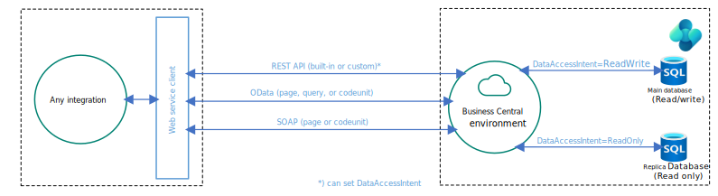

# Integration overview for Business Central online

This article is intended to help architects and developers make sound design decisions when they implement integration scenarios to and from [!INCLUDE[prod_short](../includes/prod_short.md)].

The article describes integration patterns, integration scenarios, and integration solutions. However, it doesn't include technical details about how to use or set up every integration pattern. It also doesn't include sample integration code.

## Integrations to/from Business Central are done with web services

All integrations (except for a few built-in integrations) to/from [!INCLUDE[prod_short](../includes/prod_short.md)] are done using web services. [!INCLUDE[prod_short](../includes/prod_short.md)] supports three types of web services: REST API, SOAP, and OData. 

The recommended way to use web services for [!INCLUDE[prod_short](../includes/prod_short.md)] is by using the REST API stack. 

For more information, see [Web services overview](../webservices/web-services.md).

## How to explore and develop against Business Central REST APIs

When you need to connect to [!INCLUDE[prod_short](../includes/prod_short.md)] from another application, you should use REST APIs, either the built-in APIs or custom APIs. 

For more information on how to explore and develop against APIs, best practices, and which built-in APIs exist, see [REST API overview](../webservices/api-overview.md).

## Integrating Business Central with Power Platform

[!INCLUDE[prod_short](../includes/prod_short.md)] supports multiple integrations to Power Platform. Enabling integrations to Power Platform augments the functionality in [!INCLUDE [prod_short](../includes/prod_short.md)] with additional features. 

<!-- to be added when all overview diagrams are ready
:::image type="content" source="media/powerplatform-integrations.svg" alt-text="Shows how Business Central integrates to M365" lightbox="media/powerplatform-integrations.svg"::: -->

[!INCLUDE [prod_short](../includes/prod_short.md)] integrates to the following Power Platform products and services:
- Power Apps
- Power Automate
- Power BI
- Power Pages

For more information, see [Integrating Business Central with Microsoft 365](../powerplatform/powerplatform-integration-overview.md).

## Built-in: Integrating Business Central with Dataverse

[!INCLUDE[prod_short](../includes/prod_short.md)] has four built-in ways to integrate with [!INCLUDE[dataverse_short](../includes/dataverse_short.md)]: 

- Data synchronization that replicates data between [!INCLUDE[prod_short](../includes/prod_short.md)] and [!INCLUDE[dataverse_short](../includes/dataverse_short.md)].
- Data virtualization with virtual tables in [!INCLUDE[dataverse_short](../includes/dataverse_short.md)] via [!INCLUDE[prod_short](../includes/prod_short.md)] API for (**C**reate/**R**ead/**U**pdate/**D**elete) operations.
- Data change (**CUD**) events using webhooks.
- Business events (preview).

:::image type="content" source="media/connect-to-dataverse.svg" alt-text="Shows the four interactions of DataVerse with Business Central" lightbox="media/connect-to-dataverse.svg":::

For more information, see [Integrating Business Central with Microsoft Dataverse](dataverse-integration-overview.md).

## Built-in: Integrating Business Central with Dynamics 365 Sales

You can integrate [!INCLUDE[prod_short](../includes/prod_short.md)] with Dynamics 365 Sales by first setting up integration to [!INCLUDE[dataverse_short](../includes/dataverse_short.md)] and then do more setup from the [!INCLUDE[prod_short](../includes/prod_short.md)] application. Integrating to Dynamics 365 Sales lets users view information from [!INCLUDE[prod_short](../includes/prod_short.md)] while they're working in Dynamics 365 Sales. For example, when preparing a sales quote it could be useful to know whether you have enough inventory to fulfill the order.

For more information, see [Integrating Business Central with Dynamics 365 Sales](/dynamics365/business-central/admin-prepare-dynamics-365-for-sales-for-integration)  

## Built-in: Integrating Business Central with Shopify

You can integrate [!INCLUDE[prod_short](../includes/prod_short.md)] with Shopify by installing and configuring the Shopify Connector app. By connecting your Shopify store (or stores) with [!INCLUDE[prod_short](../includes/prod_short.md)], you can maximize your business productivity and manage and view insights from your business and your Shopify store as one unit.

For more information, see [Get started with the Shopify connector](/dynamics365/business-central/shopify/get-started).

## Integrating to external systems from AL code: calling external services

You can integrate [!INCLUDE[prod_short](../includes/prod_short.md)] apps/extensions with external systems by using the *HttpClient* data type in AL code.

:::image type="content" source="media/httpclient.svg" alt-text="Shows how AL apps/extensions can call external web services from Business Central" lightbox="media/httpclient.svg":::

For more information, see [Integrating to external services with the HttpClient data type](../developer/devenv-httpclient.md).

## Integrating to external systems from AL code: Azure services

You can integrate [!INCLUDE[prod_short](../includes/prod_short.md)] apps/extensions with Azure services such as Azure Blob Services, Azure File Services, Azure Functions, or Azure Key Vault. 

:::image type="content" source="media/connect-to-azure-services.svg" alt-text="Shows how AL apps/extensions can call Azure services from Business Central" lightbox="media/connect-to-azure-services.svg":::

For more information, see [Integrating Business Central with Azure services](./integration-azure-overview.md).

## Integrating Business Central with infrastructure services

[!INCLUDE[prod_short](../includes/prod_short.md)] integrate to a few fundamental infrastructure services for operations such as authentication, authoriation, auditing, telemetry, and printing.

Here are some supported integrations between Business Central and fundamental services:

- Authentication and Authorization: [!INCLUDE[microsoft_entra_name](includes/m365-entra-name.md)]
- Network security: [!INCLUDE[azure_security_service_tags_name](includes/azure-security-service-tags-name.md)]
- Telemetry: [!INCLUDE[appinsights](../includes/azure-appinsights-name.md)]
- Local printers: [!INCLUDE[m365_universal_print](../includes/universal-print-name.md)]

For more information, see [Integrating Business Central with infrastructure services](integration-infrastructure-overview.md).

## Integrating to external systems from AL code: copilot

You can integrate [!INCLUDE[prod_short](../includes/prod_short.md)] apps/extensions with the Azure Open AI Service to include copilot and generative AI experiences. 

For more information, see [Integrating AI using Developer Tools for Copilot](../developer/ai-integration-landing-page.yml).

## Integrating to external systems from AL code: Microsoft Teams

You can integrate [!INCLUDE[prod_short](../includes/prod_short.md)] apps/extensions with Microsoft Teams. [!INCLUDE [prod_short](../includes/prod_short.md)] offers an app that connects Microsoft Teams to the data in [!INCLUDE [prod_short](../includes/prod_short.md)] so that users can quickly share details across team members and respond faster to inquiries. 

For more information, see [Integrating with Microsoft Teams overview](../developer/devenv-develop-for-teams.md).

## See also

[Web services overview](../webservices/web-services.md)  
[Developing Connect apps](../developer/devenv-develop-connect-apps.md)   
[Business Central connector for Power Platform](/connectors/dynamicssmbsaas)   
[Integrating with Microsoft Power Apps overview](../powerplatform/power-apps-overview.md)  
[Integrating with Microsoft Power Automate overview](../powerplatform/power-automate-overview.md)  
[Integrating with Microsoft Power Pages (preview)](../developer/power-pages-on-virtual-tables-overview.md)  
[Integrating with Microsoft Power BI](/dynamics365/business-central/admin-powerbi-overview)  
[How users can embed Power BI Reports in Business Central](/dynamics365/business-central/across-working-with-powerbi)  
[How AL developers can add Power BI Reports to pages](../developer/devenv-power-bi-report-parts.md)  
[Integrating Business Central with Microsoft Dataverse](dataverse-integration-overview.md)  
[Integrating Business Central with Dynamics 365 Sales](/dynamics365/business-central/admin-prepare-dynamics-365-for-sales-for-integration)  
[Integrating Business Central with Shopify](/dynamics365/business-central/shopify/get-started)  
[Integrating to external services from AL using the HttpClient data type](../developer/devenv-httpclient.md)  
[Integrating Business Central with Azure services](./integration-azure-overview.md)
[Integrating AI using Developer Tools for Copilot](../developer/ai-integration-landing-page.yml)
[Integrating with Microsoft Teams overview](../developer/devenv-develop-for-teams.md)  