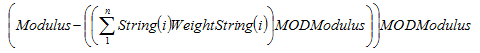

[!INCLUDE[newdev_dev_preview](../includes/newdev_dev_preview.md)]

# STRCHECKSUM Method (Code, Text)
Calculates a checksum for a string that contains a number.  

## Syntax  

```  

CheckNumber :=STRCHECKSUM(String[, WeightString][, Modulus])  
```  

#### Parameters  
 *String*  
 Type: Text constant or code  

 This string contains the number for which you want to calculate a checksum. You can only enter the numeric characters 0-9 in this string. If you enter anything else, a run-time error will occur (in English only). If *String* is empty, 0 is returned.  

 *WeightString*  
 Type: Text constant or code  

 This string contains numbers that you want to use as weights when calculating the checksum. The default value is a string that contains STRLEN\(String\) '1'-characters.  

 You can only enter the numeric characters 0-9 in this string. If you enter anything else, then a run-time error occurs.  

 If *String* is longer than *WeightString*, then a string is concatenated that contains STRLEN\(*String*\) - STRLEN\(*WeightString*\) '1'-characters to the end of *WeightString*. If *WeightString* is longer than *String*, then a run-time error occurs.  

 *Modulus*  
 Type: Integer  

 The number that you want to use in the checksum formula. The default value is 10.  

## Property Value/Return Value  
 Type: Integer  

 The checksum, which is calculated using this formula:  

   

## Example  
 This example shows how to use the STRCHECKSUM method to calculate a checksum.  

 This example requires that you create the following global variables and text constants.  

|Variable name|DataType|Length|  
|-------------------|--------------|------------|  
|StrNumber|Text|30|  
|Weight|Text|30|  
|Modulus|Integer|Not applicable|  

|Text constant|ENU value|  
|-------------------|---------------|  
|Text000|The number: %1\\|  
|Text001|has the checksum: %2|  

```  
StrNumber := '4378';  
Weight := '1234';  
Modulus := 7;   
CheckSum := STRCHECKSUM(StrNumber, Weight, Modulus);   
MESSAGE(Text000 + Text001, StrNumber, CheckSum);  
```  

 The formula is:  

 \(7 - \(4x1 + 3x2 + 7x3 + 8x4\) MOD 7\) MOD 7=0  

 The message window displays the following:  

 **The number: 4378**  

 **has the checksum: 0**  

## Example  
 This example shows how to use the STRCHECKSUM method to calculate a modulus 10 checksum for a bar code.  

 The STRCHECKSUM method can be used to calculate checksums for 13- and 8-digit European Article Number \(EAN\) and EAN-compatible bar codes such as a Universal Product Code \(UPC\) or Japanese Article Number \(JAN\).  

 A 13-digit EAN code has the following format:  

1.  The 12 digits in positions 13 to 2 are used to calculate the checksum at position 1.  

2.  Starting with position 2, all even values are totaled. The result is then multiplied by three. This value is called Even.  

3.  Starting with position 3, all odd values are totaled. The result is called Odd.  

4.  Total=Even + Odd.  

5.  The modulus 10 checksum is then \(10 - Total MOD 10\) MOD 10.  

 This example requires that you create the following global variables and text constants.  

|Variable name|DataType|Length|  
|-------------------|--------------|------------|  
|StrNumber|Text|30|  
|Weight|Text|30|  
|Modulus|Integer|Not applicable|  

|Text constant|ENU value|  
|-------------------|---------------|  
|Text000|The EAN code: %1\\|  
|Text001|has the checksum: %2|  

```  
StrNumber := '577622135746';  
Weight := '131313131313';  
CheckSum := STRCHECKSUM(StrNumber, Weight);  
MESSAGE(Text000 + Text001, StrNumber, CheckSum);  
```  

 The message window displays the following:  

 **The EAN code: 577622135746**  

 **has the checksum: 3**  

## See Also  
 [Code Data Type](../datatypes/devenv-Code-Data-Type.md)   
 [Text Data Type](../datatypes/devenv-Text-Data-Type.md)
