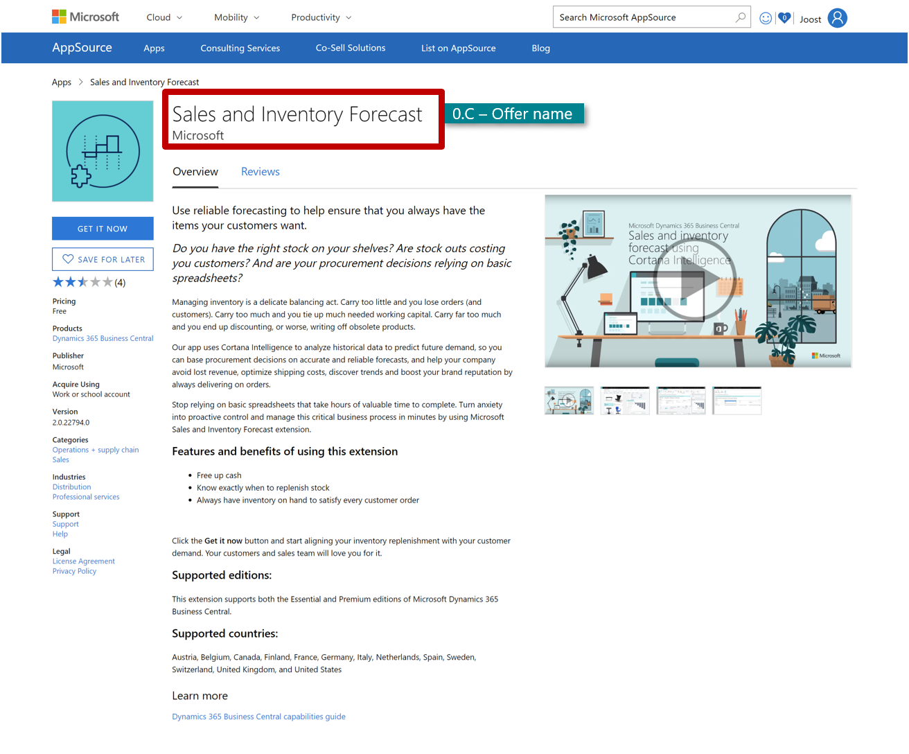

# Offer Name 

| General requirements | Description |Requirements |
|----------------------|-------------|-------------|
| 0.C **Offer Name**   | Your offers name on AppSource | Required      |

> [!NOTE]  
> The offer name must be the same as the name you specified in the app manifest. The offer name can be in any language.

**What your offer name will look like on AppSource** (Applicable naming structure) 
When creating a name for your offer, you can use the following two naming structures:

- Name 1: (Your offer name) for Microsoft Dynamics 365 Business Central 

    *Example: Sales & Inventory Forecast for Microsoft Dynamics 365* 

- Name 2: Your offer name only 

    *Example: Sales & Inventory Forecast*  

| General requirements | Description | Requirements | 
|----------------------|-------------|--------------|
| 0.C **Offer Name** | There are many things to consider when creating a relevant and enticing name for your offer.  | Recommended |

**How to create a strong app name for your offer** (Do’s and don’ts)?
How to create a good offer name

**Do’s**
- Ideally, your app name should communicate the core value customers will receive and it should not be tied to a specific product 
- Benefit-based names are always more effective than descriptive names. | 
- Use industry specific vocabulary or benefit-based references in your product name if possible – this will increase relevance and conversion rates.

**Don't**
- Don’t use technology specific messaging as your core product name component.
- Avoid using acronyms that are emotionally meaningless.
- Don’t include Microsoft names and/or trademarks, such as Dynamics or Dynamics 365 in your offering names, URLs, company names, social media account names or any other names you might use.

*Key questions to ask yourself when choosing a name for your offer:* 
- Does my product name convey anything to my prospect? 
- Does it capture the essence of the product and the value it delivers?
- Is it appropriate and appealing to our target audience? Is it short?
- Does the name connect with what our business is about?
- Is it interesting and memorable?
- Does it limit us in any way? How easily will it translate into other languages/cultures?
- Is it too much like another product and will it cause market confusion?

## Offer Summary

| Offer Details  | Description | Requirements |
|----------------|-------------|--------------|
| 1. **Offer Summary**  | The summary is the first paragraph that the prospect reads, as it will appear on your app's search page. Hence, make sure that it is clear and concise. | Required |

How to create a good summary for your offer? 
**How to structure your summary?**
- The summary should be max. 25 words or 100 characters including spaces, or less.
- The summary can be in any one language (you can choose any language to write your summary in, but do not mix languages) 
- The summary should summarize the value proposition of your offer in one short and concise sentence.
- The value proposition is a statement of the unique benefits your product delivers to the customer. 

If you need help formulating a positioning statement, try the value proposition generator located [here.](https://neuralimpact.ca/valueproposition)
- Consider whether or not is relevant (or valuable) to include your offer name in the summary 
- Don’t just state the offer name as an attempt to make it more memorable (names rarely give away any clues to the prospect about the value they will receive by starting to use your offer).

> [!TIP]  
> *Example:* *Use reliable forecasting to help ensure that you always have the items your
customers want.*

