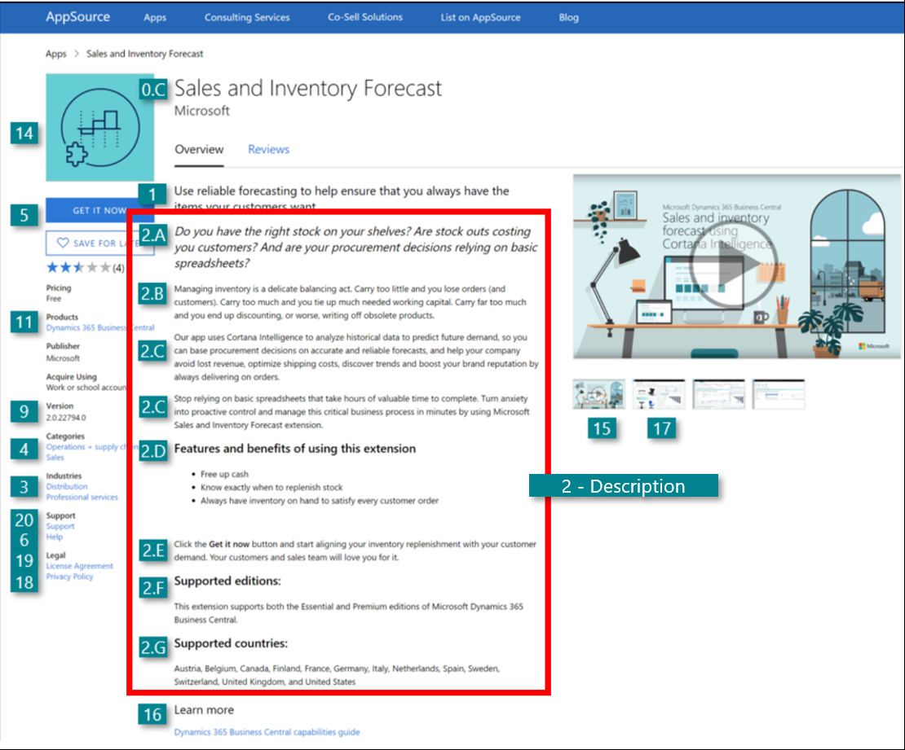

# Offer Description 

| Offer Details  | Description| Requirements |
|----------------|------------|--------------|
| 2. **Offer Description** (How to format and structure paragraphs in your offer description) | Make an elaborate and compelling description that outlines the benefits and usage scenarios of your Dynamics 365 Business Central app. | 	Required | 

> [!NOTE] 
> The description can be in multiple languages (max 3) but must be the same content for each language. If English is not one of the languages chosen, an English document must be added to the document section. 

How to structure the paragraphs in your description? Describe WHY customers would need your product and the value they get from using it instead of just writing WHAT your product does. 

To do so, your description should consist of 6 paragraphs (in the following order):
- Introduction paragraph (point 2.A)
- Pain based paragraph (point 2.B)
- Benefit based paragraph (point 2.C)
- Benefits in bullet points paragraph (2.D)
- Closing Call to action paragraph (point 2.E)
- Supported editions paragraph (point 2.F)
- Supported countries paragraph (point 2.G)

By including all of these paragraphs you will provide prospects with a compelling offer that explains them WHY they need to start using it.

How to format your description in the Cloud Partner Portal? The right formatting enables prospects to get a quick overview of the value that your offer can give them. Making the description compelling and nice to look at is therefore of key importance. 

When formatting the description of your offer please consider the following:
- The description can max. be 3000 characters incl. spaces
- Use simple html tags when formatting your description to create structured sections that are easy to get an overview of. 

The following html tags are allowed:
- p, em, ul, li, ol and header tags.
- Structure your description as small “easily readable” sections with headlines
- List vital benefits as bullet points
- Engage prospects by speaking directly to them using second person “you” language.

| Offer Details  | Description | Requirements |
|----------------|-------------|--------------|
| 2.A Offer Description **(Introduction Paragraph)** | To capture (and keep) the interest of the prospects you need to create interest and positive mental acknowledgement from the start. This can be achieved by asking relevant provocative questions that prospects either do not know the answer to or can relate to in the introduction paragraph. | Recommended  |

How to structure the content in this paragraph?
- Make a section where you ask provocative questions. 
- Speak to a core pain they are likely experiencing that has a negative measurable impact
- The question should stimulate a strong emotional response.

How to format this paragraph?
- Format this section as a headline *in itallic.*

Use these html tags:
- \<h2\>\<em\> section with provocative questions
- \</em\>\</h2\>

> [!TIP]  
> *Example:* *Do you have the right stock on your shelves? Are stock outs costing you customers? And are your procurement decisions relying on basic spreadsheets?*

| Offer Details | Description | Requirements |
|---------------|-------------|--------------|
| 2.B Offer Description **(Pain paragraph)** | Pain is the most compelling motivator of driving prospects to take action. Therefore, it is of the upmost importance that you communicate WHY your prospects need your product through a “pain-based” paragraph that call out the fears that they are facing. | Recommended  |

How to structure the content in this paragraph?
- Use this paragraph to clearly demonstrate to your prospects that you genuinely understand their industry and unique business problems.
- Describe the business challenges they are facing now (pain) and the ways their revenue growth, margins, productivity (desire), and so on are being negatively impacted by not taking action now.
- Most importantly, call out the fears that are likely holding them back.
- Remind them of the cost (higher risk, lower margins, lost sales) they are experiencing by putting off a decision. In so doing you have a bigger likelihood of getting the messages through to them and enticing them to take action.

How to format this paragraph? Format this section as a paragraph
- Use these html tags: \<p\> pain paragraph\</p\> 

*Example:*

> [!TIP]  
> *Example:* *Managing inventory is a delicate balancing act. Carry too little and you
lose orders (and customers). Carry too much and you tie up much needed working capital. Carry far too much and you end up discounting, or worse, writing off obsolete products.*

| Offer Details  | Description | Requirements |
|----------------|-------------|--------------|
| 2.C Offer Description **(Benefit paragraph)** | Likewise, you should also make a paragraph that describes the most important benefits and rewards that your prospects will realize by using your offer. | Recommended  |

How to structure the content in this paragraph?
- Tell them what they will gain by using your offer 
- You do not need to tell them how you do it, just what they will gain.
- When describing the potential value in specific, measurable business terms, you will appeal to both their desire and greed.

Quantify impacts and gains. 
- The more specific and concrete your promise of value is, the better. Abstract concepts such as “more efficiency, more productivity, transform your business” are not emotionally impactful or convincing, and they do not compel a prospect to act. Paint a picture of a possible experience that the prospect will immediately desire.
- Avoid the temptation of simply listing features and app functionality.
- If you make strong claims in the benefit paragraph, make sure you support them with proof.

How to format this paragraph?*
Format this section as a paragraph 

Use these html tags:
- \<p\> 1st benefit paragraph\</p\>
- \<p\> 2nd benefit paragraph\</p\>

> [!TIP]  
> *Example:* *Our app uses Cortana Intelligence to analyze historical data to predict
future demand, so you can base procurement decisions on accurate and
reliable forecasts, and help your company avoid lost revenue, optimize
shipping costs, discover trends and boost your brand reputation by always
delivering on orders.*
*Stop relying on basic spreadsheets that take hours of valuable time to
complete. Turn anxiety into proactive control and manage this critical
business process in minutes by using Microsoft’s Sales and Inventory
Forecast extension.*

| Offer Details                                               | Description                                       | Requirements |
|-------------------------------------------------------------|---------------------------------------------------|--------------|
| 2.D Offer Description **(Benefits as bullet points paragraph)** | *How to structure the content in this paragraph?* Highlight your offers benefits by listing them as bullet points. | Recommended  |

How to format this paragraph?* Format headline in bold 

Use these html tags:
- \<h3\>\<strong\> Features and benefits
- \</strong\>\<h3\>
Format bullet points as: 
Use these html tags:
- \<ul\>
- \<li\>1st Bullet point \</li\>
- \<li\>2nd Bullet point \</li\>
- \<li\>3rd Bullet point \</li\>
- \</ul\>

> [!TIP]  
> *Example:* *Features and benefits of using this extension* *Free up cash* *Know exactly when to replenish stock* *Always have inventory on hand to satisfy every customer order*

| Offer Details  | Description | Requirements |
|----------------|------------|--------------|
| 2.E Offer Description **(Closing Call to action paragraph)** | Round off your description with a strong “Closing Call to action” paragraph that urges customers to take action in order to realize your offer’s benefits. | Recommended  |

Choose the type of Call to action that you want to include:
- Calls to actions are active directions to your offer’s: Landing page, a link to a button at the storefront details and/or a “learn more” document
- We recommend that you link to both a button and your offer’s unique app landing page in the closing call to action.

How to structure the content in this paragraph?
- We recommend that this paragraph is less than 200 words or 1,200 characters.
- Insert your chosen call to action(s).
- Highlight the action that you want users to take by formatting the wanted action in bold as well as linking to your app’s unique landing page (either through hyperlinking the landing page or including a sentence on “Learn more" about us here ["How to Create a Sales Landing Page"](readiness-how-to-create-sales-landing-page.md).

How to format this paragraph? Format this section as a paragraph
- Use these html tags:
- \<p\>Click the \<strong\>Get it now\</strong\> button – then insert your closing call to action paragraph here\</p\>

> [!TIP]  
> *Example:* *Click Get it now and start aligning your inventory replenishment with your customer demand like a pro. Your customers and sales team will love you for it.*

## Supported Editions Supported Countries Premium SKU 
| Offer Details                                        | Description                                                                                                                                           | Requirements |
|------------------------------------------------------|-------------------------------------------------------------------------------------------------------------------------------------------------------|--------------|
| 2.F Offer Description **(Supported editions paragraph)** | Finally, insert a section in the bottom of your description that clearly states which edition(s) your offer supports (Essentials or Premium edition). | Required     |

How to structure the content in this paragraph?
- Create a header 3 in the html tags and make it bold.
- Call the header “Supported Editions”.
- Include a sentence that lists the edition(s) that your app supports.

How to format this paragraph? Format headline in bold 
- Use these html tags:
- \<h3\>\<strong\>Supported Editions:\</strong\>\</h3\>

Format the paragraph 
- Use these html tags:
- \<p\>This app supports both the Essential and Premium editions of Microsoft Dynamics 365 Business Central.\</p\>\<p\>

> [!TIP]  
> *Example:* *Supported editions:* *This app supports both the Essential and Premium edition of Microsoft Dynamics 365 Business Central.*
## Supported Countries
| Offer Details                                         | Description                                                                                                               | Requirements |
|-------------------------------------------------------|---------------------------------------------------------------------------------------------------------------------------|--------------|
| 2.G Offer Description **(Supported countries paragraph)** | Finally, insert a section in the bottom of your description that clearly states which countries your app is available in. | Required     |

Please refer to the list of supported Countries for Microsoft Dynamics 365 Business Central found here /dynamics365/business-central/dev-itpro/compliance/apptest-countries-and-translations 

How to structure the content in this paragraph?
- Create a header 3 in the html tags and make it bold.
- Call the header “Supported countries”.
- Include a sentence that lists the countries that your app is available in.

How to format this paragraph?
Format headline in bold 
- Use these html tags: \<h3\>\<strong\>Supported countries:\</strong\>\<h3\>

Format the paragraph
- Use these html tags: \<p\>Australia, Austria, Belgium, Canada, Denmark, Finland, France, Germany, Iceland, Italy, Mexico,Netherlands, New Zealand, Spain, Sweden, Switzerland, United Kingdom and United States\</p\> \</p\>

> [!TIP]  
> *Example:* *Supported countries:* *This app is available in: Australia, Austria, Belgium, Canada,* *Denmark, Finland, France, Germany, Iceland, Italy, Mexico, Netherlands, New Zealand, Norway, Spain, Sweden, Switzerland, United Kingdom and United States.*

> [!TIP]  
> Example of a completed offer summary and offer description in the “Offer
details” section of the Cloud Partner Portal.

Below is an enlarged picture of the entire offer description (cf. point 2.A-G)
and the html tags used:

 \<h2\>\<em\>Do you have the right stock on your shelves? Are stock outs costing you customers? And are your procurement decisions relying on basic spreadsheets?\</em\>\</h2\> \<p\>Managing inventory is a delicate balancing act. Carry too little and you lose orders (and customers). Carry too much and you tie up much needed working capital. Carry far too much and you end up discounting, or worse, writing off obsolete products.\</p\> \<p\>Our app uses Cortana Intelligence to analyze historical data to predict future demand, so you can base procurement decisions on accurate and reliable forecasts, and help your company avoid lost revenue, optimize shipping costs, discover trends and boost your brand reputation by always delivering on orders.\</p\> \<p\>Stop relying on basic spreadsheets that take hours of valuable time to complete. Turn anxiety into proactive control and manage this critical business process in minutes by using Microsoft Sales and Inventory Forecast app.\</p\> \<h3\>\<strong\>Features and benefits of using this app\</strong\>\</h3\> \<ul\> \<li\>Free up cash\</li\> \<li\>Know exactly when to replenish stock\</li\> \<li\>Always have inventory on hand to satisfy every customer order\</li\> \</ul\> \<p\>\&nbsp;\</p\> \<p\>Click the \<strong\>Get it now\</strong\> button and start aligning your inventory replenishment with your customer demand. Your customers and sales team will love you for it.\</p\> \<h3\>\<strong\>Supported editions:\</strong\>\</h3\> \<p\>This app supports both the Essential and Premium editions of Microsoft Dynamics 365 Business Central.\</p\> \<p\> \<h3\>\<strong\>Supported countries:\</strong\>\</h3\> \<p\>Australia, Austria, Belgium, Canada, Denmark, Finland, France, Germany, Italy, Netherlands, New Zealand, Spain, Sweden, Switzerland, United Kingdom and United States\</p\> \</p\>

