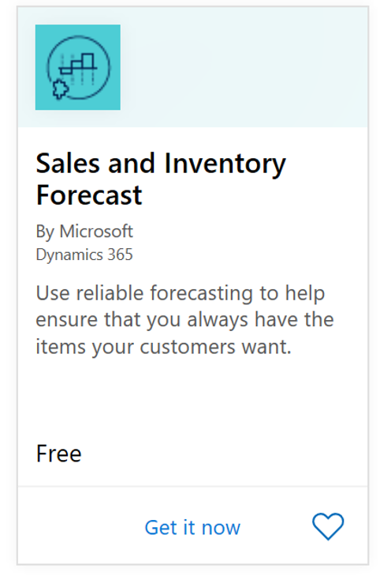
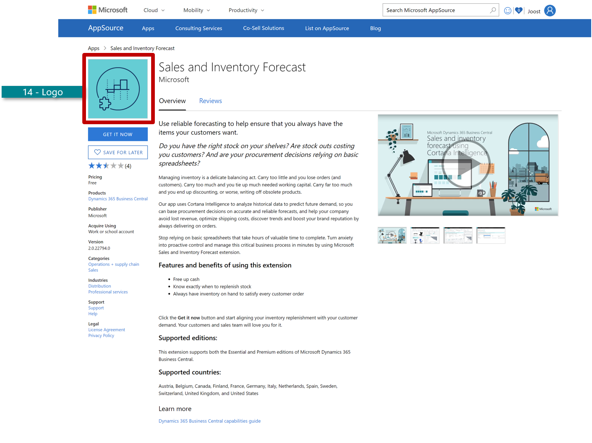
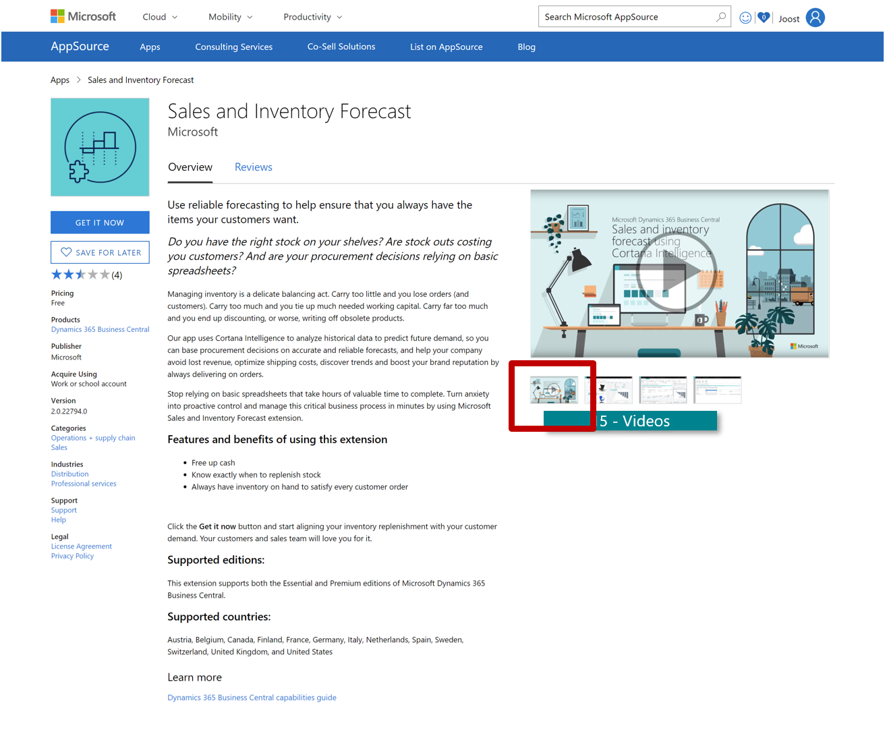
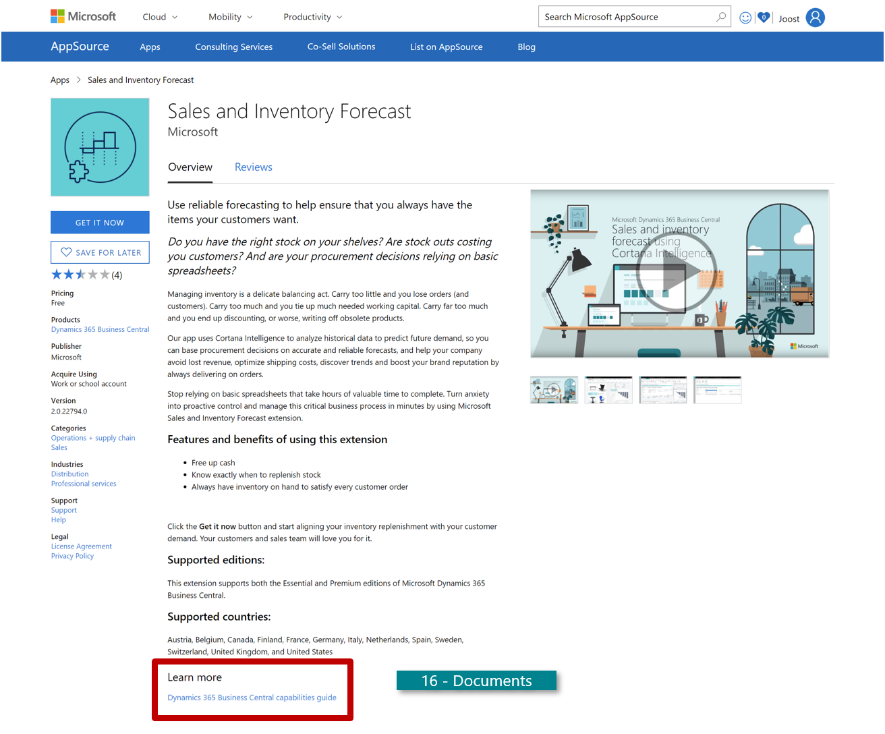
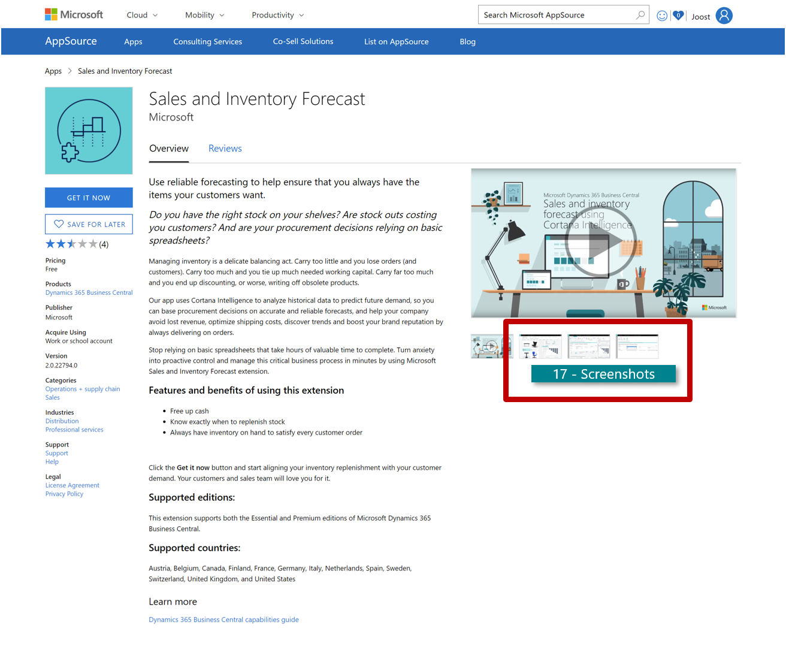

# Marketing Artifacts - Offer Logo

| Marketing artifacts | Description| Requirements |
|---------------------|------------|--------------|
| 14. **Offer logo**  | Formatting | Required     |
| 14.A Offer logo for your app's search page (.png, 48x48 pixels)    | 1 offer logo for your app's search page: 48x48 pixels resolution .png image | Required     |
| 14.B Offer logo for your app's details page (.png, 216x216 pixels) | 1 offer logo for your app's details page: 216x216 pixels resolution .png image | Required     |

You are required to provide two offer logos on AppSource:
- one in 48x48 pixels resolution for your app's search page:
- one in 216x216 pixels resolution for your app's details page:
- Both logos needs to be uploaded as .png images
- The name of the logo files can only use alphanumeric characters, dashes (-), or underscores (no spaces or other special characters)

Structure
- Your logo should be designed and optimized for a digital medium, not a traditional print based logo.
- Monitors emit light and paper absorbs light.
- Make sure you change the format, as you don't want to end up with weird, inaccurate color representation.
- Color calibration across devices can affect the look and feel of your app:
- All colors can be achieved by merging RGB (red, green, and blue) light, but monitors display only a limited range of the visible spectrum at a lowmedium resolution, usually 72-75 dots per inch. 
- Print production usually requires a four-color process CMYK (cyan, magenta, yellow, black) in high resolution of at least 300 dpi.

## Marketing Artifacts - Videos
| Marketing artifacts  | Description| Requirements |
|---------------------|-------------|--------------|
| 15. **Videos** | Pictures tell more than a 100 words – make sure to leverage this when promoting your offer. | Recommended  |

Large amounts of information are easier to take in when visualized. Using videos that demo your offer are therefore ideal to create intertest and enable prospects to learn more about your offer quickly. On AppSource videos will play when customers select the associated video thumbnail on your app's details page.

Formatting and General requirements (cf. section 0.A-D) to keep in mind when creating videos:
- A minimum of one video is recommended (up to a maximum of 5 are permitted).
- Language in videos can be either local or English
- Note, videos made in local language can have subtitles in English (no requirement).
Make the right references from the get go: 
- Only include screenshots & demo of the newest UI.
- Reference Microsoft's brand names correctly:
- Only refer to Microsoft Dynamics 365 Business Central, Dynamics 365 Business Central or Business Central after first mentioning of full product name.
- Don't make references to acronyms, old Dynamics 365 NAV brand names/logos or demo old UIs.
- Don't include Microsoft Dynamics 365 logos or trademarks in your video.

> [!NOTE]  
> Videos can be in any language, must be captioned if not spoken in English.

Structure - Choose the type of videos that you want to include 

You can create 4 different types of marketing videos:
- "Why" videos
- "How & What" videos
- "Getting Started" videos
- "Customer Testimony" videos 

See guidelines on how to best structure the 4 above mentioned videos (and why it is crucial to incorporate them) in [How to create compelling video](readiness-how-to-make-compelling-videos.md)

> [!TIP]  
> *Example of a video that is set up according to our best practices:*
> [A "How and What product video" from Open Door Technology](https://vimeo.com/260138342)

How to upload video(s) to Partner Center? 
When uploading a video in the in Partner Center you need to provide the following:
- A name for your video (cf. customers will see this name on your app's details page)
- An URL to a YouTube or Vimeo video 
- The video URL must be either a YouTube or Vimeo link that is able to be played using an embedded experience.
- A thumbnail image o Upload only a .png image with resolution 1280x720.
- Don't add a 'Play' icon to the thumbnail; this will be added automatically in AppSource.

Note: On AppSource videos will play when customers select the associated video thumbnail on your app's details page.

> [!TIP]  
> *Example:* *URL to YouTube video Thumbnail image*
> [How Cortana helps manage inventory in](https://www.youtube.com/watch?v=toac7I6At2Q&index=4&list=PLcakwueIHoT-wVFPKUtmxlqcG1kJ0oqq4&t=0s) [Dynamics 365 Business Central](https://www.youtube.com/watch?v=toac7I6At2Q&index=4&list=PLcakwueIHoT-wVFPKUtmxlqcG1kJ0oqq4&t=0s)

## Marketing Artifacts - Documents
| Marketing artifacts  | Description | Requirements |
|----------------------|------------|--------------|
| 16. **Documents** (Learn more documents) | Enable prospects to learn more about your offer by adding supporting sales and marketing assets in the "learn more" section of the storefront details. | Required |

Formatting
- A minimum of one document is required (up to a maximum of 3 are permitted).
- It is a requirement that all docs are written in English and are formatted as PDF-files.
- We recommend you to add the link to your app landing page to all your documents.

> [!NOTE]    
> If your description does not include English, it is a requirement that you are providing an English translation as a document. This document must include the description text in English as well as the support information in English (if the support page is not in English). 

Structure:
- Think wisely about what content you include in the learn more section. Don't sell, educate the prospect:
- Don't just include a description of your offer here – the prospect has already read the description in the store front details in AppSource and has shown an interest in your offering by clicking on the learn more item – don't discourage this interest by repeating something that they already know. 
- Instead, use this opportunity to show them something new that entices their interest to start using your offer even more.

Examples of Sales and marketing docs you can include as your "Learn more" assets are:
- Set up instructions, customer reviews, marketing materials, white papers, brochures, check lists, PowerPoints etc.
- A unique offer landing page

When uploading a document in the in Partner Center you need to provide the following:
- A name for your document (cf. customers will see this name on your app's details page) 
- Upload the doc you want to include in your storefront details

## Marketing Artifacts - Screenshots
| Marketing artifacts | Description | Requirements |
|---------------------|-------------|--------------|
| 17. **Screenshots**     | Pictures speak more directly to our brain than words. Your screenshots should therefore clearly demonstrate the claims you make and the functionality of your offer. | Required| 

Formatting
- A minimum of 3 screenshots are required (up to a maximum of 5 are permitted).
- Use images that demos your offer in Dynamics 365 Business Central and if possible, what problem your offer is solving.
Choose the proper image format to use: 
- Screen portraits
- Can be more effective than screenshots because you can design annotations in them.
- Screenshots
- Require super-imposing, which can be clumsy and confusing. Also, screenshots lose readability when reduced in size

> [!NOTE]  
> Screenshots can be provided in any language. 

Structure
- Upload only .png images with a resolution on 1280 x 720 px.

Example of different types of images that you can include to visually demonstrate claims made are: Infographics, tables, charts, dashboards etc.

- Use screenshots that includes realistic demo data and tell a compelling story 
- Use visual images that highlights and demonstrates the key competitive differential between your product and others.
- Our brains love contrast, so use comparisons if you can (i.e. screenshots of "before" and "after" using your offer).

Choose key visual elements to highlight rather than including a full screen of distracting, irrelevant content.
- Graphic dashboards are optimal.
- Zoom in on differentiation aspects.
- *Don't use small fonts*, as small fonts that require squinting.
- *Don't include screenshots from the Winclient* – only use screenshots from the Webclient and the Dynamics 365 Business Central UI.

When uploading a screenshot in the in Partner Center you need to provide the following: 
|- A name for your screenshot (Customers will see this name on your app's details page)
- An URL to a YouTube or Vimeo video o The video URL must be either a YouTube or Vimeo link that is able to be played using an embedded experience.
- Upload only a .png image with resolution 1280 x 720.

> [!TIP]  
> *Example:* *Dashboard* *Set up instructions*

> [!TIP]  
> *Example:* of the completed screenshot fields (cf. point 17) in the "Marketing artifacts" section of Partner Center:

