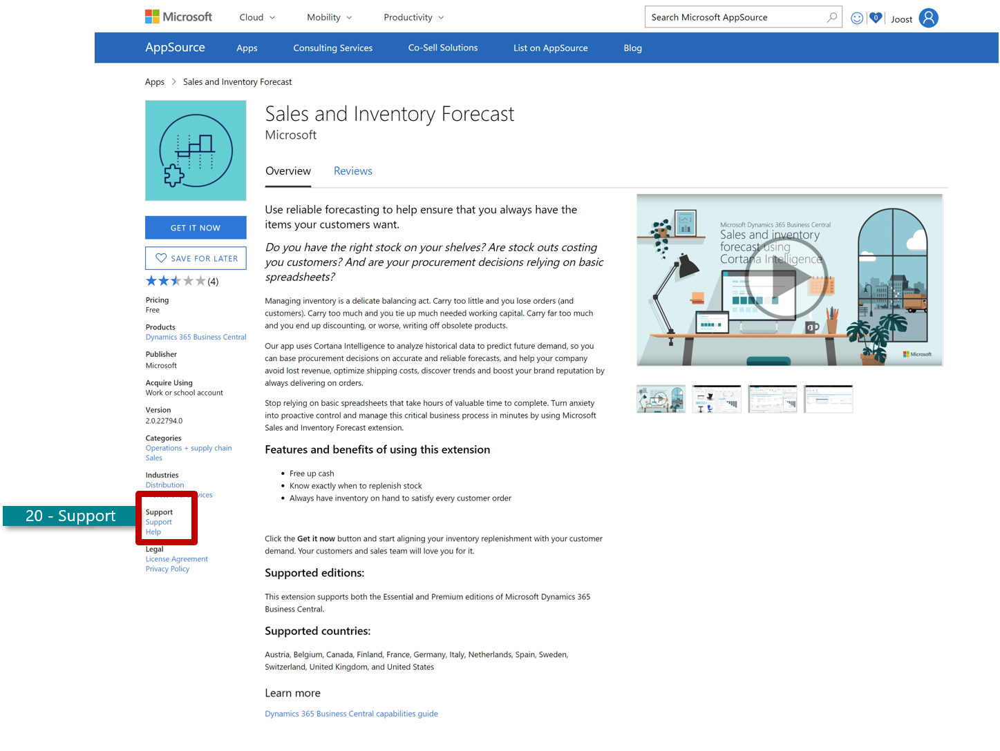

# Help URL

| Listing details | Description | Requirements |
|-----------------|-------------|--------------|
| 6. **Help URL** | You need to provide a URL for a distinct help page where prospects can find different types of online product help. The help page needs to include online documentation that can be used as help. Your Help Link should be a landing page on your website where one can find help resources, such as documentation, FAQs, step-by-step guides, webinars, and so on.| Required|

Formatting
- The Help page can be in any language. We do recommend that your help information is in English and are formatted as PDF-files.
- There needs to be a clear distinction between the support and the help site. We require two separate pages (unless a single page covers all Help Link and Support Link requirements). 

Structure
- Provide a URL for a distinct help page, where prospects can find different types of online product help.

The help page needs to include online documentation that can be used as help.
- Types of online help that you can include on your help page are:
- Instructions on set up/how to get started
- Links to existing videos and documentation 
- Links to the most frequently asked questions

*Example of a help site that is set up according to our best practices:* [Foodware's help page](https://docs.foodware365.com/bcportal/Foodware365QuickStart.htm?b=Expiration%20Management)

> [!TIP]  
> *Example:* of the help link-, supported countries/regions-, supported
languages and app version fields (cf. point 6,7,8 and 9) in the "Listing
details" section of Partner Center:

## Support URL
| Customer support | Description | Requirements |
|------------------|-------------|--------------|
| 20. **Support URL**  | Formatting  your support page can be in any language. It is a requirement that you provide different (i.e. more than two) contact options on your app landing page. | Required |

Structure
- You need to provide a URL for a distinct support page where prospects can find different contact options
- The support page should be accessible without a login

The support page needs to include the following contact options and docs: 
- Email 
- Phone number
- Live-chat (if possible) 
- Address 
- Include the time frame for your reply (such as within 1-2 business days).

How to upload your support page to Partner Center?
- Enter the URL to your app's support page.

> [!TIP]  
> *Example:* of a support page that is set up according to our best practices: [EOS Solutions' support page.]( https://www.eos-solutions.it/en/contact-support.html)
