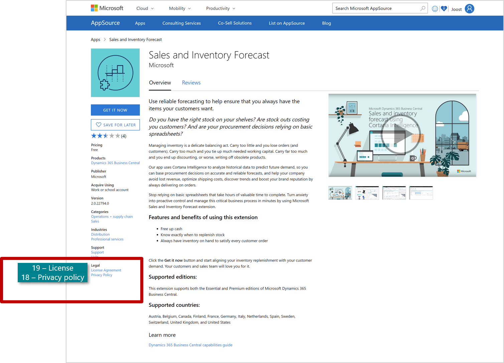

# Privacy Policy & Terms of Use

| Legal | Description | Requirements |
|-------|-------------|--------------|
| 18. **Privacy policy URL**  | You need to provide a URL for your app’s privacy policy page where prospects can find information on how you handle their data.| Required|
|| How to upload your privacy policy to Partner Center? Enter the URL to your app's privacy policy page.|
|| *Examples of policies that are set up according to our best practices:* [Plumbline Consulting’s privacy policy](https://progressussoftware.com/privacy-policy/); [EOS Solutions’ privacy policy](https://www.eos-solutions.it/en/privacy.html)|
| 19. **License Agreement (Terms of Use)** |  You need to provide a License Agreement, where prospects can find information on the terms of use of your app. Prospects are required to accept these terms before they can try your app.  | Required     |
|| How to upload your terms of use to Partner Center? You can upload your Terms of Use in two different ways: 1) If the License Agreement is hosted on your own website, you  just provide the URL. If not, you enter the License Agreement (without HTML) in the designated field.
||*Example of a License Agreement that is set up according to our best practices):* [Plumbline Consulting’s License Agreement](https://progressussoftware.com/user-agreement/)

> [!TIP]  
> *Example:* of the completed screenshot fields (cf. point 18 and 19) in the “Legal” section of Partner Center)

