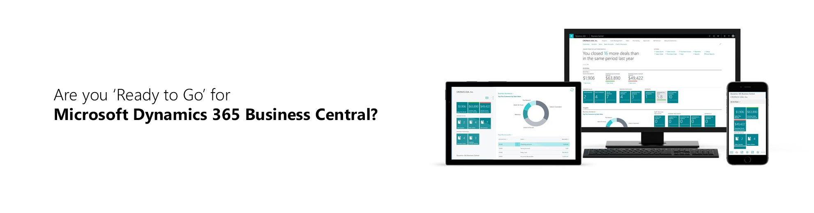

# The “Ready to Go” Program

[!INCLUDE[d365_bus_central_md](../includes/d365_bus_central_md.md)] is a business management solution that helps companies connect their financials, sales, service, and operations to streamline business processes, improve customer interactions, and make better decisions.  

[!INCLUDE[prodshort](../includes/prodshort.md)] creates multiple [opportunities for partners to provide apps or consulting services](https://aka.ms/businesscentralapps) on Microsoft AppSource.

The “Ready to Go” program is designed to support you in the journey of bringing offerings to market. The program contains learning, coaching, and tooling. Use the tabs below to read more about the elements of the "Ready to Go" program.  

> [!TIP]
> Keep on top of news, tips, tools, programs, and new capabilities by following us on the [Business Central for partners](https://community.dynamics.com/business/b/businesscentraldevitpro) blog.

# [**Learning**](#tab/learning)
**The "Ready to Go" online learning catalog** is an extensive collection of materials for [!INCLUDE[d365_bus_central_md](../includes/d365_bus_central_md.md)], including training resources, white papers, and tools for both app developers (ISVs) as well as resellers (VARs). It is designed for marketeers, business decision makers, sales and pre-sales roles, architects, consultants, and developers. [Access the "Ready to Go" learning catalog](https://go.microsoft.com/fwlink/?linkid=2002101).

# [**Coaching**](#tab/coaching)
Several Development Centers, Master VARs, and Training Centers provide **“Ready to Go” coaching**.

The coaches are independently owned companies which provide services to partners, tailored to their needs. Over time they have developed lots of best practices by supporting multiple partners, they also have strong ties with [!INCLUDE[d365_bus_central_md](../includes/d365_bus_central_md.md)] teams and are always up to date on the latest strategy and product innovation.

An example of one of the coaching sessions provided by the Development Centers and Master VARs are **the “Ready to Go” validation workshops**. This workshop is an 8h workshop at a fixed price which is designed to coach you in bringing your app into Microsoft AppSource or help you with the implementation of your first customer.  

Please find the coaches in your region and explore which "Ready to Go" offerings they provide:

|Company|Coaching services provided|More info|
|-------|--------------------------|---------|
|**1ClickFactory**  (Development Center)|Coaching and training services in person and online in Europe, North and South America, Asia, and Africa.|[ReadyToGo Contacts](https://www.1clickfactory.com/readytogo/)|
|**Ciellos**  (Development Center)|Coaching and training services in person and online in Europe, North, and South America.|[ReadyToGo Contacts](https://www.ciellos.com/ready-to-go)|
|**Cloud-Ready-Software**(Development Center)|Coaching and training services in person and online in Europe, North and South America, Asia, and Africa.|[ReadyToGo Contacts](https://cloud-ready-software.com/readytogo/)|
|**Innova Consulting** (Development Center)|Coaching and training services in person and online in Europe and South America.|[ReadyToGo Contacts](https://www.innovaconsulting.es/en/readytogo/)|
|**QBS Group** (MasterVAR)|Coaching and training services in person and online in Europe, Middle East, and Africa.|[ReadyToGo Contacts](https://www.qbsgroup.com/service/ready-to-go-for-dynamics-365-business-central/)|
|**Velosio** (MasterVar)|Coaching and training services in person and online in North America.|[ReadyToGo Contacts](https://www.velosio.com/landing/readytogo/)|
|**Plataan** (Training Center)|Training services in person and online in Europe, North and South America, Asia, and Africa.|[ReadyToGo Contacts](https://plataan.tv/en)|

# [**Tooling**](#tab/tooling)
**The "Ready to Go" tooling** is designed to support you in the actual app development, including testing and learning scenarios. The platform provides you with various insider builds of [!INCLUDE[d365_bus_central_md](../includes/d365_bus_central_md.md)] (cf. both current, upcoming and daily builds are available).  
The platform also enables you to provide direct feedback to the Microsoft engineers who are working on [!INCLUDE[d365_bus_central_md](../includes/d365_bus_central_md.md)]. 

# [**Resources**](#tab/resources)
### Business Central on the Dynamics 365 Blog for partners

The blog talks about opportunities, processes, programs, and tools for the Business Central partner community. Follow the blog here: [Business Central on the Dynamics 365 Blog for partners](https://cloudblogs.microsoft.com/dynamics365/it/product/business-central/)

### Monthly “Ready to Go” Office Hours call
“Ready to Go” Office Hours is a monthly call that takes place the second Tuesday of every month. The call is structured as a FAQ session, where a team of our different experts will be present to answer any questions that you may have in relation to bringing your offerings into AppSource. Sign up here: [aka.ms/ReadyToGoOfficeHours](https://aka.ms/ReadyToGoOfficeHours).

### GitHub
Use the GitHub forum to post questions about AL to the community and Microsoft experts here: [https://github.com/microsoft/al/issues](https://github.com/microsoft/al/issues).

### Follow “Ready to Go” activity on social media
Get insights into what's happening with [!INCLUDE[prodshort](../../includes/prodshort.md)]. Follow us on [Twitter](https://twitter.com/search?q=%23ReadyToGo%20%23MSDYN365BC&src=typd). 

### Learn more about the offering types
+ [Build Add-on apps: https://aka.ms/BusinessCentralAddonApps](https://aka.ms/BusinessCentralAddonApps)  
+ [Build Embed apps: https://aka.ms/BusinessCentralEmbedApps](https://aka.ms/BusinessCentralEmbedApps)  
+ [Build Connect apps: https://aka.ms/BusinessCentralConnectApps](https://aka.ms/BusinessCentralConnectApps)  
+ [Build Localization apps: https://aka.ms/BusinessCentralLocalizationApps](https://aka.ms/BusinessCentralLocalizationApps)  
+ [Deliver consulting services as a VAR: https://aka.ms/BusinessCentralConsultingServices](https://aka.ms/BusinessCentralConsultingServices) 

### Shortcuts to developing and publishing Business Central apps documentation

+ [Marketing Validation Checklist](/dynamics365/business-central/dev-itpro/developer/readiness/readiness-checklist-marketing)
+ [Technical Validation Checklist](/dynamics365/business-central/dev-itpro/developer/devenv-checklist-submission)
+ [How to create an effective sales landing page](/dynamics365/business-central/dev-itpro/developer/readiness/readiness-how-to-create-sales-landing-page)
+ [How to make compelling videos](/dynamics365/business-central/dev-itpro/developer/readiness/readiness-how-to-make-compelling-videos)

### Learning catalog
+ [Business Central Learning Catalog](https://go.microsoft.com/fwlink/?linkid=2002101)  
