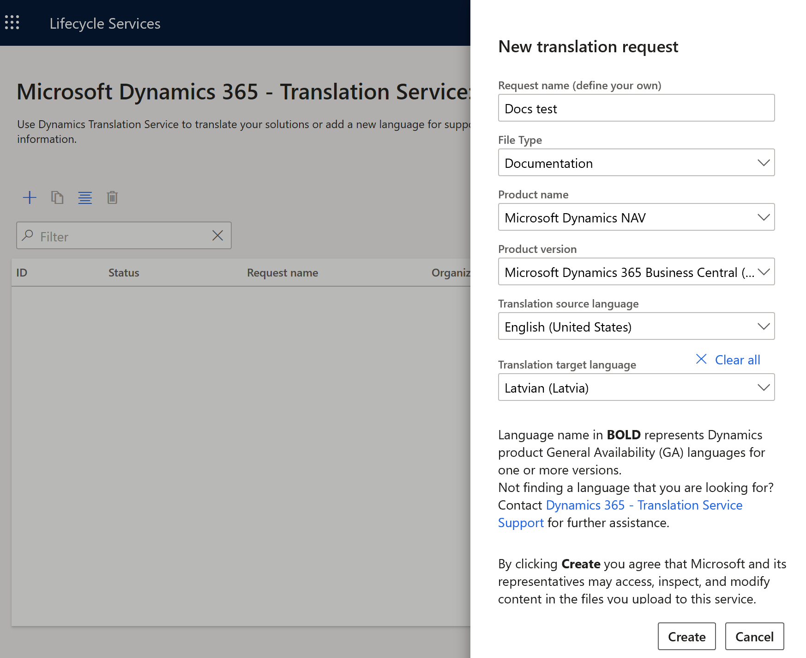

# Extend, Customize, and Collaborate on the Help for [!INCLUDE[prodlong](../developer/includes/prodlong.md)]

The source files for the Help for the base application are available in public GitHub repos so that you can easily extend and customize the content for your customers. In this section, you can learn about working with the GitHub repos and MarkDown files. You can also find guidance in the [Docs Contributor Guide](/contribute/).  

If you want to get Microsoft's content and deploy it to your own website with or without customizations, see [Custom Help Toolkit](custom-help-toolkit.md).  

## Get content from the GitHub repos

There are repos in GitHub for the source content and each of the languages that Microsoft translates to. The [dynamics365smb-docs](https://github.com/MicrosoftDocs/dynamics365smb-docs) repo contains the source content in English (US). If you want access to the content in other languages, navigate to the relevant repo - the names follow this pattern: ```dynamics365smb-docs-pr.\<language>-\<country>```, such as [dynamics365smb-docs-pr.da-DK](https://github.com/MicrosoftDocs/dynamics365smb-docs-pr.da-DK) for the Danish version.  

You can use the [HtmlFromRepoGenerator tool](custom-help-toolkit-HtmlFromRepoGenerator.md) to get the latest version of Microsoft's content and generate HTML files that you can then customize. The tool handles the GitHub work for you, but you will still have to understand the basics of the Microsoft GitHub repos.  

When Microsoft publishes an update to the content, the *live* branch in the corresponding GitHub repo is updated. The source repo is updated at least weekly; however, the related language-specific repos are updated less frequently, based on when new translations are made available. You can use the [Custom Help Toolkit](custom-help-toolkit.md) to get the current version of Microsoft's content and prepare HTML files for customization. Alternatively, if you customize the Microsoft content based on MarkDown, you can use scripts to get the current version. The GitHub platform and tooling will help you manage any potential merge conflicts if you have made changes to the same files as Microsoft has. For more information, see [Set up Git repository locally for documentation](/contribute/get-started-setup-local) in the Docs Authoring Guide and [Fork a repo](https://help.github.com/articles/fork-a-repo/) in the Help for GitHub.  

> [!TIP]
> You do not have to get acquainted with GitHub if you just want to get the Microsoft content in HTML format to deploy to a website, for example. You do not even have to get a GitHub account, as shown in the [Getting by without GitHub](#get-the-content-without-a-github-account) section. However, in many scenarios, you might want to join us in GitHub for closer collaboration and easy of extensibility.

If you fork one of our repos, you can choose to update your fork with regular updates from the Microsoft repo.  

For guidance about what the Microsoft-provided content for [!INCLUDE [prodshort](../developer/includes/prodshort.md)] is all about, see [User Assistance Model](../user-assistance.md).  

The remaining sections of this article are intended for people who do **not** use the [Custom Help Toolkit](custom-help-toolkit.md) - and for the curious. See the following table to find what you want to learn more about.  

|To learn more about this subject|Read this section |
|--------------------------------|------------------|
|Files and subfolders in the GitHub repos| [What the GitHub repos contain](#what-the-github-repos-contain) |
|How to interact with the GitHub repos without using the [HtmlFromRepoGenerator](custom-help-toolkit-HtmlFromRepoGenerator.md) tool |[Get updates from Microsoft](#get-updates-from-microsoft) |
|The mechanics of working in GitHub based on our internal contributor guide|  [Get started with GitHub](#get-started-with-github) |
|How you can contribute to Microsoft's content| [Contributing](#contributing)|
|Forking a repo without using the [HtmlFromRepoGenerator](custom-help-toolkit-HtmlFromRepoGenerator.md) tool| [Get the content without a GitHub account](#get-the-content-without-a-github-account)|
|Generating content for your website without using the [HtmlFromRepoGenerator](custom-help-toolkit-HtmlFromRepoGenerator.md) tool|[Build HTML files](#build-html-files)|
|Potential problems you might see when you customize Microsoft's content| [Known issues with Microsoft's content](#known-issues-with-microsofts-content) |
|Using the Dynamics 365 Translation Service to manage translations| [Translate the content](#translate-the-content) |

### What the GitHub repos contain

Microsoft's GitHub *dynamics365smb-docs* repos for [!INCLUDE [prodshort](../developer/includes/prodshort.md)] Help contain the following folders:

- accountant

    Contains files that are relevant for Dynamics 365 — Accountant Hub but will soon be deleted due to deprecation. You can ignore this folder.
- archive

    Contains files that are not published but kept for backwards compatibility use internally at Microsoft. You can ignore this folder.
- business-central

    Contains files that are relevant for [!INCLUDE [prodshort](../developer/includes/prodshort.md)]
- media-source

    Contains source files for some of the pictures that are used in the [!INCLUDE [prodshort](../developer/includes/prodshort.md)] content
- Templates

    Contains a template that you can use if you build HTML files for the legacy Dynamics NAV Help Server website

The repos also contain files in the root of the repos that are used internally by Microsoft for managing the content on the docs.microsoft.com site and on GitHub. They are not relevant for the purpose of extending or customizing the content.

> [!TIP]
> The [!INCLUDE [prodshort](../developer/includes/prodshort.md)] installation media still contain CAB files for Help Server; however, the latest content is always available in the GitHub repos. If you find that the CAB files are outdated, or if they do not contain the files that you expect, get the latest files from GitHub. For more information, see the [Get updates from Microsoft](#get-updates-from-microsoft) and [Get the content without a GitHub account](#get-the-content-without-a-github-account) sections, respectively.

If you want to contribute to the developer and administration content, clone or fork the `https://github.com/MicrosoftDocs/dynamics365smb-devitpro-pb` repo

### Get updates from Microsoft

Microsoft makes frequent changes to the [!INCLUDE [prodshort](../developer/includes/prodshort.md)] content, and those changes show up in the public GitHub repos. The base repo, MicrosoftDocs/dynamics365smb-docs, is updated weekly, and the translations are updated monthly. When you decide it is time to get the latest version of the content from Microsoft, you can do that using GitBash or GitHub Desktop. In the Help for GitHub, you can see [an example of how this works in GitBash](https://help.github.com/en/articles/merging-an-upstream-repository-into-your-fork). In GitHub Desktop, just use the *Merge into current branch* menu item to pull changes from the origin into your fork.  

However, if your solution is available in more than one country, then you are likely to want to make content available in multiple languages. Microsoft has a GitHub repo for each supported language, but the configuration files are only available in the English (US) source repo, MicrosoftDocs/dynamics365smb-docs.  

The following script was developed by a Danish partner in order to get the Microsoft source for a number of languages, copy media files to the localization repos, and then build HTML files. The script is provided in agreement with the partner without further support.

```powershell
$languages = $("da-dk","de-ch","de-de")
$git = "C:\Program Files\Git\cmd\git.exe"
$docfx = "C:\GitHub\DocFx\docfx.exe"
$365docs = "C:\GitHub\MSFT\dynamics365smb-docs"
$langDir = "c:\Working\help\dynamics365smb-docs-pr."

Start-Process -FilePath $git -ArgumentList "clone --single-branch --branch live https://github.com/MicrosoftDocs/dynamics365smb-docs.git" -WorkingDirectory "C:\working\help" -Wait
foreach ($language in $languages)
{
    $arguments = $("clone --single-branch --branch live https://github.com/MicrosoftDocs/dynamics365smb-docs-pr." + $language + ".git")
    Start-Process -FilePath $git -ArgumentList $arguments -WorkingDirectory "C:\working\help" -Wait
    Copy-Item $($365docs + "\business-central\docfx.json") $($langDir + $language + "\business-central")
    Copy-Item $($365docs + "\business-central\media") $($langDir + $language + "\business-central") -Recurse -Force
    Copy-Item $($365docs + "\business-central\LocalFunctionality") $($langDir + $language + "\business-central") -Recurse -Force
    Copy-Item $($365docs + "\Templates") $($langDir + $language) -Recurse -Force
    Set-Content -Path $($langDir + $language + "\business-central\docfx.json") -Value (get-content -Path $($365docs + "\business-central\docfx.json"))
    Start-Process -FilePath $docfx -ArgumentList $("C:\working\help\dynamics365smb-docs-pr." + $language + "\business-central\docfx.json" + " --output c:\working\output\" + $language)
}
```

For more information, see the [Build HTML files](#build-html-files) section.  

Because the Microsoft repos are public, you do not need a valid GitHub account in order to get the content. However, we recommend that your organization has a system account with access to GitHub at a minimum.  

### Get started with GitHub

To join Microsoft in the world of GitHub and MarkDown, there are new terminology and tools to get used to. The following list outlines the main steps, but you can find additional content, tools, and ideas in the [GitHub documentation](https://help.github.com/en/github) and other forums.

1. Fork the right repo

    You cannot work directly in the [!INCLUDE [prodshort](../developer/includes/prodshort.md)] repos in the MicrosoftDocs GitHub org, such as the dynamics365smb-docs repo. The first thing you need to do is create a fork of the repo under your GitHub account. A fork is a copy of this repo that lets you work freely on the content without affecting the MicrosoftDocs/dynamics365smb-docs repo.  

    Alternatively, you can *clone* the Microsoft repo. This is useful if you don't intend to customize Microsoft's content, for example. But in many cases, *forking* the repo is more preferable.  

    For more information, see [Set up your GitHub account](/contribute/get-started-setup-github) and [Set up Git repository locally for documentation](/contribute/get-started-setup-local) in the Docs Authoring Guide.

    > [!TIP]
    > You are not required to make your GitHub repos public. When you fork a public repo, you can specify in the settings for the new repo if the repo is public, private, or available only to specific GitHub accounts.

2. Install GitHub Desktop (optional) and clone your forked repo.

    GitHub Desktop makes is easy to work and collaborate with repos locally from your own desktop. For more information, see [GitHub Desktop](https://desktop.github.com/).  

3. Get hold of your favorite MarkDown editor, and start making changes.

    The help content is stored in the *business-central* folder of the repo. Articles use a syntax for formatting text called [Markdig](https://github.com/lunet-io/markdig) Flavored Markdown, which is [CommonMark](https://commonmark.org/) compliant. To learn more about working with markdown, see [Getting started with writing and formatting on GitHub](https://help.github.com/articles/getting-started-with-writing-and-formatting-on-github/).

    If you want to work locally, you can edit using any text editor. Just save the file as a .md type. Here are two good tools that provide you with some nice features, including a preview of how the content will be rendered in HTML:

    - [Visual Studio Code](https://code.visualstudio.com/)

        Add the [Docs Authoring Pack for Visual Studio Code](/contribute/how-to-write-docs-auth-pack), which gives you spell checker, MarkDown validation, and many other productivity features  
    - [Atom](https://atom.io/)

        Atom has spell check and is good for managing many files

Internally at Microsoft, some authors use Code, others use Atom, and for light-weight work, we tend to just edit the content in the browser. You can find more guidance for how to get started with MarkDown in the [Docs Contributor Guide](/contribute/). This guide is published by the team that built the Docs.microsoft.com site where the Business Central team publishes their docs.

> [!IMPORTANT]
> The [Writate](https://www.writage.com/) plugin for Word can be very helpful for converting existing content to MarkDown, but we recommend that you do not use it to edit MarkDown files in Word. When you save the MarkDown file, all metadata tags and some of the formatting is erased.

### Contributing

A benefit of GitHub is the ability for you to contribute to the core content that the Microsoft team provides in the dynamics365smb-docs repo. For example, you might have a new article that you think would be beneficial or you might have a correction to an existing article. If you would like to contribute to the MicrosoftDocs/dynamics365smb-docs repo, you create a *pull request* from your repo to the MicrosoftDocs/dynamics365smb-docs repo. The Microsoft team will then review the request and include the changes as appropriate.

> [!NOTE]
> Microsoft accepts pull requests to the *dynamics365smb-docs* repo only, not the language-specific repos. If you have feedback about translations, you can report a GitHub issue in the relevant repo.

To create a pull request to the MicrosoftDocs/dynamics365smb-docs repo by using GitHub Desktop, do the following:

1. Commit the changes to your repo that you want to include in the pull request.
2. Choose **Sync** to push the changes up to your repo on GitHub.
3. When the sync is completed, choose **Pull Request**, make sure that the pull request points at the *live* branch, and then choose **Pull Request**.

## Get the content without a GitHub account

If you do not want to collaborate with Microsoft on the content, you can get the latest version of the content from GitHub without a GitHub account. For example, if you want content that is newer than the content on the [!INCLUDE [prodshort](../developer/includes/prodshort.md)] installation media, you can get the latest by simply downloading the content of the relevant GitHub repo, which you can do without a GitHub account - the Microsoft repos are public so that anyone can always get to them. Use the [HtmlFromRepoGenerator](custom-help-toolkit-HtmlFromRepoGenerator.md) tool, create your own scripts, or follow this process to fork a repo manually.  

### To get files without a GitHub account

1. Go to the relevant GitHub repo, such as this one for German: [https://github.com/MicrosoftDocs/dynamics365smb-docs-pr.de-de/](https://github.com/MicrosoftDocs/dynamics365smb-docs-pr.de-de/).  

    You can see in the browser when the content was last updated.  
2. Choose the green **Clone or download** button, and then choose **Download ZIP**.
3. Open the downloaded *dynamics365smb-docs-pr.de-de-live.zip* file and extract to a relevant location.

    Now you have a copy of Microsoft's content. Next, you can generate HTML files for use on your website as described in the [Build HTML files](#build-html-files) section.

## Build HTML files

For publishing to your own website, you can use the [HtmlFromRepoGenerator](custom-help-toolkit-HtmlFromRepoGenerator.md) tool that is part of the custom Help toolkit for [!INCLUDE [prodshort](../developer/includes/prodshort.md)] to clone a repo and generate the corresponding HTML files.  

Alternatively, you can create your own tooling and processes around [DocFx](https://dotnet.github.io/docfx/), which is an open-source tool for converting markdown files. This section provides some guidance on how you can use DocFx to publish HTML files from your fork of one of the Microsoft repos. You can find additional tips in the [Custom Help Toolkit](custom-help-toolkit.md) article.  

> [!TIP]
> You can also use DocFx to generate content for the legacy Dynamics NAV Help Server. In that case, use the NAV docfx.json file from [dynamics365smb-docs](https://github.com/MicrosoftDocs/dynamics365smb-docs).

1. Install [DocFx](https://dotnet.github.io/docfx/) on your computer.

    DocFx is a command line tool, but you can also run it from a PowerShell script.  

    You must provide a .JSON file that defines certain build settings, including the output folder in which to store the generated HTML files. We suggest that you use the docfx.json configuration file from the [dynamics365smb-docs](https://github.com/MicrosoftDocs/dynamics365smb-docs) repo. For more information, see [Getting Started with DocFX](https://dotnet.github.io/docfx/tutorial/docfx_getting_started.html).

2. To change settings in the docfx.json file, open the docfx.json file from the folder containing your local clone in your preferred editor.  

    The following table describes key parameters for you to customize.

    |Property  |Description  |
    |----------|-------------|
    |**dest**  | Specifies the output folder of the generated HTML files, such as `c:\Working\output\`. |
    |**template**     | Specifies the templates that the HTML files will be generated after. The default for Microsoft is blank, but the value can be a string or an array.|
    |**globalMetadata**  | Contains metadata that will be applied to every file, in key-value pair format. We encourage you to use this property to apply the `ROBOTS: NOINDEX, NOFOLLOW` metadata to each HTML file. The intent is that search engines will find Microsoft's original content on the docs.microsoft.com site rather than any customizations that you and hundreds of other may have published. For an example, see the NAVdocfx.json file. If you use the NAVdocfx.json file to build HTML files for non-Microsoft functionality, then change the value of the `ROBOTS` property. You can also add other global metadata, or metadata that applies to specific subfolders.  |
    |**fileMetadata**|Contains metadata that will be applied to specific files, based on the specified parameters, in key-value pair format. The default is currently blank.|
    |**markdownEngineName**|Specifies the "flavor" of MarkDown to use to build the HTML files. The default is `markdig`.|

    For more information, see the [Properties for build](https://dotnet.github.io/docfx/tutorial/docfx.exe_user_manual.html#32-properties-for-build) section in the DocFx user manual.

    The docfx.json files in the Microsoft repos have additional settings for the docs.microsoft.com site. If you build the HTML files based on the docfx.json in the Microsoft repos, make sure that you have configured it for your needs.  

3. If you have cloned a localization repo such as [dynamics365smb-docs-pr.da-dk](https://github.com/MicrosoftDocs/dynamics365smb-docs-pr.da-dk), you must also clone the [dynamics365smb-docs](https://github.com/MicrosoftDocs/dynamics365smb-docs) repo and copy the content of the \business-central\media\ folder.

    The localization repos only contain the files that are translated into the relevant languages. Microsoft does not translate all illustrations; therefore, the localization repos do not contain the many untranslated images, screenshots, and other illustrations. If you build a localization repo as-is, then the HTML files will have broken links to the missing illustrations.

    In the sample script described above, the following command copies the media folder:

    ```powershell
    Copy-Item $($365docs + "\business-central\media") $($langDir + $language + "\business-central") -Recurse -Force
    ```

4. Go to your desktop and open a command prompt.

5. Go to the docfx installation folder.

6. Run the equivalent of the following command:

    ```powershell
    docfx "c:\GitHub\MSFT\dynamics365smb-docs\business-central\docfx.json"
    ```

The files are generated as .html files and stored in the output location that is specified in the docfx.json file.

> [!IMPORTANT]
> Depending on the website that the HTML files will be deployed to, you might not be able to use the table of contents file (TOC.html) that is generated in this process. That file is structured based on the configuration of the [https://docs.microsoft.com](https://docs.microsoft.com) site. If you use the legacy Dynamics NAV Help Server, then you must use the ToC.xml file instead.

The table of contents on the docs.microsoft.com site is currently a MarkDown file, TOC.md, but we are planning to convert it to a YAML file in order to be more compliant with the docs.microsoft.com site. Once we have converted the TOC.md file to TOC.yml, you will still be able to use DocFx.exe to build HTML files, but you will have to port your customizations of the TOC.md file to the new YAML format.  

The root of the MicrosoftDocs repos contain files that are related to internal Microsoft processes, such as `.openpublishing.build.ps1`. These scripts are used to validate and preview content, but they rely on internal Microsoft resources that are not publicly available. The `.openpublishing.redirection.json` file lists files that were published to the docs.microsoft.com site but have been deprecated later. As part of standard website practices, the docs.microsoft.com site uses redirection to avoid broken links when a page is deleted, and the `.openpublishing.redirection.json` file provides the mapping for redirection.  

For inspiration for how to build your own help website, see [How-to: Customize DFM Engine](https://dotnet.github.io/docfx/tutorial/howto_customize_docfx_flavored_markdown.html) in the DocFx user manual and the [Azure App Service](/azure/app-service/) documentation.

For tips and tricks about writing in MarkDown, see the [Authoring Guide](writing-guide.md).  

### <a name="anchorlink"></a>Links to anchors across languages

[!INCLUDE [docslinkanchor](../developer/includes/docslinkanchor.md)]

Alternatively, you can add a post-processing step to the script that you use to run DocFx to change the equivalent of ```<h3 id=da-DK-anchor-name>``` with ```<h3 id=en-US-anchor-name>```. In this example, the step would change ```<h3 id=min-oversatte-overskrift'>``` to ```<h3 id=my-translated-subheading'>```.  

## Known issues with Microsoft's content

Microsoft's content in the various GitHub repos is optimized for the docs.microsoft.com site and the tools that are used for this site. If you reuse Microsoft's content, you may experience a number of known issues, depending on how you publish your content. This section describes recommended steps to work around these issues.  

### Docs are not available for a specific version

Microsoft's public GitHub repos reflect the latest version of [!INCLUDE [prodshort](../developer/includes/prodshort.md)]. If you want to deploy help for an earlier version of [!INCLUDE [prodshort](../developer/includes/prodshort.md)] on-premises, then you can use the HTML files on the installation media. If you find that that particular version is missing content, then please check the following sections for suggested workarounds.  

### Broken links

If you deploy Microsoft's content to a website, your tools or your users will report that some links do not work. The links result in a 404 error or similar. These errors are caused by Microsoft having deleted the target files due to rework of the content. On the docs.microsoft.com site, we have tools that automatically handle links to deleted files through redirection. But if you deploy Microsoft's content to your own website, you will not have the same redirection.  

We run periodic tests to catch these errors, but if you do see an error that is caused by a file not existing anymore, check the `.openpublishing.redirection.json` file in the root of the [source repo](https://github.com/MicrosoftDocs/dynamics365smb-docs). This file is used by the docs.microsoft.com site to manage redirection when a file is deprecated. For example, if you get an error that *"finance-how-to-set-up-sepa-direct-debit.md does not exist"*, then you can see in the `.openpublishing.redirection.json` file that the article has been deprecated and replaced by *finance-collect-payments-with-sepa-direct-debit.md*. You can replace the link in the file that is looking for *finance-how-to-set-up-sepa-direct-debit.md* to link to *finance-collect-payments-with-sepa-direct-debit.md* instead.  

> [!TIP]
> Use the [HtmlFromRepoGenerator](custom-help-toolkit-HtmlFromRepoGenerator.md) tool to manage this for you.

### ToC.xml for Help Server is different from the TOC.md file

Microsoft does not currently maintain the ToC.xml file and does not add new features to it. While the Help Server component is still supported, [it will be deprecated in 2021 release wave 1](/dynamics365-release-plan/2020wave2/smb/dynamics365-business-central/deprecation-legacy-dynamics-nav-help-server-component-). As a result, it contains links that are broken as described in the previous section.  

### Translated content is not available

Microsoft creates content in English (US) that then gets translated into the Microsoft-provided target languages. The translations are available in the relevant localization repos within a few weeks.  

## Translate the content

You can use the [Dynamics 365 Translation Service](/dynamics365/fin-ops-core/dev-itpro/lifecycle-services/translation-service-overview) (DTS) to translate your own or the Microsoft-provided content into other languages. The service is hosted in Lifecycle Services and currently supports translation of content in Word documents and HTML files. For more information, see [Translate documentation files](/dynamics365/fin-ops-core/dev-itpro/lifecycle-services/use-translation-service-ua).  

To translate content for either [!INCLUDE [prodshort](../developer/includes/prodshort.md)] or [!INCLUDE [navnow_md](../developer/includes/navnow_md.md)], choose [!INCLUDE [navnow_md](../developer/includes/navnow_md.md)] as the product as shown in the following illustration:

> [!div class="mx-imgBorder"]
> 

## See also

[Business Central User Assistance Model](../user-assistance.md)  
[Configuring the Help Experience](../deployment/configure-help.md)  
[Custom Help Toolkit](custom-help-toolkit.md)  
[Custom Help Toolkit: The HtmlFromRepoGenerator tool](custom-help-toolkit-HtmlFromRepoGenerator.md)  
[Custom Help Toolkit: The FieldTopicTextExtractor tool](custom-help-toolkit-FieldTopicTextExtractor.md)  
[Custom Help Toolkit: The HtmlLocaleChanger tool](custom-help-toolkit-HtmlLocaleChanger.md)  
[Authoring Guide](writing-guide.md)  
[Docs Contributor Guide](/contribute/)  
[Docs Authoring Pack for Visual Studio Code](/contribute/how-to-write-docs-auth-pack)  
[Getting started with writing and formatting on GitHub](https://help.github.com/articles/getting-started-with-writing-and-formatting-on-github/)  
[Visual Studio Code](https://code.visualstudio.com/)  
[Atom](https://atom.io/)  
[DocFx](https://dotnet.github.io/docfx/)  
[Blog post: Extending and customizing the Help](https://cloudblogs.microsoft.com/dynamics365/it/2019/08/14/extending-and-customizing-the-help-in-dynamics-365-business-central)  
[Blog post: Collaborate on content for Business Central](https://cloudblogs.microsoft.com/dynamics365/it/2019/08/14/collaborate-on-content-for-dynamics-365-business-central/)  
