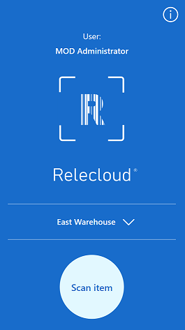
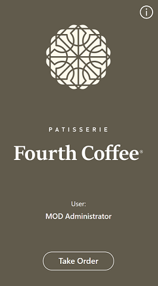

# Sample Power Apps for Business Central (preview)

[!INCLUDE[general_preview](../developer/includes/general_preview.md)]

This article introduces sample apps that provide an easy way to start building your own Power Apps that work with Business Central data. The sample apps also help you understand the best practices for development, which are outlined in [Best practices for Power Apps with Business Central](power-apps-best-practices.md).

The apps are made available to you in GitHub repositories and are meant as inspiration only. You can fork the GitHub repositories so that the apps can be customized for your scenarios.

## Warehouse helper app 

The warehouse helper app is a sample app that shows a simplified warehouse scenario where users can scan items and update the inventory for that item.  

  

The workflow is purposely simple and is meant to be used as a base for building your own warehouse workflows.

[Find the app here](https://github.com/microsoft/businesscentralsamples-warehousehelper).

## Take order app

The take order app is a frontline app meant for servers working at a restaurant. The app offers an easy way for servers to assign tables, take customer orders, and initiate checkout.

  

This app is built as an example of a high-fidelity app with a full set of functionalities.

[Find the app here](https://github.com/microsoft/businesscentralsamples-takeorder).

## Next steps

Review the [Best practices for Power Apps with Business Central](power-apps-best-practices.md) for tips on creating apps.