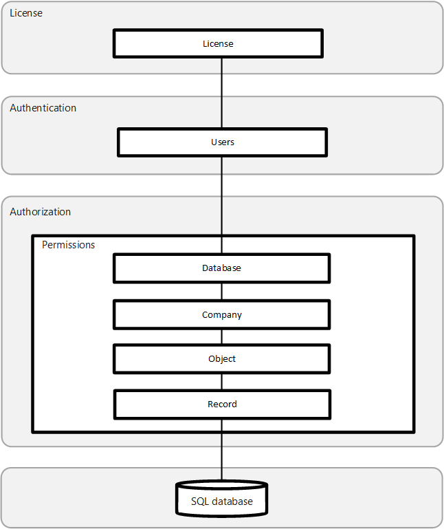

# Application Security in Business Central

This section helps you understand and improve the security of your Business Central application regardless of where it is hosted. In the articles listed below, you will find guidance and recommended practices related to authentication, authorization, and auditing, as well as data encryption and secure development practices that can be applied to any Business Central environment.

[!INCLUDE[prodshort](../developer/includes/prodshort.md)] uses a layered approach to application security, as outlined in the following diagram.

## Authentication

Before users can sign-in to the [!INCLUDE[prodshort](../developer/includes/prodshort.md)] application, they must be authenticated as valid user in the system. Business Central On-Premises supports several authentication methods, such as Windows and Azure Active Directory. Business Central Online uses strictly Azure Active Directory (Azure AD).  For more information, see the following articles:

[Managing Users and Permissions](/dynamics365/business-central/ui-how-users-permissions)

<!-- [User Authentication](user-security.md#user-authentication)  -->

[Authentication and Credential Types](../administration/users-credential-types.md)

[Multi-factor Authentication](multifactor-authentication.md)  

The authentication method configured for Business Central Server is also used to access web services. For more information, see [Web Services Authentication](../webservices/web-services-authentication.md).

## Authorization

Once authenticated, authorization determines which areas a user can access, such as the pages and reports that they can open, and the permissions that they have on associated data. For more information, see the following articles:

[User Permissions in the Application](user-security.md#user-permissions-in-the-application)

[Analyzing Permission Changes Trace Telemetry](../administration/telemetry-permission-changes-trace.md)

[Data Security](data-security.md?tabs=database-level)

<!--[Managing Users and Permissions](/dynamics365/business-central/ui-how-users-permissions) redundant -->

[Removing Elements from the User Interface According to Permissions](../administration/hide-ui-elements.md)  

[Analyzing Authorization Telemetry](../administration/telemetry-authorization-trace.md)

[Using OAuth to Authorize Business Central Web Services ](../webservices/authenticate-web-services-using-oauth.md)

## Auditing

[!INCLUDE[prodshort](../developer/includes/prodshort.md)] includes several auditing features that help you track information about who is signing-in, what their permissions are, what data have they changed, and more.  For more information, see the following articles:

[Authorization Assessment](/dynamics365/business-central/ui-how-users-permissions#to-get-an-overview-of-a-users-permissions)
  
[Data Auditing](/dynamics365/business-central/across-log-changes)
  
[Security Auditing](security-auditing.md)

[Data Classification](/dynamics365/business-central/admin-classifying-data-sensitivity)
  
## Data Encryption

You can encrypt data on the Business Central server by generating new or importing existing encryption keys that you enable on the Business Central server instance that connects to the database. For more information, see [Encrypting Data in Dynamics 365 Business Central](../developer/devenv-encrypting-data.md).

<!-- [Data encryption](/dynamics365/business-central/admin-manage-data-encryption)-->  

## Security Development Lifecycle

Microsoft's Security Development Lifecycle (SDL) is a software development process that helps developers build more secure software and address security compliance requirements while reducing development cost. For more information, see [Security Development Lifecycle](https://www.microsoft.com/sdl).  

## See Also  

[Security and Protection](security-and-protection.md)  
[Security Tips for Business Users](security-users.md)  
[Online Security](security-online.md)  
[On-Premises Security](security-onpremises.md)  
