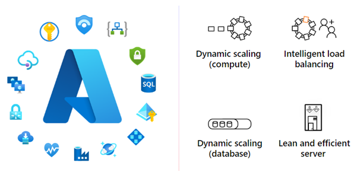

<!-- comment: when viewing the live version of this article, there's a lot of redundancy in the Service Updates section (line 93). The "includes" text (line 91) contains much of the same info as the text in line 93. -->
<!-- question: In the paragraph in line 21, what does 30-K mean? It looks like shortcut for 30,000, but that seems small. -->

# Service overview for Business Central online

[!INCLUDE[azure-ad-to-microsoft-entra-id](~/../shared-content/shared/azure-ad-to-microsoft-entra-id.md)]

<!--[!INCLUDE [prod_long](includes/prod_long.md)] is a complete enterprise resource planning (ERP) software solution for mid-sized organizations that is fast to implement, easy to configure, and simple to use, both on-premises and online. [Sign up for a trial](/dynamics365/business-central/across-preview) before you decide to move to the cloud. Read this article to learn about the systems that make [!INCLUDE [prod_short](includes/prod_short.md)] online run as a service that you can bet your business on.  -->

In the rapidly evolving landscape of technology-driven businesses, finding a business management solution that seamlessly adapts to your organization's growth is paramount. Modern small and medium businesses (SMBs) are looking for a solution that doesn't just meet but anticipates the evolving needs of businesses in today's dynamic marketplace. 

[!INCLUDE [prod_long](includes/prod_long.md)] online is a cloud-based ERP software solution for small and mid-sized organizations. It was launched in April 2018 and has since onboarded more than 30-K customers working in professional services, consumer goods, manufacturing, retail, health, hospitality, transport and logistics, finance, and dozens more industries. It has become a mature, battle-tested solution that understands the intricacies of modern business operations in the areas of security, scalability, performance, resilience, and high availability. 

The team that develops the Business Central product itself is the same team responsible for running and managing the Business Central online service. It has first-hand knowledge of all its components.

The service is built from the ground up as a multitenant service, comprised of multiple microservices running on the Microsoft Azure cloud ecosystem. It's built on leading technologies such as React, TypeScript, .NET Core, Azure OpenAI, Microsoft Entra, Azure Functions, Containers, Load Balancer, Virtual Machine Scale Sets, Azure Cosmos DB, Key Vault, Service Bus, Traffic Manager, Azure SignalR Service, WebSockets, and many more.

## Global availability

[!INCLUDE[prod_short](includes/prod_short.md)] online is running globally in more than 170 countries/regions, out of 21 Microsoft Azure regions, and new countries/regions go live on a quarterly basis. For more information, see [Countries/regions and Translations Supported](compliance/apptest-countries-and-translations.md).  

For a visual overview of where [!INCLUDE [prod_short](includes/prod_short.md)] online is deployed, visit [Geographical availability](https://dynamics.microsoft.com/availability-reports/georeport/) and then in the **Product** pane, under **Operations Apps**, select **Dynamics 365 Business Central**.  

### Availability of Copilot in Business Central

Microsoft Copilot in Business Central includes a variety of features that can each be in preview or generally available in different languages and regions. For information about availability of Copilot in Business Central and other business applications, see the [Copilot international availability report](https://go.microsoft.com/fwlink/?linkid=2262455).

## Built upon a foundation of trust, security, and compliance

On the [Service Trust](https://servicetrust.microsoft.com/) site, review the available independent audit reports for Microsoft cloud services. Find information about compliance with data protection standards and regulatory requirements:

* International Organization for Standardization (ISO)
* Service Organization Controls (SOC)
* International privacy standards  

For example, you can find audit reports and certifications for ISO 27001, ISO 27018, or the SOC 2 Type II reports.  

## Business continuity and disaster recovery (BCDR)

[!INCLUDE [prod_short](includes/prod_short.md)] online architecture and administration capabilities ensure uninterrupted access to your critical business data and processes. Automatic backups, built-in redundancy, and high availability protect your data and keep it accessible during and after a disruptive event. [!INCLUDE [prod_short](includes/prod_short.md)] has proactive BCDR strategies, processes, and technologies that minimize downtime and preserve important assets.

[!INCLUDE [prod_short](includes/prod_short.md)] online financially guarantees 99.9% up-time for its paid production environments, where customers are entitled to financial compensation if the service doesn't deliver on this promise. <!-- Built-in redundancy implemented on many levels of the service, automated failover and rollback mechanisms, rigid and granular backup policy, as well as-->Historical data shows that the [!INCLUDE [prod_short](includes/prod_short.md)] online service has been able to consistently maintain this level of availability.

[!INCLUDE [prod_short](includes/prod_short.md)] uses the Azure cloud computing platform for its robust business continuity options that protect your critical workloads against disruptions. The Azure global network of regions keeps your data close to your geographic location, and provides options for recovering data in another region. Your data is available despite regional outages or disruptions. To learn more about Azure regions, go to [Azure Geographies](https://azure.microsoft.com/explore/global-infrastructure/geographies/#overview).

Administrators can use the [!INCLUDE [prod_short](includes/prod_short.md)] admin center to find the Azure region that their environments are in.

### Database and backups

[!INCLUDE [prod_short](includes/prod_short.md)] uses Azure SQL Database as the database technology for its environments.

Azure SQL Database, Microsoft's cloud-based relational database service, is used as the best-of-breed service for transactional workloads of Business Central. Azure SQL Database is always running on the latest stable version of the SQL Server database engine and patched OS, with 99.99% availability. Azure SQL Database works behind the scenes to provide Business Central with the following benefits and more: 

- High availability 
- Rich business continuity and disaster recovery options 
- Local and regional redundancy 
- Backup and restore options 
- Advanced performance analyses and tuning capabilities 
- Schema management 
- Efficient resource utilization 
- Dynamic scalability features to accommodate fluctuating workloads 
- Robust security protocols to safeguard sensitive data 

To learn more about how Azure SQL Database keeps workloads running smoothly, go to [High availability for Azure SQL Database](/azure/azure-sql/database/high-availability-sla).

Azure SQL Database protects [!INCLUDE [prod_short](includes/prod_short.md)] production and sandbox environments by taking automatic backups that it keeps for 28 days. Administrators can use the [!INCLUDE [prod_short](includes/prod_short.md)] admin center to restore the environment to any specific point in time in the past 28 days. To learn more about restoring an environment, go to [Restoring an Environment in the Admin Center](/dynamics365/business-central/dev-itpro/administration/tenant-admin-center-backup-restore).

Administrators can also use the [!INCLUDE [prod_short](includes/prod_short.md)] admin center to recover deleted production or sandbox environments within 14 days of their deletion. To learn more about recovering deleted environments, go to [Recover an environment](/dynamics365/business-central/dev-itpro/administration/tenant-admin-center-environments-delete#recover-an-environment).

### High availability through geographical redundancy

Each [!INCLUDE [prod_short](includes/prod_short.md)] environment is also protected by automatic geo-redundant backups. If a region experiences a full outage, Azure restores your data from the backup in another Azure region within the same Azure geography. Although it's rare, recovering data into another Azure region is a fully automated internal procedure that we practice regularly. It's a standard part of our internal audits and disaster recovery drills. To learn more about backups, go to [Automated backups in Azure SQL Database](/azure/azure-sql/database/automated-backups-overview).

[Azure availability zones](/azure/reliability/availability-zones-overview) provide extra resilience by offering physically separate data centers within an Azure region. Distributing resources across multiple availability zones achieves high availability for the compute and storage resources for [!INCLUDE [prod_short](includes/prod_short.md)]. During local failures or planned maintenance in one or more zones, tenants in the available zones aren't affected. Other tenants are automatically redirected to resources in the available zones in the same region. This option is enabled for all [!INCLUDE [prod_short](includes/prod_short.md)] production environments with paid [!INCLUDE [prod_short](includes/prod_short.md)] subscriptions.  

[!INCLUDE [prod_short](includes/prod_short.md)] is also designed with built-in redundancy, autoscaling, and automatic load-balancing capabilities for its compute resources. To remain available if one or more of its compute instances fail, [!INCLUDE [prod_short](includes/prod_short.md)] runs on other instances. [!INCLUDE [prod_short](includes/prod_short.md)] supports rolling upgrades and automated OS image updates to apply patches, security updates, or new platform versions without downtime. Compute instances are always up to date and secure, which reduces vulnerability to threats and service interruptions.

## Service level agreements (SLA)

[!INCLUDE [service-terms](includes/service-terms.md)]

## Service updates

[!INCLUDE [service-updates](includes/service-updates.md)]

New capabilities roll out in release waves that consist of a major update and subsequent minor updates. Most capabilities are made available in major updates, but some, especially regulatory requirements, become available in minor updates as well.

The major updates are typically made available twice a year, in April and in October. Minor updates roll out every month. Get an overview of the release plans at [What's new and planned for Dynamics 365 Business Central](https://aka.ms/BCReleasePlan). 

Administrators can set a maintenance window in which Microsoft can update each environment and schedule a specific date for their updates. For more information, see [Managing Updates in the Business Central Admin Center](administration/tenant-admin-center-update-management.md). Microsoft then schedules updates of the business functionality to be applied during these maintenance windows and dates.

An exception to this type of schedule is the continuous updates to the underlying service. The service components apply to multiple environments, such as all tenants in a region. So Microsoft schedules those updates to a time when traffic is lower in each region, typically during the evening or night. Typically, users don't notice service updates. [!INCLUDE [prod_short](includes/prod_short.md)] manages traffic so that people working in [!INCLUDE [prod_short](includes/prod_short.md)] aren't affected.  

## Lifecycle policy

[!INCLUDE [prod_short](includes/prod_short.md)] online is governed by the Microsoft [Modern Lifecycle Policy](https://support.microsoft.com/help/30881), which means continuous [service updates](#service-updates) and a major update every six months. For more information, see [Dynamics 365 Business Central Service Compliance](/dynamics365/business-central/compliance/compliance-service-compliance) and [Dynamics 365 release schedule and early access](/dynamics365/get-started/release-schedule).  

Get an overview of new and upcoming changes in the [Dynamics 365 release plans](/dynamics365/release-plans/).  

## See also

- [Scalability](service-scalability.md)  
- [Service operations](service-operations.md)  
- [FAQ for Dynamics 365 Business Central](faq.yml)  
- [Administration of Business Central online](administration/tenant-administration.md)  
- [Technical Support for Business Central](technical-support.md)  
- [Escalating support issues to Microsoft](administration/manage-technical-support.md#escalating-support-issues-to-microsoft)  
- [Data and access when a trial or subscription ends](administration/tenant-administration.md#expire)  
- [Azure global infrastructure](https://azure.microsoft.com/global-infrastructure)  
- [Azure reliability](https://azure.microsoft.com/features/reliability/)  
- [Microsoft Service Trust](https://servicetrust.microsoft.com/)  

[!INCLUDE [footer-banner](includes/footer-banner.md)]
