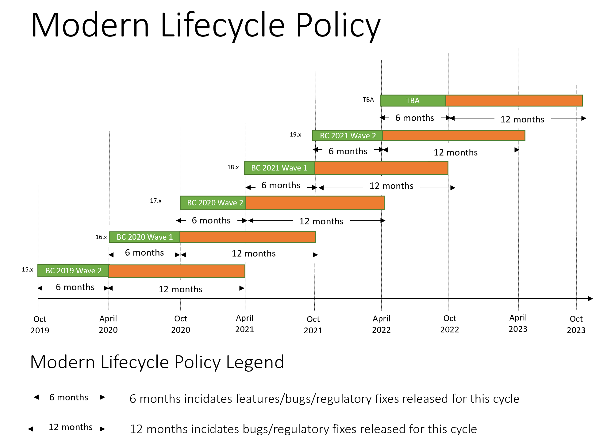

# Software Lifecycle Policy and Dynamics 365 Business Central On-Premises Updates

This article outlines the lifecycle and support policies for [!INCLUDE[prod_long](../developer/includes/prod_long.md)] on-premises updates. For more information, see [Microsoft Lifecycle Policy for Business Central on-premises](/lifecycle/products/dynamics-365-business-central-onpremises-modern-policy).  

## Modern Lifecycle Policy

[!INCLUDE[prod_long](../developer/includes/prod_long.md)] (on-premises) 2019 release wave 2 and later updates are covered by the Modern Lifecycle Policy. The [Modern Lifecycle Policy](/lifecycle/policies/modern) offers support and servicing, including bug fixes, new features, and latest tax updates.  

The customer is in full control of its on-premises deployments and must follow this policy. The customer is in control of installing updates in its on-premises environments. Microsoft will support the [!INCLUDE[prod_long](../developer/includes/prod_long.md)] (on-premises) software as indicated on the [Microsoft Lifecycle Policy for Business Central on-premises](/lifecycle/products/dynamics-365-business-central-onpremises-modern-policy) page, but only if the customer keeps the deployed software current according to this policy. By keeping current, you're getting all the latest feature and bug fixes.  

The following image illustrates the update schedule for [!INCLUDE [prod_long](../developer/includes/prod_long.md)].
> [!div class="mx-imgBorder"]
> 

<!-- Critical fixes and non-critical updates are handled in the following way:

- **Critical fixes** – Critical fixes include security fixes and any fixes that are required to support reliability and availability. Critical fixes will be made available in the latest platform update version.

- **Non-critical updates** – Customers must update to the most current Dynamics 365 Business Central to deploy non-critical updates.-->

## Fixed Lifecycle Policy

[!INCLUDE[prod_long](../developer/includes/prod_long.md)] (on-premises) October'18 and April '19 Update software is covered by the [Fixed Lifecycle Policy](/lifecycle/policies/fixed).  

Licensed customers must stay current with updates to the [!INCLUDE[prod_long](../developer/includes/prod_long.md)] on-premises software in accordance with the following servicing and system requirements. [This policy](/lifecycle/products/dynamics-365-business-central-onpremises-fixed-policy) requires the customer to maintain an Enhancement Plan and deploy updates as noted later in this article.  

| Release | Version | Build number | Availability | Mainstream support ends |
|--|--|--|--|--|
| Dynamics 365 Business Central (on-premises) | October'18 Update (version 13.x) | 24630 | November 1, 2018 | \*\* |
| Dynamics 365 Business Central (on-premises) | April '19 Update (version 14.x) | 29537 | April 1, 2019 | October 10, 2023 |

\*\* In order to obtain mainstream support after April 14, 2020, customers must update to the April 2019 release or a later update for the April 2019 version  

## See Also

[Microsoft Lifecycle Policy for Business Central on-premises](/lifecycle/products/dynamics-365-business-central-onpremises-modern-policy)  
[Configuring Technical Support](../technical-support.md)  
[Development and Administration Help for Dynamics 365 Business Central](../index.md)  
[Upgrading to [!INCLUDE[prod_long](../developer/includes/prod_long.md)]](../upgrade/upgrading-to-business-central.md)  
[Deployment of [!INCLUDE[prod_long](../developer/includes/prod_long.md)]](../deployment/Deployment.md)  
