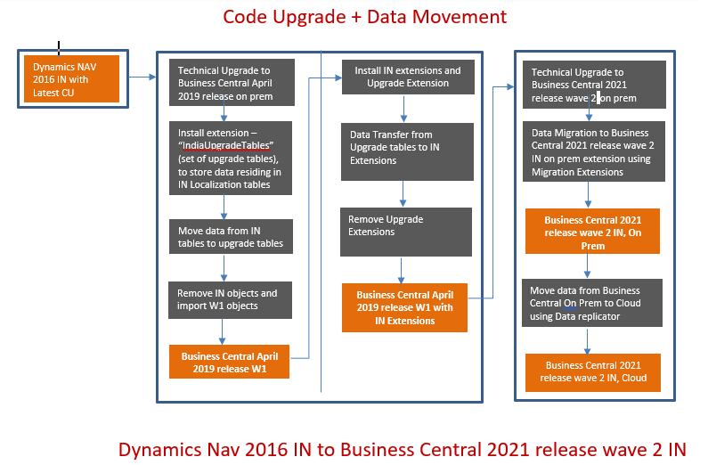

# India Data Migration Toolkit 

This article describes how to upgrade from an India (IN) version of Dynamics NAV 2016 to latest version of Business Central India.

## Overview

The purpose of the data migration toolkit is to allow the customer to upgrade from an India (IN) version of Dynamics NAV 2016 to latest version of Business Central India. The toolkit will cover the migration of India localization data, but will not cover the migration of any customization, it has to be managed by partner/customer.

Data migration from an India (IN) version of Dynamics NAV 2016 to Business Central 2021 release wave 2 is a two-step process. Data of Dynamics NAV 2016 is migrated to Business Central April 2019 release and then it is further migrated to Business Central 2021 release wave 2.

 
## Data Migration

Some localization tables have been deprecated in Business Central 2021 release wave 2. List of deprecated tables has been provided in the documentation. If any custom fields were added in these tables, then data stored in these fields needs to be migrated manually.

Customized Roles & Permissions from Dynamics NAV 2016 must be reconfigured manually in Business Central 2021 release wave 2. The India (IN) localization table Ids have been changed in Business Central 2021 release wave 2. Dynamics NAV 2016 India (IN) environment, from where the data is to be migrated to Business Central, must have CU 66 and TDS 194 Hotfix.

The data migration processes, using India (IN) Data Migration Toolkit, have been integrated in the standard documentation.

For data migration from India Dynamics NAV 2016 to Business Central April 2019 release, see information, [Data Migration from Dynamics NAV 2016 India (IN) to Business Central April 2019 release](../upgrade/Converting-a-Database.md)

For data migration from Business Central April 2019 release to Business Central 2021 release wave 2 On-Prem, see information,  [Data Migration from Business Central April 2019 release to Business Central 2021 release wave 2 On-Prem](../upgrade/upgrade-unmodified-application-v14-v19.md)

For data migration from customized, Business Central April 2019 release to Business Central 2021 release wave 2 On-Prem, see information,  [Data Migration from Customized Business Central April 2019 release to Business Central 2021 release wave 2 On-Prem](../upgrade/upgrade-to-microsoft-base-app-v19.md)

For data migration from Business Central 2021 release wave 2 On-Prem to Cloud, see information, [Data Migration from Business Central 2021 release wave 2 On-Prem to Cloud](../administration/migration-tool.md)

For list of deprecated India (IN) localization tables in Business Central 2021 release wave 2, see information, [List of deprecated India (IN) localization tables](../upgrade/india-data-migration-list-of-deprecated-tables.md)

## See Also 
[India Post India Upgrade Tables](../upgrade/post-india-upgrade-tables.md)
 
