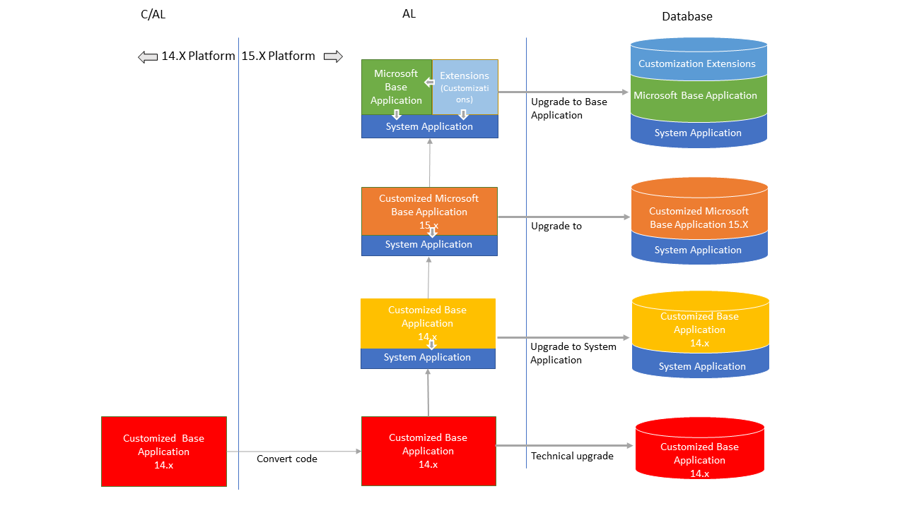
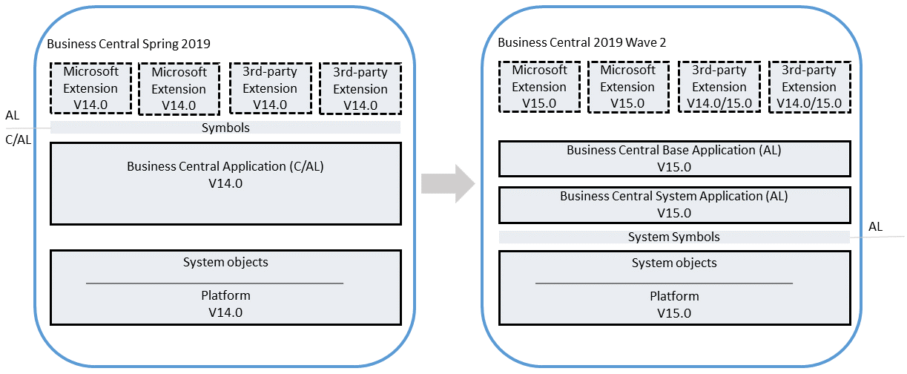
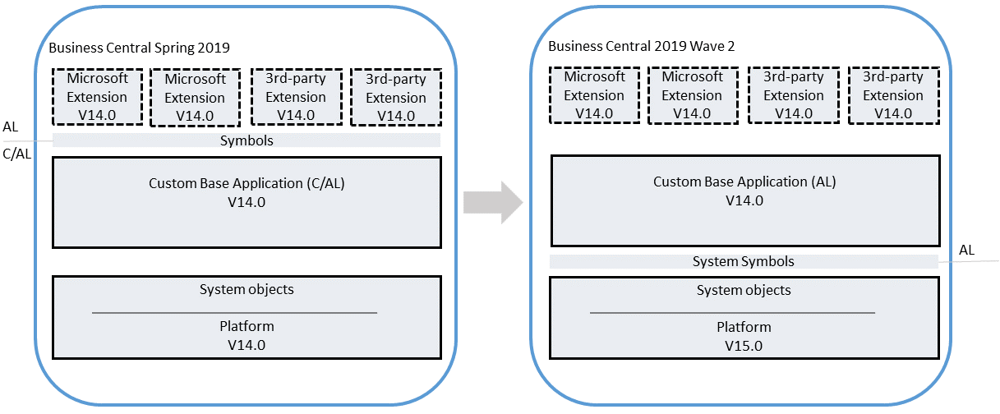
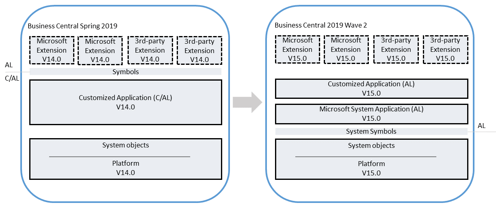
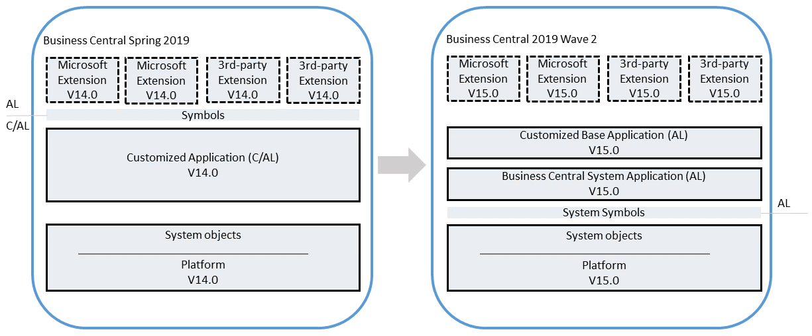

# Upgrading to [!INCLUDE[prod_long](../developer/includes/prod_long.md)] 2019 Release Wave 2
<!--
> [!IMPORTANT]  
> [!INCLUDE[vnext_preview](../developer/includes/vnext_preview.md)] 
>
> Please note that this topic is a draft in progress. We are still working on adding more details to the steps described in this topic.
-->
[!INCLUDE[prod_short](../developer/includes/prod_short.md)] 2019 release wave 2 (version 15) marks the release where C/AL has been completely replaced by AL. The 2019 release wave 2 is the first version that does not include the classic development environment (also known as C/SIDE). From an application perspective, this means that [!INCLUDE[prod_short](../developer/includes/prod_short.md)] 2019 Wave 2 is completely extension-based. The [!INCLUDE[prod_short](../developer/includes/prod_short.md)] base application is now delivered as an AL extension instead of C/AL. Additionally, application functionality that is not related to the business logic has been moved into separate modules that are combined into an extension known as the System Application. This change will influence how you perform the upgrade compared to earlier releases.

## Upgrade paths

When upgrading your [!INCLUDE[prod_short](../developer/includes/prod_short.md)] Spring 2019 (version 14) solution to version 15, the goal is to move towards a full uptake of the [!INCLUDE[prod_short](../developer/includes/prod_short.md)] base and system applications, as they are, and migrating code customizations to add-on extensions. There are different upgrade paths that you follow to get to this state, as illustrated in the following figure. 



As mentioned, the recommended upgrade path for a customized solution is to uptake the version 15 Microsoft Base Application and System Application, and move all code customizations to extensions. However, we realize that the complexity of some solutions will make this path very difficult. If this path is not currently realistic for your solution, then we recommend as a minimum to upgrade to a version 15 customized base application.

> [!IMPORTANT]
> Be aware that for each path, once the database has been synchronized and data upgraded, it becomes more difficult to bring your solution to the next path. This will require significant manual work until tooling is available in a future release.

For details about each path, see the following articles:

- [Upgrade of an Unmodified Application](upgrade-unmodified-application.md)
- [Technical Upgrade of Customized Application](upgrade-technical-upgrade-v14-v15.md)

*The following articles are currently being formalized and will be available as soon as possible*
 
- Upgrade to the System Application
- Upgrade to a Customized Version 15 Base Application  
- Upgrade to the Microsoft Base Application

<!--
- [Upgrade to the Microsoft System Application](upgrade-system-application-v14-v15.md)
- [Upgrade to Customized Base Application](upgrade-hybrid-upgrade-v14-v15.md)  
- [Upgrade to the Microsoft Base Application](upgrade-full-upgrade-v14-v15.md)
-->

> [!NOTE]
> Upgrading to [!INCLUDE[prod_long](../developer/includes/prod_long.md)] 2019 Release Wave 2 requires that you first upgrade to [!INCLUDE[prod_long](../developer/includes/prod_long.md)] Spring 2019 (version 14).
<!--
## Upgrade an unmodified [!INCLUDE[prod_short](../developer/includes/prod_short.md)] application

Use this scenario if you have a Business Central application that does not include any code customization in C/AL. Customizations, if any, are done by extensions, which can be Microsoft (1st party) extensions and custom extensions (3rd party). With this upgrade, you will replace the C/AL base application with the new Business Central version 15 base application extension and the system application. The result will be a fully upgraded application and platform on [!INCLUDE[prod_short](../developer/includes/prod_short.md)] 2019 release wave 2.

  

For more information, see [Upgrading an Unmodified Application](upgrade-unmodified-application.md). 

## Technical upgrade of a custom application to version 15 platform

Use this process when you have a customized Business Central application that you want to upgrade to the [!INCLUDE[prod_short](../developer/includes/prod_short.md)] 2019 release wave 2 platform. This will not upgrade the application to the latest version. With this process, you will convert the entire application from C/AL to an base application extension.


   


For more information, see [Technical Upgrade](upgrade-technical-upgrade-v14-v15.md).


## Upgrade Customized Application to the Microsoft System Application

Use this process when you have a customized Business Central application that you want to upgrade to use the Microsoft System Application and the version 15 platform. With this process, you will convert the entire application from C/AL to AL and refactor to use the System Application  extension.

  

For more information, see [Upgrade to the System Application](upgrade-system-application-v14-v15.md). 


## Upgrade Customized Application to the Microsoft Base Application

Use this process when you have a customized Business Central application that you want to upgrade to the Business Central Wave 2 application and platform. With this process, you will convert the entire application from C/AL to AL and refactor to use the system application layer extension.

   

For more information, see [Upgrade to the Microsoft Base Application](upgrade-full-upgrade-v14-v15.md). 
-->

## New and changed application features

There a several new and changed platform application features available in [!INCLUDE[prod_short](../developer/includes/prod_short.md)] April 2019 release wave2 for users, administrators, and developers. For an overview of these features, see [Overview of Dynamics 365 Business Central 2019 release wave 2](/dynamics365-release-plan/2019wave2/dynamics365-business-central/).

To take advantage of these all these features, you will have to perform an application code upgrade, not just a technical (platform) upgrade.  

<!--
### Prerequisites

1. Upgrade to Business Central Spring 2019.

### Task 1: Convert your application from C/AL to AL

The first thing to do is convert your solution from C/AL to AL. For more information, see [Code Conversion from C/AL to AL](devenv-code-conversion.md).
<!--
1. Export all objects except system objects to txt in new syntax for AL. For this, I used Development Shell run as an admin:

    ```
    Export-NAVApplicationObject -DatabaseServer navdevvm-0127\bcdemo -DatabaseName "Demo Database BC (14-0)" -ExportToNewSyntax -Path "c:\exporttoal\expoertedbc14app.txt" -Filter 'Id=1..1999999999'
    ```

    <!-- 
    Optionally, omit the text objects:


    ```
    Export-NAVApplicationObject -DatabaseServer navdevvm-0127\bcdemo -DatabaseName "Demo Database BC (14-0)" -ExportToNewSyntax -Path "c:\exporttoal\expoertedbc14app.txt" -Filter 'Id=1..129999'
    ```
    
    ```
    Export-NAVApplicationObject -DatabaseServer navdevvm-0127\bcdemo -DatabaseName "Demo Database BC (14-0)" -ExportToNewSyntax -Path "c:\exporttoal\expoertedbc14app.txt" -Filter 'Id=140000..1999999999'
    ```
    
    There is a switch that you can set to tartget the runtime to 4.0. You should set this so you will not get so many warnings.  This is not documented yet.

2. If you have custom .NET add-ins, create a declaration file (.al). I created a small file called mydotnet.al

    ```
    dotnet
    {
        assembly("Microsoft.Dynamics.Nav.Client.BusinessChart")
        {
            type("Microsoft.Dynamics.Nav.Client.BusinessChart.BusinessChartAddIn";"Microsoft.Dynamics.Nav.Client.BusinessChart")
            {
                IsControlAddIn = true;
            }
        }
    
        assembly("Microsoft.Dynamics.Nav.Client.TimelineVisualization")
        {
            type("Microsoft.Dynamics.Nav.Client.TimelineVisualization.InteractiveTimelineVisualizationAddIn";"Microsoft.Dynamics.Nav.Client.TimelineVisualization")
            {
                IsControlAddIn = true;
            }
        }
    }
    ```
3. Start command prompt as administrator, navigate to txt2al.exe, and run the following command to convert to *.al. By default, the location is C:\Program Files (x86)\Microsoft Dynamics 365 Business Central\140\RoleTailored Client

    ```      
    txt2al --source=C:\exporttoal\expoertedbc14app2.txt --target=C:\exporttoal\al2 --injectDotNetAddIns --dotNetAddInsPackage=C:\exporttoal\dotnet\mydotnet.al
    ```      

    This will create separate al file for each object.

3. Create a new application database on BC 15. Use the New-NAVApplicationDatabase cmdlet of the Administration Shell:

    ```
    New-NAVApplicationDatabase -DatabaseServer navdevvm-0127\BCDEMO -DatabaseName MyTest15Db
    ```
4. Connect to BC 15 server Instance to the database.
5. Create a project for application in VS Code.

    - Connect to the BC 15 Server instance.
6. Modify the app.json:

    - Set the `id`:

        ```
          "id": "437dbf0e-84ff-417a-965d-ed2bb9650972",
          "name": "BaseApp",
          "publisher": "Microsoft",
          "version": "15.0.34982.0"
        ```
    - Set the target in the app.json to OnPrem.
    - In the app.json change the `idRange` to include all the IDs (leave blank).
    - Delete the values in the `dependencies` parameter  
7. Manually copy the system (platform) symbols extension (Microsoft_System_15.0.34942.0.app) to the **.alpackages** folder.

    This file is located in the 

    <!-- **Error:**

    I tried to us the Download Symbols command but could not because of error: {
    "resource": "/c:/Users/jswymer/Documents/AL/CusomtBaseApp2/app.json",
    "owner": "_generated_diagnostic_collection_name_#1",
    "code": "AL1045",
    "severity": 8,
    "message": "The package cache c:\\Users\\jswymer\\Documents\\AL\\CusomtBaseApp2\\./.alpackages could not be found.",
    "source": "AL",
    "startLineNumber": 1,
    "startColumn": 1,
    "endLineNumber": 1,
    "endColumn": 1
    -->
<!--
8. Modify the settings.json file in Visual Studio Code to include paths to .NET assemblies. Set the `"al.assemblyProbingPaths"` parameter:

    ```
        "al.assemblyProbingPaths": [
        "./.netpackages", "C:/Windows/Microsoft.NET/assembly", "C:/Program Files/Microsoft Dynamics 365 Business Central/150","C:/Program Files/Microsoft Dynamics 365 Business Central/150/service/Addins",
        "C:/NugetCache/NET_Framework_472_TargetingPack.4.7.03081.00",
        "C:/NugetCache/Microsoft.Nav.Platform.Main.14.0.28217",
        "C:/windows/assembly/GAC/ADODB", "C:/Program Files (x86)/Microsoft Dynamics 365 Business Central/150/RoleTailored Client"
    ],
    ```
8. Modify the **dotnet.al** file to remove all instances of "Version=14.0.0.0" for **Microsoft.Nav** assemblies and for the `DocumentFormat.OpenXml` assembly declaration, remove the `version` and `culture` keys and set `PublicKeyToken = '8fb06cb64d019a17'`.


    ```
    assembly("DocumentFormat.OpenXml")
    {
        PublicKeyToken = '8fb06cb64d019a17';

9. Make the following modifications to the application:
    1. Comment out code in the following objects:

        - AzureADUserManagement.Codeunit.al
    
            ```
                local procedure GetGraphUserPlans(var TempPlan: Record Plan temporary;var GraphUser: DotNet UserInfo;IncludePlansWithoutEntitlement: Boolean)
            var
                AssignedPlan: DotNet ServicePlanInfo;
                DirectoryRole: DotNet RoleInfo;
                ServicePlanIdValue: Variant;
                IsSystemRole: Boolean;
                HaveAssignedPlans: Boolean;
            begin
                TempPlan.Reset;
                TempPlan.DeleteAll;
        
                // Loop through assigned Azzure AD Plans
                foreach AssignedPlan in GraphUser.AssignedPlans do begin
                  HaveAssignedPlans := true;
                  if AssignedPlan.CapabilityStatus = 'Enabled' then begin
                    ServicePlanIdValue := AssignedPlan.ServicePlanId;
                    if IncludePlansWithoutEntitlement or IsNavServicePlan(ServicePlanIdValue) then
                      AddToTempPlan(ServicePlanIdValue,AssignedPlan.ServicePlanName,TempPlan);
                  end;
                end;
        
                // If there are no Azure AD Plans, loop through Azure AD Roles
                /* if not HaveAssignedPlans then
                  foreach DirectoryRole in Graph.GetUserRoles(GraphUser) do begin
                    Evaluate(IsSystemRole,Format(DirectoryRole.IsSystem));
                    if IncludePlansWithoutEntitlement or IsSystemRole then
                      AddToTempPlan(DirectoryRole.RoleTemplateId,DirectoryRole.DisplayName,TempPlan);
                  end; */
            end;
    
            ```
        - FlowSelectorTemplate.Page.al
    
            ```   
            usercontrol(FlowAddin;"Microsoft.Dynamics.Nav.Client.FlowIntegration")
            {
            ApplicationArea = Basic,Suite;
        
            trigger ControlAddInReady()
            begin
            /*                                 CurrPage.FlowAddin.Initialize(
                FlowServiceManagement.GetFlowUrl,FlowServiceManagement.GetLocale,
                AzureAdMgt.GetAccessToken(FlowServiceManagement.GetFlowARMResourceUrl,FlowServiceManagement.GetFlowResourceName,false),
                AzureAdMgt.GetAccessToken(FlowServiceManagement.GetAzureADGraphhResourceUrl,FlowServiceManagement.GetFlowResourceName,false),
                AzureAdMgt.GetAccessToken(FlowServiceManagement.GetMicrosoftGraphhResourceUrl,FlowServiceManagement.GetFlowResourceName,false));
    
            LoadTemplates;
    
            AddInReady := true; */
            end;
            ```   
            ```
        - FlowSelector.Page.al
    
            ```   
                group(Control3)
                {
                    ShowCaption = false;
                    Visible = IsUserReadyForFlow AND NOT IsErrorMessageVisible;
                    usercontrol(FlowAddin;"Microsoft.Dynamics.Nav.Client.FlowIntegration")
                    {
                        ApplicationArea = Basic,Suite;
    
                        trigger ControlAddInReady()
                        begin
                        /*     CurrPage.FlowAddin.Initialize(
                              FlowServiceManagement.GetFlowUrl,FlowServiceManagement.GetLocale,
                              AzureAdMgt.GetAccessToken(FlowServiceManagement.GetFlowARMResourceUrl,FlowServiceManagement.GetFlowResourceName,false),
                              AzureAdMgt.GetAccessToken(FlowServiceManagement.GetAzureADGraphhResourceUrl,FlowServiceManagement.GetFlowResourceName,false),
                              AzureAdMgt.GetAccessToken(FlowServiceManagement.GetMicrosoftGraphhResourceUrl,FlowServiceManagement.GetFlowResourceName,false));
    
                            LoadFlows;
    
                            AddInReady := true; */
                        end;
    
            ```          

   2. CodeViewer is no longer used. Either remove all references to it in the application (recommended) or copy the **CodeViewer** folder from the Addin folder of Business Central 140 RoleTailored client installation to the Add-ins folder of the Business Central 150 Server installation.

10. Build the extension package.

### Convert the test application to AL

At minimum, you must create an extension that contains the test libraries (CALTestLibraries.W1.fob) and test runner objects (CALTestRunner.fob). This is required for re-pubishing Microsoft extensions as part of the upgrade.. 
 
 Contains codeunits with generic and application-specific functions to reduce duplication of test code.
 
CALTestRunner.fob
 
 
1. If not already done, import the CALTestLibraries.W1.fob and CALTestRunner.fob files into the old database. Theese are available in the TestToolki folder of the installation DVD.

2. Export all test objects to a txt file in new syntax for AL. For this, I used Development Shell run as an admin:
    
      ```
      Export-NAVApplicationObject -DatabaseServer navdevvm-0127\bcdemo -DatabaseName "Demo Database BC (14-0)" -ExportToNewSyntax -Path "c:\exporttoal\expoertedbc14app.txt" -Filter 'Id=130000..139999'

3. Start command prompt as administrator, navigate to txt2al.exe, and run the following command to convert to *.al. By default, the location is C:\Program Files (x86)\Microsoft Dynamics 365 Business Central\140\RoleTailored Client

    ```      
    txt2al --source=C:\exporttoal --target=C:\exporttoal\al --dotNetAddInsPackage=C:\exporttoal\dotnet\mydotnet.al
    ```      
4. Create an Al project.

5. Connect to Business Central 15.0 Server instance.

5. Add the system symbols and custom base application extensions to the **.alpackages** folder of the project.

6. In the app.json, add a dependency on the custom base app.

    <!-- 
    I had to remove AppliedPaymentEntriesTest.Codeunit, BankPmtApplAlgorithm.Codeunit, BankPmtApplTolerance.Codeunit, GetSemiManualTestCodeunits.Page, LibraryAzureADUserMgmt.Codeunit, LibraryVerifyXMLSchema.Codeunit files because of errors I also had to comment out refereences to PermissionTestHelper in LibraryLowerPermissions.Codeunit.al-->
<!--
7. Build the project.

    Make a note of the name, ID, and publisher.

-->
<!--
### Task 2: Upgrade the application database to the version 15.0 platform
 
1. Make backup of the database.
2. Uninstall all extensions from the old tenants.

    Use the [!INCLUDE[adminshell](../developer/includes/adminshell.md)] for Business Central Spring 2019 (run as an adminstrator):

    ``` 
    Get-NAVAppInfo -ServerInstance bc140 -Tenant default | % { Uninstall-NAVApp -ServerInstance bc140 -Name $_.Name -Version $_.Version -Tenant default}
    ``` 
3. Unpublish all system and application symbols.

    ``` 
    Get-NAVAppInfo -ServerInstance bc140 -SymbolsOnly | % { Unpublish-NAVApp -ServerInstance bc140 -Name $_.Name -Version $_.Version }
    ```     
4. Unpublish all extensions from the application.

   You can use the Get-NAVAppInfo annd Unpublish-NAVApp cmdlets as follows:

    ```
    Get-NAVAppInfo -ServerInstance bc140 | % { Unpublish-NAVApp -ServerInstance bc140 -Name $_.Name -Version $_.Version }
    ```

5. Dismount tenants and stop server instance.

   ```
   Dismount-NAVTenant bc140 -Tenant default
   ```

6. Run a technical upgrade on the old application database by using the Business Central 2019 Wave 2 Administration Shell. This will upgrade the system tables to the BC 15 platform. Start the Business Central Administration Shell as an admin, and run this command:

    ```
    Invoke-NAVApplicationDatabaseConversion -DatabaseServer navdevvm-0127\bcdemo -DatabaseName "demo database bc (14-0)"
    ``` 

    <!--What if to made changes to system tables?-->

<!--
### Task 3: Upgrade the application

1. Connect the Business Central 15.0 Server instance to the old application database.

    In a single tenant deployment, this will mount the tenant automatically.

2. Configure the server instance for migrating the custom base application extension and the test application (if you have one).

    ```
    Set-NAVServerConfiguration BC150 -KeyName "DestinationAppsForMigration" -KeyValue '[{"appId":"437dbf0e-84ff-417a-965d-ed2bb9650972", "name":"BaseApp", "publisher": "Microsoft"},{"appId":"e3d1b010-7f32-4370-9d80-0cb7e304b6f0", "name":"TestToolKit2", "publisher": "Default publisher"}]'
    ```

    This will configure the server instance to automatically install the base application and test application on tenants after the data upgrade. Alternatively, you can omit this step, in which case you will have to manually install the extensions manually.

3. Configure the server instance to synchronize only base application.

    ```
     Set-NAVServerConfiguration bc150 -KeyName "FeatureSwitchOverrides" -KeyValue "forceSystemOnlyBaseSync"
    ```

2. Increase the application version to the version that you gave the custom base application:

    ``` 
    Set-NAVApplication BC150 -ApplicationVersion 15.0.34982.0 -force
    ``` 
    
    At this point, the tenant state is **OperationalWithSyncPending**.
3. Publish platform system symbols.

    ```
    Publish-NAVApp -ServerInstance BC150 -Path "C:\Program Files (x86)\Microsoft Dynamics 365 Business Central\150\AL Development Environment\System.app" -PackageType SymbolsOnly
    ```
4. Publish the custom base application extension:

    ```
    Publish-NAVApp -ServerInstance BC150 -Path "C:\Users\jswymer\Documents\AL\CusomtBaseApp2\Microsoft_BaseApp_15.0.34982.0.app" -SkipVerification
    ```

<!--5. Mount the tenant (multinent deployment only).-->

<!--
### Task 4: Upgrade the tenant

If you have a multitenant deployment, perform these steps for each tenant.

1. (Multitnent only) Mount the tenant.

    ```
    Mount-NAVTenant bc150 -Tenant default -DatabaseName "Demo Database BC (14-0)" -DatabaseServer navdevvm-0127 -DatabaseInstance BCDEMO
    ```
2. Synchronize the tenant.
  
    ```
    Sync-NAVTenant BC150 -tenant default
    ```

    When completed the tenant state is **OperationalDataUpgradePending**.
<!-- this step is not required becase of the  "FeatureSwitchOverrides" -KeyValue "forceSystemOnlyBaseSync server setting
2. Delete all objects except system objects from application database (IDs 2000000000 and greater). Do not synchronize the tenant/tables. -->

<!-- 
3. Synchronize the tenant with the base application extension (BaseApp):

    ```
    Sync-NAVApp BC150 -Name "BaseApp" -Version 15.0.34982.0 -tenant default
    ```

    This will append tables in database with guids extensions.

<!-- This step is not required becase I do not have a test app>
4. If you published a test application extension, synchronize the tenant with the test application extension.-->
<!--
5. Upgrade the tenant data.

    ```
    Start-NAVDataUpgrade BC150 -FunctionExecutionMode Serial -Force -SkipCompanyInitialization
    ```
<!-- not required with full cusom app       
21. Install system application extension (Microsoft_System Application_15.0.34737.0) on tenant.

    ```
    Install-NAVApp BC150 -Name "System Application" -Version 15.0.34737.0
    ```
-->
<!--
6. (Single tenant only) When upgrade is completed, restart the server instance.

    You will see that the custom base application and test application have been isntalled on the tenant. Only required for single tenant.

<!--
9. If you did not configured server instance with base app, install custom base application extension on the tenant:

    ```
    Install-NAVApp BC150 -Name "BaseApp" -Version 15.0.34982.0
    ```

    <!-- I got an error when I tried to do this at first: The get-navdataupgrade indicates that it is done.
        C:\windows\system32> Get-NAVDataUpgrade BC150 -Tenant default
        
        
        ExtensionData             : System.Runtime.Serialization.ExtensionDataObject
        TenantId                  : default
        TotalFunctionCount        : 17
        ExecutedFunctions         : 17
        UpgradeExecutionMode      : UsingParallelOrSerialTransaction
        Progress                  : 100.00 %
        Details                   : {}
        Errors                    :
        ExecutionDetails          : {BASE, BASE, BASE, BASE...}
        ExecutionErrors           :
        State                     : Completed
        NumericProgress           : 1
        IsTenantInExclusiveAccess : False
        
        
        
        C:\windows\system32> Install-NAVApp BC150 -Name "BaseApp" -Version 15.0.34982.0
        Install-NAVApp : Could not install the extension BaseApp on tenant default due to the following error: Error code: 85132273
        At line:1 char:1
        + Install-NAVApp BC150 -Name "BaseApp" -Version 15.0.34982.0
        + ~~~~~~~~~~~~~~~~~~~~~~~~~~~~~~~~~~~~~~~~~~~~~~~~~~~~~~~~~~
            + CategoryInfo          : InvalidOperation: (:) [Install-NAVApp], InvalidOperationException
            + FullyQualifiedErrorId : MicrosoftDynamicsNavServer$BC150/default,Microsoft.Dynamics.Nav.Apps.Management.Cmdlets.InstallNavApp 

            C:\windows\system32> Install-NAVApp BC150 -Name BaseApp -Version 15.0.34982.0
            Install-NAVApp : Could not install the extension BaseApp on tenant default due to the following error: Error code: 85132273
            At line:1 char:1
            + Install-NAVApp BC150 -Name BaseApp -Version 15.0.34982.0
            + ~~~~~~~~~~~~~~~~~~~~~~~~~~~~~~~~~~~~~~~~~~~~~~~~~~~~~~~~
                + CategoryInfo          : InvalidOperation: (:) [Install-NAVApp], InvalidOperationException
                + FullyQualifiedErrorId : MicrosoftDynamicsNavServer$BC150/default,Microsoft.Dynamics.Nav.Apps.Management.Cmdlets.InstallNavApp
            
            C:\windows\system32> Install-NAVApp BC150 -Name BaseApp -Version 15.0.34982.0 -Tenant default
            Install-NAVApp : Could not install the extension BaseApp on tenant default due to the following error: Error code: 85132273
            At line:1 char:1
            + Install-NAVApp BC150 -Name BaseApp -Version 15.0.34982.0 -Tenant defa ...
            + ~~~~~~~~~~~~~~~~~~~~~~~~~~~~~~~~~~~~~~~~~~~~~~~~~~~~~~~~~~~~~~~~~~~~~
                + CategoryInfo          : InvalidOperation: (:) [Install-NAVApp], InvalidOperationException
                + FullyQualifiedErrorId : MicrosoftDynamicsNavServer$BC150/default,Microsoft.Dynamics.Nav.Apps.Management.Cmdlets.InstallNavApp
            
            C:\windows\system32> Restart-NAVServerInstance BC150
            
            
            ServerInstance : MicrosoftDynamicsNavServer$BC150
            DisplayName    : Microsoft Dynamics 365 Business Central Server [BC150]
            State          : Running
            ServiceAccount : NT AUTHORITY\NETWORK SERVICE
            Version        : 15.0.34942.0
            Default        : True
            
            --> 

<!--
The application should now be accessible from the client.

### Publish Microsoft and 3rd party extensions

Now, you can publish the Microsoft and 3rd-party extensions that were published in the old solution. For each extension, do the following steps:
<!--
9. Prepare to publish and upgrade Microsoft and 3rd party extensions

    To publish 3rd party extensions, the extensions must be modified with a dependency on the custom base application extension. There are two ways you can do this. One way is to modify the extension code and build the package again. The other way is to configure the Business Central Server instance. This is the recommended way.

   <!-- 1. Either change teh app.json file for each extension, so that the application version is removed and the dependency is added for the custom Base App.Or, configure the DestinationAppsForMigration server setting. 

    ```
    Repair-NAVApp BC150 -Name  My14Extension -Version 1.0.0.0
    ``` 1. Sync repaired app.:

    ```
    Repair-NAVApp BC150 -Name  My14Extension -Version 1.0.0.0
    ```
    
    **Error:**

    C:\windows\system32> sync-navApp BC150 -Name  My14Extension -Version 1.0.0.0
    WARNING: Cannot synchronize the extension My14Extension because it is already synchronized.
    C:\windows\system32> install-navApp BC150 -Name  My14Extension -Version 1.0.0.0
    install-navApp : Object of type Table with ID 18 could not be found.
    At line:1 char:1
    + install-navApp BC150 -Name  My14Extension -Version 1.0.0.0
    + ~~~~~~~~~~~~~~~~~~~~~~~~~~~~~~~~~~~~~~~~~~~~~~~~~~~~~~~~~~
        + CategoryInfo          : InvalidOperation: (:) [Install-NAVApp], InvalidOperationException
        + FullyQualifiedErrorId : MicrosoftDynamicsNavServer$BC150/default,Microsoft.Dynamics.Nav.Apps.Management.Cmdlets.InstallNavApp  -->

<!--
    
    **Modifying extensions code:**

    1. Open the project for the custom extensions.
    2. Connect to the BC 150 server instance  
    3. In the app.json:
        
        1. Set a dependency for the custom base app:

         "dependencies": [{
            "appId": "437dbf0e-84ff-417a-965d-ed2bb9650972",
            "publisher": "Microsoft",
            "name": "BaseApp",
            "version": "15.0.34982.0"
          }]

        2. Delete the application parameter
        3. set the platform the 15.0.x.0
    3. Build package.

    ** Set the Server**

    ```
    Set-NAVServerConfiguration BC150 -KeyName "DestinationAppsForMigration" -KeyValue '[{"appId":"437dbf0e-84ff-417a-965d-ed2bb9650972", "name":"BaseApp", "publisher": "Microsoft"},{"appId":"e3d1b010-7f32-4370-9d80-0cb7e304b6f0", "name":"TestToolKit2", "publisher": "Default publisher"}]'
    ```
25. Publish and sync the test app extension to support Microsoft extension:

        ```
        Publish-NAVApp -ServerInstance BC150 -Path "C:\Users\jswymer\Documents\AL\TestToolKit2\Default publisher_TestToolKit2_14.4.34866.0.app" -SkipVerification
        ```
        
        
        ```
        Sync-NAVApp -ServerInstance BC150 -Name TestToolKit2 -Version 14.4.34866.0
        ```

        ```
        Install-NAVApp bc150 -Name testtoolkit2 -Version 14.4.34866.0
        ```
-->
<!--
1. Publish 3rd party extensions.


    If you modified code:

    1. Publish Microsoft and 3rd-party extensions that were previously published:
    
        ```
        Publish-NAVApp -ServerInstance BC150 -Path "C:\Users\jswymer\Documents\AL\My14Extension\Default publisher_My14Extension_1.0.0.4.app" -SkipVerification
        ```
    2. Synchronize the tenant with the extension:

        ```
        Sync-NAVApp BC150 -Name My14Extension -Version 1.0.0.4
        ```
    3. Upgrade the data to the extension:

        ```
        Start-NAVAppDataUpgrade BC150 -Name My14Extension -Version 1.0.0.4
        ```    

        This upgrades the data and installs the extension version.

    If you configured server:-->
<!--
1. Publish the extension that was previously published:
    
    ```
    Publish-NAVApp -ServerInstance BC150 -Path "C:\Users\jswymer\Documents\AL\My14Extension\Default publisher_My14Extension_1.0.0.4.app" -SkipVerification
    ```
2. Synchronize the extension with the tenant:
    ```
    Sync-NAVApp -ServerInstance BC150 -Name My14Extension -Version 1.0.0.4
    ```
3. Install the extension on the tenant:

    ```
    Install-NAVApp BC150 -Name My14Extension -Version 1.0.0.4
    ```

-->
## Components

### <a name="BaseApplication"></a>Base Application

The base application contains the objects (such as table, pages, codeunits, and reports) that define the business logic and functionality of the solution. In version 14 and earlier, the base application also contained system objects that were not specifically related to the business logic. In version 15, the standard business objects are now included in the Microsoft Base Application extension, and the system objects have been moved to the System Application extension. 

### <a name="SystemApplication"></a>System Application

In version 15.0, application functionality that is not related to the business logic has been moved into separate modules that are combined into an extension known as the System Application. For an introduction to the System Application, see For more information, see [Overview of the System Application](../developer/devenv-system-application-overview.md).

### <a name="Symbols"></a>Symbols

Symbols are the application programming interface between AL code and C/AL code. Symbols enable the ability to reference C/AL objects from AL objects. Symbols are provided as an extension package, and are published to the server instance similar to application extensions, but not installed on tenants.

In version 14.0, with the base application being C/AL, there are three types of symbols: system, application, and test. System symbols contained references to the platform system objects. The application symbols contained references to the business application objects. The test symbols contained references to the test libraries used by Microsoft extensions.

In version 15, with the move to AL, the only symbols required are the system symbols, which are still provided on the version 15.0 installation media (DVD).

### Customization extensions
Customization extensions are AL extensions that add functionality to the base application or system application. These extensions can be Microsoft (1st party) or 3rd party extensions. 3rd party extensions are extensions that your organization provides or extensions that are provided by others, such as from ISVs or from App Source.
  
## See Also  

[Upgrade of an Unmodified Application](upgrade-unmodified-application.md)  
[Technical Upgrade of Customized Application](upgrade-technical-upgrade-v14-v15.md)  
[[!INCLUDE[prod_long](../developer/includes/prod_long.md)] Upgrade Compatibility Matrix](upgrade-v14-v15-compatibility.md)  
