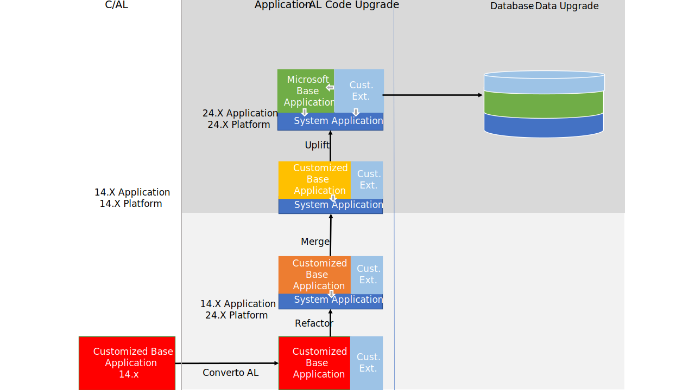

# Upgrading to [!INCLUDE[prod_long](../developer/includes/prod_long.md)] 2024 release wave 1

[!INCLUDE[prod_short](../developer/includes/prod_short.md)] 2024 Release wave 1 (version 24) is the ninth major release that is fully AL-based. [!INCLUDE[prod_short](../developer/includes/prod_short.md)] 2019 release wave 2 (version 15) marked the release in which C/AL was replaced by AL. The classic development environment, known as C/SIDE, was deprecated. From an application perspective, [!INCLUDE[prod_short](../developer/includes/prod_short.md)] is now extension-based only. The [!INCLUDE[prod_short](../developer/includes/prod_short.md)] base application is delivered as an AL extension. Also, application functionality that isn't related to the business logic has been moved into separate modules. These modules are combined into an extension known as the System Application. This change will influence how you do the upgrade compared to earlier releases.

## Upgrade path

Depending on your current version, a direct upgrade to version 24 isn't always possible. You may have to first upgrade to an intermediate version. The following table describes the upgrade paths for supported versions:

|  Source version  |  Path  |
|------------|--------------|
|<ul><li> [!INCLUDE[navcrete](../developer/includes/navcrete_md.md)] (version 8)</li><li>[!INCLUDE[navcorfu](../developer/includes/navcorfu_md.md)] (version 9)</li><li>[!INCLUDE[nav2017](../developer/includes/nav2017.md)] (version 10)</li><li>[!INCLUDE[nav2018_md](../developer/includes/nav2018_md.md)] (version 11)</li><li>[!INCLUDE[prod_short](../developer/includes/prod_short.md)] October 2018 (version 13)</li></ul>|<ol><li>[!INCLUDE[prod_short](../developer/includes/prod_short.md)] Spring 2019 (version 14)</li><li>[!INCLUDE[prod_short](../developer/includes/prod_short.md)] 2024 Release Wave 1 (version 24)</li></ol>This path requires you convert your application from C/AL to AL.|
|<ul><li> [!INCLUDE[prod_short](../developer/includes/prod_short.md)] Spring 2019 (version 14)</li><li> [!INCLUDE[prod_short](../developer/includes/prod_short.md)] 2019 Release Wave 2 (version 15)</li><li> [!INCLUDE[prod_short](../developer/includes/prod_short.md)] 2020 release wave 1 (version 16)</li><li> [!INCLUDE[prod_short](../developer/includes/prod_short.md)] 2020 release wave 2 (version 17)</li><li> [!INCLUDE[prod_short](../developer/includes/prod_short.md)] 2021 release wave 1 (version 18)</li><li> [!INCLUDE[prod_short](../developer/includes/prod_short.md)] 2021 release wave 2 (version 19)</li><li> [!INCLUDE[prod_short](../developer/includes/prod_short.md)] 2022 release wave 1 (version 20)</li><li>[!INCLUDE[prod_short](../developer/includes/prod_short.md)] 2022 release wave 2 (version 21)</li><li>[!INCLUDE[prod_short](../developer/includes/prod_short.md)] 2023 release wave 1 (version 22)</li><li>[!INCLUDE[prod_short](../developer/includes/prod_short.md)] 2023 release wave 2 (version 23)</li></ul>|Direct to version 24|

Your current version doesn't have to be the latest update for the version. However, for intermediate versions, use to the latest available update.

## Upgrade overview

When upgrading your [!INCLUDE[prod_short](../developer/includes/prod_short.md)] Spring 2019 (version 14) solution to version 24, the goal is to move towards a full uptake of the [!INCLUDE[prod_short](../developer/includes/prod_short.md)] base and system applications, as they are, and migrating code customizations to add-on extensions. There are different upgrade levels that you follow to get to this state, as illustrated in the following figure. We recommend that you refactor to the system application as a minimum.

## New and changed features

There are several new and changed platform and application features available in [!INCLUDE[prod_short](../developer/includes/prod_short.md)] 2024 release wave 1. These changes affect users, administrators, and developers. For an overview of these features, see [Overview of Dynamics 365 Business Central 2024 Release Wave 1](/dynamics365/release-plan/2023wave2/smb/dynamics365-business-central/planned-features).

### Business Foundation extension

Version 24 introduces the *business foundation* part 

## Deprecated features

Before you upgrade, review the following articles to get an overview of features deprecated in this release:

- [Deprecated Features in W1](deprecated-features-w1.md)
- [Deprecated Features in the Platform](deprecated-features-platform.md)
- [Deprecated Tables](deprecated-tables.md)

From these articles, use the links in the table of contents to view more deprecated features, like features specific to local versions.

## Migrating from on-premises to online

For information about migrating an on-premises solution to online, see [Migrate to Business Central Online from Business Central On-premises](/dynamics365/business-central/dev-itpro/administration/migrate-business-central-on-premises).

## See Also  

[Upgrading to Business Central](upgrading-to-business-central.md)  
[Upgrading Extensions](../developer/devenv-upgrading-extensions.md)  
[[!INCLUDE[prod_long](../developer/includes/prod_long.md)] Upgrade Compatibility Matrix](upgrade-v14-v15-compatibility.md)  
