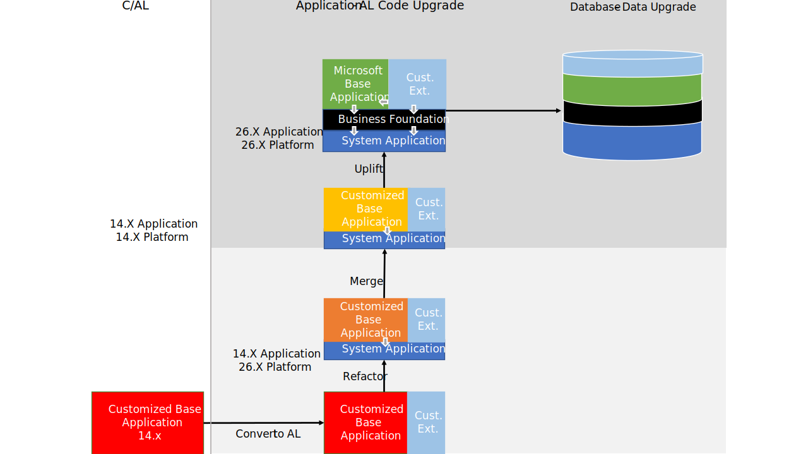

# Upgrade to Dynamics 365 Business Central 2025 release wave 1

[!INCLUDE[prod_short](../developer/includes/prod_short.md)] 2025 release wave 1 (version 26) is the 11th major release that's fully AL-based. The transition from C/AL to AL began with [!INCLUDE[prod_short](../developer/includes/prod_short.md)] 2019 release wave 2 (version 15), when Microsoft deprecated the classic C/SIDE development environment. 

From an application perspective, [!INCLUDE[prod_short](../developer/includes/prod_short.md)] now supports extension-based development only. The [!INCLUDE[prod_short](../developer/includes/prod_short.md)] base application is delivered as an AL extension. Also, application functionality that isn't related to the business logic has moved into separate modules. These modules are combined into an extension known as the System Application. These architectural changes affect how you upgrade compared to earlier releases.

## Upgrade path

Depending on your current version, you might not be able to upgrade directly to version 26. In some cases, you must first upgrade to one or more intermediate versions. The following table describes the upgrade paths for supported versions:

[!INCLUDE[upgrade-path-v26](../developer/includes/upgrade-path-v26.md)]

Your current version doesn't have to be on the latest update. However, when you upgrade through intermediate versions, use the latest available update for each version.

## Upgrade overview

When you upgrade your [!INCLUDE[prod_short](../developer/includes/prod_short.md)] Spring 2019 (version 14) solution, you must first upgrade to version 15. The goal is to fully adopt the base and System Applications, as they are, while moving code customizations into add-on extensions. 

You can follow different upgrade levels to reach this state, as shown in the following illustration. As a minimum, we recommend that you refactor to use the System Application.

## New and changed features

There are several new and changed platform and application features available in [!INCLUDE[prod_short](../developer/includes/prod_short.md)] 2025 release wave 1. These changes affect users, administrators, and developers. Learn more at [Overview of Dynamics 365 Business Central 2025 release wave 1](/dynamics365/release-plan/2025wave1/smb/dynamics365-business-central/planned-features).

## Business Foundation extension

Version 24 introduced the Business Foundation extension. This extension currently includes objects and logic for number series, which were previously part of the base application. Microsoft will add more functionality to this extension in future releases. The base application now has a dependency on the business foundation extension in addition to the system application. This change affects the upgrade process because the business foundation extension needs to be published and installed on the tenant before the base application.

The base application now depends on both the System Application and the Business Foundation extension. As a result, you need to publish and install the Business Foundation extension on the tenant before you install the base application.

## Deprecated features  

Before you upgrade, review the following articles for an overview of deprecated features in this release:

- [Deprecated Features in W1](deprecated-features-w1.md)
- [Deprecated Features in the Platform](deprecated-features-platform.md)
- [Deprecated Tables](deprecated-tables.md)

Use the links in each article's table of contents to find more deprecated features, including those specific to local versions.

## Migrate to Business Central online

You can upgrade to [!INCLUDE[prod_short](../developer/includes/prod_short.md)] online from supported versions of [!INCLUDE[prod_short](../developer/includes/prod_short.md)] on-premises, as long as extensions handle your application customizations.

The process consists of two parts:

- Convert nonstandard functionality and customizations to apps and per-tenant extensions. Learn more in [Deploying a Tenant Customization](../developer/devenv-deploy-tenant-customization.md).
- Run the cloud migration tool, and then switch to use [!INCLUDE[prod_short](../developer/includes/prod_short.md)] online going forward.

Learn more in [Migrate on-premises data to Business Central online](../administration/migrate-data.md).

## Related information  

- [Upgrading to Business Central](upgrading-to-business-central.md)  
- [Upgrading Extensions](../developer/devenv-upgrading-extensions.md)  
- [[!INCLUDE[prod_long](../developer/includes/prod_long.md)] Upgrade Compatibility Matrix](upgrade-v14-v15-compatibility.md)  
