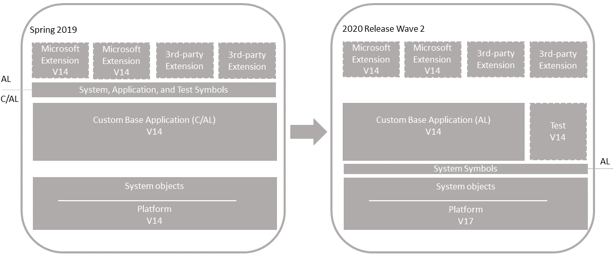

# Technical Upgrade From Version 14 to Version 16

Use this process when you have a code customized [!INCLUDE[prodshort](../developer/includes/prodshort.md)] application (version 14) that you want to upgrade to the [!INCLUDE[prodshort](../developer/includes/prodshort.md)] 2020 release wave 2 platform (version 17). This process won't upgrade the application to the latest version. You'll convert the entire application from C/AL to an AL base application extension.

   
 
#### Single-tenant and multitenant deployments

The process for upgrading is similar for a single-tenant and multitenant deployment. However, there are some inherent differences. With a single-tenant deployment, the application and business data are included in the same database. While with a multitenant deployment, application code is in a separate database (the application database) than the business data (tenant). In the procedures that follow, for a single-tenant deployment, consider references to the *application database* and *tenant database* as the same database. Steps are marked as *Single-tenant only* or *Multitenant only* where applicable.

## Prerequisites

1. Upgrade to Business Central Spring 2019 (version 14).

   There are several updates for version 14. When upgrading from Business Central Fall 2018 (version 13) or Dynamics NAV, upgrade to the latest version 14 update that has a compatible version 16 update. For more information, see [[!INCLUDE[prodlong](../developer/includes/prodlong.md)] Upgrade Compatibility Matrix](upgrade-v14-v15-compatibility.md).
   
   If your solution is already on version 14, then you don't have to upgrade to the latest version 16 update.

   To download the latest update, go to [Released Cumulative Updates for Microsoft Dynamics 365 Business Central Spring 2019 Update on-premises](https://support.microsoft.com/help/4501292).

   For information, see [Upgrading to Dynamics 365 Business Central On-Premises](upgrading-to-business-central-on-premises.md).

2. Disable data encryption.

    If the current server instance uses data encryption, disable it. You can enable it again after upgrading.

    For more information, see [Managing Encryption and Encryption Keys](how-to-export-and-import-encryption-keys.md#encryption).

    Instead of disabling encryption, you can export the current encryption key, which you'll then import after upgrade. However, we recommend disabling encryption before upgrading.

<!-- Replace step 1 with this for CU1
1. Upgrade to the latest Business Central Spring 2019 Cumulative Update (version 14.X) that is compatible with the version 15 .

   If your current deployment is already running cumulative update 5 (version 14.6), we recommend to wait until the first cumulative update for version 15 is released. This is recommended because of destructive schema changes introduced by version 15 Base Application.

 For more information, see [Upgrading to Dynamics 365 Business Central On-Premises](upgrading-to-business-central-on-premises.md).

-->
## Task 1: Install version 17

1. Before you install version 17, it can be useful to create desktop shortcuts to the version 14.0 tools, such as the [!INCLUDE[admintool](../developer/includes/admintool.md)], [!INCLUDE[adminshell](../developer/includes/adminshell.md)], and [!INCLUDE[devshell](../developer/includes/devshell.md)] because the Start menu items for these tools will be replaced with the version 17.0 tools.

2. Install all components of version 17.

    You'll have to keep version 14.0 installed, because you'll need the it to complete the C/AL to AL conversion in this process. Therefore, when you install version 17, you must either specify different port numbers for components during installation or stop the version 14.0 [!INCLUDE[server](../developer/includes/server.md)] instance before you run the installation. Otherwise, you'll get an error that the [!INCLUDE[server](../developer/includes/server.md)] failed to install.

    <!--
    > [!IMPORTANT]
    > Because of dependencies, we recommend that for upgrade , you install all components available. Also, there is currently a known issue with the Microsoft.Office.Interop.Word.dll. After installation, you must copy the Microsoft.Office.Interop.Word.dll from the C:\Program Files (x86)\Microsoft Dynamics 365 Business Central\150\RoleTailored Client folder to the C:\Program Files\Microsoft Dynamics 365 Business Central\160\Service\Add-ins folder.-->

    For more information, see [Installing Business Central Using Setup](../deployment/install-using-setup.md).

3. Copy the version 14 **CodeViewer** add-in to the version 17.0 server installation

    1. Find the **CodeViewer** folder in the **Add-ins** folder of the version 14 RoleTailored client installation. By default, the folder path is C:\Program Files (x86)\Microsoft Dynamics 365 Business Central\140\RoleTailored Client\Add-ins.
    
    2. Copy the folder to the **Add-ins** folder of the version 17 server installation. By default, the folder path is C:\Program Files\Microsoft Dynamics 365 Business Central\170\Service\Add-ins. Replace the existing folder and files, if any. 
     
    CodeViewer is no longer used in version 17. But it's required because of references that exist in the converted application. If you omit this step, you might get compilation errors later.

## Task 2: Convert your v14 C/AL application to AL

For more information, see [Code Conversion from C/AL to AL](devenv-code-conversion.md).

<!--
## Task 3: Rewrite code for obsoleted system tables

In version 16, a number of tables have been deprecated and replaced by new tables. You must rewrite code that uses the deprecated tables to use the new tables. For a list of the deprecated tables and new tables, see [Deprecated Tables](deprecated-tables.md).
-->
<!--
This change introduces several breaking changes. For more information about resolving the changes, see [Breaking Changes](https://github.com/microsoft/ALAppExtensions/blob/master/BREAKINGCHANGES.md). To complete this task, you modify your base application AL source, and compile a new extension.
-->

## <a name="Preparedb"></a> Task 4: Prepare databases

In this task, you prepare the application and tenant databases for the upgrade.

1. Make backup of the database.
2. Make sure that you have the extension packages for all published extensions.

    You'll need these packages later to publish and install the extensions again.
3. Uninstall all extensions from the old tenants.

    Run the [!INCLUDE[adminshell](../developer/includes/adminshell.md)] for version 14.0 as an administrator. Use the [Uninstall-NAVApp](/powershell/module/microsoft.dynamics.nav.apps.management/uninstall-navapp) cmdlet to uninstall an extension. For example, together with the Get-NAVAppInfo cmdlet, you can uninstall all extensions with a single command:

    ``` 
    Get-NAVAppInfo -ServerInstance <BC14 server instance> -Tenant <tenant ID> | % { Uninstall-NAVApp -ServerInstance <BC14 server instance> -Name $_.Name -Version $_.Version -Tenant <tenant ID>}
    ``` 

    If you have a single tenant deployment, you can omit the `-Tenant` parameter and value. 

3. Unpublish all extensions from the application server instance.

    To unpublish extensions, use the [Unpublish-NAVAPP cmdlet](/powershell/module/microsoft.dynamics.nav.apps.management/unpublish-navapp). Together with the [Get-NAVAppInfo cmdlet](/powershell/module/microsoft.dynamics.nav.apps.management/get-navappinfo?view=businesscentral-ps), you can uninstall all extensions from the tenant using a single command:

    ```
    Get-NAVAppInfo -ServerInstance <BC14 server instance> | % { Unpublish-NAVApp -ServerInstance <BC14 server instance> -Name $_.Name -Version $_.Version }
    ```

4. Unpublish all system, test, and application symbols.

    To unpublish symbols, use the Unpublish-NAVAPP cmdlet. You can unpublish all symbols by using the Get-NAVAppInfo cmdlet with the `-SymbolsOnly` switch as follows:

    ``` 
    Get-NAVAppInfo -ServerInstance <BC14 server instance> -SymbolsOnly | % { Unpublish-NAVApp -ServerInstance <BC14 server instance> -Name $_.Name -Version $_.Version }
    ```    

    [What are symbols?](upgrade-overview-v15.md#Symbols)  

5. (Multitenant only) Dismount the tenants from the application server instance.

    To dismount a tenant, use the [Dismount-NAVTenant](/powershell/module/microsoft.dynamics.nav.management/dismount-navtenant) cmdlet:

    ```
    Dismount-NAVTenant -ServerInstance <BC14 server instance> -Tenant <tenant ID>
    ```

6. Stop the server instance.

    ```
    Stop-NAVServerInstance -ServerInstance <BC14 server instance>
    ```

## Task 5: Convert version 14.0 application database

This task runs a technical upgrade on the application database. A technical upgrade converts the database from the version 14.0 platform to the version 17.0 platform. This conversion updates the system tables of the database to the new schema (data structure). It also provides the latest platform features and performance enhancements.

1. Start [!INCLUDE[adminshell](../developer/includes/adminshell.md)] for version 17.0 as an administrator.

2. Run the [Invoke-NAVApplicationDatabaseConversion cmdlet](/powershell/module/microsoft.dynamics.nav.management/invoke-navapplicationdatabaseconversion) to start the conversion:

    ```
    Invoke-NAVApplicationDatabaseConversion -DatabaseServer <database server>\<database instance> -DatabaseName "<BC14 database name>"
    ```
    When completed, a message like the following displays in the console:

    ```
    DatabaseServer      : .\BCDEMO
    DatabaseName        : Demo Database BC (14-0)
    DatabaseCredentials :
    DatabaseLocation    :
    Collation           :
    ```

## Task 6: Configure version 16 server

When you installed version 16 in **Task 1**, a version 16 [!INCLUDE[server](../developer/includes/server.md)] instance was created. In this task, you change server configuration settings that are required to complete the upgrade. Some of the changes are only required for version 14 to version 16.0 upgrade and can be reverted after you complete the upgrade.

1. Set the server instance to connect to the application database.

    ```
    Set-NAVServerConfiguration -ServerInstance <BC15 server instance> -KeyName DatabaseName -KeyValue "<BC14 database name>"
    ```
    
    In a single tenant deployment, this command mounts the tenant automatically. For more information, see [Connecting a Server Instance to a Database](../administration/connect-server-to-database.md).

2. Disable task scheduler on the server instance for purposes of upgrade.

    ```
    Set-NavServerConfiguration -ServerInstance <BC16 server instance> -KeyName "EnableTaskScheduler" -KeyValue false
    ```
    Be sure to re-enable task scheduler after upgrade if needed.
3. Restart the server instance.

    ```
    Restart-NAVServerInstance -ServerInstance <BC16 server instance>
    ```
## <a name="UploadLicense"></a> Task 7: Upload [!INCLUDE[prodshort](../developer/includes/prodshort.md)] partner license  

If you have a new [!INCLUDE[prodshort](../developer/includes/prodshort.md)] partner license, make sure that it has been uploaded to the database. To upload the license, use the [Import-NAVServerLicense cmdlet](/powershell/module/microsoft.dynamics.nav.management/import-navserverlicense): 

```powershell
Import-NAVServerLicense -ServerInstance <BC17 server instance> -LicenseFile "<path to the license>"
```

For more information, see [Uploading a License File for a Specific Database](../cside/cside-upload-license-file.md#UploadtoDatabase).  

## Task 8: Publish system symbols, base application, and test library extensions

In this task, you'll publish extensions to the version 16.0 server instance. Publishing adds the extension to the application database that is mounted on the server instance. The extension is then available for installing on tenants later. It updates internal tables, compiles the components of the extension behind-the-scenes, and builds the necessary metadata objects that are used at runtime.

The steps in this task continue to use the [!INCLUDE[adminshell](../developer/includes/adminshell.md)] for version 16.0 that you started in the previous task.

1. Publish the system symbols extension for version 16.

    The symbols extension contains the required platform symbols that the base application depends on. The symbols extension package is called **System.app**. You find it where the **AL Development Environment** is installed. The default installation path is C:\Program Files (x86)\Microsoft Dynamics 365 Business Central\160\AL Development Environment.  

    ```
    Publish-NAVApp -ServerInstance <BC16 server instance> -Path "<path to the System.app file>" -PackageType SymbolsOnly
    ```

2. Publish the custom base application extension that you created in **Task 2**.

    ```
    Publish-NAVApp -ServerInstance <BC16 server instance> -Path "<path to the base application extension package file>"
    ```

3. Publish the test library extension if you created one in **Task 2**.

    ```
    Publish-NAVApp -ServerInstance <BC16 server instance> -Path "<path to the test library extension package file>"
    ```

## Task 9: Synchronize tenant

This task updates the tenant database schema with schema changes in system objects and application objects.

If you have a multitenant deployment, run these steps for each tenant (replacing `<tenant ID>` with the appropriate tenant ID).

1. (Multitenant only) Mount the tenant to the version 16 server instance.

    To mount the tenant, use the [Mount-NAVTenant](/powershell/module/microsoft.dynamics.nav.management/mount-navtenant) cmdlet:
    
    ```
    Mount-NAVTenant -ServerInstance <BC16 server instance> -DatabaseName "<BC14 database name>" -DatabaseServer <database server>\<database instance> -Tenant <tenant ID> -AllowAppDatabaseWrite
    ```
    
    > [!IMPORTANT]
    > You must use the same tenant ID for the tenant that was used in the old deployment; otherwise you will get an error when mounting or syncing the tenant. If you want to use a different ID for the tenant, you can either use the `-AlternateId` parameter now or after upgrading, dismount the tenant, then mount it again using the new ID and the `OverwriteTenantIdInDatabase` parameter.  
    
    > [!NOTE]  
    > For upgrade, we recommend that you use the `-AllowAppDatabaseWrite` parameter. After upgrade, you can dismount and mount the tenant again without the parameter if needed.

2. Synchronize the tenant to the system objects.
  
    Use the [Sync-NAVTenant](/powershell/module/microsoft.dynamics.nav.management/sync-navtenant) cmdlet:

    ```  
    Sync-NAVTenant -ServerInstance <BC16 server instance> -Tenant <tenant ID> -Mode Sync
    ```

    With a single-tenant deployment, you can omit the `-Tenant` parameter and value.

    At this stage, the tenant state is **Operational**.

## Task 9: Install base and test applications

You'll synchronize the tenant to the custom base application and test library extension (if any). When you synchronize the tenant, extensions take ownership of the tables in the SQL Database.

If you have a multitenant deployment, run these steps for each tenant (replacing `<tenant ID>` with the appropriate tenant ID).

1. Synchronize the tenant to the base application extension (Base Application).

    Use the [Sync-NAVApp](/powershell/module/microsoft.dynamics.nav.apps.management/sync-navapp) cmdlet:

    ```
    Sync-NAVApp -ServerInstance <BC16 server instance> -Name "Base Application" -Version <extension version> -tenant <tenant ID>
    ```

    With this step, the base app takes ownership of the database tables. When completed, in SQL Server, the table names will be suffixed with the base app extension ID.

2. Install custom base application extension on the tenant.

    To install the extension, you use the [Install-NAVApp cmdlet](/powershell/module/microsoft.dynamics.nav.apps.management/install-navapp). 

    ```
    Install-NAVApp -ServerInstance <BC16 server instance> -Name "Base Application" -Version <extension version>
    ```

    At this point, the base application is upgraded to the version 16 platform and is operational. You can open the application in the client.

3. Synchronize and install the test library extension.

    This step is like what you did for the custom base application in steps 3 and 4.

## Task 10: Configure version 16 server for app migration

In this task, you configure the version 16 server so that the Microsoft and third-party extensions that were installed in the version 14 deployment can be reinstalled. You'll configure the `DestinationAppsForMigration` parameter of the serve instance with information about the custom base application and test library. Specifically, you need the ID, name, and publisher assigned to these extensions. With the `DestinationAppsForMigration` parameter set, when you publish the Microsoft and third-party extensions, the server instance will automatically modify the manifest of the extensions to include the dependency on the base application and test library extension, allowing them to be published. For more information about this setting, see [DestinationAppsForMigration](upgrade-destinationappsformigration.md).

1. Get the ID, name, and publisher of the custom base application and test library.

    ```
    Get-NAVAppInfo -ServerInstance <BC15 server instance>
    ```

2. Set the `DestinationAppsForMigration` parameter for the server instance configuration to include the information about the custom base application and test library (if used). For example:<!-- skip this step for now in single tenant-->

    ```
    Set-NAVServerConfiguration -ServerInstance <BC16 server instance> -KeyName "DestinationAppsForMigration" -KeyValue '[{"appId":"437dbf0e-84ff-417a-965d-ed2bb9650972", "name":"Base Application", "publisher": "Microsoft"},{"appId":"<test library extension app ID>", "name":"<test library extension name>", "publisher": "<test library publisher>"}]'
    ```

3. Restart the server instance.

## Task 11: Publish and install extensions

Now, you can install the Microsoft and 3rd-party extensions that were installed on the tenant before the upgrade.

1. Publish the old extension versions.

    ```
    Publish-NAVApp -ServerInstance <BC16 server instance> -Path "<path to extension package file>"
    ```

    You only need to do this step once.

2. Synchronize the extension.

    ```
    Sync-NAVApp -ServerInstance <BC16 server instance> -Name "<extension name>" -Version <extension version> -tenant <tenant ID>
    ```

3. Install the extension:

    ```
    Install-NAVApp -ServerInstance <BC16 server instance> -Name "<extension name>" -Version <extension version> -tenant <tenant ID>
    ```

4. Repeat steps 2 and 3 for each extension and on each tenant.

Now, your application is fully upgraded to the version 16 platform.

## Task 12: <a name="JSaddins"></a>Upgrade control add-ins

The [!INCLUDE[server](../developer/includes/server.md)] installation includes new versions of the Microsoft-provided Javascript-based control add-ins, like Microsoft.Dynamics.Nav.Client.BusinessChart, Microsoft.Dynamics.Nav.Client.VideoPlayer, and more. If your solution uses any of these control add-ins, upgrade them to the latest version.

To upgrade the control add-ins from the client, do the following steps:

1. Open the [!INCLUDE[prodshort](../developer/includes/prodshort.md)] client.
2. Search for and open the **Control Add-ins** page.
3. Choose **Actions** > **Control Add-in Resource** > **Import**.
4. Locate and select the .zip file for the control add-in and choose **Open**.

    The .zip files are located in the **Add-ins** folder of the [!INCLUDE[server](../developer/includes/server.md)] installation. There's a subfolder for each add-in. For example, the path to the Business Chart control add-in is `C:\Program Files\Microsoft Dynamics 365 Business Central\160\Service\Add-ins\BusinessChart\Microsoft.Dynamics.Nav.Client.BusinessChart.zip`.
5. After you've imported all the new control add-in versions, restart Business Central Server instance.

Alternatively, you can use the [Set-NAVAddin cmdlet](/powershell/module/microsoft.dynamics.nav.management/set-navaddin) of the [!INCLUDE[adminshell](../developer/includes/adminshell.md)]. For example, the following commands update the control add-ins installed by default. Modify the commands to suit:

```powershell
$InstanceName = 'BC160'
$ServicesAddinsFolder = 'C:\Program Files\Microsoft Dynamics 365 Business Central\160\Service\Add-ins'
Set-NAVAddIn -ServerInstance $InstanceName -AddinName 'Microsoft.Dynamics.Nav.Client.BusinessChart' -PublicKeyToken 31bf3856ad364e35 -ResourceFile ($AppName = Join-Path $ServicesAddinsFolder 'BusinessChart\Microsoft.Dynamics.Nav.Client.BusinessChart.zip')
Set-NAVAddIn -ServerInstance $InstanceName -AddinName 'Microsoft.Dynamics.Nav.Client.FlowIntegration' -PublicKeyToken 31bf3856ad364e35 -ResourceFile ($AppName = Join-Path $ServicesAddinsFolder 'FlowIntegration\Microsoft.Dynamics.Nav.Client.FlowIntegration.zip')
Set-NAVAddIn -ServerInstance $InstanceName -AddinName 'Microsoft.Dynamics.Nav.Client.OAuthIntegration' -PublicKeyToken 31bf3856ad364e35 -ResourceFile ($AppName = Join-Path $ServicesAddinsFolder 'OAuthIntegration\Microsoft.Dynamics.Nav.Client.OAuthIntegration.zip')
Set-NAVAddIn -ServerInstance $InstanceName -AddinName 'Microsoft.Dynamics.Nav.Client.PageReady' -PublicKeyToken 31bf3856ad364e35 -ResourceFile ($AppName = Join-Path $ServicesAddinsFolder 'PageReady\Microsoft.Dynamics.Nav.Client.PageReady.zip')
Set-NAVAddIn -ServerInstance $InstanceName -AddinName 'Microsoft.Dynamics.Nav.Client.PowerBIManagement' -PublicKeyToken 31bf3856ad364e35 -ResourceFile ($AppName = Join-Path $ServicesAddinsFolder 'PowerBIManagement\Microsoft.Dynamics.Nav.Client.PowerBIManagement.zip')
Set-NAVAddIn -ServerInstance $InstanceName -AddinName 'Microsoft.Dynamics.Nav.Client.RoleCenterSelector' -PublicKeyToken 31bf3856ad364e35 -ResourceFile ($AppName = Join-Path $ServicesAddinsFolder 'RoleCenterSelector\Microsoft.Dynamics.Nav.Client.RoleCenterSelector.zip')
Set-NAVAddIn -ServerInstance $InstanceName -AddinName 'Microsoft.Dynamics.Nav.Client.SatisfactionSurvey' -PublicKeyToken 31bf3856ad364e35 -ResourceFile ($AppName = Join-Path $ServicesAddinsFolder 'SatisfactionSurvey\Microsoft.Dynamics.Nav.Client.SatisfactionSurvey.zip')
Set-NAVAddIn -ServerInstance $InstanceName -AddinName 'Microsoft.Dynamics.Nav.Client.SocialListening' -PublicKeyToken 31bf3856ad364e35 -ResourceFile ($AppName = Join-Path $ServicesAddinsFolder 'SocialListening\Microsoft.Dynamics.Nav.Client.SocialListening.zip')
Set-NAVAddIn -ServerInstance $InstanceName -AddinName 'Microsoft.Dynamics.Nav.Client.VideoPlayer' -PublicKeyToken 31bf3856ad364e35 -ResourceFile ($AppName = Join-Path $ServicesAddinsFolder 'VideoPlayer\Microsoft.Dynamics.Nav.Client.VideoPlayer.zip')
Set-NAVAddIn -ServerInstance $InstanceName -AddinName 'Microsoft.Dynamics.Nav.Client.WebPageViewer' -PublicKeyToken 31bf3856ad364e35 -ResourceFile ($AppName = Join-Path $ServicesAddinsFolder 'WebPageViewer\Microsoft.Dynamics.Nav.Client.WebPageViewer.zip')
Set-NAVAddIn -ServerInstance $InstanceName -AddinName 'Microsoft.Dynamics.Nav.Client.WelcomeWizard' -PublicKeyToken 31bf3856ad364e35 -ResourceFile ($AppName = Join-Path $ServicesAddinsFolder 'WelcomeWizard\Microsoft.Dynamics.Nav.Client.WelcomeWizard.zip')
```

## Task 13: Post-upgrade

1. Enable task scheduler on the server instance.
2. (Multitenant only) For tenants other than the tenant that you use for administration purposes, if you mounted the tenants using the `-AllowAppDatabaseWrite` parameter, dismount the tenants, then mount them again without using the `-AllowAppDatabaseWrite` parameter.
3. If you want to use data encryption as before, enable it.

   For more information, see [Managing Encryption and Encryption Keys](how-to-export-and-import-encryption-keys.md#encryption).

   Optionally, if you exported the encryption key instead of disabling encryption earlier, import the encryption key file to enable encryption.

4. Grant users permission to the *Open in Excel* and *Edit in Excel* actions.

    Version 16 introduces a system permission that protects these two actions. The permission is granted by the system object **6110 Allow Action Export To Excel**. Because of this change, users who had permission to these actions before upgrading, will lose permission. To grant permission again, do one of the following steps:
    
    - If you have a version 16 application, export the **EXCEL EXPORT ACTION** permission set. Then, import it to your application and add it to appropriate users. 
    
    - Add the system object **6110 Allow Action Export To Excel** permission directly to appropriate permission sets.

     For more information about working with permission sets and permissions, see [Export and Import Permission Sets](/dynamics365/business-central/ui-define-granular-permissions#to-export-and-import-a-permission-set). 

## See Also

[Upgrading to Business Central](upgrading-to-business-central.md)  
[Business Central 14.X to 15.X compatibility matrix](upgrade-v14-v15-compatibility.md)
