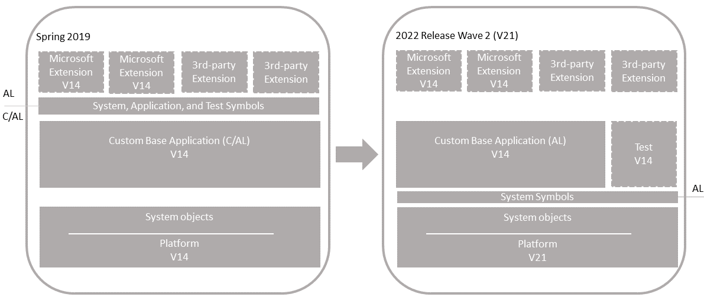

# Technical Upgrade From Version 14 to Version 21

Use this process when you have a code customized [!INCLUDE[prod_short](../developer/includes/prod_short.md)] application (version 14) that you want to upgrade to the [!INCLUDE[prod_short](../developer/includes/prod_short.md)] 2022 release wave 2 platform (version 21). This process won't upgrade the application to the latest version. You'll convert the entire application from C/AL to an AL base application extension.

[](../developer/media/bc14-to-21-technical-upgrade-unmodified-app.png#lightbox)  
 
## General information
 
### Single-tenant and multitenant deployments

[!INCLUDE[upgrade_single_vs_multitenant](../developer/includes/upgrade_single_vs_multitenant.md)]


### Personalization and customizations

[!INCLUDE[windows-client-upgrade](../developer/includes/windows-client-upgrade.md)]


## Prerequisites

1. Upgrade to Business Central Spring 2019 (version 14).

   There are several updates for version 14. When upgrading from Business Central Fall 2018 (version 13) or Dynamics NAV, upgrade to the latest version 14 update that has a compatible version 20 update. For more information, see [[!INCLUDE[prod_long](../developer/includes/prod_long.md)] Upgrade Compatibility Matrix](upgrade-v14-v15-compatibility.md).

   If your solution is already on version 14, then you don't have to upgrade to the latest version 21 update.

   To download the latest update, go to [Released Cumulative Updates for Microsoft Dynamics 365 Business Central Spring 2019 Update on-premises](https://support.microsoft.com/help/4501292).

   For information, see [Upgrading to Dynamics 365 Business Central On-Premises](upgrading-to-business-central-on-premises.md).
2. Make sure that you have the extension packages for all published extensions.

    You'll need these packages later to publish and install the extensions again.

## Task 1: Install version 21

1. Before you install version 21, it can be useful to create desktop shortcuts to the version 14.0 tools, such as the [!INCLUDE[adminshell](../developer/includes/adminshell.md)] and [!INCLUDE[devshell](../developer/includes/devshell.md)] because the Start menu items for these tools will be replaced with the version 21.0 tools.

2. Install all components of version 21.

    You keep version 14.0 installed, because you'll need it to complete the C/AL to AL conversion. So when you install version 21, you must either specify different port numbers for components during installation or stop the version 14.0 [!INCLUDE[server](../developer/includes/server.md)] instance before you run the installation. Otherwise, you'll get an error that the [!INCLUDE[server](../developer/includes/server.md)] failed to install.

    For more information, see [Installing Business Central Using Setup](../deployment/install-using-setup.md).

3. Copy the version 14 **CodeViewer** add-in to the version 21.0 server installation

    1. Find the **CodeViewer** folder in the **Add-ins** folder of the version 14 RoleTailored client installation. By default, the folder path is C:\Program Files (x86)\Microsoft Dynamics 365 Business Central\140\RoleTailored Client\Add-ins.

    2. Copy the folder to the **Add-ins** folder of the version 21 server installation. By default, the folder path is C:\Program Files\Microsoft Dynamics 365 Business Central\210\Service\Add-ins. Replace the existing folder and files, if any. 

    CodeViewer is no longer used in version 21. But it's required because of references that exist in the converted application. If you omit this step, you might get compilation errors later.

4. Copy Dynamics Online Connect add-in.

    The Dynamics Online Connect add-in was deprecated in version 17. As a result, it's been removed from the DVD and is no longer installed as part of the [!INCLUDE[server](../developer/includes/server.md)]. However, for upgrade, the add-in may still be required for the old System Application. If the [!INCLUDE[server](../developer/includes/server.md)] installation for your current version includes the **Add-ins\Connect** folder, then copy the **Connect** folder to the **Add-ins** folder of the version 21 server installation.

## Task 2: Upgrade permission sets

Version 21 introduces the capability to define permissions sets as AL objects, instead of as data. Permissions sets as AL objects is now the default and recommended model for permissions. For now, you can choose to use the legacy model, where permissions are defined and stored as data in the database. Whichever model you choose, there are permission set-related tasks you'll have to go through before and during upgrade.

For more information, see [Upgrading Permissions Sets and Permissions](upgrade-permissions.md).

## Task 3: Convert your v14 C/AL application to AL

For more information, see [Code Conversion from C/AL to AL](devenv-code-conversion.md).

## <a name="Preparedb"></a> Task 4: Prepare databases

In this task, you prepare the application and tenant databases for the upgrade.

1. Make backup of the database.
2. Disable data encryption.

    If the current server instance uses data encryption, disable it. You can enable it again after upgrading.

    For more information, see [Managing Encryption and Encryption Keys](how-to-export-and-import-encryption-keys.md#encryption).

    Instead of disabling encryption, you can export the current encryption key, which you'll then import after upgrade. However, we recommend disabling encryption before upgrading.

3. Uninstall all extensions from the old tenants.

    Run the [!INCLUDE[adminshell](../developer/includes/adminshell.md)] for version 14.0 as an administrator. [!INCLUDE[open-admin-shell](../developer/includes/open-admin-shell.md)]
    
    Use the [Uninstall-NAVApp](/powershell/module/microsoft.dynamics.nav.apps.management/uninstall-navapp) cmdlet to uninstall an extension. For example, together with the Get-NAVAppInfo cmdlet, you can uninstall all extensions with a single command:

    ```powershell 
    Get-NAVAppInfo -ServerInstance <BC14 server instance> -Tenant <tenant ID> | % { Uninstall-NAVApp -ServerInstance <BC14 server instance> -Name $_.Name -Version $_.Version -Tenant <tenant ID>}
    ```

    If you have a single tenant deployment, you can omit the `-Tenant` parameter and value. 

4. Unpublish all extensions from the application server instance.

    To unpublish extensions, use the [Unpublish-NAVAPP cmdlet](/powershell/module/microsoft.dynamics.nav.apps.management/unpublish-navapp). Together with the [Get-NAVAppInfo cmdlet](/powershell/module/microsoft.dynamics.nav.apps.management/get-navappinfo), you can uninstall all extensions from the tenant using a single command:

    ```powershell
    Get-NAVAppInfo -ServerInstance <BC14 server instance> | % { Unpublish-NAVApp -ServerInstance <BC14 server instance> -Name $_.Name -Version $_.Version }
    ```

5. Unpublish all system, test, and application symbols.

    To unpublish symbols, use the Unpublish-NAVAPP cmdlet. You can unpublish all symbols by using the Get-NAVAppInfo cmdlet with the `-SymbolsOnly` switch as follows:

    ```powershell 
    Get-NAVAppInfo -ServerInstance <BC14 server instance> -SymbolsOnly | % { Unpublish-NAVApp -ServerInstance <BC14 server instance> -Name $_.Name -Version $_.Version }
    ```

    [What are symbols?](upgrade-overview-v15.md#Symbols)  

6. (Multitenant only) Dismount the tenants from the application server instance.

    To dismount a tenant, use the [Dismount-NAVTenant](/powershell/module/microsoft.dynamics.nav.management/dismount-navtenant) cmdlet:

    ```powershell
    Dismount-NAVTenant -ServerInstance <BC14 server instance> -Tenant <tenant ID>
    ```

7. Stop the server instance.

    ```powershell
    Stop-NAVServerInstance -ServerInstance <BC14 server instance>
    ```

## Task 5: Convert the application database to version 21

This task runs a technical upgrade on the application database. A technical upgrade converts the database from the version 14.0 platform to the version 21.0 platform. This conversion updates the system tables of the database to the new schema (data structure). It also provides the latest platform features and performance enhancements.

[!INCLUDE[convert_azure_sql_db](../developer/includes/convert_azure_sql_db.md)]

2. Start [!INCLUDE[adminshell](../developer/includes/adminshell.md)] for version 21.0 as an administrator.

   [!INCLUDE[open-admin-shell](../developer/includes/open-admin-shell.md)]

3. Run the [Invoke-NAVApplicationDatabaseConversion cmdlet](/powershell/module/microsoft.dynamics.nav.management/invoke-navapplicationdatabaseconversion) to start the conversion:

    ```powershell
    Invoke-NAVApplicationDatabaseConversion -DatabaseServer <database server>\<database instance> -DatabaseName "<BC14 database name>"
    ```

    When completed, a message like the following displays in the console:

    ```powershell
    DatabaseServer      : .\BCDEMO
    DatabaseName        : Demo Database BC (14-0)
    DatabaseCredentials :
    DatabaseLocation    :
    Collation           :
    ```
[!INCLUDE[convert_azure_sql_db_timeout](../developer/includes/convert_azure_sql_db_timeout.md)]

## Task 6: Configure version 21 server

When you installed version 21 in **Task 1**, a version 21 [!INCLUDE[server](../developer/includes/server.md)] instance was created. In this task, you change server configuration settings that are required to complete the upgrade. Some of the changes are only required for version 14 to version 21.0 upgrade and can be reverted after you complete the upgrade.

1. Set the server instance to connect to the application database.

    ```powershell
    Set-NAVServerConfiguration -ServerInstance <BC19 server instance> -KeyName DatabaseName -KeyValue "<BC14 database name>"
    ```

    In a single tenant deployment, this command mounts the tenant automatically. For more information, see [Connecting a Server Instance to a Database](../administration/connect-server-to-database.md).

2. Disable task scheduler on the server instance for purposes of upgrade.

    ```powershell
    Set-NavServerConfiguration -ServerInstance <BC19 server instance> -KeyName "EnableTaskScheduler" -KeyValue false
    ```

    Be sure to re-enable task scheduler after upgrade if needed.
3. Restart the server instance.

    ```powershell
    Restart-NAVServerInstance -ServerInstance <BC19 server instance>
    ```

## <a name="UploadLicense"></a> Task 7: Import [!INCLUDE[prod_short](../developer/includes/prod_short.md)] partner license  

If you have a new [!INCLUDE[prod_short](../developer/includes/prod_short.md)] partner license, make sure that it has been uploaded to the database. To upload the license, use the [Import-NAVServerLicense cmdlet](/powershell/module/microsoft.dynamics.nav.management/import-navserverlicense): 

```powershell
Import-NAVServerLicense -ServerInstance <BC19 server instance> -LicenseFile "<path to the license>"
```

Restart the server instance after you import the license.

For more information, see [Uploading a License File for a Specific Database](../cside/cside-upload-license-file.md#UploadtoDatabase).  

## Task 8: Publish base application and test library extensions

In this task, you'll publish extensions to the version 21.0 server instance. Publishing adds the extension to the application database that is mounted on the server instance. The extension is then available for installing on tenants later. It updates internal tables, compiles the components of the extension behind-the-scenes, and builds the necessary metadata objects that are used at runtime.

The steps in this task continue to use the [!INCLUDE[adminshell](../developer/includes/adminshell.md)] for version 21.0 that you started in the previous task.

1. Publish the custom base application extension that you created in **Task 3**.

    ```powershell
    Publish-NAVApp -ServerInstance <BC19 server instance> -Path "<path to the base application extension package file>"
    ```

2. Publish the test library extension if you created one in **Task 3**.

    ```powershell
    Publish-NAVApp -ServerInstance <BC19 server instance> -Path "<path to the test library extension package file>"
    ```

## Task 9: Synchronize tenant

This task updates the tenant database schema with schema changes in system objects and application objects.

If you have a multitenant deployment, run these steps for each tenant (replacing `<tenant ID>` with the appropriate tenant ID).

1. (Multitenant only) Mount the tenant to the version 21 server instance.

    To mount the tenant, use the [Mount-NAVTenant](/powershell/module/microsoft.dynamics.nav.management/mount-navtenant) cmdlet:

    ```powershell
    Mount-NAVTenant -ServerInstance <BC19 server instance> -DatabaseName "<BC14 database name>" -DatabaseServer <database server>\<database instance> -Tenant <tenant ID> -AllowAppDatabaseWrite
    ```

    > [!IMPORTANT]
    > You must use the same tenant ID for the tenant that was used in the old deployment; otherwise you will get an error when mounting or syncing the tenant. If you want to use a different ID for the tenant, you can either use the `-AlternateId` parameter now or after upgrading, dismount the tenant, then mount it again using the new ID and the `OverwriteTenantIdInDatabase` parameter.  

    > [!NOTE]  
    > For upgrade, we recommend that you use the `-AllowAppDatabaseWrite` parameter. After upgrade, you can dismount and mount the tenant again without the parameter if needed.

2. Synchronize the tenant to the system objects.
  
    Use the [Sync-NAVTenant](/powershell/module/microsoft.dynamics.nav.management/sync-navtenant) cmdlet:

    ```powershell  
    Sync-NAVTenant -ServerInstance <BC19 server instance> -Tenant <tenant ID> -Mode Sync
    ```

    With a single-tenant deployment, you can omit the `-Tenant` parameter and value.

    At this stage, the tenant state is **Operational**.

## Task 10: Install base and test applications

You'll synchronize the tenant to the custom base application and test library extension (if any). When you synchronize the tenant, extensions take ownership of the tables in the SQL Database.

If you have a multitenant deployment, run these steps for each tenant (replacing `<tenant ID>` with the appropriate tenant ID).

1. Synchronize the tenant to the base application extension (Base Application).

    Use the [Sync-NAVApp](/powershell/module/microsoft.dynamics.nav.apps.management/sync-navapp) cmdlet:

    ```powershell
    Sync-NAVApp -ServerInstance <BC19 server instance> -Name "Base Application" -Version <extension version> -tenant <tenant ID>
    ```

    With this step, the base app takes ownership of the database tables. When completed, in SQL Server, the table names will be suffixed with the base app extension ID.

2. Install custom base application extension on the tenant.

    To install the extension, you use the [Install-NAVApp cmdlet](/powershell/module/microsoft.dynamics.nav.apps.management/install-navapp). 

    ```powershell
    Install-NAVApp -ServerInstance <BC19 server instance> -Name "Base Application" -Version <extension version>
    ```

    At this point, the base application is upgraded to the version 21 platform and is operational. You can open the application in the client.

3. Synchronize and install the test library extension.

    This step is like what you did for the custom base application in steps 1 and 2.

## Task 11: Publish and install extensions

Now, you can install the Microsoft and 3rd-party extensions that were installed on the tenant before the upgrade.

1. Publish the old extension versions.

    ```powershell
    Publish-NAVApp -ServerInstance <BC19 server instance> -Path "<path to extension package file>"
    ```

    You only need to do this step once.

2. Synchronize the extension.

    ```powershell
    Sync-NAVApp -ServerInstance <BC19 server instance> -Name "<extension name>" -Version <extension version> -tenant <tenant ID>
    ```

3. Install the extension:

    ```powershell
    Install-NAVApp -ServerInstance <BC19 server instance> -Name "<extension name>" -Version <extension version> -tenant <tenant ID>
    ```

4. Repeat steps 2 and 3 for each extension and on each tenant.

Now, your application is fully upgraded to the version 21 platform.

## Task 12: <a name="JSaddins"></a>Upgrade control add-ins

[!INCLUDE[upgrade-control-addins](../developer/includes/upgrade-control-addins.md)]

## Task 13: Install upgraded permissions sets

In this task, you install the custom permission sets that you upgraded earlier in this procedure. The steps depend on whether you've decided to use permission sets as AL objects or data.

### For permission sets as AL objects

1. Publish the extension or extensions that include the permission sets.
2. Sync the extensions with the tenant.
3. Install the extensions on the tenant.

### For permission sets as data in XML

1. Set the `UserPermissionSetsFromExtensions` setting of the [!INCLUDE[server](../developer/includes/server.md)] instance to `false`.

    ```powershell
    Set-NavServerConfiguration -ServerInstance <BC19 server instance> -KeyName "UsePermissionSetsFromExtensions" -KeyValue false
    ```

2. Restart the serve instance.
3. Open the [!INCLUDE[webclient](../developer/includes/webclient.md)].
4. Search for and open the **Permission Sets** page.
5. Select **Import Permission Sets**, and follow the instructions to import the XML file.

For more information, see [To export and import a permission set](/dynamics365/business-central/ui-define-granular-permissions#to-export-and-import-a-permission-set).

## Post-upgrade tasks

1. [!INCLUDE[delegation-upgrade](../developer/includes/delegation-upgrade.md)]
2. Enable task scheduler on the server instance.
3. (Multitenant only) For tenants other than the tenant that you use for administration purposes, if you mounted the tenants using the `-AllowAppDatabaseWrite` parameter, dismount the tenants, then mount them again without using the `-AllowAppDatabaseWrite` parameter.
4. If you want to use data encryption as before, enable it.

   For more information, see [Managing Encryption and Encryption Keys](how-to-export-and-import-encryption-keys.md#encryption).

   Optionally, if you exported the encryption key instead of disabling encryption earlier, import the encryption key file to enable encryption.

5. Grant users permission to the *Open in Excel* and *Edit in Excel* actions.

    Version 18 introduced a system permission that protects these two actions. The permission is granted by the system object **6110 Allow Action Export To Excel**. Because of this change, users who had permission to these actions before upgrading, will lose permission. To grant permission again, do one of the following steps:

    - Export the **EXCEL EXPORT ACTION** permission set. Then, import it to your application and add it to appropriate users.
    - Add the system object **6110 Allow Action Export To Excel** permission directly to appropriate permission sets.

     For more information about working with permission sets and permissions, see [Export and Import Permission Sets](/dynamics365/business-central/ui-define-granular-permissions#to-export-and-import-a-permission-set). 

## See Also

[Upgrading to Business Central](upgrading-to-business-central.md)  
[Business Central 14.X to 15.X compatibility matrix](upgrade-v14-v15-compatibility.md)