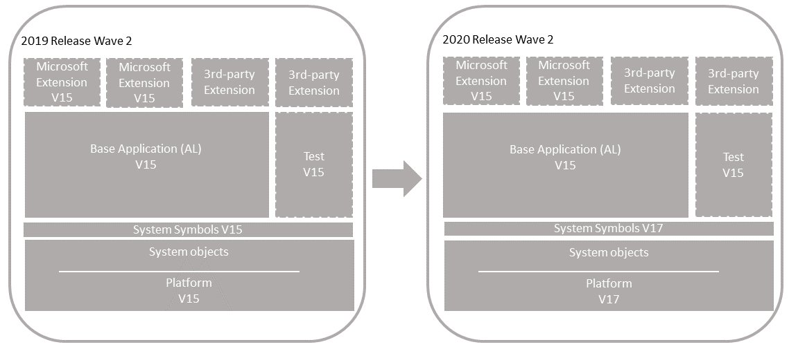

# Technical Upgrade from Version 15 to Version 17

Use this process to upgrade from [!INCLUDE[prod_short](../developer/includes/prod_short.md)] 2019 release wave 2 (version 15) to the [!INCLUDE[prod_short](../developer/includes/prod_short.md)] 2020 release wave 1 platform (version 17). This process won't upgrade the application to the latest version.

    

#### Single-tenant and multitenant deployments

The process for upgrading is similar for a single-tenant and multitenant deployment. However, there are some inherent differences. With a single-tenant deployment, the application and business data are included in the same database. While with a multitenant deployment, application code is in a separate database (the application database) than the business data (tenant). In the procedures that follow, for a single-tenant deployment, consider references to the *application database* and *tenant database* as the same database. Steps are marked as *Single-tenant only* or *Multitenant only* where applicable.

#### Considerations

In version 17, a number of tables have been deprecated and replaced by new tables compared to version 15. For a list of these tables and the corresponding new tables, see [Deprecated Tables](deprecated-tables.md). Code that uses the deprecated tables, must be rewritten to use the new tables. In this article, this work is done under Task 2.

## Prerequisites

1. Your version 15 platform is compatible with version 17.

    There are several updates for version 15. The updates have a compatible version 17 update. For more information, see [[!INCLUDE[prod_long](../developer/includes/prod_long.md)] Upgrade Compatibility Matrix](upgrade-v14-v15-compatibility.md). For example, if your solution is currently running 15.11, you can't upgrade to 17.0. You must wait until 17.1 is available.  

2. Disable data encryption.

    If the current server instance uses data encryption, disable it. You can enable it again after upgrading.

    For more information, see [Managing Encryption and Encryption Keys](how-to-export-and-import-encryption-keys.md#encryption).

    Instead of disabling encryption, you can export the current encryption key, which you'll then import after upgrade. However, we recommend disabling encryption before upgrading.

## Task 1: Install version 17

1. Before you install version 17, it can be useful to create desktop shortcuts to the version 15.0 tools, such as the [!INCLUDE[admintool](../developer/includes/admintool.md)], [!INCLUDE[adminshell](../developer/includes/adminshell.md)], and [!INCLUDE[devshell](../developer/includes/devshell.md)] because the Start menu items for these tools will be replaced with the version 17.0 tools.

2. Install version 17 components.

    You'll keep version 15 component installed for now. When you install version 17, you must either specify different port numbers for components during installation or stop the version 15.0 [!INCLUDE[server](../developer/includes/server.md)] instance before you run the installation. Otherwise, you'll get an error that the [!INCLUDE[server](../developer/includes/server.md)] failed to install.

    For more information, see [Installing Business Central Using Setup](../deployment/install-using-setup.md).

## APPLICATION

## Task 2: Rewrite code to handle obsoleted system tables

In version 17, several tables have been deprecated and replaced by new tables, compared to version 15. For a list of these tables and the corresponding new tables, see [Deprecated Tables](deprecated-tables.md). Code that uses the deprecated tables, must be rewritten to use the tables. This change will typically affect your base application or the Microsoft System Application, if you're using it.

For the base application or system application extensions, you'll have to create a new version that uses the new tables. The basic steps are as follows:

1. Create AL project in Visual Studio Code for the system and/or base application.

    If you're using the Microsoft System Application, start with this project first.

2. Include the source files of the current version in the project.

3. Copy the version 17 System symbols (System.app) file to the **.alpackages** folder of the project.

    You'll find the System.app file on the installation media (DVD) for version 17 or in the **AL Development Environment** installation folder. By default, the folder is C:\Program Files (x86)\Microsoft Dynamics 365 Business Central\170\AL Development Environment.

    For the base application, also include the extension package (.app) for the new version of the Microsoft System Application, if you're using it.

4. Modify the app.json:

    - Increase `"version"` number. You have to increase the version so you can run a data upgrade later in this process.
    - Set `"runtime"` to `6.0`
    - Set `"platform"` to `17.0.0.0`
    - Set `"target"` to `OnPrem`

    For more information about the app.json file, see [App.json file](../developer/devenv-json-files.md#Appjson).
5. In the **dotnet.al** files in the project, find and delete all instances of `Version = '15.0.0.0';` in **Microsoft.Dynamics.Nav** and  **Microsoft.Dynamics.Framework** assembly declarations.

6. Rewrite code that references the deprecated table to reference the new tables.

    Try to build the project first to see what errors you get. Then, resolve the errors. <!-- For help about most of the errors, see [Rewriting Code for Breaking Changes](deprecated-tables-fix-compile-errors.md).-->

7. Compile and build the new version of the extension.

## DATA

## <a name="Preparedb"></a> Task 3: Prepare databases

In this task, you prepare the application and tenant databases for the upgrade.

1. Make backup of the database.
2. Make sure that you have the extension packages for all published extensions.

    You'll need these packages later to publish and install the extensions again.

3. (Single-tenant only) Uninstall all extensions from the old tenants.

    Run the [!INCLUDE[adminshell](../developer/includes/adminshell.md)] for version 15.0 as an administrator. Use the [Uninstall-NAVApp](/powershell/module/microsoft.dynamics.nav.apps.management/uninstall-navapp) cmdlet to uninstall an extension. For example, together with the Get-NAVAppInfo cmdlet, you can uninstall all extensions with a single command:

    ``` 
    Get-NAVAppInfo -ServerInstance <BC15 server instance> | % { Uninstall-NAVApp -ServerInstance <BC15 server instance> -Name $_.Name -Version $_.Version }
    ``` 
4. Unpublish all system, test, and application symbols.

    To unpublish symbols, use the Unpublish-NAVAPP cmdlet.  You can unpublish all symbols by using the Get-NAVAppInfo cmdlet with the `-SymbolsOnly` switch as follows:

    ``` 
    Get-NAVAppInfo -ServerInstance <BC15 server instance> -SymbolsOnly | % { Unpublish-NAVApp -ServerInstance <BC15 server instance> -Name $_.Name -Version $_.Version }
    ```    

    [What are symbols?](upgrade-overview-v15.md#Symbols)  

5. (Multitenant only) Dismount the tenants from the application server instance.

    To dismount a tenant, use the [Dismount-NAVTenant](/powershell/module/microsoft.dynamics.nav.management/dismount-navtenant) cmdlet:

    ```
    Dismount-NAVTenant -ServerInstance <BC15 server instance> -Tenant <tenant ID>
    ```

6. Stop the server instance.

    ```
    Stop-NAVServerInstance -ServerInstance <BC15 server instance>
    ```

## Task 4: Convert the version 15.0 application database

This task runs a technical upgrade on the application database. A technical upgrade converts the database from the version 15.0 platform to the version 17.0 platform. This conversion updates the system tables of the database to the new schema (data structure). It also provides the latest platform features and performance enhancements.

> [!IMPORTANT]
> The conversion does not modify the application objects, but it will remove any modifications that you have made to system tables. After the conversion you will no longer be able to use it with Business Central 14.

1. Start [!INCLUDE[adminshell](../developer/includes/adminshell.md)] for version 17.0 as an administrator.

2. Run the [Invoke-NAVApplicationDatabaseConversion cmdlet](/powershell/module/microsoft.dynamics.nav.management/invoke-navapplicationdatabaseconversion) to start the conversion. In a multitenant deployment, run this cmdlet against the application database.

    ```
    Invoke-NAVApplicationDatabaseConversion -DatabaseServer <database server>\<database instance> -DatabaseName "<BC15 database name>"
    ```
    When completed, a message like the following displays in the console:

    ```
    DatabaseServer      : .\BCDEMO
    DatabaseName        : Demo Database BC (15-0)
    DatabaseCredentials :
    DatabaseLocation    :
    Collation           :
    ```
[!INCLUDE[convert_azure_sql_db_timeout](../developer/includes/convert_azure_sql_db_timeout.md)]

## Task 5: Configure version 17 server

When you installed version 17 in **Task 1**, a version 17 [!INCLUDE[server](../developer/includes/server.md)] instance was created. In this task, you change server configuration settings that are required to complete the upgrade. Some of the changes are only required for version 15 to version 17.0 upgrade and can be reverted after you complete the upgrade.

1. Set the server instance to connect to the application database.

    ```
    Set-NAVServerConfiguration -ServerInstance <BC17 server instance> -KeyName DatabaseName -KeyValue "<BC15 database name>"
    ```
    
    In a single tenant deployment, this command mounts the tenant automatically. For more information, see [Connecting a Server Instance to a Database](../administration/connect-server-to-database.md).

2. Disable task scheduler on the server instance for purposes of upgrade.

    ```
    Set-NavServerConfiguration -ServerInstance <BC17 server instance> -KeyName "EnableTaskScheduler" -KeyValue false
    ```
    Be sure to re-enable task scheduler after upgrade if needed.
3. Restart the server instance.

    ```
    Restart-NAVServerInstance -ServerInstance <BC17 server instance>
    ```

## Task 6: Import version 17 license

1. Use the [Import-NAVServerLicense](/powershell/module/microsoft.dynamics.nav.management/import-navserverlicense) to upload the version 17 license to the database. 

    ```
    Import-NAVServerLicense -ServerInstance <server instance name> -LicenseFile <path and file name>
    ```

2. Restart the server instance.

    ```
    Restart-NAVServerInstance -ServerInstance <server instance name>
    ```

## Task 7: Publish new system symbols

Use the Publish-NAVApp cmdlet to publish the new symbols extension package. This package is called **System.app**. If you've installed the **AL Development Environment**, you find the file in the installation folder. By default, the folder path is C:\Program Files (x86)\Microsoft Dynamics 365 Business Central\170\AL Development Environment.

```
Publish-NAVApp -ServerInstance <BC17 server instance> -Path "<path to the System.app file>" -PackageType SymbolsOnly
```

## Task 8: Publish new extension versions

Publish the new versions of the system and base application extensions.

```
Publish-NAVApp -ServerInstance <BC17 server instance> -Path "<path to .app file for system or base application>" 
```

## Task 9: Recompile published extensions

Compile all other published extensions, except the Microsoft System Application and you're base application, against the new platform.

1. To compile an extension, use the [Repair-NAVApp](/powershell/module/microsoft.dynamics.nav.apps.management/repair-navapp) cmdlet, For example:

    ```powershell  
    Repair-NAVApp -ServerInstance <server instance> -Name <extension name> -Version <extension name>
    ```
    
    To compile all published extensions at once, you can use this command:
    
    ```powershell  
    Get-NAVAppInfo -ServerInstance <server instance> | Repair-NAVApp  
    ```

2. Restart the server instance.

    ```powershell
    Restart-NAVServerInstance -ServerInstance <server instance>
    ```

## Task 10: Synchronize tenant

1. (Multitenant only) Mount the tenant to the new Business Central Server instance.

    You'll have to do this step and the next for each tenant. For more information, see [Mount or Dismount a Tenant](../administration/mount-dismount-tenant.md).
 
2. Synchronize the tenant.
  
    Use the [Sync-NAVTenant](/powershell/module/microsoft.dynamics.nav.management/sync-navtenant) cmdlet:

    ```powershell  
    Sync-NAVTenant -ServerInstance <server instance> -Tenant <tenant ID> -Mode Sync
    ```

    For a single-tenant deployment, you can either set the `<tenant ID>` to `default` or omit the `-Tenant <tenant ID>` parameter. For more information about syncing, see [Synchronizing the Tenant Database and Application Database](../administration/synchronize-tenant-database-and-application-database.md).

3. Synchronize the system application extension, then the base application.

    ```powershell  
    Sync-NAVApp -ServerInstance <server instance> -Name <extension name> version <extension version> -Tenant <tenant ID>
    ```

## Task 11: Run upgrade to install system and base applications

Instead of directly installing the system amd base applications, you'll have to run a data upgrade because previous versions of these extensions were installed. 

To do this, run the [Start-NAVAppDataUpgrade cmdlet](/powershell/module/microsoft.dynamics.nav.apps.management/start-navappdataupgrade) on each extension. Start with the system application, then the base application.

```powershell  
Start-NAVAppDataUpgrade -ServerInstance <server instance> -Name <extension name> version <extension version> -Tenant <tenant ID>
```

This will run the data upgrade and install the extensions on the tenant.

## Task 12: Reinstall other extensions

In this step, you install the remaining extensions that were previously installed on your tenant before upgrading. To install an extension, you use the [Install-NAVApp cmdlet](/powershell/module/microsoft.dynamics.nav.apps.management/install-navapp).

```powershell 
Install-NAVApp -ServerInstance <server instance> -Name "System Application" -Version <extension version>
```

If your previous tenant including the **Application** extension, install this extension first.


## Task 13: <a name="JSaddins"></a>Upgrade control add-ins

The [!INCLUDE[server](../developer/includes/server.md)] installation includes new versions of the Microsoft-provided Javascript-based control add-ins, like Microsoft.Dynamics.Nav.Client.BusinessChart, Microsoft.Dynamics.Nav.Client.VideoPlayer, and more. If your solution uses any of these control add-ins, upgrade them to the latest version.

To upgrade the control add-ins, do the following steps:

1. Open the [!INCLUDE[prod_short](../developer/includes/prod_short.md)] client.
2. Search for and open the **Control Add-ins** page.
3. Choose **Actions** > **Control Add-in Resource** > **Import**.
4. Locate and select the .zip file for the control add-in and choose **Open**.

    The .zip files are located in the **Add-ins** folder of the [!INCLUDE[server](../developer/includes/server.md)] installation. There's a subfolder for each add-in. For example, the path to the Business Chart control add-in is `C:\Program Files\Microsoft Dynamics 365 Business Central\170\Service\Add-ins\BusinessChart\Microsoft.Dynamics.Nav.Client.BusinessChart.zip`.
5. After you've imported all the new control add-in versions, restart Business Central Server instance.

Alternatively, you can use the [Set-NAVAddin cmdlet](/powershell/module/microsoft.dynamics.nav.management/set-navaddin) of the [!INCLUDE[adminshell](../developer/includes/adminshell.md)]. For example, the following commands update the control add-ins installed by default. Modify the commands to suit:

```powershell
$InstanceName = 'BC170'
$ServicesAddinsFolder = 'C:\Program Files\Microsoft Dynamics 365 Business Central\170\Service\Add-ins'
Set-NAVAddIn -ServerInstance $InstanceName -AddinName 'Microsoft.Dynamics.Nav.Client.BusinessChart' -PublicKeyToken 31bf3856ad364e35 -ResourceFile ($AppName = Join-Path $ServicesAddinsFolder 'BusinessChart\Microsoft.Dynamics.Nav.Client.BusinessChart.zip')
Set-NAVAddIn -ServerInstance $InstanceName -AddinName 'Microsoft.Dynamics.Nav.Client.FlowIntegration' -PublicKeyToken 31bf3856ad364e35 -ResourceFile ($AppName = Join-Path $ServicesAddinsFolder 'FlowIntegration\Microsoft.Dynamics.Nav.Client.FlowIntegration.zip')
Set-NAVAddIn -ServerInstance $InstanceName -AddinName 'Microsoft.Dynamics.Nav.Client.OAuthIntegration' -PublicKeyToken 31bf3856ad364e35 -ResourceFile ($AppName = Join-Path $ServicesAddinsFolder 'OAuthIntegration\Microsoft.Dynamics.Nav.Client.OAuthIntegration.zip')
Set-NAVAddIn -ServerInstance $InstanceName -AddinName 'Microsoft.Dynamics.Nav.Client.PageReady' -PublicKeyToken 31bf3856ad364e35 -ResourceFile ($AppName = Join-Path $ServicesAddinsFolder 'PageReady\Microsoft.Dynamics.Nav.Client.PageReady.zip')
Set-NAVAddIn -ServerInstance $InstanceName -AddinName 'Microsoft.Dynamics.Nav.Client.PowerBIManagement' -PublicKeyToken 31bf3856ad364e35 -ResourceFile ($AppName = Join-Path $ServicesAddinsFolder 'PowerBIManagement\Microsoft.Dynamics.Nav.Client.PowerBIManagement.zip')
Set-NAVAddIn -ServerInstance $InstanceName -AddinName 'Microsoft.Dynamics.Nav.Client.RoleCenterSelector' -PublicKeyToken 31bf3856ad364e35 -ResourceFile ($AppName = Join-Path $ServicesAddinsFolder 'RoleCenterSelector\Microsoft.Dynamics.Nav.Client.RoleCenterSelector.zip')
Set-NAVAddIn -ServerInstance $InstanceName -AddinName 'Microsoft.Dynamics.Nav.Client.SatisfactionSurvey' -PublicKeyToken 31bf3856ad364e35 -ResourceFile ($AppName = Join-Path $ServicesAddinsFolder 'SatisfactionSurvey\Microsoft.Dynamics.Nav.Client.SatisfactionSurvey.zip')
Set-NAVAddIn -ServerInstance $InstanceName -AddinName 'Microsoft.Dynamics.Nav.Client.SocialListening' -PublicKeyToken 31bf3856ad364e35 -ResourceFile ($AppName = Join-Path $ServicesAddinsFolder 'SocialListening\Microsoft.Dynamics.Nav.Client.SocialListening.zip')
Set-NAVAddIn -ServerInstance $InstanceName -AddinName 'Microsoft.Dynamics.Nav.Client.VideoPlayer' -PublicKeyToken 31bf3856ad364e35 -ResourceFile ($AppName = Join-Path $ServicesAddinsFolder 'VideoPlayer\Microsoft.Dynamics.Nav.Client.VideoPlayer.zip')
Set-NAVAddIn -ServerInstance $InstanceName -AddinName 'Microsoft.Dynamics.Nav.Client.WebPageViewer' -PublicKeyToken 31bf3856ad364e35 -ResourceFile ($AppName = Join-Path $ServicesAddinsFolder 'WebPageViewer\Microsoft.Dynamics.Nav.Client.WebPageViewer.zip')
Set-NAVAddIn -ServerInstance $InstanceName -AddinName 'Microsoft.Dynamics.Nav.Client.WelcomeWizard' -PublicKeyToken 31bf3856ad364e35 -ResourceFile ($AppName = Join-Path $ServicesAddinsFolder 'WelcomeWizard\Microsoft.Dynamics.Nav.Client.WelcomeWizard.zip')
```

## Task 14: Post-upgrade

1. Enable task scheduler on the server instance.
2. (Multitenant only) For tenants other than the tenant that you use for administration purposes, if you mounted the tenants using the `-AllowAppDatabaseWrite` parameter, dismount the tenants, then mount them again without using the `-AllowAppDatabaseWrite` parameter.
3. If you want to use data encryption as before, enable it.

   For more information, see [Managing Encryption and Encryption Keys](how-to-export-and-import-encryption-keys.md#encryption).

   Optionally, if you exported the encryption key instead of disabling encryption earlier, import the encryption key file to enable encryption.
4. Grant users permission to the *Open in Excel* and *Edit in Excel* actions.

    Version 17 introduces a system permission that protects these two actions. The permission is granted by the system object **6110 Allow Action Export To Excel**. Because of this change, users who had permission to these actions before upgrading, will lose permission. To grant permission again, do one of the following steps:
    
    - If you have a version 17 application, export the **EXCEL EXPORT ACTION** permission set. Then, import it to your application and add it to appropriate users. 
    
    - Add the system object **6110 Allow Action Export To Excel** permission directly to appropriate permission sets.

     For more information about working with permission sets and permissions, see [Export and Import Permission Sets](/dynamics365/business-central/ui-define-granular-permissions#to-export-and-import-a-permission-set).


## See Also

[Upgrading to Business Central](upgrading-to-business-central.md)  
[Business Central Compatibility Matrix](upgrade-v14-v15-compatibility.md)
