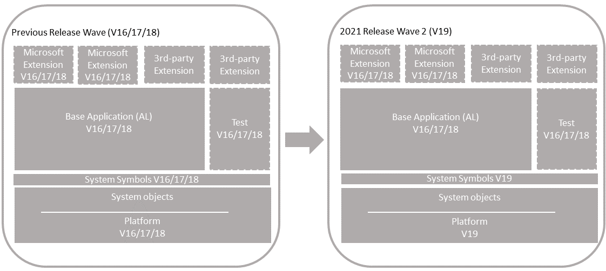

# Technical Upgrade to Version 19

Use this process to upgrade any of the following versions to the [!INCLUDE[prod_short](../developer/includes/prod_short.md)] 2021 release wave 2 platform (version 19). This process won't upgrade the application to the latest version.

- [!INCLUDE[prod_short](../developer/includes/prod_short.md)] 2021 release wave 1 (version 18)
- [!INCLUDE[prod_short](../developer/includes/prod_short.md)] 2020 release wave 2 (version 17)
- [!INCLUDE[prod_short](../developer/includes/prod_short.md)] 2020 release wave 1 (version 16)

 

## Before you begin

Review the information in this section before you start upgrading your deployment.

### Single-tenant and multitenant deployments

[!INCLUDE[upgrade_single_vs_multitenant](../developer/includes/upgrade_single_vs_multitenant.md)]

### Prepare new runtime packages

[!INCLUDE[upgrade_runtime_packages](../developer/includes/upgrade_runtime_packages.md)]


### PowerShell variables used in tasks

Many of the steps in this article use PowerShell cmdlets, which require that you provide values for various parameters. To make it easier for copying or scripting in PowerShell, the steps use the following variables for parameter values. Replace the text between the `" "` with the correct values for your environment. 

```powershell
$OldBcServerInstance = "The name of the Business Central server instance for your previous version, for example: BC180"
$NewBcServerInstance = "The name of the Business Central server instance for version 19, for example: BC190"
$TenantId = "The ID of the tenant to be upgraded. If not using a multitenant server instance, set the variable to default, or omit -Tenant parameter."
$TenantDatabase = "The name of the Business Central tenant database to be upgraded, for example: Demo Database BC (19-0)" 
$ApplicationDatabase = "The name of the Business Central application database in a multitenant environment, for example: My BC App DB. For a single-tenant deployment, this is the same as $TenantDatabase." 
$DatabaseServer = "The SQL Server instance that hosts the databases. The value has the format server_name\instance_name, For example: localhost\BCDEMO"
$OldVersion = "The version number for the current System, Base, and Application extensions that you'll reinstall, for example: 18.1.24582.0"
$PartnerLicense = "The file path and name of the partner license"
$AddinsFolder = 'The file path to the Add-ins folder of version 19 server installation, for example, C:\Program Files\Microsoft Dynamics 365 Business Central\190\Service\Add-ins'
$CustomerLicense = "The file path and name of the customer license"
```

## Task 1: Install version 19

1. Choose a version 19 that's compatible with your current platform version.

    There are several updates for each Business Central version. The update of your current version must be compatible version 19 update that you want to upgrade to. For more information, see [[!INCLUDE[prod_long](../developer/includes/prod_long.md)] Upgrade Compatibility Matrix](upgrade-v14-v15-compatibility.md). If your solution, for example, is currently running 18.6, you can't upgrade to 19.0. You'll have to wait until 19.1 is available. 

2. Before you install version 19, it can be useful to create desktop shortcuts to the version 16.0 tools, such as the [!INCLUDE[admintool](../developer/includes/admintool.md)], [!INCLUDE[adminshell](../developer/includes/adminshell.md)], and [!INCLUDE[devshell](../developer/includes/devshell.md)] because the Start menu items for these tools will be replaced with the version 19.0 tools.

3. Install version 19 components.

    You'll keep previous version installed for now. When you install version 19, you must either specify different port numbers for components (like the [!INCLUDE[server](../developer/includes/server.md)] instance and web services) or stop the version 18.0 [!INCLUDE[server](../developer/includes/server.md)] instance before you run the installation. Otherwise, you'll get an error that the [!INCLUDE[server](../developer/includes/server.md)] failed to install.

    For more information, see [Installing Business Central Using Setup](../deployment/install-using-setup.md).
4. Copy Dynamics Online Connect add-in (upgrade from version 16 or earlier).

    The Dynamics Online Connect add-in was deprecated in version 17. As a result, it's been removed from the DVD and is no longer installed as part of the [!INCLUDE[server](../developer/includes/server.md)]. However, for upgrade, the add-in may still be required for the old System Application. If the [!INCLUDE[server](../developer/includes/server.md)] installation for your current version includes the **Add-ins\Connect** folder, then copy the **Connect** folder to the **Add-ins** folder of the version 19 server installation.

## Task 2: Upgrade permission sets

Version 18 introduced the capability to define permissions sets as AL objects, instead of as data. Permissions sets as AL objects is now the default and recommended model for defining permissions. However for now, you can choose to use the legacy model, where permissions are defined and stored as data in the database. Whichever model you choose, there are permission set-related tasks you'll have to go through before and during upgrade.

For more information, see [Upgrading Permissions Sets and Permissions](upgrade-permissions.md)<!--[Permissions Upgrade Considerations](https://review.docs.microsoft.com/dynamics365/business-central/dev-itpro/developer/devenv-entitlements-and-permissionsets-overview?branch=permissionset#upgrade-considerations)-->.

<!-- ## Prereuisites 
1. Your current platform version is compatible with version 18.

    There are several updates for each Business Central version. The update of your current version must be compatible version 18 update that you want to upgrade to. For more information, see [[!INCLUDE[prod_long](../developer/includes/prod_long.md)] Upgrade Compatibility Matrix](upgrade-v14-v15-compatibility.md). If your solution, for example, is currently running 17.6, you can't upgrade to 18.0. You'll have to wait until 17.7 is available.  

3. Disable data encryption.

    If the current server instance uses data encryption, disable it. You can enable it again after upgrading.

    For more information, see [Managing Encryption and Encryption Keys](how-to-export-and-import-encryption-keys.md#encryption).

    Instead of disabling encryption, you can export the current encryption key, which you'll then import after upgrade. However, we recommend disabling encryption before upgrading.
-->

<!--
## Task 3: Rewrite code to handle obsoleted system tables (v15 only)

In version 19, several system tables were removed and replaced by new tables, compared to version 15. For a list of these tables and the corresponding new tables, see [Deprecated Tables](deprecated-tables.md). Code that uses the deprecated tables, must be rewritten to use the new tables. This change will typically affect your base application or the Microsoft System Application, if you're using it.

For the base application or system application extensions, you'll have to create a new version that uses the new tables. The basic steps are as follows:

1. Create AL project in Visual Studio Code for the system and/or base application.

    If you're using the Microsoft System Application, start with this project first.

2. Include the source files of the current version in the project.

3. Copy the version 19 System symbols (System.app) file to the **.alpackages** folder of the project.

    You'll find the System.app file on the installation media (DVD) for version 19 or in the **AL Development Environment** installation folder. By default, the folder is C:\Program Files (x86)\Microsoft Dynamics 365 Business Central\190\AL Development Environment.

    For the base application, also include the extension package (.app) for the new version of the Microsoft System Application, if you're using it.

4. Modify the app.json:

    - Increase `"version"` number. You have to increase the version so you can run a data upgrade later in this process.
    - Set `"runtime"` to `8.0`
    - Set `"platform"` to `19.0.0.0`
    - Set `"target"` to `OnPrem`

    For more information about the app.json file, see [App.json file](../developer/devenv-json-files.md#Appjson).
5. In the **dotnet.al** files in the project, find and delete all instances of `Version = '15.0.0.0';` in **Microsoft.Dynamics.Nav** and  **Microsoft.Dynamics.Framework** assembly declarations.

6. Rewrite code that references the deprecated table to reference the new tables.

    Try to build the project first to see what errors you get. Then, resolve the errors. <!-- For help about most of the errors, see [Rewriting Code for Breaking Changes](deprecated-tables-fix-compile-errors.md).

7. Compile and build the new version of the extension.-->


## <a name="Preparedb"></a> Task 3: Prepare databases

In this task, you prepare the application and tenant databases for the upgrade.

1. Make backup of the database.

<!--
2. Make sure that you have the extension packages for all published extensions.

    You'll need these packages later to re-publish and install the extensions again.
-->

2. Disable data encryption.

    If the current server instance uses data encryption, disable it. You can enable it again after upgrading.

    For more information, see [Managing Encryption and Encryption Keys](how-to-export-and-import-encryption-keys.md#encryption).

    Instead of disabling encryption, you can export the current encryption key, which you'll then import after upgrade. However, we recommend disabling encryption before upgrading.

3. (Single-tenant only) Uninstall all extensions from the old tenants.

    Run the [!INCLUDE[adminshell](../developer/includes/adminshell.md)] for the previous version, like 18, as an administrator. Use the [Uninstall-NAVApp](/powershell/module/microsoft.dynamics.nav.apps.management/uninstall-navapp) cmdlet to uninstall an extension. For example, together with the Get-NAVAppInfo cmdlet, you can uninstall all extensions with a single command:

    ```powershell 
    Get-NAVAppInfo -ServerInstance $OldBcServerInstance  | % { Uninstall-NAVApp -ServerInstance $OldBcServerInstance -Name $_.Name -Version $_.Version }
    ```

4. Unpublish all system, test, and application symbols.

    To unpublish symbols, use the Unpublish-NAVAPP cmdlet. You can unpublish all symbols by using the Get-NAVAppInfo cmdlet with the `-SymbolsOnly` switch as follows:

    ```powershell 
    Get-NAVAppInfo -ServerInstance $OldBcServerInstance  -SymbolsOnly | % { Unpublish-NAVApp -ServerInstance $OldBcServerInstance -Name $_.Name -Version $_.Version }
    ```

    [What are symbols?](upgrade-overview-v15.md#Symbols)  

5. (Multitenant only) Dismount the tenants from the application server instance.

    To dismount a tenant, use the [Dismount-NAVTenant](/powershell/module/microsoft.dynamics.nav.management/dismount-navtenant) cmdlet:

    ```powershell
    Dismount-NAVTenant -ServerInstance $OldBcServerInstance -Tenant $TenantId
    ```

6. Stop the server instance.

    ```powershell
    Stop-NAVServerInstance -ServerInstance $OldBcServerInstance
    ```

## Task 4: Convert application database to version 19

This task runs a technical upgrade on the application database. A technical upgrade converts the current database to the version 19.0 platform. This conversion updates the system tables of the database to the new schema (data structure). It also provides the latest platform features and performance enhancements.

> [!IMPORTANT]
> The conversion does not modify the application objects, but it will remove any modifications that you have made to system tables. After the conversion you will no longer be able to use it with current version.

1. Start [!INCLUDE[adminshell](../developer/includes/adminshell.md)] for version 19.0 as an administrator.

2. Run the [Invoke-NAVApplicationDatabaseConversion cmdlet](/powershell/module/microsoft.dynamics.nav.management/invoke-navapplicationdatabaseconversion) to start the conversion. In a multitenant deployment, run this cmdlet against the application database.

    ```powershell
    Invoke-NAVApplicationDatabaseConversion -DatabaseServer $DatabaseServer -DatabaseName $ApplicationDatabase
    ```

    When completed, a message like the following displays in the console:

    ```powershell
    DatabaseServer      : .\BCDEMO
    DatabaseName        : Demo Database BC (18-0)
    DatabaseCredentials :
    DatabaseLocation    :
    Collation           :
    ```

[!INCLUDE[convert_azure_sql_db_timeout](../developer/includes/convert_azure_sql_db_timeout.md)]

## Task 5: Configure version 19 server

When you installed version 19 in **Task 1**, a version 19 [!INCLUDE[server](../developer/includes/server.md)] instance was created. In this task, you change server configuration settings that are required to complete the upgrade. Some of the changes are only required for the upgrade and can be reverted after you complete the upgrade.

1. Set the server instance to connect to the application database.

    ```powershell
    Set-NAVServerConfiguration -ServerInstance $NewBcServerInstance -KeyName DatabaseName -KeyValue $ApplicationDatabase
    ```

    In a single tenant deployment, this command mounts the tenant automatically. For more information, see [Connecting a Server Instance to a Database](../administration/connect-server-to-database.md).

2. If you want to use permission sets defined as data, set the `UserPermissionSetsFromExtensions` setting to `false`.

    ```powershell
    Set-NavServerConfiguration -ServerInstance $NewBcServerInstance -KeyName "UsePermissionSetsFromExtensions" -KeyValue false
    ```

2. Disable task scheduler on the server instance for purposes of upgrade.

    ```powershell
    Set-NavServerConfiguration -ServerInstance $NewBcServerInstance -KeyName "EnableTaskScheduler" -KeyValue false
    ```

    Be sure to re-enable task scheduler after upgrade if needed.
3. Restart the server instance.

    ```powershell
    Restart-NAVServerInstance -ServerInstance $NewBcServerInstance
    ```

## <a name="UploadLicense"></a> Task 6: Import [!INCLUDE[prod_short](../developer/includes/prod_short.md)] partner license  

If you've gotten a new [!INCLUDE[prod_short](../developer/includes/prod_short.md)] partner license, make sure that it has been uploaded to the database. To upload the license, use the [Import-NAVServerLicense cmdlet](/powershell/module/microsoft.dynamics.nav.management/import-navserverlicense):

```powershell
Import-NAVServerLicense -ServerInstance $NewBcServerInstance -LicenseFile $PartnerLicense
```

For more information, see [Uploading a License File for a Specific Database](../cside/cside-upload-license-file.md#UploadtoDatabase).  

<!--
## Task 7: Publish new system symbols

Use the Publish-NAVApp cmdlet to publish the new symbols extension package. This package is called **System.app**. If you've installed the **AL Development Environment**, you find the file in the installation folder. By default, the folder path is C:\Program Files (x86)\Microsoft Dynamics 365 Business Central\180\AL Development Environment.

```powershell
Publish-NAVApp -ServerInstance <BC18 server instance> -Path "<path to the System.app file>" -PackageType SymbolsOnly
```
-->

## Task 7: Recompile published extensions

Compile all published extensions against the new platform.

[!INCLUDE[repair_runtime_packages](../developer/includes/repair_runtime_packages.md)]

1. To compile an extension, use the [Repair-NAVApp](/powershell/module/microsoft.dynamics.nav.apps.management/repair-navapp) cmdlet, For example:

    ```powershell  
    Repair-NAVApp -ServerInstance $NewBcServerInstance -Name $ExtName -Version $ExtVersion
    ```

    To compile all published extensions at once, you can use this command:

    ```powershell  
    Get-NAVAppInfo -ServerInstance $NewBcServerInstance | Repair-NAVApp  
    ```

2. If errors occur for any of the extensions, especially the system application or base application, you'll have to fix them before proceeding.

    For more information, see [Fixing compilation errors for technical upgrade](technical-upgrade-fix-compilation-errors.md).

    In most cases, fixing these errors will require that you create new versions of the extensions, which you'll have to publish and upgrade.

3. Restart the server instance.

    ```powershell
    Restart-NAVServerInstance -ServerInstance $NewBcServerInstance
    ```

## Task 8: Synchronize tenant

1. (Multitenant only) Mount the tenant to the new Business Central Server instance.

    You'll have to do this step and the next for each tenant. For more information, see [Mount or Dismount a Tenant](../administration/mount-dismount-tenant.md).

    To mount the tenant, use the [Mount-NAVTenant](/powershell/module/microsoft.dynamics.nav.management/mount-navtenant) cmdlet:

    ```powershell
    Mount-NAVTenant -ServerInstance $NewBcServerInstance -DatabaseName $TenantDatabase -DatabaseServer $DatabaseServer -Tenant $TenantId -AllowAppDatabaseWrite
    ```

    > [!IMPORTANT]
    > You must use the same tenant ID for the tenant that was used in the old deployment; otherwise you'll get an error when mounting or syncing the tenant. If you want to use a different ID for the tenant, you can either use the `-AlternateId` parameter now or after upgrading, dismount the tenant, then mount it again using the new ID and the `OverwriteTenantIdInDatabase` parameter.  
    >  
    > For upgrade, set the `-AllowAppDatabaseWrite` parameter. After upgrade, you can dismount and mount the tenant again without the parameter if needed.

2. Synchronize the tenant.
  
    Use the [Sync-NAVTenant](/powershell/module/microsoft.dynamics.nav.management/sync-navtenant) cmdlet:

    ```powershell  
    Sync-NAVTenant -ServerInstance $NewBcServerInstance -Tenant $TenantId -Mode Sync
    ```

    For a single-tenant deployment, you can either set the `$TenantId` to `default` or omit the `-Tenant $TenantId` parameter. For more information about syncing, see [Synchronizing the Tenant Database and Application Database](../administration/synchronize-tenant-database-and-application-database.md).

3. If you published new extension versions, like for system application and base application, synchronize the new versions with the tenant. Sychronize the extensions in order of dependency, for example:

    ```powershell  
    Sync-NAVApp -ServerInstance $NewBcServerInstance -Name "System Application" -Version "<version>" -Tenant $TenantId
    ```

    ```powershell  
    Sync-NAVApp -ServerInstance $NewBcServerInstance -Name "Base Application" -Version "<version>" -Tenant $TenantId
    ```

## Task 9: Upgrade new extension versions

In this task, you upgrade the tenant to any new extension versions that you created during **Task 7** to fix compilation errors, like for the system application and base application. Use the [Start-NAVAppDataUgrade cmdlet](/powershell/module/microsoft.dynamics.nav.management/start-navdataupgrade), for example:

```powershell  
Start-NAVAppDataUpgrade -ServerInstance $NewBcServerInstance -Name "System Application"-Version "<version>" -Tenant $TenantId
```

```powershell  
Start-NAVAppDataUpgrade -ServerInstance $NewBcServerInstance -Name "Base Application"-Version "<version>" -Tenant $TenantId 
```

This step will install the new versions on the tenant.

## Task 10: Reinstall extensions (single-tenant only)

In this task, you reinstall the same extensions that were installed on the tenant before, unless you've published new versions.

To install an extension, you use the [Install-NAVApp cmdlet](/powershell/module/microsoft.dynamics.nav.apps.management/install-navapp). For example:

1. Install the Application extension.

    ```powershell
    Install-NAVApp -ServerInstance $NewBcServerInstance -Name "Application" -Version $OldVersion
    ```

    Replace `<extension version>` with the exact version of the published Application extension.

    For more information about the Application extension, see [The Microsoft_Application.app File](../developer/devenv-application-app-file.md).
3. Install other extensions, including Microsoft and third-party extensions.

    ```powershell
    Install-NAVApp -ServerInstance $NewBcServerInstance -Name $ExtName -Version $ExtVersion
    ```

At this point, your solution has been updated to the latest platform.
<!--
PS C:\Windows\system32> Install-NAVApp -ServerInstance $NewInstanceName -Name "Intelligent Cloud Base"
WARNING: This license is not compatible with this version of Business Central.
WARNING: This license is not compatible with this version of Business Central.
WARNING: UnhandledErrorMessage
Install-NAVApp : The socket connection was aborted. This could be caused by an error processing your message or a receive timeout being exceeded by the remote host, or an underlying network resource issue. Local socket timeout was '10675199.02:48:05.4775807'.
At line:1 char:1
+ Install-NAVApp -ServerInstance $NewInstanceName -Name "Intelligent Cl ...
+ ~~~~~~~~~~~~~~~~~~~~~~~~~~~~~~~~~~~~~~~~~~~~~~~~~~~~~~~~~~~~~~~~~~~~~
    + CategoryInfo          : NotSpecified: (:) [Install-NAVApp], CommunicationException
    + FullyQualifiedErrorId : System.ServiceModel.CommunicationException,Microsoft.Dynamics.Nav.Apps.Management.Cmdlets.InstallNavApp
-->

## Task 11: <a name="JSaddins"></a>Upgrade control add-ins

[!INCLUDE[upgrade-control-addins](../developer/includes/upgrade-control-addins.md)]

## Task 12: Install upgraded permissions sets

In this task, you install the custom permission sets that you upgraded earlier in this procedure. The steps depend on whether you've decided to use permission sets as AL objects or as data.

### For permission sets as AL objects

1. Publish the extension or extensions that include the permission sets.
2. Sync the extensions with the tenant.
3. Install the extensions on the tenant.

### For permission sets as data in XML

1. Set the `UserPermissionSetsFromExtensions` setting of the [!INCLUDE[server](../developer/includes/server.md)] instance to `false`.

    ```powershell
    Set-NavServerConfiguration -ServerInstance $NewBcServerInstance -KeyName "UsePermissionSetsFromExtensions" -KeyValue false
    ```

2. Restart the serve instance.
3. Open the [!INCLUDE[webclient](../developer/includes/webclient.md)].
4. Search for and open the **Permission Sets** page.
5. Select **Import Permission Sets**, and follow the instructions to import the XML file.

For more information, see [To export and import a permission set](/dynamics365/business-central/ui-define-granular-permissions#to-export-and-import-a-permission-set).

## Post-upgrade tasks

1. Enable task scheduler on the server instance.
2. (Multitenant only) For tenants other than the tenant that you use for administration purposes, if you mounted the tenants using the `-AllowAppDatabaseWrite` parameter, dismount the tenants, then mount them again without using the `-AllowAppDatabaseWrite` parameter.
3. If you want to use data encryption as before, enable it.

   For more information, see [Managing Encryption and Encryption Keys](how-to-export-and-import-encryption-keys.md#encryption).

   Optionally, if you exported the encryption key instead of disabling encryption earlier, import the encryption key file to enable encryption.
4. Import the customer license.

    Import the customer license by using the [Import-NAVServerLicense cmdlet](/powershell/module/microsoft.dynamics.nav.management/import-navserverlicense), as you did with the partner license. You'll have to restart the server instance afterwards.

    ```powershell
    Import-NAVServerLicense -ServerInstance $NewBcServerInstance -LicenseFile $CustomerLicense
    Restart-NAVServerInstance -ServerInstance $NewBcServerInstance
    ```

## See Also

[Upgrading to Business Central](upgrading-to-business-central.md)  
[Business Central Compatibility matrix](upgrade-v14-v15-compatibility.md)
