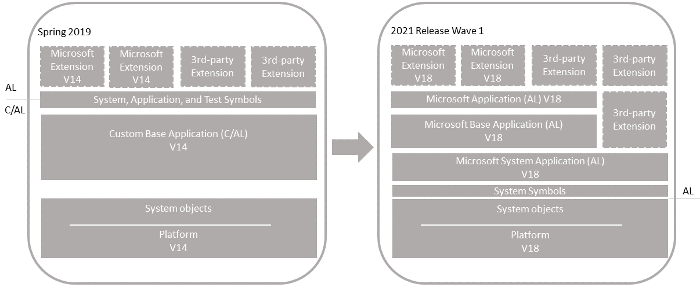
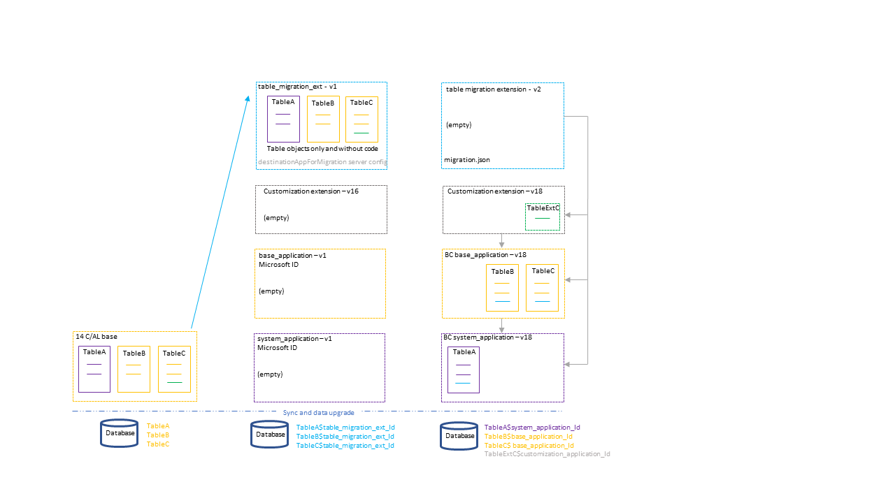

# Upgrading Customized C/AL Application to Microsoft Base Application Version 18

This article describes how to upgrade a customized version 14 application to a version 18 solution that uses the Microsoft Base Application.

  

<!--

#### Single-tenant and multitenant deployments

The process for upgrading the similar for a single-tenant and multitenant deployment. However, there are some inherent differences. With a single-tenant deployment, the application code and business data are in the same database. In a multitenant deployment, application code is in a separate database (the application database) than the business data (tenant). In the procedures that follow, for a single-tenant deployment, consider references to the *application database* and *tenant database* as the same database. Steps are marked as *Single-tenant only* or *Multitenant only* where applicable.
-->

## Overview

The upgrade is divided into two sections: Application Upgrade and Data Upgrade. The Application Upgrade section deals with upgrading the application code. For the application upgrade, you'll have to create several extensions. Some of these extensions are only used for upgrade purposes. The Data Upgrade section deals with upgrading the data on tenants - publishing, syncing, and installing extensions. For this scenario, the data upgrade consists of two phases for migrating data from the current tables to extension-based tables. The following figure illustrates the upgrade process.  

 

The process uses two special features for migrating tables and data to extensions:

- destinationappsformigration server setting

    The *destinationappsformigration* setting is a configuration setting on the [!INCLUDE[server](../developer/includes/server.md)]. In short, it's used to transfer ownership of the existing tables to the table migration extension.  For more information, see [DestinationAppsForMigration](upgrade-destinationappsformigration.md).

- migration.json file

    The *migration.json* file is used to migrate tables and fields from one extension to another. In this case, migration is from the table migration extension to system and base application tables. For more information about the migration.json, see [The Migration.json File](../developer/devenv-migration-json-file.md).

#### Single-tenant and multitenant deployments

The process for upgrading is similar for a single-tenant and multitenant deployment. However, there are some inherent differences. With a single-tenant deployment, the application and business data are included in the same database. While with a multitenant deployment, application code is in a separate database (the application database) than the business data (tenant). In the procedures that follow, for a single-tenant deployment, consider references to the *application database* and *tenant database* as the same database. Steps are marked as *Single-tenant only* or *Multitenant only* where applicable.

## <a name="prereqs"></a>Prerequisites

1. Your version 14 is compatible with version 18.

    There are several updates for version 14. The updates have a compatible version 18 update. For more information, see [[!INCLUDE[prod_long](../developer/includes/prod_long.md)] Upgrade Compatibility Matrix](upgrade-v14-v15-compatibility.md).

2. The version 14 [!INCLUDE[devshell](../developer/includes/devshell.md)] and [!INCLUDE[adminshell](../developer/includes/adminshell.md)] are installed. 

3. Get the required version of the txt2al conversion tool.

    During the upgrade, you'll use the txt2al conversion tool to convert existing tables to the AL syntax. You'll need to use a version of txt2al conversion tool that supports the `--tableDataOnly` parameter. This parameter was first introduced in [version 14.12 (cumulative update 11, platform 14.0.41862)](https://support.microsoft.com/en-us/help/4549684/cumulative-update-12-for-microsoft-dynamics-365-business-central-april). So if you're upgrading from version 14.11 (cumulative update 10) or earlier, you'll have to download the txt2al conversion tool from a later version 14 update. See [Released Cumulative Updates for Microsoft Dynamics 365 Business Central Spring 2019 Update on-premises](https://support.microsoft.com/en-us/help/4501292/released-cumulative-updates-for-microsoft-dynamics-365-business). 

## Task 1: Install version 18

1. Download the latest available update for [!INCLUDE[prod_long](../developer/includes/prod_long.md)] (version 18) that is compatible with your version 14.

    For more information, see [[!INCLUDE[prod_long](../developer/includes/prod_long.md)] Upgrade Compatibility Matrix](upgrade-v14-v15-compatibility.md).

2. Before you install version 18, it can be useful to create desktop shortcuts to the version 14.0 tools, such as the [!INCLUDE[admintool](../developer/includes/admintool.md)], [!INCLUDE[adminshell](../developer/includes/adminshell.md)], and [!INCLUDE[devshell](../developer/includes/devshell.md)] because the Start menu items for these tools will be replaced with the version 18 tools.

3. Install Business Central version 18 components.

    You'll have to keep version 14 installed to complete some steps in the upgrade process. When you install version 18, you must either specify different port numbers for components (like the [!INCLUDE[server](../developer/includes/server.md)] instance and web services) or stop the version 14.0 [!INCLUDE[server](../developer/includes/server.md)] instance before you run the installation. Otherwise, you'll get an error that the [!INCLUDE[server](../developer/includes/server.md)] failed to install.

    For more information, see [Installing Business Central Using Setup](../deployment/install-using-setup.md).

## Task 2: Upgrade permission sets

Version 18 introduces the capability to define permissions sets as AL objects, instead of as data. Permissions sets as AL objects is now the default and recommended model for defining permissions. However for now, you can choose to use the legacy model, where permissions are defined and stored as data in the database. Whichever model you choose, there are permission set-related tasks you'll have to go through before and during upgrade.

For more information, see [Upgrading Permissions Sets and Permissions](upgrade-permissions.md)<!--[Permissions Upgrade Considerations](https://review.docs.microsoft.com/en-us/dynamics365/business-central/dev-itpro/developer/devenv-entitlements-and-permissionsets-overview?branch=permissionset#upgrade-considerations)-->.
## APPLICATION UPGRADE

This section describes how to upgrade the application code. This work involves creating various extensions.

## Task 3: Move code customizations to extensions

The first step, and the largest step, is to create extensions for the customizations compared to the Microsoft base application.

- Create extensions for the target platform **7.0 Business Central 2021 release wave 1**.
- Include dependencies for the Microsoft System, Base, and Application extensions for version 18.0.0.0.

## Task 4: Create table migration extension

In this step, you create an extension that consists only of the non-system table objects from your custom base application. The table objects will only include the properties and field definitions. They won't include AL code on triggers or methods. This extension is an interim extension used only during the upgrade. 

You'll create two versions of this extension. The first version contains the table objects. The second version, is an empty extension that contains a migrate.json file.

### Create the first version

1. Create a folder where you'll store exported txt files for tables (for example, C:\export2al\bc14tablesonly\).

2. Start the [!INCLUDE[devshell](../developer/includes/devshell.md)] for version 14.

3. Run the [Export-NAVApplicationObject cmdlet](/powershell/module/microsoft.dynamics.nav.ide/export-navapplicationobject) to export only tables from the database.

    ```powershell
    Export-NAVApplicationObject -DatabaseServer .\BCDEMO -DatabaseName "Demo Database BC (14-0)" -ExportToNewSyntax -Path "C:\export2al\bc14tablesonly\exportedbc14-tables.txt" -Filter 'Type=Table;Id=1..1999999999'
    ```

4. Use the txt2al conversion tool to convert the exported tables to the AL syntax. Use the `--tableDataOnly` parameter to include table and field definitions only.

    1. Create a folder for storing the AL files for base application objects (for example, C:\export2al\bc14tablesonly\al\).
    2. Start a command prompt as an administrator, and navigate to the folder that contains txt2al.exe file.

        By default, the location is C:\Program Files (x86)\Microsoft Dynamics 365 Business Central\140\RoleTailored Client.
    3. Run the txt2al command:

      ```
      txt2al --source=C:\export2al\bc14tablesonly --target=C:\export2al\bc14tablesonly\al --tableDataOnly
      ```

    For more information about this tool, see [The Txt2Al Conversion Tool](../developer/devenv-txt2al-tool.md).

    > [!NOTE]
    > If the `--tableDataOnly` parameter isn't available, you'll need a later version ot the txt2al conversion tool. See [Prerequisites](#prereqs) for more information.

5. Make sure you have installed the latest AL Extension for Visual Studio Code from the version 18 DVD.

   For more information, see [Getting Started with AL](../developer/devenv-get-started.md).

6. In Visual Studio Code, create an AL project for table migration extension using the **AL: Go!** command.

   Set the target platform to **7.0 Business Central 2021 release wave 1**.
7. If present, delete the HelloWorld.al file.

7. Configure the project's app.json file:

    - Set the `"name"`, `"publisher"`, and `"version"`. You can use any valid values. 
    - Delete the `"application"` parameter.
    - Clear the `"dependencies"`.
    - Set the  `"idRanges"` to cover the table object IDs or clear all values.
    - Add the `"target"` parameter and set it to `"Onprem"`.

    Make a note of the `"id"` setting value, which is the ID assigned to the table migration extension. You'll use this ID later in the process.

    ```json
    {
      "id": "11111111-aaa-2222-bbbb-333333333333",
      "name": "bc14baseapptablesonly",
      "publisher": "My publisher",
      "version": "1.0.0.0",
      "brief": "",
      "description": "",
      "privacyStatement": "",
      "EULA": "",
      "help": "",
      "url": "",
      "logo": "",
      "dependencies": [],
      "screenshots": [],
      "platform": "18.0.0.0",
      "idRanges": [  ],
      "contextSensitiveHelpUrl": "https://bc14baseapptablesonly.com/help/",
      "showMyCode": true,
      "runtime": "7.0",
      "target": "OnPrem"
    }
    ```

8. Create an `.alpackages` folder in the root folder of the project and then copy the version 18 system symbols extension (System.app file) to the folder.

    The System.app file is located where you installed the AL Development Environment. By default, the folder path is C:\Program Files (x86)\Microsoft Dynamics 365 Business Central\180\AL Development Environment. This package contains the symbols for all the system tables and codeunits.

9. Add the AL files for tha tables that you converted earlier to the root folder for the project.

10. Build the extension package for the first version.

    To build the extension package, press Ctrl+Shift+B. This step creates an .app file for your extension. The file name has the format \<publisher\>\_\<name\>\_\<version\>.app.

### Create the second version

1. In Visual Studio Code, create a new file called migration.json file and add it to the project's root folder.
2. In the migration.json, include rules for the Microsoft base application, system application, and your customization extensions.

    ```json
    {
        "apprules": [
            {
                "id": "63ca2fa4-4f03-4f2b-a480-172fef340d3f"
            },
            {
                "id": "437dbf0e-84ff-417a-965d-ed2bb9650972"
            },
            {
                "id": "<NNNNNNNN-NNNN-NNNN-NNNN-NNNNNNNNNNNN>"
            },
            {
                "id": "<NNNNNNNN-NNNN-NNNN-NNNN-NNNNNNNNNNNN>"
            }
        ]
    }
    ```

    In the example code:

    - `63ca2fa4-4f03-4f2b-a480-172fef340d3f` identifies the system application extension
    - `437dbf0e-84ff-417a-965d-ed2bb9650972` identifies the base application extension
    - The two other IDs are examples that identify other new customization extensions you might have. Replace or remove these entries as needed.

    For more information about the migration.json, see [The Migration.json File](../developer/devenv-migration-json-file.md).

3. Delete the AL table object files except for the following tables: 

    |Table|File|Modifications|
    |-----|----|-------------|
    |table 7330 "Bin Content Buffer" |BinContentBuffer.Table.al|Remove `TableRelation =` lines. |
    |table 265 "Document Entry"| DocumentEntry.Table.al||
    |table 338 "Entry Summary" |EntrySummary.Table.al|Remove line `AccessByPermission = TableData "Warehouse Source Filter" = R;`|
    |table 1754 "Field Content Buffer"|FieldContentBuffer.Table.al||
    |table 1670 "Option Lookup Buffer"|OptionLookupBuffer.Table.al ||

    In version 18, these tables have been changed to temporary tables. For now, you'll have to include these objects in the table migration extension; otherwise you'll have problems syncing the extension later.
4. Increase the `version` in the app.json file.
5. Build the extension package for the second version.

    To build the extension package, press Ctrl+Shift+B.

## Task 5: Create empty System, Base, and customization extensions

Create two empty extensions: one for the Microsoft base application and another for the System Application. Also, create an empty extension for each new customization extension. The only file in the extension project that is required is an app.json.

You can create the empty extension like any other extension by adding an AL project in Visual Studio Code:

1. In Visual Studio Code, select **View** > **Command Palette** > **AL: Go!** and follow instructions.
2. Delete the HelloWorld.al sample file from the project.
3. Modify the app.json file.

    The important settings in the app.json file are: `"id"`, `"name"`, `"version"`, `"publisher"`, `"dependencies"`, and `"runtime"`.
    
    - The `id` and `name` must match the value used by Microsoft's extensions.
    - Set the `version` to any version lower than 18.0.0.0, like 14.0.0.0.
    - You'll also have to include the `"publisher"`. You can use your own publisher name or `"Microsoft"`.
    - Remove all other settings. It's important that there are no `"dependencies"` set.
    - Set the `runtime` to `"7.0"`.

    The app.json files for the **System Application** and **Base Application** extensions, should look similar to following examples:
    
    **System Application** 
    
    ```json
      "id": "63ca2fa4-4f03-4f2b-a480-172fef340d3f",
      "name": "System Application",
      "publisher": "Microsoft",
      "version": "14.0.0.0",
      "runtime": "7.0"
    ```
    
    **Base Application**   
    
    ```json
      "id": "437dbf0e-84ff-417a-965d-ed2bb9650972",
      "name": "Base Application",
      "publisher": "Microsoft",
      "version": "14.0.0.0",
      "runtime": "7.0"
    ```

4. Build and compile the extension package. To build the extension package, press Ctrl+Shift+B.

> [!TIP]
> This step is only required if you need to trigger a data upgrade on these extensions, which you'll do by running Start-NavAppDataUpgrade on these extensions in Task 14. For the scenario in this article, at a minimum this step is required for the System and Base Applications. You can skip this step for any customization extensions that do not not include upgrade code.

## DATA UPGRADE

## Task 6: Prepare databases

1. Make backup of the databases.
2. Disable data encryption.

    If the current server instance uses data encryption, disable it. You can enable it again after upgrading.

    For more information, see [Managing Encryption and Encryption Keys](how-to-export-and-import-encryption-keys.md#encryption).

    Instead of disabling encryption, you can export the current encryption key, which you'll then import after upgrade. However, we recommend disabling encryption before upgrading.
3. Start [!INCLUDE[adminshell](../developer/includes/adminshell.md)] for version 14 as an administrator.
4. (Single-tenant only) Uninstall all extensions from the tenants.

    To uninstall an extension, you use the [Uninstall-NAVApp](/powershell/module/microsoft.dynamics.nav.apps.management/uninstall-navapp) cmdlet.  For example, you can uninstall all extensions with a single command:

    ```powershell
    Get-NAVAppInfo -ServerInstance <server instance name> -Tenant <tenant ID>| % { Uninstall-NAVApp -ServerInstance <server instance name> -Tenant <tenant ID> -Name $_.Name -Version $_.Version -Force}
    ``` 

5.  (Single-tenant only) Unpublish all extensions from the application server instance.

    To unpublish an extension, use the [Unpublish-NAVApp cmdlet](/powershell/module/microsoft.dynamics.nav.apps.management/unpublish-navapp). For example, you can unpublish all extensions by using a single command:

    ```powershell
    Get-NAVAppInfo -ServerInstance <BC14 server instance> | % { Unpublish-NAVApp -ServerInstance <BC14 server instance> -Name $_.Name -Version $_.Version }
    ```
6. Unpublish all system, test, and application symbols.

    To unpublish symbols, use the Unpublish-NAVAPP cmdlet with the `-SymbolsOnly` switch.

    ```powershell 
    Get-NAVAppInfo -ServerInstance <BC14 server instance> -SymbolsOnly | % { Unpublish-NAVApp -ServerInstance <BC14 server instance> -Name $_.Name -Version $_.Version }
    ```

    [What are symbols?](upgrade-overview-v15.md#Symbols)  
7. (Multitenant only) Dismount the tenants from the application server instance.

    To dismount a tenant, use the [Dismount-NAVTenant](/powershell/module/microsoft.dynamics.nav.management/dismount-navtenant) cmdlet:

    ```powershell
    Dismount-NAVTenant -ServerInstance <server instance name> -Tenant <tenant ID>
    ```
8. Stop the server instance.

    ```powershell
    Stop-NAVServerInstance -ServerInstance <server instance name>
    ```

## Task 7: Convert version 14 database

This task runs a technical upgrade on the application database. The task converts the database from the version 14 platform to the version 18 platform. The conversion updates the system tables of the database to the new schema (data structure). It provides the latest platform features and performance enhancements.

[!INCLUDE[convert_azure_sql_db](../developer/includes/convert_azure_sql_db.md)]
2. Start [!INCLUDE[adminshell](../developer/includes/adminshell.md)] for version 18 as an administrator.
3. Run the Invoke-NAVApplicationDatabaseConversion cmdlet to start the conversion:

    ```powershell
    Invoke-NAVApplicationDatabaseConversion -DatabaseServer <database server name>\<database server instance> -DatabaseName "<database name>"
    ```
    <!--This adds systemID to system tables, clears the Objects table. -->

    When completed, a message like the following displays in the console:

    ```
    DatabaseServer      : .\BCDEMO
    DatabaseName        : Demo Database BC (14-0)
    DatabaseCredentials :
    DatabaseLocation    :
    Collation           :
    ```

[!INCLUDE[convert_azure_sql_db_timeout](../developer/includes/convert_azure_sql_db_timeout.md)]

## Task 8: Configure version 18 server for DestinationAppsForMigration

In this step, you configure the version 18 server instance. In particular, you configure it to migrate the table migration extension that you created earlier. The migration is controlled by the `DestinationAppsForMigration` setting for the server instance. For more information about the `DestinationAppsForMigration` setting, see [DestinationAppsForMigration](upgrade-destinationappsformigration.md).

1. Set the server instance to connect to the application database.

    ```powershell
    Set-NAVServerConfiguration -ServerInstance <server instance name> -KeyName DatabaseName -KeyValue "<database name>"
    ```

    In a single tenant deployment, this command will mount the tenant automatically. For more information, see [Connecting a Server Instance to a Database](../administration/connect-server-to-database.md).

2. Configure the `DestinationAppsForMigration` setting of the server instance to table migration extension.

    You'll need the ID, name, and publisher for the table migration extension that you created in **Task 2**.

    ```powershell
    Set-NAVServerConfiguration -ServerInstance <server instance name> -KeyName "DestinationAppsForMigration" -KeyValue '[{"appId":"<table migration extension ID>", "name":"<table migration extension>", "publisher": "<publisher>"}]'
    ```

    > [!NOTE]
    > You can add multiple extensions to this setting.

3. Disable task scheduler on the server instance for purposes of upgrade.

    ```powershell
    Set-NavServerConfiguration -ServerInstance <server instance name> -KeyName "EnableTaskScheduler" -KeyValue false
    ```
    Be sure to re-enable task scheduler after upgrade if needed.
4. Restart the server instance.

    ```powershell
    Restart-NAVServerInstance -ServerInstance <server instance name>
    ```

## Task 9: Import License

Import the version 18 partner license. To import the license, use the [Import-NAVServerLicense cmdlet](/powershell/module/microsoft.dynamics.nav.management/import-navserverlicense):

```powershell
Import-NAVServerLicense $-ServerInstance <server instance name> -LicenseFile <path>
```

Restart the server instance.

## Task 10: Publish DestinationAppsForMigrations extensions

In this task, you'll publish the extensions configured as DestinationAppsForMigration.

<!-- no longer required because part of convert
1. Publish version 18 system symbols extension.

    The symbols extension contains the required platform symbols that the base application depends on. The symbols extension package is called **System.app**. You find it where the **AL Development Environment** is installed. The default path is C:\Program Files (x86)\Microsoft Dynamics 365 Business Central\180\AL Development Environment.  

    ```powershell
    Publish-NAVApp -ServerInstance  <server instance name> -Path "<path to system.app>" -PackageType SymbolsOnly
    ```

    [What are symbols?](upgrade-overview-v15.md#Symbols)-->

1. Publish the first version of the table migration extension, which is the version that contains the table objects.

    ```powershell
    Publish-NAVApp -ServerInstance <server instance name> -Path "<path to extension .app file>"
    ```

2. Publish the empty versions of the following extensions:

    - **System Application** extension
    - **Base Application** extension
    - Customization extensions (if any).

    This step publishes the extensions you created in Task 3. Publish the extensions using the Publish-NAVApp, like in the previous steps. Except if the extensions aren't signed, use the `-SkipVerification` switch parameter.

3. Restart the server instance.

    ```powershell
    Restart-NAVServerInstance -ServerInstance <server instance name>
    ```

## Task 11: Synchronize tenant

In this task, you'll synchronize the tenant's database schema with any schema changes in the application database and extensions.

If you have a multitenant deployment, do these steps for each tenant.

1. (Multitenant only) Mount the tenant to the version 18 server instance.

    To mount the tenant, use the [Mount-NAVTenant](/powershell/module/microsoft.dynamics.nav.management/mount-navtenant) cmdlet:

    ```powershell
    Mount-NAVTenant -ServerInstance <server instance name> -DatabaseName <database name> -DatabaseServer <database server>\<database instance> -Tenant <tenant ID> -AllowAppDatabaseWrite
    ```

    > [!IMPORTANT]
    > You must use the same tenant ID for the tenant that was used in the old deployment; otherwise you'll get an error when mounting or syncing the tenant. If you want to use a different ID for the tenant, you can either use the `-AlternateId` parameter now or after upgrading, dismount the tenant, then mount it again using the new ID and the `OverwriteTenantIdInDatabase` parameter.  

    > [!NOTE]  
    > For upgrade, use the `-AllowAppDatabaseWrite` parameter. After upgrade, you can dismount and mount the tenant again without the parameter if needed.

    At this stage, the tenant state is OperationalWithSyncPending.
2. Synchronize the tenant with the application database.

    Use the [Sync-NAVTenant](/powershell/module/microsoft.dynamics.nav.management/sync-navtenant) cmdlet:

    ```powershell  
    Sync-NAVTenant -ServerInstance <server instance name> -Mode Sync -Tenant <tenant ID>
    ```

    With a single-tenant deployment, you can omit the `-Tenant` parameter and value.

3. Synchronize the tenant with the table migration extension. This is the tables only extension you created in task 2.

    Use the [Sync-NAVApp](/powershell/module/microsoft.dynamics.nav.apps.management/sync-navapp) cmdlet:

    ```powershell
    Sync-NAVApp -ServerInstance <server instance name> -Tenant <tenant ID> -Name "<table migration extension>" -Version <extension version>
    ```

    This step creates empty tables in the database for the table objects defined in the table migration extension. When completed, the table migration extension takes ownership of the table. In SQL Server, you'll notice that the table names will be suffixed with the extension ID. At this point, the tenant state is OperationalDataUpgradePending.

    > [!TIP]
    > To verify the tenant state, run [Get-NAVTenant](/powershell/module/microsoft.dynamics.nav.management/get-navtenant) cmdlet with the `-ForceRefresh` switch:
    >
    > `Get-NAVTenant <server instance> -Tenant <default> -ForceRefresh`
4. Synchronize the empty versions of system application, base application, and customization extensions that you published in Task 8.

## Task 12: Install DestinationAppsForMigration and move tables

In this task, you run a data upgrade on tables to handle data changes made by platform and extensions. The step installs the table migration extension. It moves data from the old tables to the new tables owned by the table migration extension.

1. To run the data upgrade, use the [Start-NavDataUpgrade](/powershell/module/microsoft.dynamics.nav.management/start-navdataupgrade) cmdlet:

    ```powershell
    Start-NAVDataUpgrade -ServerInstance <server instance name> -Tenant <tenant ID> -FunctionExecutionMode Serial -SkipAppVersionCheck
    ```
    <!--
        ```powershell
    Start-NAVDataUpgrade -ServerInstance <server instance name> -Tenant <tenant ID> -FunctionExecutionMode Serial -SkipCompanyInitialization [-SkipAppVersionCheck] 
    ```


    You only need to use the -SkipAppVersionCheck if you didn't increase the application version in Task 8. This step will automatically install the table migration extension.    -->

2. To view the progress of the data upgrade, you can run Get-NavDataUpgrade cmdlet with the `–Progress` switch.

    When completed, the table migration extension will be installed.

3. Install the empty versions of the system, base, and custom extensions that you published in Task 8.

    To install the extension, you use the [Install-NAVApp cmdlet](/powershell/module/microsoft.dynamics.nav.apps.management/install-navapp). 

    ```powershell
    Install-NAVApp -ServerInstance <server instance name> -Name "<name>" -Version <extension version>
    ```

4. (Multitenant only) Repeat steps 1 and 2 for each tenant.

## Task 13: Publish final extensions

This step starts the second phase of the data upgrade. You'll publish the second version of the table migration extension and the production versions of extensions. The production extensions include the new versions of Microsoft System Application, Base Application extension, and customization extensions. The extension packages for Microsoft extensions are on the installation media (DVD). Customization extensions include the extension versions that you created in Task 1, not the empty versions.

Publish extensions using the Publish-NAVApp cmdlet like you did in previous steps.

```powershell
Publish-NAVApp -ServerInstance <server instance name> -Path "<path to extension .app file>"
```

Publish the extensions in the following order:

1. Second version of the table migration extension, which is the empty version with the migration.json file.
2. Microsoft System Application

    Publish the Microsoft_System Application.app extension package file that is in the **Applications\System Application\Source** folder of installation media (DVD).  
3. Microsoft Base Application

    Publish the Microsoft_Base Application.app extension package file that is in the **Applications\BaseApp\Source** folder of installation media (DVD).

    > [!NOTE]
    > The other .app files in this folder, like Microsoft_Danish language (Denmark).app, are extensions that add translations for a specific language. By publishing and installing these extensions, you add the capability of showing the base application in another language. These extensions aren't required to complete the upgrade and can be published and installed later.

4. Customization extensions.
5. Application extension.
6. Microsoft and third-party extensions.

    The Microsoft extensions are in the **Applications** folder of installation media (DVD).

<!-- At this point, you'll see duplicate tables in SQL Server for the each table defiend in the tables-only extension. The duplicate tables will be owned by the system and base apps-->

## Task 14: Synchronize final extensions

Synchronize the newly published extensions using the Sync-NAVApp cmdlet like you did in previous steps.

```powershell
Sync-NAVApp -ServerInstance <server instance name> -Tenant <tenant ID> -Name "<extension name>" -Version <extension version>
```

Synchronize the extensions in the following order:

1. Microsoft System Application
2. Microsoft Base Application
3. Microsoft Application
4. Microsoft and third-party extensions
5. Customization extensions
6. Second version of the table migration extension (empty version)

> [!IMPORTANT]
> Synchronize extensions in the order of dependencies. The migration extension must be synchronized last. This step will change table ownership to the system and base application.

<!-- At this point, you'll see duplicate tables in SQL Server for the each table defiend in the tables-only extension. The duplicate tables will be owned by the system and base apps. But the tables are empty -->
<!-- Error when temp tables not included 
Sync-NAVApp : Table Document Entry :: The table 'Document Entry' cannot be located. Removing tables is not allowed unless they are temporary or are being moved by migration to another app.
Table Entry Summary :: The table 'Entry Summary' cannot be located. Removing tables is not allowed unless they are temporary or are being moved by migration to another app.
Table Option Lookup Buffer :: The table 'Option Lookup Buffer' cannot be located. Removing tables is not allowed unless they are temporary or are being moved by migration to another app.
Table Field Content Buffer :: The table 'Field Content Buffer' cannot be located. Removing tables is not allowed unless they are temporary or are being moved by migration to another app.
Table Bin Content Buffer :: The table 'Bin Content Buffer' cannot be located. Removing tables is not allowed unless they are temporary or are being moved by migration to another app.
At line:1 char:1
+ Sync-NAVApp -ServerInstance $NewInstanceName -Name $TableMigrationExt ...
+ ~~~~~~~~~~~~~~~~~~~~~~~~~~~~~~~~~~~~~~~~~~~~~~~~~~~~~~~~~~~~~~~~~~~~~
    + CategoryInfo          : InvalidOperation: (:) [Sync-NAVApp], InvalidOperationException
    + FullyQualifiedErrorId : MicrosoftDynamicsNavServer$BC180/nav-systemapplication,Microsoft.Dynamics.Nav.Apps.Management.Cmdlets.SyncNavApp
-->

## Task 15: Upgrade empty table migration extension

Run data upgrade on the table migration extension (empty version) by using the [Start-NAVAppDataUpgrade](/powershell/module/microsoft.dynamics.nav.apps.management/start-navappdataupgrade) cmdlet. For example:

```powershell
Start-NAVAppDataUpgrade -ServerInstance <server instance> -Name "<table migration extension>" -version <version 2>
```

## Task 16: Clean sync and unpublish table migration extensions

This step removes the temporary tables included in this table migration extensions from the database, and unpublishes both versions of the extension. This step is done to avoid duplicate-object conflicts when upgrading the System and Base applications in the next task. 

1. Uninstall the second version of the table migration extension.

   ```powershell
   Uninstall-NAVApp -ServerInstance <server instance name> -Tenant <tenant ID> -Name "<table migration extension>" -Version <extension version>
   ```

2. Synchronize the extension by using the clean mode:

   ```powershell
   Sync-NAVApp -ServerInstance <server instance name> -Tenant <tenant ID> -Name "<table migration extension>" -Version <extension version> -Mode clean
   ```

3. Unpublish the two versions of the table migration extension.

For more information, see [Unpublishing and Uninstalling Extensions](../developer/devenv-unpublish-and-uninstall-extension-v2.md).

<!-- Error during upgrade when the table migration versions haven't been unpublsihed.
PS C:\Windows\system32> Start-NAVAppDataUpgrade -ServerInstance $NewInstanceName -Name "System Application" -version $Version -Force
WARNING: This license is not compatible with this version of Business Central.
WARNING: This license is not compatible with this version of Business Central.
Start-NAVAppDataUpgrade : The application object of type 'Table' with the ID '1754' is defined in multiple apps. The apps are: System Application by Microsoft 18.0.23223.0; bc14baseapptablesonly by My publisher 1.0.0.5.
At line:1 char:1
+ Start-NAVAppDataUpgrade -ServerInstance $NewInstanceName -Name "Syste ...
+ ~~~~~~~~~~~~~~~~~~~~~~~~~~~~~~~~~~~~~~~~~~~~~~~~~~~~~~~~~~~~~~~~~~~~~
    + CategoryInfo          : InvalidOperation: (:) [Start-NAVAppDataUpgrade], InvalidOperationException
    + FullyQualifiedErrorId : MicrosoftDynamicsNavServer$BC180/default,Microsoft.Dynamics.Nav.Apps.Management.Cmdlets.StartNavAppDataUpgrade
 
-->

## Task 17: Upgrade and install final extensions

The final step is to upgrade to the new extension versions in the following order. Use the Start-NAVAppDataUpgrade or Install-NAVApp cmdlets like you did in the previous task.

Run the data upgrade on the extensions in the following order:

1. Upgrade the Microsoft System Application extension.
2. Upgrade the Microsoft Base Application extension.
3. Install the Microsoft Application extension
4. Upgrade customization extensions, Microsoft, and third-party extensions.

   For customization extensions, only do this task for those extensions that have an empty version currently installed on the tenant (see **Task 11**). If you have a customization extension for which you didn't create and publish an empty version, complete the next task to install these extensions.

<!-- Error when UsePermissionsFromExtensions false
PS C:\Windows\system32> Start-NAVAppDataUpgrade -ServerInstance $NewInstanceName -Name "Base Application" -version $Version -Force
WARNING: This license is not compatible with this version of Business Central.
WARNING: This license is not compatible with this version of Business Central.
Start-NAVAppDataUpgrade : Could not upgrade the extension 'Base Application' by 'Microsoft' from version '14.0.0.0' to '18.0.23223.0' for tenant 'default' and company '' due to the following error: 'The following SQL error occurred after the SQL command was canceled:
Invalid column name '$systemCreatedAt'.
Invalid column name '$systemCreatedBy'.
Invalid column name '$systemModifiedAt'.
Invalid column name '$systemModifiedBy'.
Statement(s) could not be prepared.
' and AL stack trace: 
"Upgrade Plan Permissions"(CodeUnit 104030).TryInsertPermissionSet line 10 - Base Application by Microsoft
"Upgrade Plan Permissions"(CodeUnit 104030).AddBackupRestorePermissionSet line 5 - Base Application by Microsoft
"Upgrade Plan Permissions"(CodeUnit 104030).SetBackupRestorePermissions line 8 - Base Application by Microsoft
"Upgrade Plan Permissions"(CodeUnit 104030).OnUpgradePerDatabase line 2 - Base Application by Microsoft
"Upgrade Triggers"(CodeUnit 2000000008).OnUpgradePerDatabase line 2
At line:1 char:1
+ Start-NAVAppDataUpgrade -ServerInstance $NewInstanceName -Name "Base  ...
+ ~~~~~~~~~~~~~~~~~~~~~~~~~~~~~~~~~~~~~~~~~~~~~~~~~~~~~~~~~~~~~~~~~~~~~
    + CategoryInfo          : InvalidOperation: (:) [Start-NAVAppDataUpgrade], InvalidOperationException
    + FullyQualifiedErrorId : MicrosoftDynamicsNavServer$BC180/default,Microsoft.Dynamics.Nav.Apps.Management.Cmdlets.StartNavAppDataUpgrade
 
-->
## Task 18: Install remaining customization extensions

Complete this task for customizations extension that you created in Task 1, but create and publish an empty version first.

To install each extension, run the [Install-NAVApp cmdlet](/powershell/module/microsoft.dynamics.nav.apps.management/install-navapp): 

```powershell
Install-NAVApp -ServerInstance <server instance name> -Name "<name>" -Version <extension version>
```

## Task 19: Upgrade control add-ins

The [!INCLUDE[server](../developer/includes/server.md)] installation includes new versions of the Microsoft-provided Javascript-based control add-ins that must be upgraded.

- Microsoft.Dynamics.Nav.Client.BusinessChart
- Microsoft.Dynamics.Nav.Client.FlowIntegration
- Microsoft.Dynamics.Nav.Client.OAuthIntegration
- Microsoft.Dynamics.Nav.Client.PageReady
- Microsoft.Dynamics.Nav.Client.PowerBIManagement
- Microsoft.Dynamics.Nav.Client.RoleCenterSelector
- Microsoft.Dynamics.Nav.Client.SocialListening
- Microsoft.Dynamics.Nav.Client.SatisficationSurvey
- Microsoft.Dynamics.Nav.Client.TimelineVisualization
- Microsoft.Dynamics.Nav.Client.VideoPlayer
- Microsoft.Dynamics.Nav.Client.WebPageViewer
- Microsoft.Dynamics.Nav.Client.WelcomeWizard

To upgrade the control add-ins from the client, do the following steps:

1. Open the [!INCLUDE[](../developer/includes/prod_short.md)] client.
2. Search for and open the **Control Add-ins** page.
3. Choose **Actions** > **Control Add-in Resource** > **Import**.
4. Locate and select the .zip file for the control add-in and choose **Open**.

    The .zip files are located in the **Add-ins** folder of the [!INCLUDE[server](../developer/includes/server.md)] installation. There's a subfolder for each add-in. For example, the path to the Business Chart control add-in is `C:\Program Files\Microsoft Dynamics 365 Business Central\180\Service\Add-ins\BusinessChart\Microsoft.Dynamics.Nav.Client.BusinessChart.zip`.
5. After you've imported all the new control add-in versions, restart Business Central Server instance.

Alternatively, you can use the [Set-NAVAddin cmdlet](/powershell/module/microsoft.dynamics.nav.management/set-navaddin) of the [!INCLUDE[adminshell](../developer/includes/adminshell.md)]. For example, the following commands update the control add-ins installed by default. Modify the commands to suit:

```powershell
$InstanceName = 'BC180'
$ServicesAddinsFolder = 'C:\Program Files\Microsoft Dynamics 365 Business Central\180\Service\Add-ins'
Set-NAVAddIn -ServerInstance $InstanceName -AddinName 'Microsoft.Dynamics.Nav.Client.BusinessChart' -PublicKeyToken 31bf3856ad364e35 -ResourceFile ($AppName = Join-Path $ServicesAddinsFolder 'BusinessChart\Microsoft.Dynamics.Nav.Client.BusinessChart.zip')
Set-NAVAddIn -ServerInstance $InstanceName -AddinName 'Microsoft.Dynamics.Nav.Client.FlowIntegration' -PublicKeyToken 31bf3856ad364e35 -ResourceFile ($AppName = Join-Path $ServicesAddinsFolder 'FlowIntegration\Microsoft.Dynamics.Nav.Client.FlowIntegration.zip')
Set-NAVAddIn -ServerInstance $InstanceName -AddinName 'Microsoft.Dynamics.Nav.Client.OAuthIntegration' -PublicKeyToken 31bf3856ad364e35 -ResourceFile ($AppName = Join-Path $ServicesAddinsFolder 'OAuthIntegration\Microsoft.Dynamics.Nav.Client.OAuthIntegration.zip')
Set-NAVAddIn -ServerInstance $InstanceName -AddinName 'Microsoft.Dynamics.Nav.Client.PageReady' -PublicKeyToken 31bf3856ad364e35 -ResourceFile ($AppName = Join-Path $ServicesAddinsFolder 'PageReady\Microsoft.Dynamics.Nav.Client.PageReady.zip')
Set-NAVAddIn -ServerInstance $InstanceName -AddinName 'Microsoft.Dynamics.Nav.Client.PowerBIManagement' -PublicKeyToken 31bf3856ad364e35 -ResourceFile ($AppName = Join-Path $ServicesAddinsFolder 'PowerBIManagement\Microsoft.Dynamics.Nav.Client.PowerBIManagement.zip')
Set-NAVAddIn -ServerInstance $InstanceName -AddinName 'Microsoft.Dynamics.Nav.Client.RoleCenterSelector' -PublicKeyToken 31bf3856ad364e35 -ResourceFile ($AppName = Join-Path $ServicesAddinsFolder 'RoleCenterSelector\Microsoft.Dynamics.Nav.Client.RoleCenterSelector.zip')
Set-NAVAddIn -ServerInstance $InstanceName -AddinName 'Microsoft.Dynamics.Nav.Client.SatisfactionSurvey' -PublicKeyToken 31bf3856ad364e35 -ResourceFile ($AppName = Join-Path $ServicesAddinsFolder 'SatisfactionSurvey\Microsoft.Dynamics.Nav.Client.SatisfactionSurvey.zip')
Set-NAVAddIn -ServerInstance $InstanceName -AddinName 'Microsoft.Dynamics.Nav.Client.SocialListening' -PublicKeyToken 31bf3856ad364e35 -ResourceFile ($AppName = Join-Path $ServicesAddinsFolder 'SocialListening\Microsoft.Dynamics.Nav.Client.SocialListening.zip')
Set-NAVAddIn -ServerInstance $InstanceName -AddinName 'Microsoft.Dynamics.Nav.Client.VideoPlayer' -PublicKeyToken 31bf3856ad364e35 -ResourceFile ($AppName = Join-Path $ServicesAddinsFolder 'VideoPlayer\Microsoft.Dynamics.Nav.Client.VideoPlayer.zip')
Set-NAVAddIn -ServerInstance $InstanceName -AddinName 'Microsoft.Dynamics.Nav.Client.WebPageViewer' -PublicKeyToken 31bf3856ad364e35 -ResourceFile ($AppName = Join-Path $ServicesAddinsFolder 'WebPageViewer\Microsoft.Dynamics.Nav.Client.WebPageViewer.zip')
Set-NAVAddIn -ServerInstance $InstanceName -AddinName 'Microsoft.Dynamics.Nav.Client.WelcomeWizard' -PublicKeyToken 31bf3856ad364e35 -ResourceFile ($AppName = Join-Path $ServicesAddinsFolder 'WelcomeWizard\Microsoft.Dynamics.Nav.Client.WelcomeWizard.zip')
```

## Task 20: Install upgraded permissions sets

In this task, you install the custom permission sets that you upgraded earlier in this procedure. The steps depend on whether you've decided to use permission sets as AL objects or as data.

### For permission sets as AL objects

1. Publish the extension or extensions that include the permission sets.
2. Sync the extensions with the tenant.
3. Install the extensions on the tenant.

### For permission sets as data in XML

1. Set the `UserPermissionSetsFromExtensions` setting of the [!INCLUDE[server](../developer/includes/server.md)] instance to `false`.

    ```powershell
    Set-NavServerConfiguration -ServerInstance <BC18 server instance> -KeyName "UsePermissionSetsFromExtensions" -KeyValue false
    ```

2. Restart the serve instance.
3. Open the [!INCLUDE[webclient](../developer/includes/webclient.md)].
4. Search for and open the **Permission Sets** page.
5. Select **Import Permission Sets**, and follow the instructions to import the XML file.

For more information, see [To export and import a permission set](/dynamics365/business-central/ui-define-granular-permissions#to-export-and-import-a-permission-set).


## Task 21: Change application version

This task serves two purposes. It ensures that personalization works as expected after upgrade. It's also useful for support purposes and answering a common question about the application version.  

On the **Help and Support** page in the client, you'll see an application version, such as 14.0.2345.6. For an explanation of the number, see [Version numbers in Business Central](../administration/version-numbers.md). This version isn't updated automatically when you install an update. If you want the version to reflect the version of the update or your own version, you change it manually.

We recommend setting the value to application build number for the version 18 update. You get the number from the [Released Updates for Microsoft Dynamics 365 Business Central 2021 Release Wave 1 on-premises](https://support.microsoft.com/help/4528706).

1. Run the [Set-NAVApplication cmdlet](/powershell/module/microsoft.dynamics.nav.management/set-navapplication):

   ```powershell
   Set-NAVApplication -ServerInstance <server instance name> -ApplicationVersion <new application version> -Force
   ```

   For example:

   ```powershell
   Set-NAVApplication -ServerInstance BC180 -ApplicationVersion 18.0.38071.0 -Force
   ```

2. Run the [Sync-NAVTenant](/powershell/module/microsoft.dynamics.nav.management/sync-navtenant) cmdlet to synchronize the tenant with the application database.

   ```powershell  
   Sync-NAVTenant -ServerInstance <server instance name> -Mode Sync -Tenant <tenant ID>
   ```

   With a single-tenant deployment, you can omit the `-Tenant` parameter and value.

3. Run the [Start-NavDataUpgrade](/powershell/module/microsoft.dynamics.nav.management/start-navdataupgrade) cmdlet to change the version number:

   ```powershell
   Start-NAVDataUpgrade -ServerInstance <server instance name> -FunctionExecutionMode Serial -Tenant <tenant ID>
   ```

## Post-upgrade tasks

1. Uninstall the table migration extension.
2. Enable task scheduler on the server instance.
3. (Multitenant only) For tenants other than the tenant that you use for administration purposes, if you mounted the tenants using the `-AllowAppDatabaseWrite` parameter, dismount the tenants, then mount them again without using the `-AllowAppDatabaseWrite` parameter.
4. If you want to use data encryption as before, enable it.

   For more information, see [Managing Encryption and Encryption Keys](how-to-export-and-import-encryption-keys.md#encryption).

   Optionally, if you exported the encryption key instead of disabling encryption earlier, import the encryption key file to enable encryption.

5. Grant users permission to the *Open in Excel* and *Edit in Excel* actions.

    Version 18 introduces a system permission that protects these two actions. The permission is granted by the system object **6110 Allow Action Export To Excel**. Because of this change, users who had permission to these actions before upgrading, will lose permission. To grant permission again, do one of the following steps:
    
    - Assign the **EXCEL EXPORT ACTION** permission set to appropriate users. 
    
    - Add the system object **6110 Allow Action Export To Excel** permission directly to appropriate permission sets.

     For more information about working with permission sets and permissions, see [Export and Import Permission Sets](/dynamics365/business-central/ui-define-granular-permissions#to-export-and-import-a-permission-set). 

## See Also  

[Publishing and Installing an Extension](../developer/devenv-how-publish-and-install-an-extension-v2.md)  
[Upgrading to Business Central](upgrading-to-business-central.md)  
[Signing an APP Package File](../developer/devenv-sign-extension.md)  
