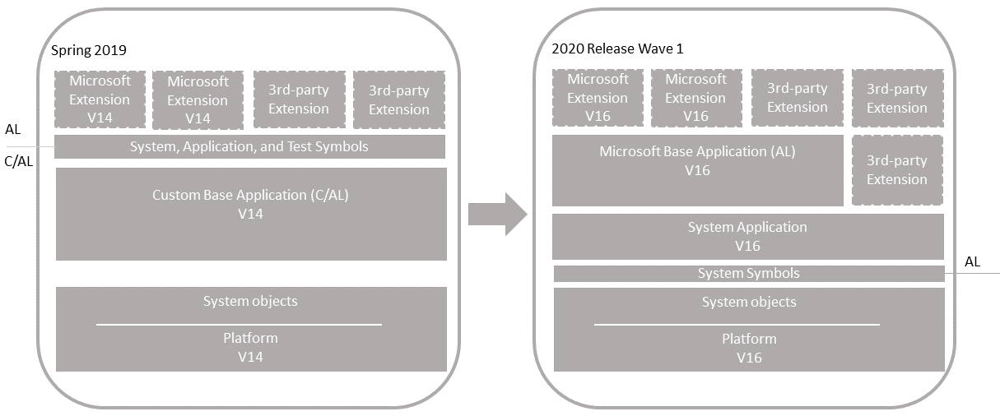
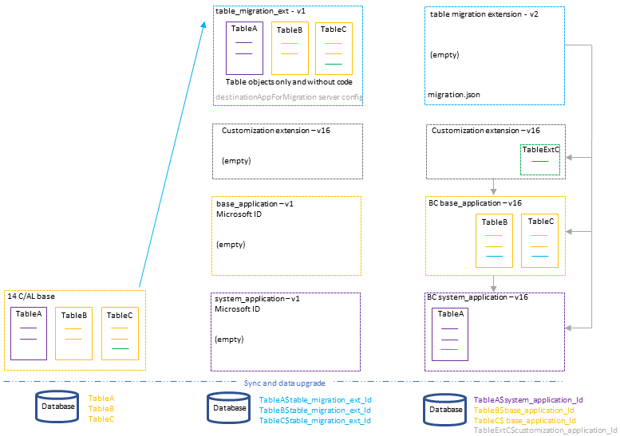

# Upgrading Customized C/AL Application to Microsoft Base Application


This article describes how to upgrade a customized version 14 application to a version 16 solution that uses the Microsoft Base Application.


  

<!--

#### Single-tenant and multitenant deployments

The process for upgrading the similar for a single-tenant and multitenant deployment. However, there are some inherent differences. With a single-tenant deployment, the application code and business data are in the same database. In a multitenant deployment, application code is in a separate database (the application database) than the business data (tenant). In the procedures that follow, for a single-tenant deployment, consider references to the *application database* and *tenant database* as the same database. Steps are marked as *Single-tenant only* or *Multitenant only* where applicable.
-->
## Overview

The upgrade is divided into two sections: Application Upgrade and Data Upgrade. The Application Upgrade section deals with upgrading the application code. For the application upgrade, you'll have to create several extensions. Some of these extensions are only used for upgrade purposes. The Data Upgrade section deals with upgrading the data on tenants - publishing, syncing, and installing extensions. For this scenario, the data upgrade consists of two phases for migrating data from the current tables to extension-based tables. The following figure illustrates the upgrade process.  

 

The process uses two special features for migrating tables and data to extensions:

- destinationappsformigration server setting

    The *destinationappsformigration* setting is a configuration setting on the [!INCLUDE[server](../developer/includes/server.md)]. In short, it's used to transfer ownership of the existing tables to the table migration extension.  For more information, see [DestinationAppsForMigration](upgrade-destinationappsformigration.md).

- migration.json file

    The *migration.json* file is used to migrate tables and fields from one extension to another. In this case, migration is from the table migration extension to system and base application tables. For more information about the migration.json, see [The Migration.json File](../developer/devenv-migration-json-file.md).

#### Single-tenant and multitenant deployments

The process for upgrading is similar for a single-tenant and multitenant deployment. However, there are some inherent differences. With a single-tenant deployment, the application and business data are included in the same database. While with a multitenant deployment, application code is in a separate database (the application database) than the business data (tenant). In the procedures that follow, for a single-tenant deployment, consider references to the *application database* and *tenant database* as the same database. Steps are marked as *Single-tenant only* or *Multitenant only* where applicable.

## Prerequisites

1. Your version 14 is compatible with version 16.

    There are several updates for version 14. The updates have a compatible version 16 update. For more information, see [[!INCLUDE[prodlong](../developer/includes/prodlong.md)] Upgrade Compatibility Matrix](upgrade-v14-v15-compatibility.md). For example, if your solution is currently running 14.XXXXXX, you can't upgrade to 16.0. You must wait until 16.1 is available.  


## Install version 16

1. Download the latest available update for Business Central 2020 (version 16) that is compatible with your version 14.

    For more information, see [[!INCLUDE[prodlong](../developer/includes/prodlong.md)] Upgrade Compatibility Matrix](upgrade-v14-v15-compatibility.md).

2. Before you install version 16, it can be useful to create desktop shortcuts to the version 14.0 tools, such as the [!INCLUDE[admintool](../developer/includes/admintool.md)], [!INCLUDE[adminshell](../developer/includes/adminshell.md)], and [!INCLUDE[devshell](../developer/includes/devshell.md)] because the Start menu items for these tools will be replaced with the version 16 tools.

3. Install Business Central version 16 components.

    If you don't uninstall version 14, then you must either specify different port numbers for components (like the [!INCLUDE[server](../developer/includes/server.md)] instance and web services) during installation, or you must stop the version 14.0 [!INCLUDE[server](../developer/includes/server.md)] instance before you run the installation. Otherwise, you'll get an error that the [!INCLUDE[server](../developer/includes/server.md)] failed to install.

    For more information, see [Installing Business Central Using Setup](../deployment/install-using-setup.md).

## APPLICATION UPGRADE

This section describes how to upgrade the application code. This work involves creating various extensions.

## Task 1: Move code customizations to extensions

The first step, and the largest step, is to create extensions for the customizations compared to the Microsoft base application.

## Task 2: Create table migration extension

In this step, you create an extension that consists only of the non-system table objects from your custom base application. The table objects will only include the properties and field definitions. They won't include AL code on triggers or methods. This extension is an interim extension used only during the upgrade. 

You'll create two versions of this extension. The first version contains the table objects. The second version, is an empty extension that contains a migrate.json file.

### Create the first version

1. Start the [!INCLUDE[devshell](../developer/includes/devshell.md)] and run [Export-NAVApplicationObject cmdlet](/powershell/module/microsoft.dynamics.nav.ide/export-navapplicationobject) to export only tables from the database.

    ```powershell
    Export-NAVApplicationObject -DatabaseServer .\BCDEMO -DatabaseName "Demo Database BC (14-0)" -ExportToNewSyntax -Path "C:\export2al\bc14tablesonly\exportedbc14-tables.txt" -Filter 'Type=Table;Id=1..1999999999'
    ```

2. Use the txt2al conversion tool to convert the exported tables to the AL syntax. Use the `--tableDataOnly` parameter to include  table and field definitions only.

    ```
    txt2al --source=C:\export2al\bc14tablesonly --target=C:\export2al\bc14tablesonly\al --tableDataOnly
    ```

    For more information about this tool, see [The Txt2Al Conversion Tool](../developer/devenv-txt2al-tool.md).

3. In Visual Studio Code, create an AL project for table migration extension using the al:go command.

    Set the target platform to **5.0 Business Central 2020 release wave 1**.

   For more information, see [Getting Started with AL](../developer/devenv-get-started.md).

4. Configure the project's app.json file:
    
    - Set the `"name"`, `"publisher"`, and `"version"`. You can use any valid name. 
    - Set the `"target"` to `"Onprem"`.
    - Set the  `"idRanges"` to cover the table object IDs.
    - Clear the `"dependencies"`.

5. Create an `.alpackages` folder in the root folder of the project and then copy the system (platform) symbols extension (System.app file) to the folder.

    The System.app file is located where you installed the AL Development Environment. By default, the folder path is C:\Program Files (x86)\Microsoft Dynamics 365 Business Central\160\AL Development Environment. This package contains the symbols for all the system tables and codeunits.

6. Add the AL files that you converted tables to the project.

7. Build the extension package for the first version.

### Create the second version

1. Create a migration.json file and add it to the project's root folder.
2. In the migration.json, include rules for the Microsoft base application, system application, and your customization extensions.

    ```json
    {
        "apprules": [
            {
                "id": "63ca2fa4-4f03-4f2b-a480-172fef340d3f"
            },
            {
                "id": "437dbf0e-84ff-417a-965d-ed2bb9650972"
            },
            {
                "id": "72616078-0a6a-4ccf-90af-339d0d1eea0d"
            },
            {
                "id": "5f7ac7ac-4f75-4c80-8dc8-c527608e7e5d"
            }
        ]
    }
    ```

    In the example code:

    - `63ca2fa4-4f03-4f2b-a480-172fef340d3f` identifies the system application extension
    - `437dbf0e-84ff-417a-965d-ed2bb9650972` identifies the base application extension
    - The two other IDs are examples that identify other customization extensions you might have. Replace or remove these as needed.

    For more information about the migration.json, see [The Migration.json File](../developer/devenv-migration-json-file.md).

3. Delete the AL objects.
4. Increase the `version` in the app.json file.
5. Build the extension package for the second version.

## Task 3: Create empty extensions System, Base, and customization extensions

Create two empty extensions: one for the Microsoft base application and another for the System Application. The only file in the extension project that is required is an app.json. You can create the extension like any other extension by adding an AL project in Visual Studio Code. Also, create an empty extension for each new customization extension.

After you create the project, modify the app.json file. The important settings in the app.json file `id`, `name`, and `version`. The `id` and `name` must match the value used by Microsoft's extensions. Set the `version` to any version lower than 16.0.0.0. For example:

**System Application** 

```json
  "id": "63ca2fa4-4f03-4f2b-a480-172fef340d3f",
  "name": "System Application",
  "version": "14.0.0.0",
```

**Base Application**   

```json
  "id": "437dbf0e-84ff-417a-965d-ed2bb9650972",
  "name": "Base Application",
  "version": "14.0.0.0",
```

Build and compile the extension package.


> [!TIP]
> This step is only required if to trigger a data upgrade on these extensions when you run Start-NavAppDataUpgrade on these extensions later. Running the data upgrade will automatically install them. You can skip this step, then manually run Install-NavApp instead.

## DATA UPGRADE

## Task 4: Prepare databases

1. Make backup of the databases.
2. Disable data encryption.

    If the current server instance uses data encryption, disable it. You can enable it again after upgrading.

    For more information, see [Managing Encryption and Encryption Keys](how-to-export-and-import-encryption-keys.md#encryption).

    Instead of disabling encryption, you can export the current encryption key, which you'll then import after upgrade. However, we recommend disabling encryption before upgrading.
3. Start [!INCLUDE[adminshell](../developer/includes/adminshell.md)] for version 14 as an administrator.
4. (Single-tenant only) Uninstall all extensions from the tenants.

    To uninstall an extension, you use the [Uninstall-NAVApp](/powershell/module/microsoft.dynamics.nav.apps.management/uninstall-navapp) cmdlet.  For example, you can uninstall all extensions with a single command:

    ```powershell
    Get-NAVAppInfo -ServerInstance <server instance name> -Tenant <tenant ID>| % { Uninstall-NAVApp -ServerInstance <server instance name> -Tenant <tenant ID> -Name $_.Name -Version $_.Version -Force}
    ``` 

5.  (Single-tenant only) Unpublish all extensions from the application server instance.

    To unpublish an extension, use the [Unpublish-NAVApp cmdlet](/powershell/module/microsoft.dynamics.nav.apps.management/unpublish-navapp). For example, you can unpublish all extensions by using a single command:

    ```powershell
    Get-NAVAppInfo -ServerInstance <BC14 server instance> | % { Unpublish-NAVApp -ServerInstance <BC14 server instance> -Name $_.Name -Version $_.Version }
    ```
6. Unpublish all system, test, and application symbols.

    To unpublish symbols, use the Unpublish-NAVAPP cmdlet with the `-SymbolsOnly` switch.

    ```powershell 
    Get-NAVAppInfo -ServerInstance <BC14 server instance> -SymbolsOnly | % { Unpublish-NAVApp -ServerInstance <BC14 server instance> -Name $_.Name -Version $_.Version }
    ```

    [What are symbols?](upgrade-overview-v15.md#Symbols)  
7. (Multitenant only) Dismount the tenants from the application server instance.

    To dismount a tenant, use the [Dismount-NAVTenant](/powershell/module/microsoft.dynamics.nav.management/dismount-navtenant) cmdlet:

    ```powershell
    Dismount-NAVTenant -ServerInstance <server instance name> -Tenant <tenant ID>
    ```
8. Stop the server instance.

    ```powershell
    Stop-NAVServerInstance -ServerInstance <server instance name>
    ```

## Task 5: Convert version 14 database

This task runs a technical upgrade on the application database. The task converts the database from the version 14 platform to the version 16 platform. The conversion updates the system tables of the database to the new schema (data structure). It provides the latest platform features and performance enhancements.

1. Start [!INCLUDE[adminshell](../developer/includes/adminshell.md)] for version 16 as an administrator.
2. Run the Invoke-NAVApplicationDatabaseConversion cmdlet to start the conversion:

    ```powershell
    Invoke-NAVApplicationDatabaseConversion -DatabaseServer <database server name>\<database server instance> -DatabaseName "<database name>"
    ```
    <!--This adds systemID to system tables, clears the Objects table. -->

    When completed, a message like the following displays in the console:

    ```
    DatabaseServer      : .\BCDEMO
    DatabaseName        : Demo Database BC (14-0)
    DatabaseCredentials :
    DatabaseLocation    :
    Collation           :
    ```

## Task 6: Configure version 16 server for DestinationAppsForMigration

In this step, you configure the version 16 server instance. In particular, you configure it to migrate the table migration extension that you created earlier. The migration is controlled by the `DestinationAppsForMigration` setting for the server instance. For more information about the `DestinationAppsForMigration` setting, see [DestinationAppsForMigration](upgrade-destinationappsformigration.md).

1. Set the server instance to connect to the application database.

    ```powershell
    Set-NAVServerConfiguration -ServerInstance <server instance name> -KeyName DatabaseName -KeyValue "<database name>"
    ```
    In a single tenant deployment, this command will mount the tenant automatically. For more information, see [Connecting a Server Instance to a Database](../administration/connect-server-to-database.md).

2. Configure the `DestinationAppsForMigration` setting of the server instance to table migration extension.

    You'll need the ID, name, and publisher for the extension

    ```powershell
    Set-NAVServerConfiguration -ServerInstance <server instance name> -KeyName "DestinationAppsForMigration" -KeyValue '[{"appId":"63ca2fa4-4f03-4f2b-a480-172fef340d3f", "name":"<table migration extension>", "publisher": "<publisher>"}]'
    ```

    > [!NOTE]
    > You can add multiple extensions to this setting.
2. Disable task scheduler on the server instance for purposes of upgrade.

    ```powershell
    Set-NavServerConfiguration -ServerInstance <server instance name> -KeyName "EnableTaskScheduler" -KeyValue false
    ```
    Be sure to re-enable task scheduler after upgrade if needed.
3. Restart the server instance.

    ```powershell
    Restart-NAVServerInstance -ServerInstance <server instance name>
    ```

## Task 7: Import License

Import the version 16 partner license. To import the license, use the [Import-NAVServerLicense cmdlet](/powershell/module/microsoft.dynamics.nav.management/import-navserverlicense):

```powershell
Import-NAVServerLicense $-ServerInstance <server instance name> -LicenseFile <path>
```

Restart the server instance.

## Task 8: Increase application version

This task is optional, but it's recommended. You can choose to skip it for now and do it later. In this task, you'll increase the application_version that's stored in $ndo$dbproperty table of the application database. The application version isn't changed automatically.

<!--
 The application version serves two purposes:

- Enables running the Start-NAVDataUpgrade cmdlet later. The application version is compared with the tenant's version. If the application version is greater, a data upgrade can be run. If you skip this task, you'll have to use the `-SkipAppVersionCheck` switch with Start-NAVDataUpgrade cmdlet in Task 8. 
- The application version is shown in the client on the **Help and Support** page. This task ensures that page displays the latest application version.

The version has the format `major.minor.build.revision`, such as, '14.3.14824.1'. As a minimum, you increase the revision by 1. However, we recommend setting the value to application build number for the version 15 update. You can get this number from the [Released Updates for Microsoft Dynamics 365 Business Central 2019 Release Wave 2 on-premises](https://support.microsoft.com/help/4528706) page.
-->
To change the application version, run the [Set-NAVApplication cmdlet](/powershell/module/microsoft.dynamics.nav.management/set-navapplication):

```powershell
Set-NAVApplication -ServerInstance <server instance name> -ApplicationVersion <new application version> -Force
```

For example:

```powershell
Set-NAVApplication -ServerInstance BC160 -ApplicationVersion 16.0.38071.0 -Force
```
<!--
Later, when you synchronize and upgrade the tenant(s), the new application version will be updated in the tenant database ($ndo$tenantproperty table).
-->
## Task 9: Publish symbols and DestinationAppsForMigrations

In this task, you'll publish the platform symbols and the extensions configured as DestinationAppsForMigration.

1. Publish version 16 system symbols extension.

    The symbols extension contains the required platform symbols that the base application depends on. The symbols extension package is called **System.app**. You find it where the **AL Development Environment** is installed. The default path is C:\Program Files (x86)\Microsoft Dynamics 365 Business Central\160\AL Development Environment.  

    ```powershell
    Publish-NAVApp -ServerInstance  <server instance name> -Path "<path to system.app>" -PackageType SymbolsOnly
    ```
    [What are symbols?](upgrade-overview-v15.md#Symbols)

2. Publish the table migration extension.

    ```powershell
    Publish-NAVApp -ServerInstance <server instance name> -Path "<path to extension .app file>"
    ```

3. Publish other extensions, including the empty **System Application** extension, the empty **Base Application** extension, and new customization extensions.

## Task 10: Synchronize tenant

In this task, you'll synchronize the tenant's database schema with any schema changes in the application database and extensions.

If you have a multitenant deployment, do these steps for each tenant.

1. (Multitenant only) Mount the tenant to the version 15 server instance.

    To mount the tenant, use the [Mount-NAVTenant](/powershell/module/microsoft.dynamics.nav.management/mount-navtenant) cmdlet:
    
    ```powershell
    Mount-NAVTenant -ServerInstance <server instance name> -DatabaseName <database name> -DatabaseServer <database server>\<database instance> -Tenant <tenant ID> -AllowAppDatabaseWrite
    ```
    
    > [!IMPORTANT]
    > You must use the same tenant ID for the tenant that was used in the old deployment; otherwise you'll get an error when mounting or syncing the tenant. If you want to use a different ID for the tenant, you can either use the `-AlternateId` parameter now or after upgrading, dismount the tenant, then mount it again using the new ID and the `OverwriteTenantIdInDatabase` parameter.  
    
    > [!NOTE]  
    > For upgrade, we recommend that you use the `-AllowAppDatabaseWrite` parameter. After upgrade, you can dismount and mount the tenant again without the parameter if needed.

    At this stage, the tenant state is OperationalWithSyncPending.
2. Synchronize the tenant with the application database.

    Use the [Sync-NAVTenant](/powershell/module/microsoft.dynamics.nav.management/sync-navtenant) cmdlet:

    ```powershell  
    Sync-NAVTenant -ServerInstance <server instance name> -Mode Sync -Tenant <tenant ID>
    ```
    
    With a single-tenant deployment, you can omit the `-Tenant` parameter and value.

3. Synchronize the tenant with the table migration extension.

    Use the [Sync-NAVApp](/powershell/module/microsoft.dynamics.nav.apps.management/sync-navapp) cmdlet:

    ```powershell
    Sync-NAVApp -ServerInstance <server instance name> -Tenant <tenant ID> -Name "<table migration extension>" -Version <extension version>
    ```

    This step creates empty tables in the database for the table objects defined in the table migration extension. When completed, the table migration extension takes ownership of the table. In SQL Server, you'll notice that the table names will be suffixed with the extension ID. At this point, the tenant state is OperationalDataUpgradePending.
4. Synchronize the empty system application, base application, and customization extensions.

## Task 11: Install DestinationAppsForMigration and move tables

In this task, you run a data upgrade on tables to handle data changes made by platform and extensions. The step installs table migration extension. It moves data from the old tables to the new tables owned by the table migration extension.

1. To run the data upgrade, use the [Start-NavDataUpgrade](/powershell/module/microsoft.dynamics.nav.management/start-navdataupgrade) cmdlet:

    ```powershell
    Start-NAVDataUpgrade -ServerInstance <server instance name> -Tenant <tenant ID> -FunctionExecutionMode Serial -SkipCompanyInitialization [-SkipAppVersionCheck] 
    ```

    You only need to use the -SkipAppVersionCheck if you didn't increase the application version in Task 5. 

2. To view the progress of the data upgrade, you can run Get-NavDataUpgrade cmdlet with the `–Progress` switch.

    This will automatically install the table migration extension.

3. Install the empty system, base, and custom extensions.

    To install the extension, you use the [Install-NAVApp cmdlet](/powershell/module/microsoft.dynamics.nav.apps.management/install-navapp). 

    ```powershell
    Install-NAVApp -ServerInstance <BC16 server instance> -Name "<name>" -Version <extension version>
    ```

4. (Multitenant only) Repeat steps 1 and 2 for each tenant.

## Task 12: Publish final extensions

This step starts the second phase of the data upgrade. You'll publish the second version of the table migration extension and the production versions of extensions.

Publish extensions in the following order:

1. Second version of the table migration extension
2. Microsoft System Application
3. Microsoft Base Application
4. Customization extensions
5. Microsoft and third-party extensions

## Task 13: Synchronize final extensions

Synchronize the newly published extensions in the following order:

1. Microsoft System Application
2. Microsoft Base Application
3. Microsoft and third-party extensions
4. Customization extensions
5. Second version of the table migration extension

> [!IMPORTANT]
> Synchronize extensions in the order of dependencies. The migration extension must be synchronized last. This step will change table ownership to the system and base application.

## Task 14: Upgrade on table migration extension

Run data upgrade on the table migration extension. For example:

```powershell
Start-NAVAppDataUpgrade -ServerInstance <server instance> -Name "<table migration extension>" -version <version 2>
```

## Task 15: Upgrade final extensions

The final step is to upgrade to the new extension versions in the following order:

1. Microsoft System Application.
2. Microsoft Base Application.
3. Customization, Microsoft, and third-party extensions.

## Post-upgrade tasks

1. Uninstall the table migration extension.
2. Enable task scheduler on the server instance.
3. (Multitenant only) For tenants other than the tenant that you use for administration purposes, if you mounted the tenants using the `-AllowAppDatabaseWrite` parameter, dismount the tenants, then mount them again without using the `-AllowAppDatabaseWrite` parameter.
4. If you want to use data encryption as before, enable it.

   For more information, see [Managing Encryption and Encryption Keys](how-to-export-and-import-encryption-keys.md#encryption).

   Optionally, if you exported the encryption key instead of disabling encryption earlier, import the encryption key file to enable encryption.

5. Grant users permission to the *Open in Excel* and *Edit in Excel* actions.

    Version 16 introduces a system permission that protects these two actions. The permission is granted by the system object **6110 Allow Action Export To Excel**. Because of this change, users who had permission to these actions before upgrading, will lose permission. To grant permission again, do one of the following steps:
    
    - Assign the **EXCEL EXPORT ACTION** permission set to appropriate users. 
    
    - Add the system object **6110 Allow Action Export To Excel** permission directly to appropriate permission sets.

     For more information about working with permission sets and permissions, see [Export and Import Permission Sets](/dynamics365/business-central/ui-define-granular-permissions#to-export-and-import-a-permission-set). 

## See Also  

[Publishing and Installing an Extension](../developer/devenv-how-publish-and-install-an-extension-v2.md)  
[Upgrading to Business Central](upgrading-to-business-central.md)  
