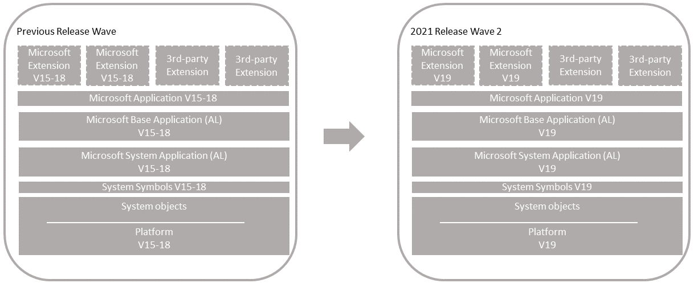

# Upgrading Microsoft System and Base Application to Version 19

Use this scenario if you have one of the following [!INCLUDE[prod_short](../developer/includes/prod_short.md)] versions that uses the Microsoft System and Base applications.

- 2021 release wave 1 (version 18)
- 2020 release wave 2 (version 17)
- 2020 release wave 1 (version 16)
- 2019 release wave 2 (version 15)

> [!IMPORTANT]
> See [Upgrade Compatibility Matrix](upgrade-v14-v15-compatibility.md) to determine which update of version 19 is compatible with your current Business Central version.

  

[!INCLUDE[upgrade_single_vs_multitenant](../developer/includes/upgrade_single_vs_multitenant.md)]

## Before you begin

### Consider known issues

[!INCLUDE[upgrade_known_issues](../developer/includes/upgrade_known_issues.md)]

<!--
### Prepare for tables that have changed to temporary tables

Starting with version 18, several base application tables are now temporary tables. This change may affect the upgrade from version 17 or earlier. For more information, see [Upgrading Base Application Tables That Have Changed to Temporary](upgrade-temporary-tables.md).-->

### Prepare new runtime packages

[!INCLUDE[upgrade_runtime_packages](../developer/includes/upgrade_runtime_packages.md)]

### PowerShell variables used in tasks

Many of the steps in this article use PowerShell cmdlets, which require that you provide values for various parameters. To make it easier for copying or scripting in PowerShell, the steps use the following variables for parameter values. Replace the text between the `" "` with the correct values for your environment.

```powershell
$OldBcServerInstance = "The name of the Business Central server instance for your previous version, for example: BC180"
$NewBcServerInstance = "The name of the Business Central server instance for version 19, for example: BC190"
$TenantId = "The ID of the tenant to be upgraded. If not using a multitenant server instance, set the variable to default, or omit -Tenant parameter."
$TenantDatabase = "The name of the Business Central tenant database to be upgraded, for example: Demo Database BC (19-0)" 
$ApplicationDatabase = "The name of the Business Central application database in a multitenant environment, for example: My BC App DB. In a single-tenant deployment, this is the same as the $TenantDatabase" 
$DatabaseServer = "The SQL Server instance that hosts the databases. The value has the format server_name\instance_name, For example: localhost\BCDEMO"
$SystemAppPath = "The file path and name of the System Application extension for the update, for example: C:\DVD\Applications\system application\Source\\Microsoft_System Application.app"
$BaseAppPath = "The file path and name of the Base Application extension for the update, for example: C:\DVD\Applications\BaseApp\Source\Microsoft_Base Application.app"
$ApplicationAppPath = "The path and file name to the Application application extension for the update, for example: C:\DVD\Applications\Application\Source\Microsoft_Application.app"
$NewBCVersion = "The version number for the current System, Base, and Application extensions that you'll reinstall, for example: 18.1.24582.0"
$PartnerLicense = "The file path and name of the partner license"
$CustomerLicense = "The file path and name of the customer license"
$AddinsFolder = "The file path to the Add-ins folder of version 19 server installation, for example, C:\Program Files\Microsoft Dynamics 365 Business Central\190\Service\Add-ins."
```

## Task 1: Install version 19

1. Download the latest available update for Business Central 2021 (version 19) that is compatible with your current version.

    For more information, see [[!INCLUDE[prod_long](../developer/includes/prod_long.md)] Upgrade Compatibility Matrix](upgrade-v14-v15-compatibility.md).

2. Before you install version 19, it can be useful to create desktop shortcuts to the tools of the current version, such as the [!INCLUDE[admintool](../developer/includes/admintool.md)], [!INCLUDE[adminshell](../developer/includes/adminshell.md)], and [!INCLUDE[devshell](../developer/includes/devshell.md)] because the Start menu items for these tools will be replaced with the version 19 tools.

3. Install Business Central version 19 components.

    You keep the current version installed to complete some steps in the upgrade process. When you install version 19, you must either specify different port numbers for components (like the [!INCLUDE[server](../developer/includes/server.md)] instance and web services) or you must stop the current version's [!INCLUDE[server](../developer/includes/server.md)] instance before you run the installation. Otherwise, you'll get an error that the [!INCLUDE[server](../developer/includes/server.md)] failed to install.

    For more information, see [Installing Business Central Using Setup](../deployment/install-using-setup.md).

## Task 2: Upgrade permission sets

Version 18 introduced the capability to define permissions sets as AL objects, instead of as data. Permissions sets as AL objects is now the default and recommended model for permissions. For now, you can choose to use the legacy model, where permissions are defined and stored as data in the database. Whichever model you choose, there are permission set-related tasks you'll have to go through before and during upgrade.

For more information, see [Upgrading Permissions Sets and Permissions](upgrade-permissions.md)<!--[Permissions Upgrade Considerations](https://review.docs.microsoft.com/dynamics365/business-central/dev-itpro/developer/devenv-entitlements-and-permissionsets-overview?branch=permissionset#upgrade-considerations)-->.

<!--
## Prerequisites


1. Your version 17 is compatible with version 18.

    There are several updates for version 17. The updates have a compatible version 18 update. For more information, see [[!INCLUDE[prod_long](../developer/includes/prod_long.md)] Upgrade Compatibility Matrix](upgrade-v14-v15-compatibility.md). For example, if your solution is currently running 17.5, you can't upgrade to 18.0. You must wait until 18.1 is available.  

2. Disable data encryption.

    If the current server instance uses data encryption, disable it. You can enable it again after upgrading.

    For more information, see [Managing Encryption and Encryption Keys](how-to-export-and-import-encryption-keys.md#encryption).

    Instead of disabling encryption, you can export the current encryption key, which you'll then import after upgrade. However, we recommend disabling encryption before upgrading.
-->


## Task 3: Prepare the existing databases

1. Make backup of the databases.
2. Disable data encryption.

    If the current server instance uses data encryption, disable it. You can enable it again after upgrading.

    For more information, see [Managing Encryption and Encryption Keys](how-to-export-and-import-encryption-keys.md#encryption).

    Instead of disabling encryption, you can export the current encryption key, which you'll then import after upgrade. However, we recommend disabling encryption before upgrading.

3. Start [!INCLUDE[adminshell](../developer/includes/adminshell.md)] for your current version as an administrator.

   [!INCLUDE[open-admin-shell](../developer/includes/open-admin-shell.md)]

4. (Single-tenant only) Uninstall all extensions from the old tenants.

    In this step, you uninstall the Base Application, System Application (if used), and any other extensions that are currently installed on the database.

    1. Get a list of installed extensions.
    
        This step is optional, but it can be useful to the names and versions of the extensions.

        To get a list of installed extensions, use the [Get-NAVAppInfo cmdlet](/powershell/module/microsoft.dynamics.nav.apps.management/get-navappinfo).

        ```powershell 
        Get-NAVAppInfo -ServerInstance $OldBcServerInstance -Tenant $TenantId
        ```

        For a single-tenant deployment, set the `$TenantId` to default.

    2. Uninstall the extensions.
    
        To uninstall an extension, you use the [Uninstall-NAVApp](/powershell/module/microsoft.dynamics.nav.apps.management/uninstall-navapp) cmdlet.
    
        ```powershell 
        Uninstall-NAVApp -ServerInstance $OldBcServerInstance -Name <extensions name> -Tenant $TenantId -Version <extension version> -Force
        ```
        
        Replace  `<extension name>` and `<extension version>` with the exact name and version the published System Application.

        For example, together with the Get-NAVApp cmdlet, you can uninstall all extensions with a single command:

        ```powershell 
        Get-NAVAppInfo -ServerInstance $OldBcServerInstance -Tenant $TenantId| % { Uninstall-NAVApp -ServerInstance $OldBcServerInstance -Tenant $TenantId -Name $_.Name -Version $_.Version -Force}
        ``` 

5. Unpublish all system symbols.

    To unpublish symbols, use the Unpublish-NAVAPP cmdlet with the `-SymbolsOnly` switch.

    ```powershell 
    Get-NAVAppInfo -ServerInstance $OldBcServerInstance -SymbolsOnly | % { Unpublish-NAVApp -ServerInstance $OldBcServerInstance -Name $_.Name -Version $_.Version }
    ```

    [What are symbols?](upgrade-overview-v15.md#Symbols)  
6. (Multitenant only) Dismount the tenants from the application server instance.

    To dismount a tenant, use the [Dismount-NAVTenant](/powershell/module/microsoft.dynamics.nav.management/dismount-navtenant) cmdlet:

    ```powershell
    Dismount-NAVTenant -ServerInstance $OldBcServerInstance -Tenant $TenantId
    ```
7. Stop the server instance.

    ```powershell
    Stop-NAVServerInstance -ServerInstance $OldBcServerInstance
    ```

## Task 4: Convert application database to version 19

This task runs a technical upgrade on the application database to convert it to the version 19 platform. The conversion updates the system tables of the database to the new schema (data structure). It provides the latest platform features and performance enhancements. The conversion adds the system symbols for the version to the database, so you don't have to manually publish the Systems extension, as you had to do with early releases.

1. Start [!INCLUDE[adminshell](../developer/includes/adminshell.md)] for version 19 as an administrator.
2. Run the Invoke-NAVApplicationDatabaseConversion cmdlet to start the conversion:

    ```powershell
    Invoke-NAVApplicationDatabaseConversion -DatabaseServer $DatabaseServer -DatabaseName $ApplicationDatabase
    ```
    <!--This adds systemID to system tables, clears the Objects table. -->

    When completed, a message like the following displays in the console:

    ```
    DatabaseServer      : .\BCDEMO
    DatabaseName        : Demo Database BC (18-0)
    DatabaseCredentials :
    DatabaseLocation    :
    Collation           :
    ```

[!INCLUDE[convert_azure_sql_db_timeout](../developer/includes/convert_azure_sql_db_timeout.md)]

## Task 5: Configure version 19 server

When you installed version 19 in **Task 2**, a version 19 [!INCLUDE[server](../developer/includes/server.md)] instance was created. In this task, you change server configuration settings that are required to complete the upgrade. Some of the changes are only required for upgrade and can be reverted after you complete the upgrade.

1. Set the server instance to connect to the application database.

    ```powershell
    Set-NAVServerConfiguration -ServerInstance $NewBcServerInstance -KeyName DatabaseName -KeyValue $ApplicationDatabase
    ```
    In a single tenant deployment, this command will mount the tenant automatically. For more information, see [Connecting a Server Instance to a Database](../administration/connect-server-to-database.md).

2. Disable task Scheduler on the server instance for purposes of upgrade.

    ```powershell
    Set-NavServerConfiguration -ServerInstance $NewBcServerInstance -KeyName "EnableTaskScheduler" -KeyValue false
    ```

    Be sure to re-enable task scheduler after upgrade if needed.
3. Restart the server instance.

    ```powershell
    Restart-NAVServerInstance -ServerInstance $NewBcServerInstance
    ```

## Task 6: Import version 19 license

1. Use the [Import-NAVServerLicense](/powershell/module/microsoft.dynamics.nav.management/import-navserverlicense) to upload the version 19 license to the database. 

    ```powershell
    Import-NAVServerLicense -ServerInstance $NewBcServerInstance -LicenseFile $PartnerLicense
    ```

2. Restart the server instance.

    ```powershell
    Restart-NAVServerInstance -ServerInstance $NewBcServerInstance
    ```

## Task 7: Publish extensions

In this task, you'll publish the extensions. As minimum, you publish the new base application and system application extensions from the installation media (DVD). You also publish new versions of any Microsoft extensions and third-party extensions that were used on your old deployment.

Publishing an extension adds the extension to the application database that is mounted on the server instance. Once published, it's available for installing on tenants. This task updates internal tables, compiles the components of the extension behind-the-scenes, and builds the necessary metadata objects that are used at runtime.

The steps in this task continue to use the [!INCLUDE[adminshell](../developer/includes/adminshell.md)] for version 19 that you started in the previous task.

<!-- removed starting in 18
1. Publish version 18 system symbols extension.

    The symbols extension contains the required platform symbols that the base application depends on. The symbols extension package is called **System.app**. You find it where the **AL Development Environment** is installed. The default path is C:\Program Files (x86)\Microsoft Dynamics 365 Business Central\180\AL Development Environment.  

    ```powershell
    Publish-NAVApp -ServerInstance  <server instance name> -Path "<path to system.app>" -PackageType SymbolsOnly
    ```
    [What are symbols?](upgrade-overview-v15.md#Symbols) -->

1. Publish the **System Application** extension (Microsoft_System Application.app).

    You find the (Microsoft_System Application.app in the **Applications\System Application\Source** folder of installation media (DVD).

    ```powershell
    Publish-NAVApp -ServerInstance $NewBcServerInstance -Path $SystemAppPath
    ```

    [What is the System Application?](upgrade-overview-v15.md#SystemApplication)
2. Publish the Business Central base application extension (Microsoft_Base Application.app).

    The **Base Application** extension contains the application business objects. You find the (Microsoft_Base Application.app in the **Applications\BaseApp\Source** folder of installation media (DVD).

    ```powershell
    Publish-NAVApp -ServerInstance $NewBcServerInstance -Path $BaseAppPath
    ```

3. Publish the Microsoft_Application extension.

    For more information about this extension, see [The Microsoft_Application.app File](../developer/devenv-application-app-file.md).

    ```powershell
    Publish-NAVApp -ServerInstance $NewBcServerInstance -Path $ApplicationAppPath
    ```

4. Publish the new versions of Microsoft extensions.

    In this step, you publish new versions of Microsoft extensions that were used on your old deployment. You find the extensions in the **Applications** folder of the installation media (DVD).

    ```powershell
    Publish-NAVApp -ServerInstance $NewBcServerInstance -Path "<path to Microsoft extension>"
    ```

    For example:

    ```powershell
    Publish-NAVApp -ServerInstance BC190 -Path "C:\W1DVD\Applications\SalesAndInventoryForecast\Source\SalesAndInventoryForecast.app"
    ```

5. Publish new versions of 3rd-party extensions. Be sure to include new extensions that contain custom permission sets as AL objects.

    If you have new versions of these extensions, built on the Business Central version 19, then publish the new versions.  

    ```powershell
    Publish-NAVApp -ServerInstance $NewBcServerInstance -Path "<path to extension>"
    ```

6. Recompile extensions not built on version 19.

    [!INCLUDE[repair_runtime_packages](../developer/includes/repair_runtime_packages.md)]

    Do this step for any published extension versions that aren't built on version 19, and you want to reinstall on tenants. These extensions must be recompiled to work with version 19. To recompile the extensions, use the [Repair-NAVApp](/powershell/module/microsoft.dynamics.nav.apps.management/repair-navapp) cmdlet:

    ```powershell  
    Repair-NAVApp -ServerInstance $NewBcServerInstance -Name <extension name> -Version <extension name>
    ```
    
    For example, to recompile all extensions that are not published by Microsoft, you could run the following command:

    ```powershell  
    Get-NAVAppInfo -ServerInstance $NewBcServerInstance | Where-Object {$_.Publisher -notlike 'Microsoft'} | Repair-NAVApp
    ```

    Restart the [!INCLUDE[server](../developer/includes/server.md)] when completed.

## Task 8: Synchronize tenant

You'll synchronize the tenant's database schema with any schema changes in the application database and extensions. If you have a multitenant deployment, do these steps for each tenant.

1. (Multitenant only) Mount the tenant to the version 19 server instance.

    To mount the tenant, use the [Mount-NAVTenant](/powershell/module/microsoft.dynamics.nav.management/mount-navtenant) cmdlet:

    ```powershell
    Mount-NAVTenant -ServerInstance $NewBcServerInstance -DatabaseName $TenantDatabase -DatabaseServer $DatabaseServer -Tenant $TenantId -AllowAppDatabaseWrite
    ```

    > [!IMPORTANT]
    > You must use the same tenant ID for the tenant that was used in the old deployment; otherwise you'll get an error when mounting or syncing the tenant. If you want to use a different ID for the tenant, you can either use the `-AlternateId` parameter now or after upgrading, dismount the tenant, then mount it again using the new ID and the `OverwriteTenantIdInDatabase` parameter.  
    >  
    > For upgrade, set the `-AllowAppDatabaseWrite` parameter. After upgrade, you can dismount and mount the tenant again without the parameter if needed.

    At this stage, the tenant state is OperationalWithSyncPending.
2. Synchronize the tenant with the application database.

    Use the [Sync-NAVTenant](/powershell/module/microsoft.dynamics.nav.management/sync-navtenant) cmdlet:

    ```powershell  
    Sync-NAVTenant -ServerInstance $NewBcServerInstance -Mode Sync -Tenant $TenantId
    ```

    With a single-tenant deployment, you can omit the `-Tenant` parameter and value.

3. Synchronize the tenant with the **System Application** extension. 

    Use the [Sync-NAVApp](/powershell/module/microsoft.dynamics.nav.apps.management/sync-navapp) cmdlet:

    ```powershell
    Sync-NAVApp -ServerInstance $NewBcServerInstance -Tenant $TenantId -Name "System Application" -Version $NewBCVersion
    ```

    Replace `$NewBCVersion` with the exact version of the published System Application. To get the version, you can use the [Get-NAVAppInfo cmdlet](/powershell/module/microsoft.dynamics.nav.apps.management/get-navappinfo).
    
4. Synchronize the tenant with the Business Central Base Application extension.

    ```powershell
    Sync-NAVApp -ServerInstance $NewBcServerInstance -Tenant $TenantId -Name "Base Application" -Version $NewBCVersion
    ```

   Replace `$NewBCVersion` with the exact version of the published Base Application.

5. Synchronize the tenant with the [Application](../developer/devenv-application-app-file.md) extension.

    ```powershell
    Sync-NAVApp -ServerInstance $NewBcServerInstance -Tenant $TenantId -Name "Application" -Version $NewBCVersion
    ```

6. Synchronize the tenant with Microsoft and 3rd-party extensions.

    For each extension, run the Sync-NAVApp cmdlet:

    ```powershell
    Sync-NAVApp -ServerInstance $NewBcServerInstance -Tenant $TenantId -Name "<extension name>" -Version <extension version>
    ```

## Task 9: Upgrade data

In this task, you run a data upgrade for extensions.

#### Single tenant

Run the data upgrade on extensions in order of dependency.

1. Run the data upgrade for the System Application, followed by the Base Application, then Application extension. 

    To run the data upgrade, use the [Start-NAVAppDataUpgrade cmdlet](/powershell/module/microsoft.dynamics.nav.apps.management/start-navappdataupgrade) cmdlet:

    ```powershell
    Start-NAVAppDataUpgrade -ServerInstance $NewBcServerInstance -Name "System Application" -Version $NewBCVersion
    ```
    ```powershell
    Start-NAVAppDataUpgrade -ServerInstance $NewBcServerInstance -Name "Base Application" -Version $NewBCVersion
    ```
    ```powershell
    Start-NAVAppDataUpgrade -ServerInstance $NewBcServerInstance -Name "Application" -Version $NewBCVersion
    ```

    This step will automatically install the new system application and base application versions on the tenant.
2. Upgrade the new versions of Microsoft extensions and third-party extensions.

    Upgrade any Microsoft and third-party extension that are used in the old deployment to new versions found on the installation media. The new versions are in the **Application** folder of the DVD. There's a folder for each extension. The extension package (.app file) is in the **Source** folder. 

    For each extension, run [Start-NAVAppDataUpgrade cmdlet](/powershell/module/microsoft.dynamics.nav.apps.management/start-navappdataupgrade). First, run the data upgrade for the Application extension, then run it for other Microsoft extensions and third-party extensions. 

    This step will also automatically install the new extension version on the tenant.

#### Multitenant

On each tenant, run the [Start-NavDataUpgrade](/powershell/module/microsoft.dynamics.nav.management/start-navdataupgrade) cmdlet as follows:
    
```powershell
Start-NAVDataUpgrade -ServerInstance $NewBcServerInstance -Tenant $TenantId -FunctionExecutionMode Serial -SkipAppVersionCheck
```

This command will upgrade and install the extensions on the tenant.

## Task 10: Install 3rd-party extensions

Complete this task to install third-party extensions for which a new version wasn't published. For each extension, run the [Install-NAVApp cmdlet](/powershell/module/microsoft.dynamics.nav.apps.management/install-navapp):

```powershell
Install-NAVApp -ServerInstance $NewBcServerInstance -Name <extension name> -Version <extension version>
```

## Task 11: <a name="JSaddins"></a>Upgrade control add-ins

[!INCLUDE[upgrade-control-addins](../developer/includes/upgrade-control-addins.md)] 

## Task 12: Install upgraded permissions sets

In this task, you install the custom permission sets that you upgraded earlier in this procedure. The steps depend on whether you've decided to use permission sets as AL objects or as data.

### For permission sets as AL objects

1. Publish the extension or extensions that include the permission sets.
2. Sync the extensions with the tenant.
3. Install the extensions on the tenant.

### For permission sets as data in XML

1. Set the `UserPermissionSetsFromExtensions` setting of the [!INCLUDE[server](../developer/includes/server.md)] instance to `false`.

    ```powershell
    Set-NavServerConfiguration -ServerInstance $NewBcServerInstance -KeyName "UsePermissionSetsFromExtensions" -KeyValue false
    ```

2. Restart the serve instance.
3. Open the [!INCLUDE[webclient](../developer/includes/webclient.md)].
4. Search for and open the **Permission Sets** page.
5. Select **Import Permission Sets**, and follow the instructions to import the XML file.

For more information, see [To export and import a permission set](/dynamics365/business-central/ui-define-granular-permissions#to-export-and-import-a-permission-set).

## Task 13: Change application version

[!INCLUDE[upgrade-change-application-version](../developer/includes/upgrade-change-application-version.md)]

<!--

You get the number from the [Released Updates for Microsoft Dynamics 365 Business Central 2021 Release Wave 2 on-premises](https://support.microsoft.com/help/4528706). For an explanation of the number, see [Version numbers in Business Central](../administration/version-numbers.md).

### Change the application version in the database

1. Run the [Set-NAVApplication cmdlet](/powershell/module/microsoft.dynamics.nav.management/set-navapplication):

    ```powershell
    Set-NAVApplication -ServerInstance $NewBcServerInstance -ApplicationVersion $NewVersion -Force
    ```

    For example:
    
    ```powershell
    Set-NAVApplication -ServerInstance BC190 -ApplicationVersion 19.0.38071.0 -Force
    ```

2. Run the [Sync-NAVTenant](/powershell/module/microsoft.dynamics.nav.management/sync-navtenant) cmdlet to synchronize the tenant with the application database.

    ```powershell  
    Sync-NAVTenant -ServerInstance $NewBcServerInstance -Mode Sync -Tenant $TenantId
    ```
    
    With a single-tenant deployment, you can omit the `-Tenant` parameter and value.

3. Run the [Start-NavDataUpgrade](/powershell/module/microsoft.dynamics.nav.management/start-navdataupgrade) cmdlet to change the version number:

    ```powershell
    Start-NAVDataUpgrade -ServerInstance $NewBcServerInstance -FunctionExecutionMode Serial -Tenant $TenantId
    ```
    The data upgrade process will be running in the background after running the above Start-NAVDataUpgrade cmdlet. You check on the progress using the Get-NAVDataUpgrade cmdlet: such as: `Get-NAVDataUpgrade -ServerInstance $NewBcServerInstance -Tenant $TenantId -Progress` or `Get-NAVDataUpgrade -ServerInstance $NewBcServerInstance -Tenant $TenantId -Detailed`.

Don't stop the [!INCLUDE[server](../developer/includes/server.md)] instance until the process is complete, that is, when you see `State = Operational` in the results from the Get-NAVDataUpgrade cmdlet.

### Change the application version shown on the Help and Support page in the client

The [!INCLUDE[server](../developer/includes/server.md)] includes a configuration setting called **Solution Version Extension** (SolutionVersionExtension). This setting lets you specify an extension whose version number will show as the Application Version on the client's **Help and Support** page. Typically, you'd use the extension considered to be your solution's base application. You set **Solution Version Extension** to ID of the extension. For example, if your solution uses the Microsoft Base Application, set the value to `437dbf0e-84ff-417a-965d-ed2bb9650972`.

You can set **Solution Version Extension** by using the [!INCLUDE[admintool](../developer/includes/admintool.md)] or the [Set-NAVServerConfiguration](/powershell/module/microsoft.dynamics.nav.management/set-navserverconfiguration) cmdlet of the [!INCLUDE[admin shell](../developer/includes/adminshell.md)].

The following example uses the Set-NAVServerConfiguration cmdlet to set the **Solution Version Extension** to the Microsoft Base Application:

```powershell  
Set-NAVServerConfiguration -ServerInstance $NewBcServerInstance -KeyName SolutionVersionExtension -KeyValue 437dbf0e-84ff-417a-965d-ed2bb9650972 -ApplyTo All  
```
-->
## Post-upgrade tasks

1. Enable task scheduler on the server instance.
2. (Multitenant only) For tenants other than the tenant that you use for administration purposes, if you mounted the tenants using the `-AllowAppDatabaseWrite` parameter, dismount the tenants, then mount them again without using the `-AllowAppDatabaseWrite` parameter.
3. If you want to use data encryption as before, enable it.

   For more information, see [Managing Encryption and Encryption Keys](how-to-export-and-import-encryption-keys.md#encryption).

   Optionally, if you exported the encryption key instead of disabling encryption earlier, import the encryption key file to enable encryption.
4. Import the customer license

   Import the customer license by using the [Import-NAVServerLicense cmdlet](/powershell/module/microsoft.dynamics.nav.management/import-navserverlicense), as you did with the partner license. You'll have to restart the server instance afterwards.

    ```powershell
    Import-NAVServerLicense -ServerInstance $NewBcServerInstance -LicenseFile $CustomerLicense
    Restart-NAVServerInstance -ServerInstance $NewBcServerInstance
    ```

## See Also  

[Upgrading to Business Central](upgrading-to-business-central.md)  
[Upgrading Extensions](../developer/devenv-upgrading-extensions.md)  
