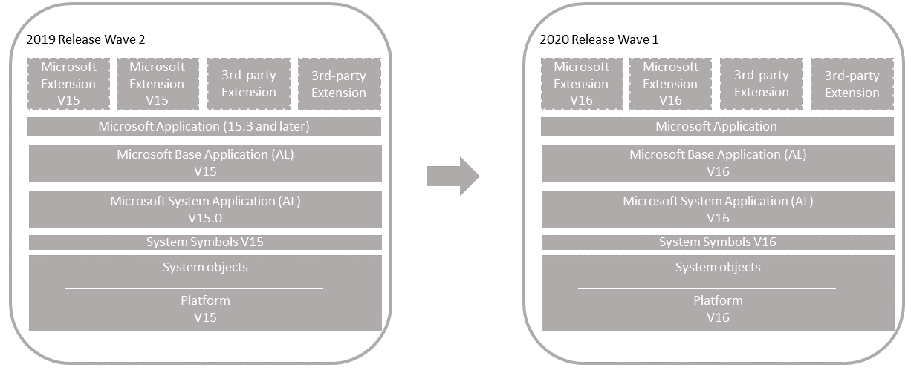

# Upgrading Version 15 Base Application to Version 16

Use this scenario if you have a [!INCLUDE[prodshort](../developer/includes/prodshort.md)] 2019 release wave 2 solution that uses the Microsoft System and Base applications.

  

#### Single-tenant and multitenant deployments

The process for upgrading the similar for a single-tenant and multitenant deployment. However, there are some inherent differences. With a single-tenant deployment, the application code and business data are in the same database. In a multitenant deployment, application code is in a separate database (the application database) than the business data (tenant). In the procedures that follow, for a single-tenant deployment, consider references to the *application database* and *tenant database* as the same database. Steps are marked as *Single-tenant only* or *Multitenant only* where applicable.

## Prerequisites

1. Your version 15 is compatible with version 16.

    There are several updates for version 15. The updates have a compatible version 16 update. For more information, see [[!INCLUDE[prodlong](../developer/includes/prodlong.md)] Upgrade Compatibility Matrix](upgrade-v14-v15-compatibility.md). For example, if your solution is currently running 15.5, you can't upgrade to 16.0. You must wait until 16.1 is available.  

2. Disable data encryption.

    If the current server instance uses data encryption, disable it. You can enable it again after upgrading.

    For more information, see [Managing Encryption and Encryption Keys](how-to-export-and-import-encryption-keys.md#encryption).

    Instead of disabling encryption, you can export the current encryption key, which you'll then import after upgrade. However, we recommend disabling encryption before upgrading.

## Task 1: Install version 16

1. Download the latest available update for Business Central 2020 (version 16) that is compatible with your version 15.

    For more information, see [[!INCLUDE[prodlong](../developer/includes/prodlong.md)] Upgrade Compatibility Matrix](upgrade-v14-v15-compatibility.md).


2. Before you install version 16, it can be useful to create desktop shortcuts to the version 15.0 tools, such as the [!INCLUDE[admintool](../developer/includes/admintool.md)], [!INCLUDE[adminshell](../developer/includes/adminshell.md)], and [!INCLUDE[devshell](../developer/includes/devshell.md)] because the Start menu items for these tools will be replaced with the version 16 tools.

3. Install Business Central version 16 components.

    If you don't uninstall version 15, then you must either specify different port numbers for components (like the [!INCLUDE[server](../developer/includes/server.md)] instance and web services) during installation, or you must stop the version 15.0 [!INCLUDE[server](../developer/includes/server.md)] instance before you run the installation. Otherwise, you'll get an error that the [!INCLUDE[server](../developer/includes/server.md)] failed to install.

    For more information, see [Installing Business Central Using Setup](../deployment/install-using-setup.md).

## Task 2: Prepare version 15 databases

1. Make backup of the databases.

2. Start [!INCLUDE[adminshell](../developer/includes/adminshell.md)] for version 16 as an administrator.

3. (Single-tenant only) Uninstall all extensions from the old tenants.

    In this step, you uninstall the Base Application, System Application (if used), and any other extensions that are currently installed on the database.

    1. Get a list of installed extensions.
    
        This step is optional, but it can be useful to the names and versions of the extensions.

        To get a list of installed extensions, use the [Get-NAVAppInfo cmdlet](/powershell/module/microsoft.dynamics.nav.apps.management/get-navappinfo).

        ```powershell 
        Get-NAVAppInfo -ServerInstance <server instance name> -Tenant <tenant ID>
        ```

        For a single-tenant deployment, set the `<tenant ID>` to default.

    2. Uninstall the extensions.
    
        To uninstall an extension, you use the [Uninstall-NAVApp](/powershell/module/microsoft.dynamics.nav.apps.management/uninstall-navapp) cmdlet.
    
        ```powershell 
        Uninstall-NAVApp -ServerInstance <server instance name> -Name <extensions name> -Tenant <tenant ID> -Version <extension version> -Force
        ```
        
        Replace  `<extension name>` and `<extension version>` with the exact name and version the published System Application.

        For example, together with the Get-NAVApp cmdlet, you can uninstall all extensions with a single command:

        ```powershell 
        Get-NAVAppInfo -ServerInstance <server instance name> -Tenant <tenant ID>| % { Uninstall-NAVApp -ServerInstance <server instance name> -Tenant <tenant ID> -Name $_.Name -Version $_.Version -Force}
        ``` 

5. Unpublish all system symbols.

    To unpublish symbols, use the Unpublish-NAVAPP cmdlet with the `-SymbolsOnly` switch.

    ``` 
    Get-NAVAppInfo -ServerInstance <BC15 server instance> -SymbolsOnly | % { Unpublish-NAVApp -ServerInstance <BC15 server instance> -Name $_.Name -Version $_.Version }
    ```

    [What are symbols?](upgrade-overview-v15.md#Symbols)  
6. (Multitenant only) Dismount the tenants from the application server instance.

    To dismount a tenant, use the [Dismount-NAVTenant](/powershell/module/microsoft.dynamics.nav.management/dismount-navtenant) cmdlet:

    ```
    Dismount-NAVTenant -ServerInstance <server instance name> -Tenant <tenant ID>
    ```
7. Stop the server instance.

    ```
    Stop-NAVServerInstance -ServerInstance <server instance name>
    ```

## Task 3: Convert version 15 database

This task runs a technical upgrade on the application database to convert it from the version 15 platform to the version 16 platform. The conversion updates the system tables of the database to the new schema (data structure). It provides the latest platform features and performance enhancements.

1. Start [!INCLUDE[adminshell](../developer/includes/adminshell.md)] for version 16 as an administrator.
2. Run the Invoke-NAVApplicationDatabaseConversion cmdlet to start the conversion:

    ```
    Invoke-NAVApplicationDatabaseConversion -DatabaseServer <database server name>\<database server instance> -DatabaseName "<database name>"
    ```
    <!--This adds systemID to system tables, clears the Objects table. -->

    When completed, a message like the following displays in the console:

    ```
    DatabaseServer      : .\BCDEMO
    DatabaseName        : Demo Database BC (15-0)
    DatabaseCredentials :
    DatabaseLocation    :
    Collation           :
    ```

## Task 4: Configure version 16 server

When you installed version 16 in **Task 1**, a version 16 [!INCLUDE[server](../developer/includes/server.md)] instance was created. In this task, you change server configuration settings that are required to complete the upgrade. Some of the changes are only required for version 15 to version 16 upgrade and can be reverted after you complete the upgrade.

1. Set the server instance to connect to the application database.

    ```
    Set-NAVServerConfiguration -ServerInstance <server instance name> -KeyName DatabaseName -KeyValue "<database name>"
    ```
    In a single tenant deployment, this command will mount the tenant automatically. For more information, see [Connecting a Server Instance to a Database](../administration/connect-server-to-database.md).

2. Disable task Scheduler on the server instance for purposes of upgrade.

    ```
    Set-NavServerConfiguration -ServerInstance <server instance name> -KeyName "EnableTaskScheduler" -KeyValue false
    ```
    Be sure to re-enable task scheduler after upgrade if needed.
3. Restart the server instance.

    ```
    Restart-NAVServerInstance -ServerInstance <server instance name>
    ```
    
## Task 5: Import version 16 license

1. Use the [Import-NAVServerLicense](/powershell/module/microsoft.dynamics.nav.management/import-navserverlicense) to upload the version 16 license to the database. 

    ```
    Import-NAVServerLicense -ServerInstance <server instance name> -LicenseFile <path and file name>
    ```

2. Restart the server instance.

    ```
    Restart-NAVServerInstance -ServerInstance <server instance name>
    ```

## Task 6: Publish symbols and extensions

In this task, you'll publish the platform symbols and extensions. As minimum, you publish the new base application and system application extensions from the installation media (DVD). You also publish new versions of any Microsoft extensions and third-party extensions that were used on your old deployment.

Publishing an extension adds the extension to the application database that is mounted on the server instance. Once published, it's available for installing on tenants. This task updates internal tables, compiles the components of the extension behind-the-scenes, and builds the necessary metadata objects that are used at runtime.

The steps in this task continue to use the [!INCLUDE[adminshell](../developer/includes/adminshell.md)] for version 16 that you started in the previous task.

1. Publish version 16 system symbols extension.

    The symbols extension contains the required platform symbols that the base application depends on. The symbols extension package is called **System.app**. You find it where the **AL Development Environment** is installed. The default path is C:\Program Files (x86)\Microsoft Dynamics 365 Business Central\160\AL Development Environment.  

    ```
    Publish-NAVApp -ServerInstance  <server instance name> -Path "<path to system.app>" -PackageType SymbolsOnly
    ```
    [What are symbols?](upgrade-overview-v15.md#Symbols) 
2. Publish the **System Application** extension (Microsoft_System Application.app).

    You find the (Microsoft_System Application.app in the **Applications\System Application\Source** folder of installation media (DVD).

    ```
    Publish-NAVApp -ServerInstance <server instance name> -Path "<path to Microsoft_System Application.app>"
    ```
    [What is the System Application?](upgrade-overview-v15.md#SystemApplication) 
3. Publish the Business Central base application extension (Microsoft_Base Application.app).

    The **Base Application** extension contains the application business objects. You find the (Microsoft_Base Application.app in the **Applications\BaseApp\Source** folder of installation media (DVD).

    ```
    Publish-NAVApp -ServerInstance <server instance name> -Path "<path to Microsoft_Base Application.app>"
    ```

4. Publish the Microsoft_Application extension (when coming from 15.2 and earlier only).

    The Microsoft_Application extension is a new extension introduced in 15.3. For more information about this extension, see [The Microsoft_Application.app File](../developer/devenv-application-app-file.md).

    ```
    Publish-NAVApp -ServerInstance <server instance name> -Path "<path to Microsoft_Application.app>"
    ```

5. Publish the new versions of Microsoft extensions.

    In this step, you publish new versions of Microsoft extensions that were used on your version 15 deployment. You find the extensions in the **Applications** folder of the installation media (DVD).

    ```
    Publish-NAVApp -ServerInstance <server instance name> -Path "<path to Microsoft extension>"
    ```

    For example:

    ```
    Publish-NAVApp -ServerInstance BC150 -Path "C:\W1DVD\Applications\SalesAndInventoryForecast\Source\SalesAndInventoryForecast.app"
    ```

6. Publish 3rd-party extensions.

    Publish 3rd-party extensions that were used on your version 15 solution. If you have new versions of these extensions, built on the Business Central version 15, then publish the new versions. Otherwise, republish the same versions that were previously published in the old deployment.  

    ```
    Publish-NAVApp -ServerInstance BC150 -Path "<path to extension>"
    ```

<!--
## Task 5: Restart server instance

Restart the [!INCLUDE[server](../developer/includes/server.md)] to free up resources for completing the upgrade.

```
Restart-NAVServerInstance -ServerInstance <server instance name>
```

This step is important, otherwise you might experience issues when you run the data upgrade.

-->

## Task 7: Synchronize tenant

In this task, you'll synchronize the tenant's database schema with any schema changes in the application database and extensions. If you have a multitenant deployment, do these steps for each tenant.

1. (Multitenant only) Mount the tenant to the version 15 server instance.

    To mount the tenant, use the [Mount-NAVTenant](/powershell/module/microsoft.dynamics.nav.management/mount-navtenant) cmdlet:
    
    ```
    Mount-NAVTenant -ServerInstance <server instance name> -DatabaseName <database name> -DatabaseServer <database server>\<database instance> -Tenant <tenant ID> -AllowAppDatabaseWrite
    ```
    
    > [!IMPORTANT]
    > You must use the same tenant ID for the tenant that was used in the old deployment; otherwise you'll get an error when mounting or syncing the tenant. If you want to use a different ID for the tenant, you can either use the `-AlternateId` parameter now or after upgrading, dismount the tenant, then mount it again using the new ID and the `OverwriteTenantIdInDatabase` parameter.  
    
    > [!NOTE]  
    > For upgrade, we recommend that you use the `-AllowAppDatabaseWrite` parameter. After upgrade, you can dismount and mount the tenant again without the parameter if needed.

    At this stage, the tenant state is OperationalWithSyncPending.
2. Synchronize the tenant with the application database.

    Use the [Sync-NAVTenant](/powershell/module/microsoft.dynamics.nav.management/sync-navtenant) cmdlet:

    ```  
    Sync-NAVTenant -ServerInstance <server instance name> -Mode Sync -Tenant <tenant ID>
    ```
    
    With a single-tenant deployment, you can omit the `-Tenant` parameter and value.

3. Synchronize the tenant with the **System Application** extension. 

    Use the [Sync-NAVApp](/powershell/module/microsoft.dynamics.nav.apps.management/sync-navapp) cmdlet:

    ```
    Sync-NAVApp -ServerInstance <server instance name> -Tenant <tenant ID> -Name "System Application" -Version <extension version>
    ```

    Replace `<extension version>` with the exact version of the published System Application. To get the version, you can use the [Get-NAVAppInfo cmdlet](/powershell/module/microsoft.dynamics.nav.apps.management/get-navappinfo).
    
4. Synchronize the tenant with the Business Central Base Application extension.

    ```
    Sync-NAVApp -ServerInstance <server instance name> -Tenant <tenant ID> -Name "Base Application" -Version <extension version>
    ```
   Replace `<extension version>` with the exact version of the published Base Application.

4. Synchronize the tenant with the [Application](../developer/devenv-application-app-file.md) extension (when comping from 15.2 and earlier only).

    ```
    Sync-NAVApp -ServerInstance <server instance name> -Tenant <tenant ID> -Name "Application"
    ```

5. Synchronize the tenant with Microsoft and 3rd-party extensions.

    For each extension, run the Sync-NAVApp cmdlet:

    ```
    Sync-NAVApp -ServerInstance BC150 -Tenant default -Name "<extension name>" -Version <extension version>
    ```

## Task 8: Upgrade data

In this task, you run a data upgrade for extensions.

#### Single tenant

You must run the data upgrade on extensions in order of dependency.

1. Run the data upgrade for the system application, followed by the base application.

    To run the data upgrade, use the [Start-NavDataUpgrade](/powershell/module/microsoft.dynamics.nav.management/start-navdataupgrade) cmdlet:

    ```
    Start-NAVAppDataUpgrade -ServerInstance <server instance name> -Name "<extension name>" -Version <extension version>
    ```

    This step will automatically install the new system application and base application versions on the tenant.
2. Upgrade the new versions of Microsoft extensions and third-party extensions.

    Complete this task to upgrade any Microsoft and third-party extension used in the old deployment to new versions on the installation media. The new versions are in the **Application** folder of the DVD. There's a folder for each extension. The extension package (.app file) is in the **Source** folder. 

    1. Install **Application** extension (when comping from 15.2 and earlier only). 

        You'll have to install the **Application** extension first, otherwise you can't upgrade Microsoft extensions.

        ```
        Install-NAVApp -ServerInstance <server instance name> -Tenant <tenant ID> -Name "Application"
        ```
    2. For each extension, run [Start-NAVAppDataUpgrade cmdlet](/powershell/module/microsoft.dynamics.nav.apps.management/start-navappdataupgrade).

        This step will also automatically install the new extension version on the tenant.

#### Multitenant

On each tenant, run the [Start-NavDataUpgrade](/powershell/module/microsoft.dynamics.nav.management/start-navdataupgrade) cmdlet as follows to change the version number:
    
```
Start-NAVDataUpgrade -ServerInstance <server instance name> -Tenant <tenant ID> -FunctionExecutionMode Serial -SkipAppVersionCheck
```

## Task 9: Install 3rd-party extensions

Complete this task to install third-party extensions for which a new version wasn't published. For each extension, run the [Install-NAVApp cmdlet](/powershell/module/microsoft.dynamics.nav.apps.management/install-navapp):

```
Install-NAVApp -ServerInstance <server instance name> -Name <extension name> -Version <extension version>
```

At this point, the upgrade is complete, and you can open the client.

## Post-upgrade tasks

1. Enable task scheduler on the server instance.
2. (Multitenant only) For tenants other than the tenant that you use for administration purposes, if you mounted the tenants using the `-AllowAppDatabaseWrite` parameter, dismount the tenants, then mount them again without using the `-AllowAppDatabaseWrite` parameter.
3. If you want to use data encryption as before, enable it.

   For more information, see [Managing Encryption and Encryption Keys](how-to-export-and-import-encryption-keys.md#encryption).

   Optionally, if you exported the encryption key instead of disabling encryption earlier, import the encryption key file to enable encryption.

4. Change application version.

    (Optional) This task isn't required for installing the update. However, it might be useful for support purposes and answering a common question about the application version.  
    
    On the **Help and Support** page in the client, you'll see an application version, such as 16.0.2345.6. For an explanation of the number, see [Version numbers in Business Central](../administration/version-numbers.md). This version number isn't updated automatically when you install an update. If you want the application version to reflect the version of the update or your own version, you change it manually as described here.
    
    We recommend setting the value to application build number for the version 15 update. You get the number from the [Released Updates for Microsoft Dynamics 365 Business Central 2019 Release Wave 2 on-premises](https://support.microsoft.com/help/4528706).
    
    1. Run the [Set-NAVApplication cmldet](/powershell/module/microsoft.dynamics.nav.management/set-navapplication):
    
    ```
    Set-NAVApplication -ServerInstance <server instance name> -ApplicationVersion <new application version> -Force
    ```
    For example:
    
    ```
    Set-NAVApplication -ServerInstance BC160 -ApplicationVersion 16.0.38071.0 -Force
    ```

    2. Run the [Sync-NAVTenant](/powershell/module/microsoft.dynamics.nav.management/sync-navtenant) cmdlet to synchronize the tenant with the application database.
    
    ```  
    Sync-NAVTenant -ServerInstance <server instance name> -Mode Sync -Tenant <tenant ID>
    ```
    
    With a single-tenant deployment, you can omit the `-Tenant` parameter and value.
    
    3. Run the [Start-NavDataUpgrade](/powershell/module/microsoft.dynamics.nav.management/start-navdataupgrade) cmdlet to change the version number:
    
    ```
    Start-NAVDataUpgrade -ServerInstance <server instance name> -Tenant <tenant ID> 
    ```

## See Also  
[Upgrading the Data](Upgrading-the-Data.md)   
[Upgrading to Business Central](upgrading-to-business-central.md)  
