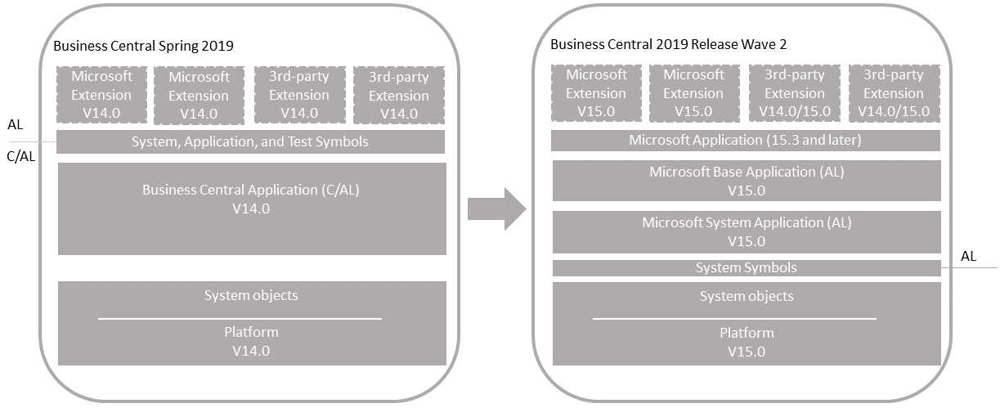

# Upgrading an Unmodified Application to [!INCLUDE[prod_long](../developer/includes/prod_long.md)] 2019 Release Wave 2

Use this scenario if you have a [!INCLUDE[prod_short](../developer/includes/prod_short.md)] Spring 2019 (referred to as version 14) application that doesn't include any code customization. Your solution might include Microsoft (first party) extensions and customization extensions (3rd-party). With this upgrade, you'll replace the C/AL base application with the new [!INCLUDE[prod_short](../developer/includes/prod_short.md)] 2019 release wave 2 base application extension. The result will be a fully upgraded Business Central 2019 release wave 2 (referred to as version 15) application and platform.

  

#### Single-tenant and multitenant deployments

The process for upgrading the similar for a single-tenant and multitenant deployment. However, there are some inherent differences. With a single-tenant deployment, the application code and business data are in the same database. In a multitenant deployment, application code is in a separate database (the application database) than the business data (tenant). In the procedures that follow, for a single-tenant deployment, consider references to the *application database* and *tenant database* as the same database. Steps are marked as *Single-tenant only* or *Multitenant only* where applicable.

## Prerequisite

1. Upgrade to Business Central Spring 2019 (version 14).

   There are several updates for version 14.
   - If you're upgrading from Business Central Fall 2018 (version 13) or Dynamics NAV, we recommend you upgrade to the latest update for version 14 that has a compatible update for version 15.
   - If your solution is already on version 14, then you don't have to upgrade to the latest version 15 update. For more information, see [[!INCLUDE[prod_long](../developer/includes/prod_long.md)] Upgrade Compatibility Matrix](upgrade-v14-v15-compatibility.md).

   To download the latest update, go to [Released Cumulative Updates for Microsoft Dynamics 365 Business Central Spring 2019 Update on-premises](https://support.microsoft.com/help/4501292).

   For information about how to do the upgrade, see [Upgrading to Dynamics 365 Business Central On-Premises](upgrading-to-business-central-on-premises.md).

2. Disable data encryption.

    If the current server instance uses data encryption, disable it. You can enable it again after upgrading.

    For more information, see [Managing Encryption and Encryption Keys](how-to-export-and-import-encryption-keys.md#encryption).

    Instead of disabling encryption, you can export the current encryption key, which you'll then import after upgrade. However, we recommend disabling encryption before upgrading.

## Task 1: Install Business Central (version 15)

1. Download the latest available update for Business Central 2019 version 15 that is compatible with your version 14.

    To download the latest update, go to [Released Updates for Microsoft Dynamics 365 Business Central 2019 Release Wave 2 on-premises](https://support.microsoft.com/help/4528706).
  
    The guidelines in this article assume that you're running the latest available update.

2. Before you install version 15, it can be useful to create desktop shortcuts to the version 14.0 tools, such as the [!INCLUDE[admintool](../developer/includes/admintool.md)], [!INCLUDE[adminshell](../developer/includes/adminshell.md)], and [!INCLUDE[devshell](../developer/includes/devshell.md)] because the Start menu items for these tools will be replaced with the version 15 tools.

3. Install Business Central version 15 components.

    If you don't uninstall version 14, then you must either specify different port numbers for components (like the [!INCLUDE[server](../developer/includes/server.md)] instance and web services) during installation, or you must stop the version 14.0 [!INCLUDE[server](../developer/includes/server.md)] instance before you run the installation. Otherwise, you'll get an error that the [!INCLUDE[server](../developer/includes/server.md)] failed to install.

    For more information, see [Installing Business Central Using Setup](../deployment/install-using-setup.md).

## Task 2: Prepare the version 14 databases for upgrade

1. Make backup of the databases.

2. Start [!INCLUDE[adminshell](../developer/includes/adminshell.md)] for version 14 as an administrator.
3. Uninstall all extensions from the old tenants.

    In this step, you uninstall the Base Application, System Application (if used), and any other extensions that are currently installed on the database.

    1. Get a list of installed extensions.
    
        This step is optional, but it can be useful to the names and versions of the extensions.

        To get a list of installed extensions, use the [Get-NAVAppInfo cmdlet](/powershell/module/microsoft.dynamics.nav.apps.management/get-navappinfo).

        ```powershell 
        Get-NAVAppInfo -ServerInstance <server instance name> -Tenant <tenant ID>
        ```

        For a single-tenant deployment, set the `<tenant ID>` to default. 
    2. Uninstall the extensions.
    
        To uninstall an extension, you use the [Uninstall-NAVApp](/powershell/module/microsoft.dynamics.nav.apps.management/uninstall-navapp) cmdlet.
    
        ```powershell 
        Uninstall-NAVApp -ServerInstance <server instance name> -Name <extensions name> -Tenant <tenant ID> -Version <extension version> -Force
        ```
        
        Replace  `<extension name>` and `<extension version>` with the exact name and version the published System Application.

        For example, together with the Get-NAVApp cmdlet, you can uninstall all extensions with a single command:

        ```powershell 
        Get-NAVAppInfo -ServerInstance <server instance name> -Tenant <tenant ID>| % { Uninstall-NAVApp -ServerInstance <server instance name> -Tenant <tenant ID> -Name $_.Name -Version $_.Version -Force}
        ``` 

4. Unpublish all extensions from the application server instance.

    To unpublish an extension, use the [Unpublish-NAVApp cmdlet](/powershell/module/microsoft.dynamics.nav.apps.management/unpublish-navapp):
    
    ``` 
    Unpublish-NAVApp -ServerInstance <server instance name> -Name <extension name> -Version <extension version>
    ``` 

    Together with the [Get-NAVAppInfo cmdlet](/powershell/module/microsoft.dynamics.nav.apps.management/get-navappinfo?view=businesscentral-ps), you can unpublish all extensions by using a single command:

    ```
    Get-NAVAppInfo -ServerInstance <BC14 server instance> | % { Unpublish-NAVApp -ServerInstance <BC14 server instance> -Name $_.Name -Version $_.Version }
    ```

5. Unpublish all system, test, and application symbols.

    To unpublish symbols, use the Unpublish-NAVAPP cmdlet with the `-SymbolsOnly` switch.

    ``` 
    Get-NAVAppInfo -ServerInstance <BC14 server instance> -SymbolsOnly | % { Unpublish-NAVApp -ServerInstance <BC14 server instance> -Name $_.Name -Version $_.Version }
    ```

    [What are symbols?](upgrade-overview-v15.md#Symbols)  
6. (Multitenant only) Dismount the tenants from the application server instance.

    To dismount a tenant, use the [Dismount-NAVTenant](/powershell/module/microsoft.dynamics.nav.management/dismount-navtenant) cmdlet:

    ```
    Dismount-NAVTenant -ServerInstance <server instance name> -Tenant <tenant ID>
    ```
7. Stop the server instance.

    ```
    Stop-NAVServerInstance -ServerInstance <server instance name>
    ```

## Task 3: Convert the version 14 database to the version 15 platform

This task runs a technical upgrade on the application database to convert it from the version 14 platform to the version 15 platform. The conversion updates the system tables of the database to the new schema (data structure). It provides the latest platform features and performance enhancements.

1. Start [!INCLUDE[adminshell](../developer/includes/adminshell.md)] for version 15 as an administrator.
2. Run the Invoke-NAVApplicationDatabaseConversion cmdlet to start the conversion:

    ```
    Invoke-NAVApplicationDatabaseConversion -DatabaseServer <database server name>\<database server instance> -DatabaseName "<database name>"
    ```
    <!--This adds systemID to system tables, clears the Objects table. -->

    When completed, a message like the following displays in the console:

    ```
    DatabaseServer      : .\BCDEMO
    DatabaseName        : Demo Database BC (14-0)
    DatabaseCredentials :
    DatabaseLocation    :
    Collation           :
    ```

## Task 4: Connect and configure the version 15 server for app migration

When you installed version 15 in **Task 1**, a version 15 [!INCLUDE[server](../developer/includes/server.md)] instance was created. In this task, you change server configuration settings that are required to complete the upgrade. Some of the changes are only required for version 14 to version 15.0 upgrade and can be reverted after you complete the upgrade.

1. Set the server instance to connect to the application database.

    ```
    Set-NAVServerConfiguration -ServerInstance <server instance name> -KeyName DatabaseName -KeyValue "<database name>"
    ```
    In a single tenant deployment, this command will mount the tenant automatically. For more information, see [Connecting a Server Instance to a Database](../administration/connect-server-to-database.md).
2. Configure the server instance for migrate extensions to the use the new base application and system application extensions. 

    ```
    Set-NAVServerConfiguration -ServerInstance <server instance name> -KeyName "DestinationAppsForMigration" -KeyValue '[{"appId":"63ca2fa4-4f03-4f2b-a480-172fef340d3f", "name":"System Application", "publisher": "Microsoft"},{"appId":"437dbf0e-84ff-417a-965d-ed2bb9650972", "name":"Base Application", "publisher": "Microsoft"}]'
    ```
    <!-- with test
    ```
    Set-NAVServerConfiguration -ServerInstance BC150 -KeyName "DestinationAppsForMigration" -KeyValue '[{"appId":"437dbf0e-84ff-417a-965d-ed2bb9650972", "name":"BaseApp", "publisher": "Microsoft"},{"appId":"e3d1b010-7f32-4370-9d80-0cb7e304b6f0", "name":"TestToolKit2", "publisher": "Default publisher"}]'
    ```-->
    This setting serves the following purposes:
    
    - When you run the data upgrade on a tenant, the server will run the data upgrade for the base and system application extensions. The base and system applications will be automatically installed on the tenant also.
    - Lets you republish extensions that haven't been built on version 15. The extensions typically include the third-party extensions that were used in your version 14. When you publish the extensions, the extension manifests are automatically modified with a dependency on the base and system applications.
2. Disable task Scheduler on the server instance for purposes of upgrade.

    ```
    Set-NavServerConfiguration -ServerInstance <server instance name> -KeyName "EnableTaskScheduler" -KeyValue false
    ```
    Be sure to re-enable task scheduler after upgrade if needed.
3. Restart the server instance.

    ```
    Restart-NAVServerInstance -ServerInstance <server instance name>
    ```

## Task 5: Increase the application version

This task is optional, but it's recommended. You can choose to skip it for now and do it later. In this task, you'll increase the application_version that's stored in $ndo$dbproperty table of the application database. The application version isn't changed automatically. The application version serves two purposes:

- Enables running the Start-NAVDataUpgrade cmdlet later in Task 8 of this article. The application version is compared with the tenant's version. If the application version is greater, a data upgrade can be run. If you skip this task, you'll have to use the `-SkipAppVersionCheck` switch with Start-NAVDataUpgrade cmdlet in Task 8. 
- The application version is shown in the client on the **Help and Support** page. This task ensures that page displays the latest application version.

The version has the format `major.minor.build.revision`, such as, '14.3.14824.1'. As a minimum, you increase the revision by 1. However, we recommend setting the value to application build number for the version 15 update. You can get this number from the [Released Updates for Microsoft Dynamics 365 Business Central 2019 Release Wave 2 on-premises](https://support.microsoft.com/help/4528706) page.

To change the application version, run the [Set-NAVApplication cmldet](/powershell/module/microsoft.dynamics.nav.management/set-navapplication):

```
Set-NAVApplication -ServerInstance <server instance name> -ApplicationVersion <new application version> -Force
```
For example:

```
Set-NAVApplication -ServerInstance BC150 -ApplicationVersion 15.1.38071.0 -Force
```

Later, when you synchronize and upgrade the tenant(s), the new application version will be updated in the tenant database ($ndo$tenantproperty table).
<!--
## Task 4: Configure the version 15 server instance 

When you installed version 15 in **Task 1**, a version 15 [!INCLUDE[server](../developer/includes/server.md)] instance was created. In this task, you change some of the server configuration settings that are required to complete the upgrade. Some of the changes are only required for version 14 to version 15 upgrade, and can be reverted after you complete the upgrade.

1. Set the server instance to connect to the application database.

    ```
    Set-NAVServerConfiguration -ServerInstance BC150 -KeyName DatabaseName -KeyValue "Demo Database BC (14-0)"
    ```
    
    In a single tenant deployment, this will mount the tenant automatically. For more information, see [Connecting a Server Instance to a Database](../administration/connect-server-to-database.md).

2. Configure the server instance to migrate 3rd party extensions to the use the new base application and system application extensions. 

    ```
    Set-NAVServerConfiguration -ServerInstance BC150 -KeyName "DestinationAppsForMigration" -KeyValue '[{"appId":"437dbf0e-84ff-417a-965d-ed2bb9650972", "name":"Base Application", "publisher": "Microsoft"},{"appId":"63ca2fa4-4f03-4f2b-a480-172fef340d3f", "name":"System Application", "publisher": "Microsoft"}]'
    ```
    <!-- with test
    ```
    Set-NAVServerConfiguration -ServerInstance BC150 -KeyName "DestinationAppsForMigration" -KeyValue '[{"appId":"437dbf0e-84ff-417a-965d-ed2bb9650972", "name":"BaseApp", "publisher": "Microsoft"},{"appId":"e3d1b010-7f32-4370-9d80-0cb7e304b6f0", "name":"TestToolKit2", "publisher": "Default publisher"}]'
    ```
    This will configure the server instance to modify the manifest of extensions with a dependency on the base application and automatically install the base application <!--and test application-- on tenants after the data upgrade. Alternatively, you can omit this step, in which case you'll have to manually install the extensions manually.

3. Configure the server instance to synchronize only the system application objects with tenants.

    This is done by setting the `FeatureSwitchOverrides` parameter to `forceSystemOnlyBaseSync`.

    ```
    Set-NAVServerConfiguration BC150 -KeyName "FeatureSwitchOverrides" -KeyValue "forceSystemOnlyBaseSync"
    ```

    This is required in order to synchronize tenants later in the upgrade process. This is required because the application database still contains the old metadata for the C/AL application objects, and these should not be synchronized with the tenant. By making this change, only system objects will by synchronized with the tenant. If you omit this step, you'll get conflicts because of duplicate object IDs.

4. Temporarily disable task scheduler on the server instance for purposes of upgrade.

    ```
    Set-NavServerConfiguration -ServerInstance BC150 -KeyName "EnableTaskScheduler" -KeyValue false
    ```
5. Restart the server instance.

    ```
    Restart-NAVServerInstance -ServerInstance BC150
    ```
-->
## Task 6: Publish the symbols and extensions

In this task, you'll publish the platform symbols and extensions. As minimum, you publish the new base application and system application extensions from the installation media (DVD). You also publish new versions of any Microsoft extensions and third-party extensions that were used on your old deployment.

Publishing an extension adds the extension to the application database that is mounted on the server instance. Once published, it's available for installing on tenants. This task updates internal tables, compiles the components of the extension behind-the-scenes, and builds the necessary metadata objects that are used at runtime.

The steps in this task continue to use the [!INCLUDE[adminshell](../developer/includes/adminshell.md)] for version 15 that you started in the previous task.

1. Publish version 15 system symbols extension.

    The symbols extension contains the required platform symbols that the base application depends on. The symbols extension package is called **System.app**. You find it where the **AL Development Environment** is installed. The default path is C:\Program Files (x86)\Microsoft Dynamics 365 Business Central\150\AL Development Environment.  

    ```
    Publish-NAVApp -ServerInstance  <server instance name> -Path "<path to system.app>" -PackageType SymbolsOnly
    ```
    [What are symbols?](upgrade-overview-v15.md#Symbols) 
2. Publish the **System Application** extension (Microsoft_System Application.app).

    You find the (Microsoft_System Application.app in the **Applications\System Application\Source** folder of installation media (DVD).

    ```
    Publish-NAVApp -ServerInstance <server instance name> -Path "<path to Microsoft_System Application.app>"
    ```
    [What is the System Application?](upgrade-overview-v15.md#SystemApplication) 
3. Publish the Business Central base application extension (Microsoft_Base Application.app).

    The **Base Application** extension contains the application business objects. You find the (Microsoft_Base Application.app in the **Applications\BaseApp\Source** folder of installation media (DVD).

    ```
    Publish-NAVApp -ServerInstance <server instance name> -Path "<path to Microsoft_Base Application.app>"
    ```
4. Publish the Microsoft_Application extension (update to 15.3 and later only)

    The Microsoft_Application extension is a new extension introduced in 15.3. For more information about this extension, see [The Microsoft_Application.app File](../developer/devenv-application-app-file.md).

    1. Get the Microsoft_Application extension package and source code.

        With update 15.4 or later, the extension package and source code are on the installation media. Complete this step only if you're installing update 15.3. The Microsoft_Application extension isn't on the 15.3 installation media. 
    
        With update 15.3, you must download extension package and source code from the Microsoft Download Center. To download, go to [https://download.microsoft.com/download/9/9/1/991764bc-5f99-4be7-957a-f132ac0633ef/Application.zip](https://download.microsoft.com/download/9/9/1/991764bc-5f99-4be7-957a-f132ac0633ef/Application.zip).
            
    2. Publish the Microsoft_Application.app package.

        <!--
        
        ```powershell
        Publish-NAVApp -ServerInstance <server instance name> -Path "DVD\Applications\Application\Source\Microsoft_Application.app"
        ```
        -->
        ```powershell
        Publish-NAVApp -ServerInstance <server instance name> -Path "<folder path>\Microsoft_Application.app"
        ```
5. Publish the new versions of Microsoft extensions.

    In this step, you publish new versions of Microsoft extensions that were used on your version 14 deployment. You find the extensions in the **Applications** folder of the installation media (DVD).

    ```
    Publish-NAVApp -ServerInstance <server instance name> -Path "<path to Microsoft extension>"
    ```

    For example:
    ```
    Publish-NAVApp -ServerInstance BC150 -Path "C:\W1DVD\Applications\SalesAndInventoryForecast\Source\SalesAndInventoryForecast.app"
    ```
6. Publish 3rd-party extensions.

    Publish 3rd-party extensions that were used on your version 14 solution. If you have new versions of these extensions, built on the Business Central version 15, then publish the new versions. Otherwise, republish the same versions that were previously published in the old deployment.  

    ```
    Publish-NAVApp -ServerInstance BC150 -Path "<path to extension>"
    ```

## Task 7: Restart the server instance

Restart the [!INCLUDE[server](../developer/includes/server.md)] to free up resources for completing the upgrade.

```
Restart-NAVServerInstance -ServerInstance <server instance name>
```

This step is important, otherwise you might experience issues when you run the data upgrade.

## Task 8: Synchronize the tenant

In this task, you'll synchronize the tenant's database schema with any schema changes in the application database and extensions.

If you have a multitenant deployment, do these steps for each tenant.

1. (Multitenant only) Mount the tenant to the version 15 server instance.

    To mount the tenant, use the [Mount-NAVTenant](/powershell/module/microsoft.dynamics.nav.management/mount-navtenant) cmdlet:
    
    ```
    Mount-NAVTenant -ServerInstance <server instance name> -DatabaseName <database name> -DatabaseServer <database server>\<database instance> -Tenant <tenant ID> -AllowAppDatabaseWrite
    ```
    
    > [!IMPORTANT]
    > You must use the same tenant ID for the tenant that was used in the old deployment; otherwise you'll get an error when mounting or syncing the tenant. If you want to use a different ID for the tenant, you can either use the `-AlternateId` parameter now or after upgrading, dismount the tenant, then mount it again using the new ID and the `OverwriteTenantIdInDatabase` parameter.  
    
    > [!NOTE]  
    > For upgrade, we recommend that you use the `-AllowAppDatabaseWrite` parameter. After upgrade, you can dismount and mount the tenant again without the parameter if needed.

    At this stage, the tenant state is OperationalWithSyncPending.
2. Synchronize the tenant with the application database.

    Use the [Sync-NAVTenant](/powershell/module/microsoft.dynamics.nav.management/sync-navtenant) cmdlet:

    ```  
    Sync-NAVTenant -ServerInstance <server instance name> -Mode Sync -Tenant <tenant ID>
    ```
    
    With a single-tenant deployment, you can omit the `-Tenant` parameter and value.

3. Synchronize the tenant with the **System Application** extension. 

    Use the [Sync-NAVApp](/powershell/module/microsoft.dynamics.nav.apps.management/sync-navapp) cmdlet:

    ```
    Sync-NAVApp -ServerInstance <server instance name> -Tenant <tenant ID> -Name "System Application" -Version <extension version>
    ```

    Replace `<extension version>` with the exact version of the published System Application. To get the version, you can use the [Get-NAVAppInfo cmdlet](/powershell/module/microsoft.dynamics.nav.apps.management/get-navappinfo).
    
4. Synchronize the tenant with the Business Central Base Application extension.

    ```
    Sync-NAVApp -ServerInstance <server instance name> -Tenant <tenant ID> -Name "Base Application" -Version <extension version>
    ```
   Replace `<extension version>` with the exact version of the published Base Application.

4. Synchronize the tenant with the Application extension.

    ```
    Sync-NAVApp -ServerInstance <server instance name> -Tenant <tenant ID> -Name "Application"
    ```

5. Synchronize the tenant with Microsoft and 3rd-party extensions.

    For each extension, run the Sync-NAVApp cmdlet:

    ```
    Sync-NAVApp -ServerInstance BC150 -Tenant default -Name "<extension name>" -Version <extension version>
    ```

> [!TIP]
> When you synchronize an extension, the extension takes ownership of any tables that it includes. In SQL Server, you'll notice that the table names will be suffixed with the extension ID. For example, Base Application tables will have `437dbf0e-84ff-417a-965d-ed2bb9650972` in the name. In addition, the systemId column is added to application tables that are not already part of an extension.

## Task 9: Upgrade the data

In this task, you run a data upgrade on tables to handle data changes made by platform and extensions.

If you have a multitenant deployment, do these steps for each tenant.

1. Upgrade the data to the platform, system application, and base application.

    1. To run the data upgrade, use the [Start-NavDataUpgrade](/powershell/module/microsoft.dynamics.nav.management/start-navdataupgrade) cmdlet:

        ```
        Start-NAVDataUpgrade -ServerInstance <server instance name> -Tenant <tenant ID> -FunctionExecutionMode Serial [-SkipAppVersionCheck]
        ```

        You only need to use the -SkipAppVersionCheck if you didn't increase the application version in Task 5. 
    2. To view the progress of the data upgrade, you can run Get-NavDataUpgrade cmdlet with the `–Progress` switch.

    This step will automatically install the base application and system application on the tenant.
2. Upgrade the new versions of Microsoft extensions and third-party extensions.

    Complete this task to upgrade any Microsoft extensions used in the old deployment to new versions on the installation media. The new versions are in the **Application** folder of the DVD. There's a folder for each extension. The extension package (.app file) is in the **Source** folder. 

    To upgrade an extension, run [Start-NAVAppDataUpgrade cmdlet](/powershell/module/microsoft.dynamics.nav.apps.management/start-navappdataupgrade):

    ```
    Start-NAVAppDataUpgrade -ServerInstance <server instance name> -Name "<extension name>" -Version <extension version>
    ```
    
    This step will also automatically install the new extension version on the tenant.
4. (Multitenant only) Repeat steps 1 through 3 for each tenant.

## Task 10: Install 3rd-party extensions

Complete this task to install third-party extensions for which a new version wasn't published. For each extension, run the [Install-NAVApp cmdlet](/powershell/module/microsoft.dynamics.nav.apps.management/install-navapp):

```
Install-NAVApp -ServerInstance <server instance name> -Name <extension name> -Version <extension version>
```

At this point, the upgrade is complete, and you can open the client.

## Post-upgrade tasks

1. Enable task scheduler on the server instance.
2. (Multitenant only) For tenants other than the tenant that you use for administration purposes, if you mounted the tenants using the `-AllowAppDatabaseWrite` parameter, dismount the tenants, then mount them again without using the `-AllowAppDatabaseWrite` parameter.
3. If you want to use data encryption as before, enable it.

   For more information, see [Managing Encryption and Encryption Keys](how-to-export-and-import-encryption-keys.md#encryption).

   Optionally, if you exported the encryption key instead of disabling encryption earlier, import the encryption key file to enable encryption.


<!--
    Start-NAVAppDataUpgrade  -ServerInstance BC150 -Name "Sales and Inventory Forecast" -Version 15.0.35926.0
    ```


## Task 8: Install 3rd party extensions

For each extension, run the Install-NAVApp cmdlet:

    3. Modify the `dependencies` parameter in the app.json file to include dependencies on the base app and system app: 

        ```
        "dependencies": [      {
        "appId": "63ca2fa4-4f03-4f2b-a480-172fef340d3f",
        "publisher": "Microsoft",
        "name": "System Application",
        "version": "15.0.0.0"
        },
        {
        "appId": "437dbf0e-84ff-417a-965d-ed2bb9650972",
        "publisher": "Microsoft",
        "name": "BaseApp",
        "version": "15.0.0.0"
        }]
        ```

    4. Build the project.

2. Publish the 3rd-party extension:

    ```
    Publish-NAVApp -ServerInstance BC150 -Path "C:\Users\jswymer\Documents\AL\My14Extension\Default publisher_My14Extension_1.0.0.3.app" -SkipVerification
    ```
3. Synchronize the tenant with the extension:

    ```
    Sync-NAVApp BC150 -Name My14Extension -Version 1.0.0.3
    ```
4. Upgrade the data to the extension:

    ```
    Start-NAVAppDataUpgrade BC150 -Name My14Extension -Version 1.0.0.3
    ```    

    This upgrades the data and installs the extension version.

### Configure server instance

1. Unpublish all 3rd party extensions.

2. Configure the version 15.0 server instance.

    Using the Set-NAVServerConfiguration cmdlet, set the `DestinationAppsForMigration` parameter to identify the BaseApp ans System Application as follows:

    ```
    Set-NAVServerConfiguration BC150 -KeyName "DestinationAppsForMigration" -KeyValue '[{"appId":"437dbf0e-84ff-417a-965d-ed2bb9650972", "name":"BaseApp", "publisher": "Microsoft"},{"appId":"63ca2fa4-4f03-4f2b-a480-172fef340d3f", "name":"System Application", "publisher": "Microsoft"} ]'
    ```

    Restart the server instance.

2. Publish 3rd-party extensions that were previously published:

    ```
    Publish-NAVApp -ServerInstance BC150 -Path "C:\Users\jswymer\Documents\AL\My14Extension\Default publisher_My14Extension_1.0.0.3.app" -SkipVerification
    ```

-->
<!--
1. Synchronize the tenant with the extension:

    ```
    Sync-NAVApp BC150 -Name My14Ext -Version 1.0.0.0

   ```
-->
<!--
. Install the extension:

    ```
    Install-NAVApp BC150 -Name My14Extension -Version 1.0.0.3
    ```
-->

## See Also  
[Upgrading the Data](Upgrading-the-Data.md)   
[Upgrading to Business Central](upgrading-to-business-central.md)  
