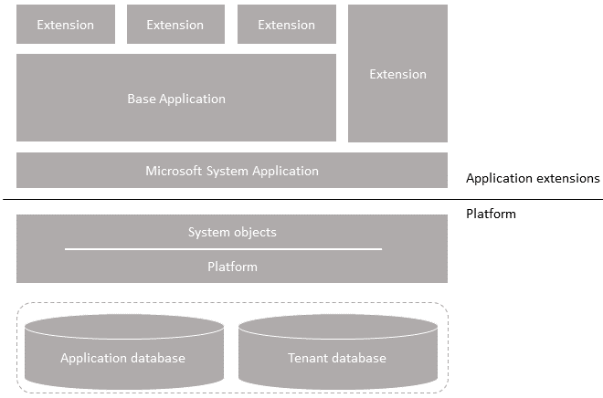

# Installing a [!INCLUDE[prod short](../developer/includes/prod_short.md)] 2020 Release Wave 2 Update

This article describes how to install an update for [!INCLUDE[prod_short](../developer/includes/prod_short.md)] on-premises. An update is a set of files that includes all hotfixes and regulatory features that have been released for Business Central.

You can choose to update only the platform or both the platform and application code. The installation guidelines are separated into PLATFORM tasks and APPLICATION tasks.

## Overview

The following figure provides a high-level representation of a [!INCLUDE[prod_short](../developer/includes/prod_short.md)] solution and the components that are involved in the installation of an update.

  

The databases store the application metadata and business data. If you have a single-tenant deployment, this data is stored in a single database. A multitenant deployment stores the application metadata in the application database and the business data in one or more tenant databases.

### Application stack

The application includes AL extensions that define the objects and code that makes up the business logic. For example, objects include tables, report, pages, codeunits, and more. Each extension is compiled and delivered as an .app file, which is published to the Business Central Server instance.

- System Application extension

    The Microsoft System Application extension includes functionality that isn't directly related the business logic. For more information, see [Overview of the System Application](../developer/devenv-system-application-overview.md). When using the Microsoft Base Application, your solution uses the System Application. With a custom Base Application, your solution may or may not use the System Application. If it doesn't, you can skip any steps in this article related to the System Application.

- Base application extension

    As a minimum, the solution always includes the Base Application. The Base Application contains the objects (such as table, pages, codeunits, and reports) that define the business logic and functionality of the solution. The Base Application can be either the Microsoft Base Application or a customized Base Application. The Microsoft Base Application is the standard application that is on the installation media (DVD). A customized Base Application is an application that includes customized code.

- Application extension

    The Application extension logically encapsulates all of the extensions making up a solution, for example, version `16.0.0.0` of the base and system application package files, and it provides a convenient way to define and refer to this solution identity. This extension is required for Microsoft extensions, but is optional for third-party extensions. For more information, see [The Microsoft_Application.app File](../developer/devenv-application-app-file.md).

- Customization extensions

    Customization extensions add functionality and features to the Base Application or System Application. Extensions can be either Microsoft extensions or third-party extensions. Microsoft extensions are available on the DVD. Third-party extensions are extensions developed by your organization or by another organization, like an ISV.

### Single-tenant and multitenant deployments

The process for upgrading is similar for a single-tenant and multitenant deployment. However, there are some inherent differences. With a single-tenant deployment, the application and business data are included in the same database. While with a multitenant deployment, application code is in a separate database (the application database) than the business data (tenant). In the procedures that follow, for a single-tenant deployment, consider references to the *application database* and *tenant database* as the same database. Steps are marked as *Single-tenant only* or *Multitenant only* where applicable.

### Platform versus application update

A platform update doesn't change the application. It involves converting your databases to the new platform and recompiling the existing extensions to ensure that they're compatible with the new platform.

An application update involves:

- Publishing new versions of extensions that include the latest application modifications
- Synchronizing the databases with any schema change introduced by the new extensions
- Updating affected data.

The installation media (DVD) includes new versions of Microsoft's Base Application, System Application, and extensions. The DVD also includes the AL source code for the Microsoft Base Application. This code useful if you have a custom base application. You can use the code to compare and merge updates into your application. You'll only have to recompile third-party extensions that you don't have a new version to publish.

## PREPARATION

## Download update package

The first thing to do is to download the update package that matches your Business Central solution.

1. Go to the [list of available updates](../deployment/update-versions-17.md) for your on-premises version of Business Central. Then, choose the update that you want.
2. From the update page, under the **Resolution** section, select the link for downloading the update, and follow the instructions.
3. On the computer where you downloaded the update .zip file, extract the all the files to a selected location. 

    When extracted, the update includes the DVD folder. This folder contains the full Business Central product. For example, the folder includes the Business Central installation program (setup.exe), tools for upgrading to the platform, and the Microsoft extensions.

When this step is completed, you can continue to update your Business Central solution to the new platform and application.

## Prepare existing databases

1. Back up your databases.

2. Run the [!INCLUDE[admin shell](../developer/includes/adminshell.md)] as an administrator.

3. (Single-tenant only) Uninstall all extensions from the all tenants.

    In this step, you uninstall the Base Application, System Application (if used), and any other extensions that are currently installed on the database.

    1. Get a list of installed extensions.

        This step is optional, but it can be useful to the names and versions of the extensions.

        To get a list of installed extensions, use the [Get-NAVAppInfo cmdlet](/powershell/module/microsoft.dynamics.nav.apps.management/get-navappinfo).

        ```powershell 
        Get-NAVAppInfo -ServerInstance <server instance name>
        ``` 

    2. Uninstall the extensions.

        To uninstall an extension, you use the [Uninstall-NAVApp](/powershell/module/microsoft.dynamics.nav.apps.management/uninstall-navapp) cmdlet.

        ```powershell 
        Uninstall-NAVApp -ServerInstance <server instance name> -Tenant <tenant ID> -Name <extensions name> -Version <extension version> -Force
        ```

        Replace  `<extension name>` and `<extension version>` with the exact name and version the installed extension. For single-tenant deployment, set `<tenant ID>` to `default` or omit the `-Tenant` parameter.

        For example, together with the Get-NAVApp cmdlet, you can uninstall all extensions with a single command:

        ```powershell 
        Get-NAVAppInfo -ServerInstance <server instance name> -Tenant <tenant ID> | % { Uninstall-NAVApp -ServerInstance <server instance name> -Tenant <tenant ID> -Name $_.Name -Version $_.Version -Force}
        ```

4. Unpublish the existing system symbols.

    To unpublish the system symbols, use the [Unpublish-NAVApp cmdlet](/powershell/module/microsoft.dynamics.nav.apps.management/unpublish-navapp) as follows:

    ```powershell
    Unpublish-NAVApp -ServerInstance <server instance> -Name System -version <version>
    ```

    [What are symbols?](upgrade-overview-v15.md#Symbols).

5. (Multitenant only) Dismount the tenants from the application database.

    To dismount a tenant, use the [Dismount-NAVTenant](/powershell/module/microsoft.dynamics.nav.management/dismount-navtenant) cmdlet:

    ```powershell
    Dismount-NAVTenant -ServerInstance <server instance> -Tenant <tenant ID>
    ```

## Install Business Central components

From the installation media (DVD), run setup.exe to uninstall the current Business Central components and install the Business Central components included in the update. 

1. Stop the [!INCLUDE[server](../developer/includes/server.md)] instance.

    ```powershell
    Stop-NAVServerInstance -ServerInstance <server instance>
    ```

2. Run setup.exe to uninstall your current version of [!INCLUDE[prod_short](../developer/includes/prod_short.md)].
3. Run setup.exe again to install components of the update.

    1. Follow setup pages until you get to the **Microsoft [!INCLUDE[prod_long](../developer/includes/prod_long.md)] Setup** page.
    2. Select **Advanced installation options** > **Choose an installation option** > **Custom**.
    3. On the **Customize the installation** page, select the following components as a minimum:

        - AL Development Environment (optional but recommended)
        - Server
        - Web Server Components.

    4. Select **Next**.
    5. On the **Specify parameters** page, set the fields as needed.

        > [!IMPORTANT]
        > Clear the **SQL Database** field so that it is blank. At this time, do not set this to the database that you want to update; otherwise, the installation of the [!INCLUDE[server](../developer/includes/server.md)] will fail. You will connect the database to the [!INCLUDE[server](../developer/includes/server.md)] later after it is converted to the new platform.

    6. Select **Apply** to complete the installation.

For more information, see [Installing Business Central Using Setup](../deployment/install-using-setup.md).

## PLATFORM UPDATE

Follow the next few tasks to convert your database to the new platform of the update. A multitenant deployment includes the application and tenant databases. The conversion updates the system tables of the database to the new schema (data structure) and provides the latest platform features and performance enhancements.

Also, to ensure that the existing published extensions work on the new platform, you'll recompile the extensions.

## Convert existing database to new platform

1. Run the [!INCLUDE[adminshell](../developer/includes/adminshell.md)] as an administrator.
2. Run the [Invoke-NAVApplicationDatabaseConversion cmdlet](/powershell/module/microsoft.dynamics.nav.management/invoke-navapplicationdatabaseconversion) to start the database conversion to the new platform.

    ```powershell
    Invoke-NAVApplicationDatabaseConversion -DatabaseServer <database server name>\<database server instance> -DatabaseName "<database name>" [-Force]
    ```

    For example, in a single tenant deployment:

    ```powershell
    Invoke-NAVApplicationDatabaseConversion -DatabaseServer .\BCDEMO -DatabaseName "Demo Database BC (17-0)"
    ```

    In a multitenant deployment, run this cmdlet against the application database and use the `-Force` parameter. For example:

    ```powershell
    Invoke-NAVApplicationDatabaseConversion -DatabaseServer .\BCDEMO -DatabaseName "BC17 Application" -Force
    ```

    When completed, a message like the following displays in the console:

    ```powershell
    DatabaseServer      : .\BCDEMO
    DatabaseName        : Demo Database BC (17-0)
    DatabaseCredentials :
    DatabaseLocation    :
    Collation           :
    ```

    > [!NOTE]
    > Depending on the update that you're installing, you might get a message similar to the following:
    >
    > `Invoke-NAVApplicationDatabaseConversion : A technical upgrade of database <database name> on server '.\<database instance>' cannot be run, because the database's application version 'NNNNNN' is greater than or equal to the platform version 'NNNNNN'`
    >
    > This is not an error, and you can continue installing the update. This message is recorded as a warning in the event log as well. This message indicates that the application database is already compatible with the new platform, which happens when the update does not make any schema changes to the system tables.

## Connect server instance to database
 
1. (Multitenant only) Enable the server instance as a multitenant instance:

    ```powershell
    Set-NAVServerConfiguration -ServerInstance <server instance> -KeyName Multitenant -KeyValue true
    ```

2. Connect the server instance to connect to the database.

    ```powershell
    Set-NAVServerConfiguration -ServerInstance <server instance> -KeyName DatabaseName -KeyValue "<database name>"
    ```

    In a multitenant deployment, the database is the application database. For more information, see [Connecting a Server Instance to a Database](../administration/connect-server-to-database.md).

3. Restart the server instance.

    ```powershell
    Restart-NAVServerInstance -ServerInstance <server instance>
    ```

## Publish the new system symbols

Use the Publish-NAVApp cmdlet to publish the new symbols extension package. This package is called **System.app**. If you've installed the **AL Development Environment**, you find the file in the installation folder. By default, the folder path is C:\Program Files (x86)\Microsoft Dynamics 365 Business Central\170\AL Development Environment. Or, it's also on the installation media (DVD) in the ModernDev\program files\Microsoft Dynamics NAV\170\AL Development Environment folder.

```
Publish-NAVApp -ServerInstance <server instance> -Path "<path to the System.app file>" -PackageType SymbolsOnly
```

## <a name="repair"></a>Recompile published extensions

Compile all published extensions against the new platform.

> [!NOTE]
> If you plan on updating the application you can skip this step for extensions for which you have new versions built on the new platform. For example, this includes Microsoft extensions that are on the DVD.  

1. To compile an extension, use the [Repair-NAVApp](/powershell/module/microsoft.dynamics.nav.apps.management/repair-navapp) cmdlet, For example:

    ```powershell  
    Repair-NAVApp -ServerInstance <server instance> -Name <extension name> -Version <extension name>
    ```

    To compile all published extensions at once, you can use this command:

    ```powershell  
    Get-NAVAppInfo -ServerInstance <server instance> | Repair-NAVApp  
    ```

2. Restart the server instance.

    ```powershell
    Restart-NAVServerInstance -ServerInstance <server instance>
    ```

## Synchronize tenant

1. (Multitenant only) Mount the tenant to the new Business Central Server instance.

    You'll have to do this step and the next for each tenant. For more information, see [Mount or Dismount a Tenant](../administration/mount-dismount-tenant.md).
 
2. Synchronize the tenant.
  
    Use the [Sync-NAVTenant](/powershell/module/microsoft.dynamics.nav.management/sync-navtenant) cmdlet:

    ```powershell  
    Sync-NAVTenant -ServerInstance <server instance> -Tenant <tenant ID> -Mode Sync
    ```

    For a single-tenant deployment, you can either set the `<tenant ID>` to `default` or omit the `-Tenant <tenant ID>` parameter. For more information about syncing, see [Synchronizing the Tenant Database and Application Database](../administration/synchronize-tenant-database-and-application-database.md).

> [!NOTE]
> At this point, if you want to update the application, you can skip the next step and proceed [APPLICATION](#Application).

## (Single-tenant only) Reinstall extensions

In this task, you reinstall the same extensions that were installed on the tenant before. If you're planning on updating the application, then skip this step.

To install an extension, you use the [Install-NAVApp cmdlet](/powershell/module/microsoft.dynamics.nav.apps.management/install-navapp).

1. If your solution uses the System Application, install this first.

    ```powershell 
    Install-NAVApp -ServerInstance <server instance> -Name "System Application" -Version <extension version>
    ```

    Replace `<extension version>` with the exact version of the published System Application.

2. Install the Base Application.

    ```powershell
    Install-NAVApp -ServerInstance <server instance> -Name "Base Application" -Version <extension version>
    ```

    Replace `<extension version>` with the exact version of the published Base Application.

3. Install the Application extension as needed.

    ```powershell
    Install-NAVApp -ServerInstance <server instance> -Name "Application" -Version <extension version>
    ```

    Replace `<extension version>` with the exact version of the published Application extension.

4. Install other extensions, including Microsoft and third-party extensions.

    ```powershell
    Install-NAVApp -ServerInstance <server instance name> -Name <extension name> -Version <extension version>
    ```

At this point, your solution has been updated to the latest platform.

> [!IMPORTANT]
> If your solution uses any Microsoft control add-ins, you must upgrade the add-ins to the latest version. Go to [Upgrade control add-ins](#controladdins) under **Post Upgrade** section.

## <a name="Application"></a> APPLICATION UPDATE

Follow the next tasks to update the application code to the new features and hotfixes. The tasks include publishing new versions of the System Application, Base Application, and add-on extensions.

You publish the System Application extension only if it was used in old solution. Add-on extensions include Microsoft and third- party extensions that were used in the old solution.

> [!NOTE]
> If a license update is required for a regulatory feature, customers can download an updated license from CustomerSource (see [How to Download a Microsoft Dynamics 365 Business Central License from CustomerSource](/dynamics/s-e/)), and partners can download their customers' updated license from VOICE (see [How to Download a Microsoft Dynamics 365 Business Central Customer License from VOICE](https://mbs.microsoft.com/partnersource/northamerica/deployment/documentation/how-to-articles/howtodownloadcustomernavlicense)).

## Upgrade System Application

Follow these steps if your existing solution uses the Microsoft System Application. Otherwise, you can skip this procedure.

1. Publish the **System Application** extension (Microsoft_System Application.app).

    You find the (Microsoft_System Application.app in the **Applications\System Application\Source** folder of installation media (DVD).

    ```powershell
    Publish-NAVApp -ServerInstance <server instance name> -Path "<path to Microsoft_System Application.app>"
    ```

2. Synchronize the tenant(s) with the **System Application** extension (Microsoft_System Application):

    Use the [Sync-NAVApp](/powershell/module/microsoft.dynamics.nav.apps.management/sync-navapp) cmdlet:

    ```powershell
    Sync-NAVApp -ServerInstance <server instance name> -Tenant <tenant ID> -Name "System Application" -Version <extension version>
    ```

    Replace `<extension version>` with the exact version of the published System Application.

    > [!TIP]
    > To get a list of all published extensions, along with their names and versions, use the [Get-NAVAppInfo cmdlet](/powershell/module/microsoft.dynamics.nav.apps.management/get-navappinfo).

3. Run the data upgrade on the System Application.

    To run the data upgrade, use the [Start-NavAppDataUpgrade](/powershell/module/microsoft.dynamics.nav.apps.management/start-navappdataupgrade) cmdlet:

    ```powershell
    Start-NAVAppDataUpgrade -ServerInstance <server instance name> -Tenant <tenant ID> -Name "System Application" -Version <extension version>
    ```

    Upgrading data updates the data in the tables of the tenant database to the schema changes made to tables of the System Application.

## Upgrade Base Application

### Microsoft Base Application

Follow these steps if your existing solution uses the Microsoft Base Application.

1. Publish the Business Central Base Application extension (Microsoft_Base Application.app).

    The **Base Application** extension contains the application business objects. You find the Microsoft_Base Application.app in the **Applications\BaseApp\Source** folder of installation media (DVD).

    ```powershell
    Publish-NAVApp -ServerInstance <server instance name> -Path "<path to Microsoft_Base Application.app>"
    ```

2. Synchronize the tenant with the Business Central Base Application extension (Microsoft_BaseApp):

    ```powershell
    Sync-NAVApp -ServerInstance <server instance name> -Tenant <tenant ID> -Name "Base Application" -Version <extension version>
    ```

    Replace `<extension version>` with the exact version of the published Base Application.

    With this step, the base app takes ownership of the database tables. When completed, in SQL Server, the table names will be suffixed with the base app extension ID. This process can take several minutes.
3. Run the data upgrade on the Base Application.

    To run the data upgrade, use the [Start-NavAppDataUpgrade](/powershell/module/microsoft.dynamics.nav.apps.management/start-navappdataupgrade) cmdlet:

    ```powershell
    Start-NAVAppDataUpgrade -ServerInstance <server instance name> -Tenant <tenant ID> -Name "Base Application" -Version <extension version>
    ```

    Upgrading data updates the data in the tables of the tenant database to the schema changes made to tables of the Base Application.

### Upgrade custom Base Application

With a custom Base Application, you may want the new application features and hotfixes in the Microsoft Base Application. If so, you'll have to merge the modifications made in the Microsoft Base Application into your custom Base Application. Then, create a new version of your custom Base Application.

The source code for the new Microsoft Base Application version is in the **Base Application.Source.zip** file. This file is on the installation media (DVD), in the **Applications\BaseApp\Source** folder. You can compare this source code with the source code of the previous Microsoft Base Application and your custom application source. Then merge the code into a new custom application version.

After you've created the new version of your custom application, you publish it to the application server instance. Then, you synchronize and run the data upgrade on the tenants.

##  <a name="AddExtensions"></a>Upgrade Microsoft extensions

If your old solution used Microsoft extensions, then you upgrade these extensions to the new versions that are available on the [!INCLUDE[prod_short](../developer/includes/prod_short.md)] installation media (DVD). The new versions are in the **Applications** folder, which contains a subfolder for each extension. The extension package (.app file) that you need for publishing the extension is in the **Source** folder, for example, **Applications\SalesAndInventoryForecast\Source\SalesAndInventoryForecast.app**.

The general steps for this task are listed below. For detailed steps, see [Publishing, Upgrading, and Installing Extensions During Upgrade](upgrade-publish-extensions.md).

### Publish and install Microsoft_Application extension

The Microsoft_Application extension was introduced in 15.3. In short, it's used to contain the dependency declarations on the system and base application extensions. For more information about this extension, see [The Microsoft_Application.app File](../developer/devenv-application-app-file.md).

1. Publish the Microsoft_Application.app package.

    The installation media path to the extension package (.app file) is **Applications\Application\Source\Microsoft_Application.app"**  

    ```powershell
    Publish-NAVApp -ServerInstance <server instance name> -Path "<folder path>\Microsoft_Application.app"
    ```

2. Synchronize the tenant database with the schema changes of the Microsoft_Application extension.

    ```powershell
    Sync-NavApp -ServerInstance <server instance name> -Tenant <tenant ID> -Name <extension name> -Tenant <tenant ID>
    ```

3. Upgrade the Microsoft_Application extension on your tenants.

    ```powershell
    Start-NAVAppDataUpgrade -ServerInstance <server instance name> -Tenant <tenant ID> -Name Application 
    ```

### Publish and install Microsoft extensions

Complete these steps for each Microsoft extension that you want to upgrade. 

1. Publish the new extension versions from the installation media (DVD).

    ```powershell
    Publish-NAVApp -ServerInstance <server instance name> -Path <path to extension package file>
    ```

2. Synchronize the tenant database with the schema changes of the extensions.

    ```powershell
    Sync-NavApp -ServerInstance <server instance name> -Tenant <tenant ID> -Name <extension name> -Version <extension version>
    ```

3. Upgrade the data associated with the Microsoft extensions. This step will automatically install the new version on the tenant

    ```powershell
    Start-NAVAppDataUpgrade -ServerInstance <server instance name> -Tenant <tenant ID> -Name <extension name> -Version <extension version>
    ```

## Upgrade Third-Party extensions

If the old solution used third-party extensions, and you still want to use them, they must be compiled to work on the new platform. For more information, see [Recompile published extensions](#repair). You then reinstall the extensions on tenants using the Install-NAVApp cmdlet.

As an alternative, if you have the source for these extensions, you can build and compile a new version of the extension in the AL development environment. Then, you upgrade to the new version as described in the previous task.

## Post Upgrade

### <a name="controladdins"></a>Upgrade control add-ins

The [!INCLUDE[server](../developer/includes/server.md)] installation includes new versions of the Microsoft-provided Javascript-based control add-ins, like Microsoft.Dynamics.Nav.Client.BusinessChart, Microsoft.Dynamics.Nav.Client.VideoPlayer, and more. If your solution uses any of these control add-ins, upgrade them to the latest version.

To upgrade the control add-ins, do the following steps:

1. Open the [!INCLUDE[prod_short](../developer/includes/prod_short.md)] client.
2. Search for and open the **Control Add-ins** page.
3. Choose **Actions** > **Control Add-in Resource** > **Import**.
4. Locate and select the .zip file for the control add-in and choose **Open**.

    The .zip files are located in the **Add-ins** folder of the [!INCLUDE[server](../developer/includes/server.md)] installation. There's a subfolder for each add-in. For example, the path to the Business Chart control add-in is `C:\Program Files\Microsoft Dynamics 365 Business Central\170\Service\Add-ins\BusinessChart\Microsoft.Dynamics.Nav.Client.BusinessChart.zip`.
5. After you've imported all the new control add-in versions, restart Business Central Server instance.

Alternatively, you can use the [Set-NAVAddin cmdlet](/powershell/module/microsoft.dynamics.nav.management/set-navaddin) of the [!INCLUDE[adminshell](../developer/includes/adminshell.md)]. For example, the following commands update the control add-ins installed by default. Modify the commands to suit:

```powershell
$InstanceName = 'BC170'
$ServicesAddinsFolder = 'C:\Program Files\Microsoft Dynamics 365 Business Central\170\Service\Add-ins'
Set-NAVAddIn -ServerInstance $InstanceName -AddinName 'Microsoft.Dynamics.Nav.Client.BusinessChart' -PublicKeyToken 31bf3856ad364e35 -ResourceFile ($AppName = Join-Path $ServicesAddinsFolder 'BusinessChart\Microsoft.Dynamics.Nav.Client.BusinessChart.zip')
Set-NAVAddIn -ServerInstance $InstanceName -AddinName 'Microsoft.Dynamics.Nav.Client.FlowIntegration' -PublicKeyToken 31bf3856ad364e35 -ResourceFile ($AppName = Join-Path $ServicesAddinsFolder 'FlowIntegration\Microsoft.Dynamics.Nav.Client.FlowIntegration.zip')
Set-NAVAddIn -ServerInstance $InstanceName -AddinName 'Microsoft.Dynamics.Nav.Client.OAuthIntegration' -PublicKeyToken 31bf3856ad364e35 -ResourceFile ($AppName = Join-Path $ServicesAddinsFolder 'OAuthIntegration\Microsoft.Dynamics.Nav.Client.OAuthIntegration.zip')
Set-NAVAddIn -ServerInstance $InstanceName -AddinName 'Microsoft.Dynamics.Nav.Client.PageReady' -PublicKeyToken 31bf3856ad364e35 -ResourceFile ($AppName = Join-Path $ServicesAddinsFolder 'PageReady\Microsoft.Dynamics.Nav.Client.PageReady.zip')
Set-NAVAddIn -ServerInstance $InstanceName -AddinName 'Microsoft.Dynamics.Nav.Client.PowerBIManagement' -PublicKeyToken 31bf3856ad364e35 -ResourceFile ($AppName = Join-Path $ServicesAddinsFolder 'PowerBIManagement\Microsoft.Dynamics.Nav.Client.PowerBIManagement.zip')
Set-NAVAddIn -ServerInstance $InstanceName -AddinName 'Microsoft.Dynamics.Nav.Client.RoleCenterSelector' -PublicKeyToken 31bf3856ad364e35 -ResourceFile ($AppName = Join-Path $ServicesAddinsFolder 'RoleCenterSelector\Microsoft.Dynamics.Nav.Client.RoleCenterSelector.zip')
Set-NAVAddIn -ServerInstance $InstanceName -AddinName 'Microsoft.Dynamics.Nav.Client.SatisfactionSurvey' -PublicKeyToken 31bf3856ad364e35 -ResourceFile ($AppName = Join-Path $ServicesAddinsFolder 'SatisfactionSurvey\Microsoft.Dynamics.Nav.Client.SatisfactionSurvey.zip')
Set-NAVAddIn -ServerInstance $InstanceName -AddinName 'Microsoft.Dynamics.Nav.Client.SocialListening' -PublicKeyToken 31bf3856ad364e35 -ResourceFile ($AppName = Join-Path $ServicesAddinsFolder 'SocialListening\Microsoft.Dynamics.Nav.Client.SocialListening.zip')
Set-NAVAddIn -ServerInstance $InstanceName -AddinName 'Microsoft.Dynamics.Nav.Client.VideoPlayer' -PublicKeyToken 31bf3856ad364e35 -ResourceFile ($AppName = Join-Path $ServicesAddinsFolder 'VideoPlayer\Microsoft.Dynamics.Nav.Client.VideoPlayer.zip')
Set-NAVAddIn -ServerInstance $InstanceName -AddinName 'Microsoft.Dynamics.Nav.Client.WebPageViewer' -PublicKeyToken 31bf3856ad364e35 -ResourceFile ($AppName = Join-Path $ServicesAddinsFolder 'WebPageViewer\Microsoft.Dynamics.Nav.Client.WebPageViewer.zip')
Set-NAVAddIn -ServerInstance $InstanceName -AddinName 'Microsoft.Dynamics.Nav.Client.WelcomeWizard' -PublicKeyToken 31bf3856ad364e35 -ResourceFile ($AppName = Join-Path $ServicesAddinsFolder 'WelcomeWizard\Microsoft.Dynamics.Nav.Client.WelcomeWizard.zip')
```

### Update application version

This task isn't required for installing the update. However, it might be useful for support purposes and answering a common question about the application version.  The **Help and Support** page in the client displays an application version, such as 16.1.2345.6. This version number isn't updated automatically when you install an update.

However, the [!INCLUDE[server](../developer/includes/server.md)] includes a configuration setting called **Solution Version Extension** (SolutionVersionExtension). This setting lets you specify an extension whose version number will show as the Application Version on the client's **Help and Support** page. Typically, you'd use the extension considered to be your solution's base application. You set **Solution Version Extension** to ID of the extension. For example, if your solution uses the Microsoft Base Application, set the value to `437dbf0e-84ff-417a-965d-ed2bb9650972`.

You can set **Solution Version Extension** by using the [!INCLUDE[admintool](../developer/includes/admintool.md)] or the [Set-NAVServerConfiguration](/powershell/module/microsoft.dynamics.nav.management/set-navserverconfiguration) cmdlet of the [!INCLUDE[admin shell](../developer/includes/adminshell.md)].

The following example uses the Set-NAVServerConfiguration cmdlet to set the **Solution Version Extension** to the Microsoft Base Application:

```powershell  
Set-NAVServerConfiguration -ServerInstance <server instance name> -KeyName SolutionVersionExtension -KeyValue 437dbf0e-84ff-417a-965d-ed2bb9650972 -ApplyTo All  
```

For more information about how to configure a server instance, see [Configuring Business Central Server](../administration/configure-server-instance.md).

## See Also

[Dynamics 365 Business Central On-Premises Release Wave 2 Updates](../deployment/update-versions-16.md)  
[Upgrading to Dynamics 365 Business Central 2019 Release Wave 2](upgrade-overview-v15.md)  
[Synchronizing the Tenant Database and Application Database](../administration/synchronize-tenant-database-and-application-database.md)  
[Version numbers in Business Central](../administration/version-numbers.md)  
[Publish and Install an Extension](../developer/devenv-how-publish-and-install-an-extension-v2.md)  
[Getting Started in AL](../developer/devenv-get-started.md)  
[Version numbers in Business Central](../administration/version-numbers.md)