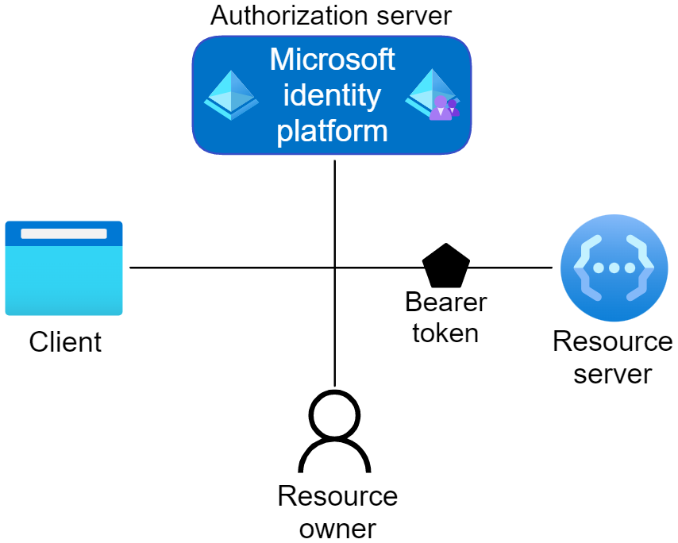

# Using OAuth to Authorize Business Central Web Services (OData and SOAP)

[!INCLUDE[prod_short](../developer/includes/prod_short.md)] supports the OAuth authorization protocol for SOAP and OData web services. This article describes some basics behind the use and configuration of OAuth authentication in [!INCLUDE[prod_short](../developer/includes/prod_short.md)]. It describes the general aspects of the OAuth authorization protocol, including how to set it up for [!INCLUDE[prod_short](../developer/includes/prod_short.md)].

> [!TIP]
> For some samples about setting up OAuth, see the [BCTech repo](https://github.com/microsoft/BCTech/tree/master/samples/PSOAuthBCAccess).

## About OAuth

[!INCLUDE[about_oauth](../developer/includes/include-about-oauth.md)]

## Concepts in OAuth

Four parties are typically involved in an OAuth 2.0 authentication and authorization exchange, as illustrated in the following diagram from Azure. Such exchanges are often called authentication flows or auth flows.

For more information, see [OAuth 2.0 Roles](/azure/active-directory/develop/active-directory-v2-protocols) in the Azure documentation.

### Authorization server

The Microsoft identity platform itself is the authorization server. Also called an identity provider or IdP, it securely handles the end-user's information, their access, and the trust relationships between the parties in the auth flow. The authorization server issues the security tokens your apps and APIs use for granting, denying, or revoking access to resources (authorization) after the user has signed in (authenticated).

### Client

The client in an OAuth exchange is the application requesting access to a protected resource. The client could be a web app running on a server, a single-page web app running in a user's web browser, or a web API that calls another web API. You'll often see the client referred to as client application, application, or app.

### Resource owner

The resource owner in an auth flow is typically the application user, or end-user in OAuth terminology. The end-user "owns" the protected resource--their data--your app accesses on their behalf. The resource owner can grant or deny your app (the client) access to the resources they own. For example, your app might call an external system's API to get a user's email address from their profile on that system. Their profile data is a resource the end-user owns on the external system, and the end-user can consent to or deny your app's request to access their data.

### Resource server

The resource server hosts or provides access to a resource owner's data. For OAuth authentication in [!INCLUDE[prod_short](../developer/includes/prod_short.md)], the resource server is the [!INCLUDE[prod_short](../developer/includes/prod_short.md)] server. The resource server relies on the authorization server to perform authentication and uses information in bearer tokens issued by the authorization server to grant or deny access to resources.

### Tokens

The parties in an authentication flow use bearer tokens to assure identification (authentication) and to grant or deny access to protected resources (authorization). Bearer tokens in the Microsoft identity platform are formatted as JSON Web Tokens (JWT).

Three types of bearer tokens are used by the Microsoft identity platform as security tokens:
- _Access tokens_ - Access tokens are issued by the authorization server to the client application. The client passes access tokens to the resource server. Access tokens contain the permissions the client has been granted by the authorization server.
- _ID tokens_ - ID tokens are issued by the authorization server to the client application. Clients use ID tokens when signing in users and to get basic information about them.
- _Refresh tokens_ - The client uses a refresh token, or RT, to request new access and ID tokens from the authorization server. Your code should treat refresh tokens and their string content as opaque because they're intended for use only by authorization server.

For more information, see [Security tokens](/azure/active-directory/develop/security-tokens) in the Azure documentation.

## App registration

Your client app needs a way to trust the security tokens issued to it by the Microsoft identity platform. The first step in establishing that trust is by registering your app with the identity platform in Azure Active Directory (Azure AD).

For more information, see [App registration](/azure/active-directory/develop/active-directory-v2-protocols#app-registration) in the Azure documentation.

## User account (user impersonation) or application account (service-to-service authentication)?

When setting up OAuth, the first decision you need to make is whether to use a user account or an application account.

The following table lists some of the differences between the two approaches.

| Area | User account (user impersonation) | Application account (service-to-service authentication) |
| ---- | --------------------------------- | ------------------------------------------------------- |
| User | Requires an interactive user to sign in | No interactive user sign-in needed |
| License | User must be licensed | Requires an application account in Business Central (no license needed) |
| Refresh token | After initial sign-in, a refresh token can be used to maintain access | No refresh token required |
| Permissions | Request is done with permissions assigned to the user | Request is done with permissions assigned to application account |

## Using User Impersonation/Delegation Authentication

For delegation/user impersonation, a [!INCLUDE[prod_short](../developer/includes/prod_short.md)] user has to consent to the resources which the client application requests access to.

## Using Service-to-Service (S2S) Authentication

Service-to-Service (S2S) authentication is suited for scenarios where integrations are required to run without any user interaction. S2S authentication uses the [Client Credentials OAuth 2.0 Flow](/azure/active-directory/develop/v2-oauth2-client-creds-grant-flow). This flow enables you to access resources by using the identity of an application.

For more information, please visit [Service-to-Service Authentication](../administration/automation-apis-using-s2s-authentication.md)

## Credentials lifetime

With authentication methods other than Azure AD, like Windows or NavUserPassword, the credentials that users provide are persisted by application and used for as long as they're valid in [!INCLUDE[prod_short](../developer/includes/prod_short.md)]. However, this is different for OAuth, because the security tokens that are used for authentication have a limited lifetime.

An authentication result from Azure AD, contains two tokens: an access token and an ID token.

The `access token` is the one that's used when the client application calls the web service. The access token is relatively short-lived (for example, one hour by default, and one day maximum). When it expires, the client application needs a new access token.

To obtain new access token when the current access token expires, one can leverage token cache. For more information, see [Acquire & cache tokens with Microsoft Authentication Library (MSAL)](/azure/active-directory/develop/msal-acquire-cache-tokens).

The lifetime of both these tokens is configurable. For more information about how to configure and manage these tokens for your installation, see [Configurable token lifetimes in Azure Active Directory](/azure/active-directory/develop/active-directory-configurable-token-lifetimes).

## See Also
  
[Web Services Authentication](web-services-authentication.md)  
[OData Web Services](OData-Web-Services.md)  
[Configuring Business Central Server](../administration/configure-server-instance.md)  
[Authentication and Credential Types](../administration/Users-Credential-Types.md)
