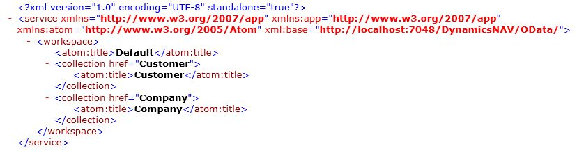

# Using OData V3 to Return-Obtain an AtomPub Document

When you register an OData web service, you expose an OData V3 service endpoint that can be accessed from a uniform resource identifier \(URI\) by using a web browser or any other HTTP client. OData V3 clients can use Atom Publishing Protocol \(AtomPub\) documents to interact with [!INCLUDE[prod_short](../developer/includes/prod_short.md)] data. AtomPub is a simple HTTP-based protocol for creating and updating web resources. It is related to the Atom Syndication Format, which is XML for web feeds. In these procedures, you obtain different kinds of AtomPub documents or feeds from a [!INCLUDE[prod_short](../developer/includes/prod_short.md)] OData web service. AtomPub documents and feeds are XML.  
  
> [!NOTE]  
> This article applies only to OData V3. You can't use the article with OData V4 endpoints.  

<!--
> [!NOTE]  
>  To use the URIs in this article, you must have access to the [!INCLUDE[demolong](../developer/includes/demolong_md.md)].  
 -->
 
## Obtain an AtomPub Document or Feed

 Depending on how you construct your URI, you can return an AtomPub document or an AtomPub feed. A feed is a request for data that can change over time. For example, this can be news content or other kinds of information. In the case of [!INCLUDE[prod_short](../developer/includes/prod_short.md)], the information is database content.  
 
1.  Register and publish a page web service by using the [!INCLUDE[nav_web_md](../developer/includes/nav_web_md.md)]. See [Publishing a Web Service](publish-web-service.md).

    The AtomPub documents that are shown in this article are based on the page 21, the **Customer Card** page, with **Customer** as the service name. The concepts and steps are the same for any [!INCLUDE[nav_web_md](../developer/includes/nav_web_md.md)] page that you register and publish as a web service.  
  
    > [!NOTE]  
    >  You can also register and publish a [!INCLUDE[prod_short](../developer/includes/prod_short.md)] query as a web service.  
  
2.  Start Windows Internet Explorer. In the **Address** field, enter a URI in this format:  
  
    ```  
    https://<Server>:<WebServicePort>/<ServerInstance>/OData  
    ```  
  
     If [!INCLUDE[server](../developer/includes/server.md)] is running on the local computer with the default [!INCLUDE[server](../developer/includes/server.md)] instance and OData port, then the address is:  
  
    ```  
    https://localhost:7048/<server instance>/OData  
    ```  
  
     The browser should now show the web service that you have published in the format of an AtomPub document:  
  
       
  
3.  If you have multiple companies, then you can modify your URI to return a feed that enumerates all available companies:  
  
    ```  
    https://localhost:7048/<server instance>/OData/Company  
    ```  
  
    > [!IMPORTANT]  
    >  You must modify your Internet Explorer settings to display the actual XML for a feed instead of the feed content that has changed. Choose **Internet Options**, choose **Content**, choose **Feeds and Web Slices**, and then clear the **Turn on feed reading view** check box. Restart Internet Explorer to enable the new setting.  
  
## Obtain a Keyed Service Entry  
 With a keyed service entry, you specify content from a particular row in a [!INCLUDE[prod_short](../developer/includes/prod_short.md)] table. The AtomPub document will contain information that is specific to that row. This procedure assumes that you have registered and published a page web service in the previous procedure.  
  
  
1.  Start Windows Internet Explorer. In the **Address** field, enter a URI in the following format to get the entry for the [!INCLUDE[demoname](../developer/includes/demoname_md.md)] company:  
  
    ```  
    https://localhost:7048/<server instance>/OData/Company('CRONUS-International-Ltd.')  
    ```  
  
2.  To get the data feed for the Customer table in the [!INCLUDE[demoname](../developer/includes/demoname_md.md)] company database, enter a URI in the following format:  
  
    ```  
    https://localhost:7048/<server instance>/OData/Company('CRONUS-International-Ltd.')/Customer  
    ```  
  
3.  To additionally constrain data to a specific keyed customer in the Customer table, enter a URI in the following format, using the customer no. for the record you want. The example uses customer no. 01121212:  
  
    ```  
    https://localhost:7048/<server instance>/OData/Company('CRONUS-International-Ltd.')/Customer('01121212')  
    ```  
  
## Obtain a Filtered Data Feed  
 With a filtered data feed, you use special syntax in the URI to define a query on the available data. For details on the specific filters available for [!INCLUDE[prod_short](../developer/includes/prod_short.md)] OData web service applications and the syntax for using them, see [Using Filter Expressions in OData URIs](Use-Filter-Expressions-in-OData-URIs.md).  
 
  
1.  Start Windows Internet Explorer. In the **Address** field, enter a URI in the following format to get the entry for the [!INCLUDE[demoname](../developer/includes/demoname_md.md)] company:  
  
    ```  
  
    https://localhost:7048/<server instance>/OData/Company('CRONUS-International-Ltd.')/Customer?$filter=City-eq-'Birmingham'  
    ```  
  
## See Also  
 [OData Web Services](OData-Web-Services.md)