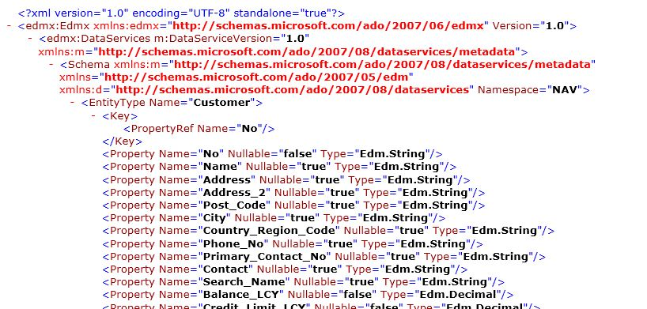

# Use OData to Return and Obtain a Service Metadata Document

The Entity Data Model \(**EDM**\) is a specification for defining the data that is used by applications that are built on the Entity Framework. **EDMX** is an XML-based file format that is the packaging format for the service metadata of a data service. When you interact with an OData service that is published from [!INCLUDE[prod_short](../developer/includes/prod_short.md)], you can request EDM-based proxies and then use tools such as LINQ to create data access logic. LINQ is a programming model that developers can use to query data from a variety of data sources, including OData. For more information, see [LINQ \(Language-Integrated Query\)](/previous-versions/bb397926(v=vs.140))  
  
The [!INCLUDE[prod_short](../developer/includes/prod_short.md)] implementation of EDM follows the [.NET 4.0 WCF Data Service Framework implementation](/dotnet/framework/wcf/).  
  
The following guidelines have been implemented for EDM.  
  
-   [!INCLUDE[prod_short](../developer/includes/prod_short.md)] field names are mapped to EDMX property names by replacing spaces with underscores.  
  
-   Primary key fields in tables are automatically defined as properties in the service metadata document even if they are not exposed on a page as controls.  
  
## Obtain a service metadata \(EDMX\) document  
  
1.  You can obtain service metadata documents for either page or query web services. This example uses a page web service. Register and publish a page web service by using the [!INCLUDE[nav_web_md](../developer/includes/nav_web_md.md)]. See [Publishing a Web Service](publish-web-service.md)..  
  
2.  Start Windows Internet Explorer. In the **Address** field, enter a URI in this format:  
  
    ```  
    https://<Server>:<WebServicePort>/<ServerInstance>/OData/$metadata  
    ```  
  
     If [!INCLUDE[server](../developer/includes/server.md)] is running on the local computer and is using the default [!INCLUDE[server](../developer/includes/server.md)] instance and OData port, then the address is:  
  
    ```  
    https://localhost:7048/<server instance>/OData/$metadata  
    ```  
  
     The browser should now show the complete metadata for the page web service that you have published. The beginning of this document looks like this:  
  
       
  
## See Also  
 [OData Web Services](OData-Web-Services.md)