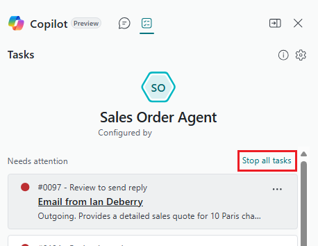

# Update 27.5 for Business Central 2025 release wave 2

Would you like to know what changes are in update 27.5? Below you find an overview and relevant links to what was done on hotfixes and regulatory features in this update. In addition, we gathered some good to know information and links that you might find interesting.

## Hotfixes

Learn about the hotfixes and download on-premises files from Microsoft Support at [Update 27.5 for Business Central 2025 release wave 2](https://support.microsoft.com/help/5081986).

## Feature changes

| Product area | Feature | Public preview/General availability |
|-|-|-|
| Electronic documents | [Set up Service Participants to Company Information](/dynamics365/release-plan/2025wave2/smb/dynamics365-business-central/set-up-service-participants-company-information) | Public preview |
| Governance and administration | [Migrate to the cloud from any SQL database](/dynamics365/release-plan/2025wave2/smb/dynamics365-business-central/migrate-cloud-sql-database)1 | Public preview |

1 This feature is a service feature available independently of the update version.

## Localization updates

No updates

## Release plan

Do you want to get a comprehensive overview of what's new and planned for Business Central online for the entire 2025 release wave 2 (release from October 2025 to April 2026)? Learn more at [Plan and prepare for Dynamics 365 Business Central in 2025 release wave 2](/dynamics365/release-plan/2025wave2/smb/dynamics365-business-central/planned-features)<!--(https://aka.ms/BCReleasePlan)-->.

## Upgrade to 27.5

### Online customers

- New customers get Business Central version 27.5 automatically.
- Existing customers are notified when update 27.5 is available so they schedule the update. Learn more in [Schedule an update](../administration/tenant-admin-center-update-management.md#schedule).

### On-premises customers

Deployments using version 24 or earlier must upgrade to version 25 before upgrading to update 27.5. Several objects marked as obsolete in these earlier versions are no longer included in the base application. Learn more in [Important information and considerations when upgrading to Business Central version 27](../upgrade/upgrade-considerations-v26.md).

## Good to know

### Stop all tasks action for Sales Order Agent

There's a new **Stop all tasks** action on the task pane. If the agent becomes blocked after importing too many tasks, you can unblock it by clearing the task list.

### Business Central 2026 release wave 1 public preview

The public preview version of Business Central 2026 release wave 1 (update 28.0) is now available for Business Central online tenants. The public preview enables you to test and provide feedback on new features coming with Business Central 2026 release wave 1 in April. Learn more in [Update 28.0 (preview)](whatsnew-update-28-0.md).

### Business Central Launch Edition - 2025 release wave 2 information

The Business Central Launch Edition includes these resources:

- 45+ what's new sessions on YouTube: [aka.ms/BCLE](https://aka.ms/BCLE)
- 'What's new' partner deck for download: [aka.ms/BCLEDECK](https://aka.ms/BCLEDECK)
- BCLE Highlight videos for download: [aka.ms/BCHighlights](https://aka.ms/BCHighlights)

### Features becoming mandatory next release wave

Prepare for features expected to be mandatory in the next release wave (28.0). When these features become mandatory, they might disrupt extensions and apps you install in the future. Work with your partner to update installed extensions and apps before the features are mandatory. These features are optional and can be enabled on the **Feature Management** page in Business Central. Learn more in [Enabling Upcoming Features Ahead of Time](../administration/feature-management.md).

- [Feature Update: Enable use of G/L currency revaluation](/dynamics365/business-central/finance-revalue-account-balances)
- [Feature Update: New sales pricing experience](/previous-versions/dynamics365-release-plan/2020wave2/smb/dynamics365-business-central/use-new-sales-pricing-experience-)
- [Feature Update: Use new communication texts for reminder terms](/dynamics365/business-central/finance-automate-reminders)
- [Feature: Advanced Tell Me (preview)](/dynamics365/release-plan/2025wave2/smb/dynamics365-business-central/find-pages-reports-advanced-tell-me-search)
- [Feature: Calculate only visible FlowFields](../developer/calculate-only-visible-flowfields-feature-key.md)
- [Feature: Enable MCP Server access](/dynamics365/release-plan/2025wave2/smb/dynamics365-business-central/connect-ai-agents-business-central-through-mcp-server)
- [Feature: Preview semantic similarity search on application metadata](../developer/semantic-search-feature-key.md)
- [Feature: Use optimized text search in lists](/dynamics365/business-central/design-details-warehouse-entries#creating-warehouse-transactions)

For a list of features that became mandatory in version 27, go to [Optional features that are now mandatory](https://aka.ms/BCFeatureMgmt).

### Discover all partner related resources

Are you a partner who wants a list of relevant resources? Learn more in [Resources for Partners](https://aka.ms/BCAll).

### Discover all user related resources

Are you a user who wants a list of relevant resources? Learn more in [Resources for users](https://aka.ms/BCUsers).  
